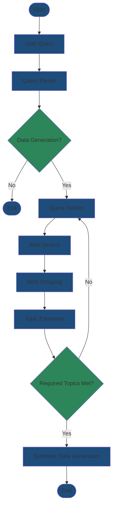

# 🚀 Synthetic Data Generation Pipeline

[](https://www.python.org/downloads/)
[](https://opensource.org/licenses/MIT)
[](https://badge.fury.io/py/Data-Generation-Agents)

An **enterprise-grade, fault-tolerant** synthetic data generation pipeline powered by **LangGraph**, **Google Gemini AI**, and intelligent web scraping. Create high-quality, multilingual training datasets with automatic resumption, state management, and graceful error handling.

## ✨ Key Features

### 🔄 **Fault-Tolerant Architecture**
- **Automatic Resumption**: Pipeline saves progress after every operation—stop anytime, resume later
- **Zero Data Loss**: State persistence ensures no work is ever repeated
- **Graceful API Handling**: Quota exhaustion stops cleanly with clear messages
- **Incremental Processing**: Process millions of samples without memory issues

### 🌐 **Multilingual & Domain-Agnostic**
- **Languages**: Excellent support for dialects (English, Egyptian Arabic, Brazilian Portuguese, etc.)
- **Domain Categories**: Optional subcategory specification for targeted data generation
- **Automatic Language Detection**: Built-in filtering for content quality

### 🧠 **AI-Powered Intelligence**
- **Smart Query Parsing**: Extracts intent, language, domain, and categories from natural language
- **Web Knowledge Integration**: Scrapes and synthesizes information
- **Topic Extraction**: Automatically identifies unique subtopics per domain
- **Context-Aware Generation**: Creates diverse, factually accurate synthetic data

### 📊 **Production-Ready**
- **LangGraph Orchestration**: Stateful workflow with conditional routing
- **Structured Logging**: Debug-level traceability for troubleshooting
- **Type-Safe**: Pydantic validation throughout the pipeline

---

## 🏗️ Architecture

The pipeline uses **8 specialized AI agents** orchestrated by **LangGraph**:


### **Agent Responsibilities**

| Agent | Purpose | Technology |
|-------|---------|------------|
| **Query Parser** | Extract requirements (domain, language, count, categories) | Gemini AI |
| **Query Refiner** | Generate diverse search queries | Gemini AI |
| **Web Search** | Find relevant sources | Tavily API |
| **Filtration** | Filter by language/relevance | AsyncIO + LangDetect |
| **Web Scraping** | Extract content from URLs | ScraperAPI |
| **Chunking** | Split content into 500-word chunks | Custom Service |
| **Topic Extraction** | Identify subtopics from content | Gemini AI |
| **Data Generator** | Create synthetic samples | Gemini AI |

---

## 📊 Pipeline Flow Visualization



---

## ⚡ Quick Start

### Installation

```bash
pip install Data-Generation-Agents
```

### Basic Usage

```python
from Data_Generation_Agents import generate_synthetic_data

# Simple: Just provide your request
generate_synthetic_data(
    "your-prompt"
)
```

### Advanced Usage with Categories

```python
generate_synthetic_data(
    """Generate 5000 medical QA pairs in English covering categories: 
    cardiology, neurology, oncology. Use columns (Question, Answer).
    Include both short (1-2 sentences) and detailed (5-8 sentences) answers.""",
    refined_queries_count=50,      # More search queries for broader coverage
    search_results_per_query=8,    # More pages scraped per query
    rows_per_subtopic=5            # Data points per topic
)
```

### CLI Usage

```bash
synthetic-data "your-prompt"
```

---

## ⚙️ Configuration

### Environment Setup

Create `.env` file:

```env
# Required Configuration
GEMINI_API_KEY=your_gemini_api_key_here
TAVILY_API_KEY=your_tavily_api_key_here
SCRAPERAPI_API_KEY=your_scraper_api_key_here
OUTPUT_DIR=./data

# Optional Configuration
REFINED_QUERIES_COUNT=50
SEARCH_RESULTS_PER_QUERY=5
ROWS_PER_SUBTOPIC=5
GEMINI_TEMPERATURE=0.7
LOG_LEVEL=INFO
```

### 🔑 Get API Keys

1. **Gemini AI** 
   → [Google AI Studio](https://makersuite.google.com/app/apikey)

2. **Tavily Search**
   → [Tavily.com](https://tavily.com/)

3. **ScraperAPI**
   → [ScraperAPI.com](https://www.scraperapi.com/)

---

## 🔄 Fault-Tolerant Resumption Example

The pipeline **never loses progress**:

```python
# First run: Generates 1000 samples, interrupted after 400
generate_synthetic_data("Generate 1000 English QA pairs about Python...")

# Console output:
# ✅ Query parsed: 1000 samples, English, domain=programming
# ✅ 50 search queries generated
# ✅ 250 URLs found via Tavily
# ✅ 180 pages scraped successfully
# ✅ 2000 content chunks created
# ✅ 250 topics extracted
# 🔄 Data generation: 400/1000 samples
# ⚠️ PIPELINE STOPPED - API QUOTA EXHAUSTED
# Progress saved. Resume by running same command after quota resets.

# Second run (next day): Automatically resumes from topic 81 (if the ROWS_PER_SUBTOPIC=5)
generate_synthetic_data("Generate 1000 English QA pairs about Python...")

# Console output:
# ⏭️ Resuming from: data_generation
# ✅ Loaded 250 topics from file
# 🔄 Resuming from topic 81/250 (400 samples already generated)
# ✅ Data generation: 1000/1000 samples completed
```

**File Structure Created:**
```
data/
└── {sha256_hash_of_query}/
    ├── pipeline_status.json          # Progress tracker
    ├── parsed_query.json             # Requirements
    ├── refined_queries.json          # Search queries
    ├── search_results.json           # Tavily results
    ├── filtered_results.json         # Filtered URLs
    ├── scraped_content.json          # Scraped pages
    ├── all_chunks.json               # Content chunks
    ├── extracted_topics.json         # topics
    └── synthetic_data.json
```

---

## ⚠️ Topic Extraction Requirement

**Critical**: Data generation requires **sufficient unique topics**.

### How It Works

```
Required Topics = Sample Count / ROWS_PER_SUBTOPIC
```

**Example:**
- Request: 5000 samples
- `ROWS_PER_SUBTOPIC = 5` (default)
- **Required**: 1000 unique topics

### Pipeline Behavior

```
# Pipeline will loop through content chunks until:
# 1. Required topics extracted (1000 topics) → Move to data generation
# 2. All chunks processed but insufficient topics → Restart with new queries
```

### For Large Datasets

```python
generate_synthetic_data(
    "Generate 10000 samples...",
    refined_queries_count=50,      # More search queries
    search_results_per_query=10,   # More pages scraped
    rows_per_subtopic=5            # Or increase to need fewer topics
)
```

**Pro Tip**: For very large datasets (10K+), increase `rows_per_subtopic` to 10 to reduce topic requirements (but may reduce diversity).

---

## 📊 Output Structure

Generated data saved as structured JSON:

```json
{
  "Question": "What is machine learning?",
  "Answer": "Machine learning is a subset of artificial intelligence that enables systems to learn and improve from experience without explicit programming..."
}
```

For custom structures, specify in your query:
```
"Generate classification data with columns: text, category, confidence_score"
```

---

## 🎯 Advanced Features

### Domain-Specific Generation

Pipeline adapts automatically to domains:
- **Technical**: Programming, DevOps, Cloud (e.g., "Python async/await patterns")
- **Medical**: Healthcare, Pharmaceuticals (e.g., "cardiology procedures")
- **Legal**: Law, Compliance (e.g., "GDPR regulations")
- **Financial**: Banking, Investment (e.g., "stock market analysis")
- **Education**: Learning materials (e.g., "calculus tutorials")

### Category Support

```python
# With categories (more targeted):
"Generate 2000 finance QA pairs in categories: cryptocurrency, stocks, bonds...."

# Without categories (broad coverage):
"Generate 2000 finance QA pairs....."
```

### Custom Gemini Models

```python
generate_synthetic_data(
    "Your query",
    gemini_model_name="gemini-1.5-pro"  # Default: gemini-2.5-flash
)
```

---

## 🛠️ Development

### Local Setup

```bash
git clone https://github.com/Omar-YYoussef/Data_Gen_Agent
cd Data_Gen_Agent
python -m venv venv
source venv/bin/activate  # Windows: venv\Scripts\activate
pip install -e ".[dev]"
```

### Project Structure

```
src/Data_Generation_Agents/
├── agents/                    # 7 AI agents
│   ├── query_parser_agent.py
│   ├── topic_extraction_agent.py
│   └── synthetic_data_generator_agent.py
├── services/                  # External APIs
│   ├── gemini_service.py      # Gemini AI
│   ├── tavily_service.py      # Web search
│   └── scraper_api_service.py # Web scraping
├── langgraph_integration/     # LangGraph workflow
│   ├── graph_builder.py       # Graph construction
│   ├── nodes.py               # Node implementations
│   └── state.py               # State definition
├── utils/                     # Utilities
│   ├── status_manager.py      # Progress tracking
│   ├── data_saver.py          # File I/O
│   └── node_helpers.py        # Helper functions
├── models/                    # Pydantic schemas
│   └── data_schemas.py
└── workflows/                 # Orchestration
    └── main_workflow.py
    ├── __main__.py                # CLI entry point
    └── main.py    
```

## 🤝 Contributing

We welcome contributions!

1. Fork the repository
2. Create feature branch: `git checkout -b feature/amazing-feature`
3. Commit changes: `git commit -m 'Add amazing feature'`
4. Push: `git push origin feature/amazing-feature`
5. Open Pull Request

---

## 📄 License

MIT License - see [LICENSE](LICENSE) file

---

## 🙏 Acknowledgments

- **Google Gemini** - Multilingual AI capabilities
- **Tavily** - AI-optimized web search
- **ScraperAPI** - Robust web scraping
- **LangGraph** - Stateful workflow orchestration

---

## 📞 Support

- **Issues**: [GitHub Issues](https://github.com/Omar-YYoussef/Data_Gen_Agent/issues)
- **Email**: omarjooo595@gmail.com
- **Documentation**: [Project Wiki](https://github.com/Omar-YYoussef/Data_Gen_Agent/wiki)

---

**Made with ❤️ by [Omar Youssef](https://github.com/Omar-YYoussef)**

*Building the future of synthetic data generation, one pipeline at a time.*