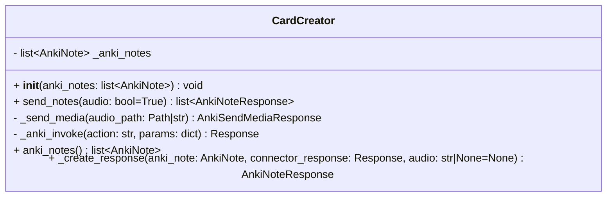

```mermaid
classDiagram
    class CardCreator {
        - list~AnkiNote~ _anki_notes
        + __init__(anki_notes: list~AnkiNote~) void
        + send_notes(audio: bool=True) list~AnkiNoteResponse~
        - _send_media(audio_path: Path|str) AnkiSendMediaResponse
        - _anki_invoke(action: str, params: dict) Response
        + anki_notes() list~AnkiNote~
        + _create_response(anki_note: AnkiNote, connector_response: Response, audio: str|None=None) AnkiNoteResponse
    }
```
