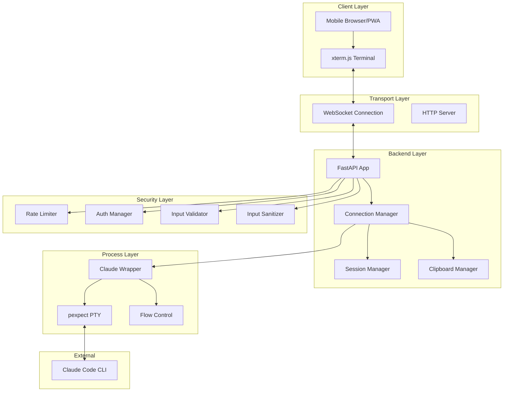
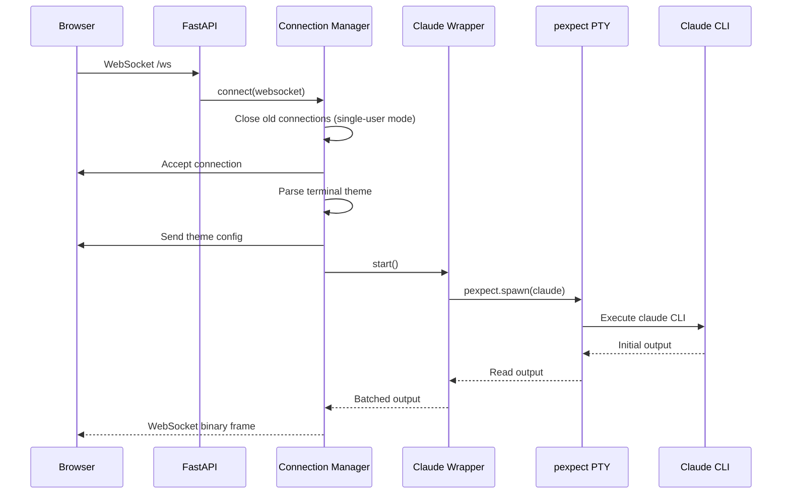
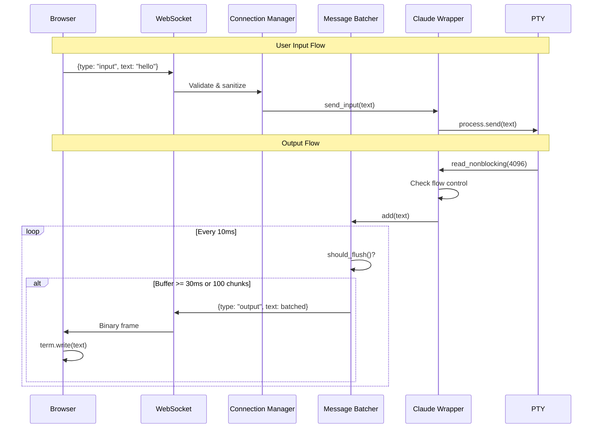
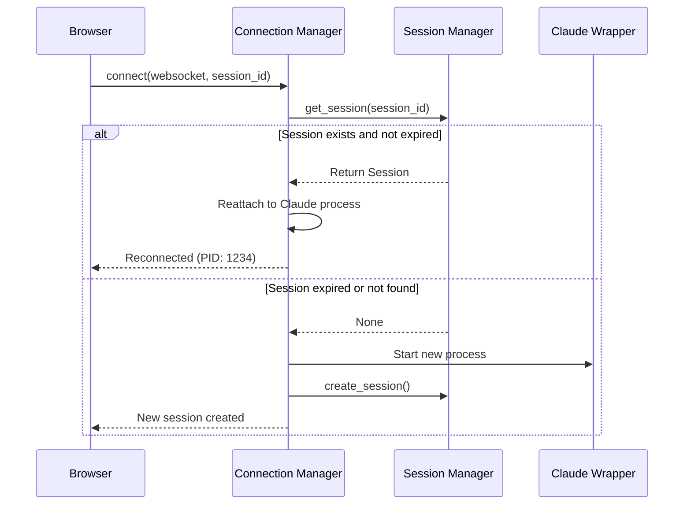

# Architecture Documentation

## Overview

**claude-on-the-go** is a mobile-first terminal access solution that enables secure, real-time access to Claude Code CLI from any device on your local network. The system uses FastAPI for WebSocket-based terminal streaming, pexpect for PTY management, and xterm.js for browser-based terminal emulation. Core value proposition: zero cloud dependencies, zero recurring costs, complete privacy.

**Key architectural principles:**
- WiFi-local only (no internet exposure)
- WebSocket streaming for real-time PTY I/O
- Single-user mode with session persistence
- Mobile-first responsive design
- Zero external dependencies beyond local network

---

## Current Architecture (v1.0)

### System Overview



### Directory Structure

```
claude-on-the-go/
├── backend/                    # FastAPI server and business logic
│   ├── app.py                  # Main FastAPI application (495 LOC)
│   ├── claude_wrapper.py       # PTY manager with flow control (289 LOC)
│   ├── session_manager.py      # Session persistence (183 LOC)
│   ├── clipboard_manager.py    # Clipboard sync (Mac ↔ Mobile)
│   ├── config.py              # Environment-based configuration (66 LOC)
│   ├── network_utils.py       # mDNS discovery, QR codes
│   ├── parsers/               # Terminal theme parsers
│   │   ├── terminal_detector.py    # Auto-detect terminal emulator
│   │   ├── iterm2_parser.py        # iTerm2 theme parsing
│   │   ├── alacritty_parser.py     # Alacritty theme parsing
│   │   ├── kitty_parser.py         # Kitty theme parsing
│   │   ├── warp_parser.py          # Warp theme parsing
│   │   ├── ghostty_parser.py       # Ghostty theme parsing
│   │   └── default_theme.py        # Fallback theme
│   └── security/              # Security primitives
│       ├── rate_limiter.py         # Token bucket rate limiting (112 LOC)
│       ├── auth.py                 # Optional password auth
│       ├── validator.py            # Message validation
│       └── sanitizer.py            # Input sanitization
│
├── frontend/                  # Web client (PWA)
│   ├── index.html             # Main terminal UI (HTML5)
│   ├── terminal.js            # xterm.js integration (416 LOC)
│   ├── style.css              # Mobile-first responsive CSS
│   └── serve.py               # Simple HTTP server for frontend
│
├── tests/                     # Test suite
│   ├── test_stability.py      # Integration tests
│   └── README.md              # Testing documentation
│
├── docs/                      # Documentation
│
├── launcher.py                # Process manager (340 LOC)
├── CLAUDE.md                  # Project instructions
├── VIEWS.md                   # UI/UX guidelines
└── ARCHITECTURE.md            # This file
```

**Total codebase: ~2,370 LOC** (backend + frontend core, excluding parsers and security utilities)

### Data Flow

#### 1. Connection Establishment



#### 2. Terminal I/O Loop



#### 3. Session Reconnection



---

## Target Architecture (v2.0 - Modular Refactor)

### Design Goals

1. **Modularity**: Clean separation between legacy, core, server, client, integrations
2. **Backward Compatibility**: Legacy v1 frozen but maintained
3. **Extensibility**: Easy to add new integrations (Tailscale, notifications)
4. **Testability**: Each module independently testable
5. **CLI-First**: `claude-on-the-go` command for all operations

### Proposed Structure

```
claude-on-the-go/
├── legacy/                    # v1.0 frozen (current codebase)
│   ├── server.py              # Symlink to backend/app.py
│   ├── README.md              # Migration guide
│   └── [current backend/frontend as-is]
│
├── core/                      # Core business logic (framework-agnostic)
│   ├── pty_manager.py         # PTY spawning & I/O (from claude_wrapper.py)
│   ├── session_store.py       # Session persistence (from session_manager.py)
│   ├── clipboard_sync.py      # Clipboard manager
│   ├── flow_control.py        # Watermark-based flow control
│   ├── config.py              # Configuration management
│   └── discovery.py           # mDNS service discovery
│
├── server/                    # FastAPI WebSocket server
│   ├── websocket.py           # WebSocket handler with reconnection
│   ├── rest.py                # REST API endpoints
│   ├── middleware.py          # Security middleware (rate limit, auth)
│   └── main.py                # Server entry point
│
├── client/                    # Web client (PWA)
│   ├── src/
│   │   ├── components/        # Web Components
│   │   │   ├── terminal/      # TerminalView, PTYStream
│   │   │   ├── connection/    # QRCode, StatusIndicator
│   │   │   ├── session/       # SessionList, SessionPlayer
│   │   │   └── mobile/        # MobileKeyboard, VoiceInput
│   │   ├── lib/
│   │   │   ├── websocket.js   # WebSocket with exponential backoff
│   │   │   └── storage.js     # localStorage wrapper
│   │   └── main.js            # App initialization
│   ├── public/
│   │   ├── index.html
│   │   ├── manifest.json      # PWA manifest
│   │   └── sw.js              # Service worker
│   └── styles/
│       └── main.css           # Mobile-first styles
│
├── integrations/              # Optional integrations
│   ├── notifications.py       # Pushover/ntfy/Telegram
│   ├── tailscale.py           # Tailscale Magic DNS
│   └── qrcode.py              # QR code generation
│
├── cli/                       # Command-line interface
│   ├── commands/
│   │   ├── start.py           # Start server
│   │   ├── stop.py            # Stop server
│   │   ├── sessions.py        # List/manage sessions
│   │   ├── qr.py              # Generate QR code
│   │   └── logs.py            # View logs
│   └── main.py                # CLI entry point
│
├── tests/                     # Comprehensive test suite
│   ├── unit/                  # Unit tests (pytest)
│   ├── integration/           # Integration tests
│   └── e2e/                   # End-to-end tests (Playwright)
│
├── docs/                      # Documentation
│   ├── api.md                 # REST API reference
│   ├── websocket.md           # WebSocket protocol
│   └── deployment.md          # Deployment guide
│
└── scripts/                   # Utility scripts
    ├── install.sh             # Installation script
    └── migrate_v1_to_v2.py    # Migration helper
```

### Module Responsibilities

#### `legacy/` - Frozen v1.0
- **Purpose**: Maintain backward compatibility for existing users
- **Contents**: Current codebase (backend/, frontend/) frozen at v1.0
- **Maintenance**: Security fixes only, no new features
- **Entry point**: `python legacy/server.py`

#### `core/` - Business Logic
- **Purpose**: Framework-agnostic core functionality
- **Dependencies**: Only Python stdlib + pexpect
- **Key modules**:
  - `pty_manager.py`: Spawn PTY, handle I/O with flow control
  - `session_store.py`: SQLite-based session persistence
  - `flow_control.py`: Watermark-based backpressure
  - `clipboard_sync.py`: Mac ↔ Mobile clipboard sync
  - `discovery.py`: mDNS service announcement
  - `config.py`: Environment variable configuration

**Example: PTY Manager**
```python
# core/pty_manager.py
class PTYManager:
    """Manages Claude CLI process with pexpect."""

    def __init__(self, command: str = "claude"):
        self.command = command
        self.process = None
        self.flow_control = FlowControl()

    async def spawn(self, output_callback: Callable):
        """Spawn Claude CLI and stream output."""
        self.process = pexpect.spawn(self.command)
        asyncio.create_task(self._read_loop(output_callback))

    async def _read_loop(self, callback):
        """Read PTY output with flow control."""
        while True:
            if self.flow_control.paused:
                await asyncio.sleep(0.01)
                continue

            data = self.process.read_nonblocking(4096)
            if data:
                await callback(data)
```

#### `server/` - FastAPI Server
- **Purpose**: WebSocket + REST API server
- **Dependencies**: FastAPI, uvicorn
- **Key modules**:
  - `websocket.py`: WebSocket handler with binary frames
  - `rest.py`: REST endpoints (/sessions, /health)
  - `middleware.py`: Rate limiting, auth, CORS
  - `main.py`: FastAPI app initialization

**Example: WebSocket Handler**
```python
# server/websocket.py
from core.pty_manager import PTYManager
from core.session_store import SessionStore

@app.websocket("/ws")
async def websocket_endpoint(websocket: WebSocket):
    await websocket.accept()

    # Attach to or create session
    session_id = websocket.query_params.get("session_id")
    pty = await get_or_create_session(session_id)

    # Bidirectional streaming
    asyncio.create_task(stream_pty_to_ws(pty, websocket))
    asyncio.create_task(stream_ws_to_pty(websocket, pty))
```

#### `client/` - Web Client (PWA)
- **Purpose**: Mobile-first terminal UI
- **Tech stack**: Vanilla JS, Web Components, xterm.js
- **Key components**:
  - `terminal/`: Terminal emulator integration
  - `connection/`: Connection status, QR codes
  - `session/`: Session history viewer
  - `mobile/`: Touch gestures, mobile keyboard

**Example: Terminal Component**
```javascript
// client/src/components/terminal/TerminalView.js
class TerminalView extends HTMLElement {
    constructor() {
        super();
        this.term = new Terminal();
        this.ws = new PTYWebSocket();
    }

    connectedCallback() {
        this.term.open(this);
        this.ws.connect(this.onOutput.bind(this));
    }

    onOutput(data) {
        this.term.write(data);
    }
}

customElements.define('terminal-view', TerminalView);
```

#### `integrations/` - Optional Integrations
- **Purpose**: Third-party service integrations
- **Design**: Pluggable, all optional, zero-config defaults
- **Modules**:
  - `notifications.py`: Forward Claude prompts to mobile (Pushover/ntfy/Telegram)
  - `tailscale.py`: Tailscale Magic DNS integration
  - `qrcode.py`: Generate connection QR codes

**Example: Notification Integration**
```python
# integrations/notifications.py
class NotificationService:
    """Send Claude prompts to mobile via push notifications."""

    def __init__(self):
        self.provider = self._detect_provider()

    def _detect_provider(self):
        if os.getenv("PUSHOVER_USER_KEY"):
            return PushoverProvider()
        elif os.getenv("NTFY_TOPIC"):
            return NtfyProvider()
        else:
            return None  # Notifications disabled

    async def send(self, title: str, message: str):
        if self.provider:
            await self.provider.send(title, message)
```

#### `cli/` - Command-Line Interface
- **Purpose**: User-friendly CLI for all operations
- **Framework**: Click or Typer
- **Commands**:
  - `claude-on-the-go start`: Start server
  - `claude-on-the-go stop`: Stop server
  - `claude-on-the-go sessions`: List active sessions
  - `claude-on-the-go qr`: Generate connection QR code
  - `claude-on-the-go logs`: View live logs

**Example: CLI Structure**
```python
# cli/main.py
import click
from cli.commands import start, stop, sessions, qr

@click.group()
def cli():
    """claude-on-the-go - Mobile access to Claude Code CLI"""
    pass

cli.add_command(start.start)
cli.add_command(stop.stop)
cli.add_command(sessions.sessions)
cli.add_command(qr.qr)

if __name__ == "__main__":
    cli()
```

---

## Migration Path (v1 → v2)

### Phase 1: Extract Core (Week 1)
1. Create `core/` directory
2. Extract `claude_wrapper.py` → `core/pty_manager.py`
3. Extract `session_manager.py` → `core/session_store.py`
4. Extract `config.py` → `core/config.py`
5. Write unit tests for core modules
6. Keep `backend/` importing from `core/` (no breaking changes)

### Phase 2: Refactor Server (Week 2)
1. Create `server/` directory
2. Split `app.py` into `websocket.py`, `rest.py`, `middleware.py`
3. Update imports to use `core/` modules
4. Add integration tests
5. Ensure `legacy/server.py` still works via symlink

### Phase 3: Rebuild Client (Week 3-4)
1. Create `client/` directory with modern structure
2. Port `terminal.js` to Web Components
3. Add PWA manifest and service worker
4. Implement session history viewer
5. Mobile gesture improvements (pinch zoom, swipe)

### Phase 4: CLI & Integrations (Week 5)
1. Create `cli/` with Click/Typer
2. Implement core commands (start, stop, sessions, qr)
3. Move `network_utils.py` → `integrations/qrcode.py`
4. Add notification integrations (Pushover, ntfy, Telegram)

### Phase 5: Testing & Documentation (Week 6)
1. Unit tests (pytest): 80%+ coverage
2. Integration tests: WebSocket reconnection, multi-client
3. E2E tests (Playwright): Mobile viewport, voice input
4. Update documentation (API, WebSocket protocol, deployment)

### Backward Compatibility Guarantee
- `python legacy/server.py` works indefinitely
- Environment variables unchanged
- WebSocket protocol unchanged (binary frames, JSON messages)
- Session IDs remain compatible

---

## Testing Strategy

### Unit Tests (pytest)
**Target: 80%+ coverage**

```python
# tests/unit/test_pty_manager.py
import pytest
from core.pty_manager import PTYManager

@pytest.mark.asyncio
async def test_pty_spawn():
    """Test PTY spawning and basic I/O."""
    pty = PTYManager(command="echo 'hello'")
    output = []

    await pty.spawn(lambda data: output.append(data))
    await asyncio.sleep(0.1)

    assert b"hello" in b"".join(output)
    await pty.stop()

@pytest.mark.asyncio
async def test_flow_control():
    """Test watermark-based flow control."""
    pty = PTYManager()
    pty.flow_control.high_watermark = 100

    # Fill buffer
    pty.flow_control.add_bytes(150)
    assert pty.flow_control.paused is True

    # Drain buffer
    pty.flow_control.remove_bytes(100)
    assert pty.flow_control.paused is False
```

### Integration Tests
**Focus: WebSocket reconnection, session persistence, multi-client**

```python
# tests/integration/test_websocket.py
import pytest
from fastapi.testclient import TestClient
from server.main import app

def test_websocket_reconnection():
    """Test WebSocket reconnection with session ID."""
    client = TestClient(app)

    # Initial connection
    with client.websocket_connect("/ws") as ws:
        ws.send_json({"type": "input", "text": "hello"})
        data = ws.receive_json()
        session_id = data["session_id"]

    # Reconnect with session ID
    with client.websocket_connect(f"/ws?session_id={session_id}") as ws:
        data = ws.receive_json()
        assert data["type"] == "session"
        assert data["reconnected"] is True
```

### E2E Tests (Playwright)
**Focus: Mobile viewport, touch gestures, voice input**

```javascript
// tests/e2e/mobile.spec.js
const { test, expect, devices } = require('@playwright/test');

test.use(devices['iPhone 13']);

test('mobile terminal resize', async ({ page }) => {
    await page.goto('http://localhost:8001');

    // Wait for terminal to load
    await page.waitForSelector('.xterm');

    // Rotate to landscape
    await page.setViewportSize({ width: 844, height: 390 });

    // Check terminal resized
    const terminalSize = await page.evaluate(() => {
        return {
            rows: window.claudeTerminal.term.rows,
            cols: window.claudeTerminal.term.cols
        };
    });

    expect(terminalSize.cols).toBeGreaterThan(80);
});
```

---

## Security Considerations

### 1. Network Isolation (Primary Defense)
- **Bind to LAN only**: `BACKEND_HOST=0.0.0.0` but firewall blocks WAN
- **No cloud exposure**: Everything WiFi-local
- **Assumption**: Local network is trusted (home/office WiFi)

### 2. Rate Limiting
**Implementation: Token bucket algorithm**

```python
# Limits per connection
RATE_LIMIT_MESSAGES = 10      # 10 messages/second
RATE_LIMIT_BYTES = 100_000    # 100 KB/second

# Prevents:
# - DoS attacks via message flooding
# - Bandwidth exhaustion
# - Clipboard sync abuse
```

### 3. Input Validation
**All WebSocket messages validated before processing**

```python
# server/middleware.py
def validate_message(msg: dict) -> Tuple[bool, str]:
    """Validate WebSocket message structure."""
    if "type" not in msg:
        return False, "Missing 'type' field"

    if msg["type"] not in ["input", "resize", "control", "clipboard_set"]:
        return False, f"Invalid message type: {msg['type']}"

    if msg["type"] == "input" and len(msg.get("text", "")) > 10_000:
        return False, "Input too large (max 10KB)"

    return True, ""
```

### 4. Input Sanitization
**Prevent command injection via ANSI escape codes**

```python
# server/middleware.py
def sanitize_input(text: str, allow_ansi: bool = True) -> str:
    """Sanitize user input before sending to PTY."""
    if not allow_ansi:
        # Strip all ANSI escape codes
        text = re.sub(r'\x1b\[[0-9;]*m', '', text)

    # Remove dangerous control characters (except allowed ones)
    allowed = {'\n', '\r', '\t', '\x03'}  # newline, return, tab, Ctrl+C
    text = ''.join(c for c in text if ord(c) >= 32 or c in allowed)

    return text
```

### 5. Optional Password Auth
**For shared network scenarios**

```bash
# Enable auth via environment variable
export ENABLE_AUTH=true
export AUTH_TOKEN="your-secure-token-here"

# Client connects with token in query params
ws://192.168.1.100:8000/ws?token=your-secure-token-here
```

### 6. Session Expiry
**Prevent zombie sessions from consuming resources**

```python
# Sessions expire after 1 hour of inactivity
SESSION_TIMEOUT = 3600

# Cleanup task runs every 60 seconds
async def cleanup_expired_sessions():
    while True:
        await asyncio.sleep(60)
        expired = [s for s in sessions if s.is_expired(SESSION_TIMEOUT)]
        for session in expired:
            await session.destroy()
```

### 7. CORS (Cross-Origin Resource Sharing)
**Restrict WebSocket connections to trusted origins**

```python
# Only allow connections from frontend
ALLOWED_ORIGINS = [
    "http://localhost:8001",
    "http://127.0.0.1:8001",
    "http://192.168.1.100:8001",  # LAN IP
]
```

### Security Checklist
- [ ] Firewall blocks WAN access to port 8000
- [ ] Rate limiting enabled (10 msg/s, 100 KB/s)
- [ ] Input validation on all WebSocket messages
- [ ] ANSI escape code sanitization
- [ ] Session expiry (1 hour default)
- [ ] CORS restricted to frontend origins
- [ ] Optional password auth for shared networks
- [ ] No secrets in logs (LOG_REDACTION=true)
- [ ] HTTPS recommended for production (via reverse proxy)

---

## Performance Targets

### Latency
- **Connection establishment**: < 3 seconds
- **Terminal echo latency**: < 50ms (LAN), < 100ms (WiFi)
- **Reconnection time**: < 2 seconds

### Throughput
- **Output streaming**: Handle 10 MB/s bursts (Claude logs)
- **Input handling**: 10 messages/second (rate limit)
- **Concurrent connections**: 1 (single-user mode)

### Resource Usage
- **Memory footprint**: < 50 MB (backend + PTY)
- **CPU usage**: < 5% idle, < 20% active
- **Network bandwidth**: < 1 MB/s typical

### Frontend Performance
- **Lighthouse PWA score**: > 95
- **Time to Interactive (TTI)**: < 2 seconds
- **xterm.js render**: 60 FPS
- **Mobile scroll smoothness**: 60 FPS

---

## Deployment Scenarios

### Local Development
```bash
# Start with launcher
python launcher.py

# Or manually
cd backend && python app.py &
cd frontend && python serve.py &
```

### Production (Self-Hosted)
```bash
# Install as systemd service
sudo cp scripts/claude-on-the-go.service /etc/systemd/system/
sudo systemctl enable claude-on-the-go
sudo systemctl start claude-on-the-go

# View logs
journalctl -u claude-on-the-go -f
```

### Docker Deployment
```dockerfile
FROM python:3.11-slim

WORKDIR /app
COPY requirements.txt .
RUN pip install -r requirements.txt

COPY backend/ ./backend/
COPY frontend/ ./frontend/

EXPOSE 8000 8001
CMD ["python", "launcher.py"]
```

### Tailscale Integration
```bash
# Access from anywhere via Tailscale
export TAILSCALE_HOSTNAME=claude-mac
tailscale up --hostname=$TAILSCALE_HOSTNAME

# Connect from phone
ws://claude-mac:8000/ws
```

---

## API Reference

### WebSocket Protocol

**Endpoint**: `ws://<host>:8000/ws`

**Query Parameters**:
- `token` (optional): Auth token if `ENABLE_AUTH=true`
- `session_id` (optional): Reconnect to existing session

**Message Types (Client → Server)**:

```typescript
// User input
{
    "type": "input",
    "text": string  // Max 10KB
}

// Terminal resize
{
    "type": "resize",
    "rows": number,
    "cols": number
}

// Control character (Ctrl+C, Ctrl+D)
{
    "type": "control",
    "char": string  // "c", "d", "z"
}

// Set Mac clipboard from phone
{
    "type": "clipboard_set",
    "text": string
}

// Heartbeat response
{
    "type": "pong"
}
```

**Message Types (Server → Client)**:

```typescript
// PTY output
{
    "type": "output",
    "text": string,
    "is_prompt": boolean
}

// Terminal theme configuration
{
    "type": "theme",
    "colors": {
        "background": string,
        "foreground": string,
        // ... xterm.js color scheme
    },
    "font": string,
    "fontSize": number
}

// Session information
{
    "type": "session",
    "session_id": string,
    "reconnected": boolean
}

// Clipboard sync (Mac → phone)
{
    "type": "clipboard_sync",
    "text": string
}

// Heartbeat ping
{
    "type": "ping"
}

// Error message
{
    "type": "error",
    "message": string
}
```

### REST API

**GET /**: Health check
```json
{
    "service": "Claude-onTheGo Backend",
    "status": "running",
    "connections": 1,
    "claude_alive": true
}
```

---

## Future Enhancements

### Near-term (v2.1)
- [ ] Session history viewer (replay past sessions)
- [ ] Read-only sharing (time-limited tokens)
- [ ] Voice input integration (Web Speech API)
- [ ] Multiple terminal tabs (tmux integration)

### Mid-term (v2.5)
- [ ] Native mobile app (Capacitor wrapper)
- [ ] Biometric auth (Touch ID, Face ID)
- [ ] Offline mode (service worker caching)
- [ ] Split-screen mode (terminal + docs)

### Long-term (v3.0)
- [ ] Multi-user mode (team collaboration)
- [ ] End-to-end encryption (zero-trust)
- [ ] Plugin system (custom integrations)
- [ ] Cloud sync (optional, paid tier)

---

## Contributing

### Development Setup
```bash
# Clone repo
git clone https://github.com/your-username/claude-on-the-go.git
cd claude-on-the-go

# Create virtual environment
python -m venv venv
source venv/bin/activate  # or `venv\Scripts\activate` on Windows

# Install dependencies
pip install -r requirements.txt

# Run tests
pytest tests/

# Start development server
python launcher.py
```

### Code Style
- **Python**: Black formatter, flake8 linter, type hints
- **JavaScript**: ESLint, Prettier
- **Commits**: Conventional Commits format
- **Documentation**: Docstrings for all public APIs

### Pull Request Checklist
- [ ] Tests pass (`pytest tests/`)
- [ ] Code formatted (`black backend/`)
- [ ] Type hints added (Python 3.8+ syntax)
- [ ] Documentation updated (ARCHITECTURE.md, API docs)
- [ ] Changelog updated (CHANGELOG.md)

---

## License

MIT License - see LICENSE file for details.

---

## Questions & Support

- **GitHub Issues**: https://github.com/your-username/claude-on-the-go/issues
- **Discussions**: https://github.com/your-username/claude-on-the-go/discussions
- **Email**: support@claude-on-the-go.dev

---

*Last updated: 2025-10-10*
*Version: 2.0.0-draft*
