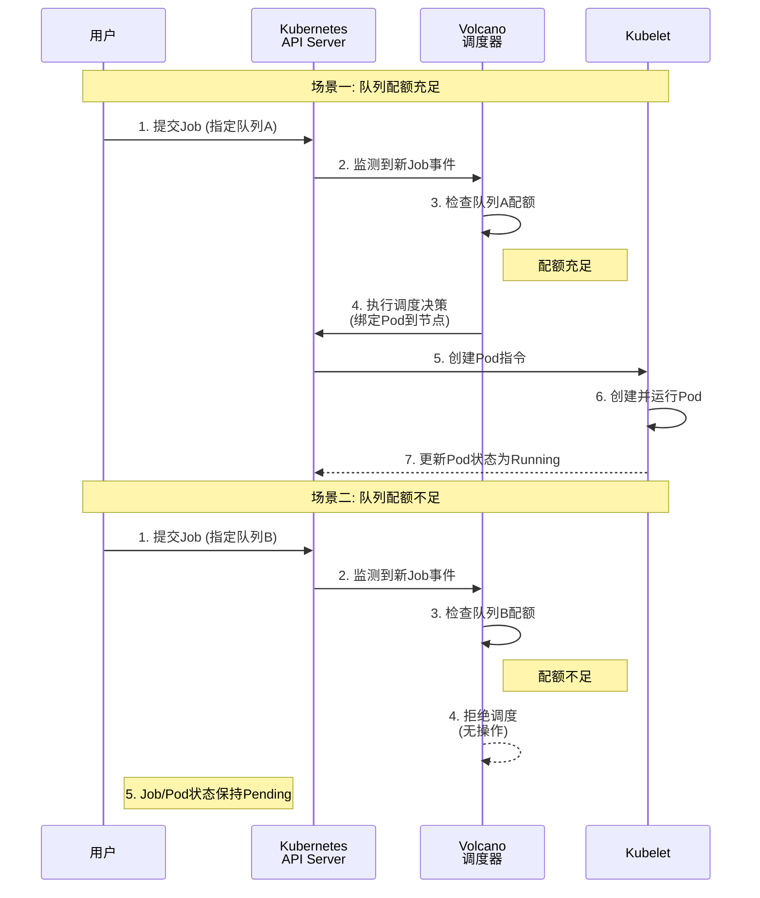

```mermaid

sequenceDiagram
    participant User as 用户
    participant ApiServer as Kubernetes<br>API Server
    participant Volcano as Volcano<br>调度器
    participant Kubelet as Kubelet

    Note over User, Kubelet: 场景一: 队列配额充足
    User->>ApiServer: 1. 提交Job (指定队列A)
    ApiServer->>Volcano: 2. 监测到新Job事件
    Volcano->>Volcano: 3. 检查队列A配额
    Note right of Volcano: 配额充足
    Volcano->>ApiServer: 4. 执行调度决策<br>(绑定Pod到节点)
    ApiServer->>Kubelet: 5. 创建Pod指令
    Kubelet->>Kubelet: 6. 创建并运行Pod
    Kubelet-->>ApiServer: 7. 更新Pod状态为Running

    Note over User, Kubelet: 场景二: 队列配额不足
    User->>ApiServer: 1. 提交Job (指定队列B)
    ApiServer->>Volcano: 2. 监测到新Job事件
    Volcano->>Volcano: 3. 检查队列B配额
    Note right of Volcano: 配额不足
    Volcano-->>Volcano: 4. 拒绝调度<br>(无操作)
    Note left of ApiServer: 5. Job/Pod状态保持Pending

```