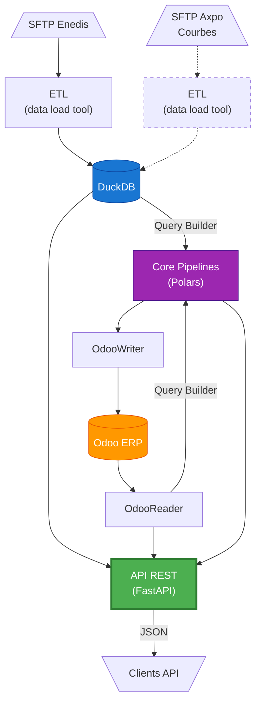

# ⚡ ElectriCore - Moteur de traitement données énergétiques

**ElectriCore** est un outil libre pour reprendre le contrôle des données du réseau électrique français. Architecture moderne **Polars + DuckDB** pour transformer les flux bruts Enedis en données exploitables par LibreWatt, Odoo et autres outils de suivi énergétique.

## 🎯 Objectifs

Un outil de calcul énergétique **performant** et **maintenable** pour :
- ✅ **Transformer** les flux XML/CSV Enedis en données structurées
- ✅ **Calculer** les indicateurs essentiels (périmètre, abonnements, consommations, TURPE)
- ✅ **Exposer** les données via API REST sécurisée
- ✅ **Intégrer** avec Odoo et autres systèmes tiers

---

## 🏗️ Architecture - 3 Modules Principaux

```
electricore/
├── etl/              # 📥 ETL - Extraction & Transformation (DLT)
│   ├── sources/      # Sources de données (SFTP Enedis)
│   ├── transformers/ # Transformations modulaires (crypto, archive, parsers)
│   └── connectors/   # Connecteurs externes (Odoo)
│
├── core/             # 🧮 CORE - Calculs énergétiques (Polars)
│   ├── models/       # Modèles Pandera (validation des données)
│   ├── pipelines/    # Pipelines de calcul (périmètre, abonnements, énergie, turpe)
│   └── loaders/      # Query builders (DuckDB, Polars)
│
└── api/              # 🌐 API - Accès aux données (FastAPI)
    ├── services/     # Services de requêtage (DuckDB)
    └── main.py       # Application FastAPI avec authentification
```

### Diagramme de flux



---

## 📥 Module ETL - Extraction & Transformation

Pipeline ETL modulaire basé sur **DLT** (Data Load Tool) pour extraire et transformer les flux Enedis.

### Flux supportés

| Flux   | Description                  | Tables générées               |
|--------|------------------------------|-------------------------------|
| **C15** | Changements contractuels    | `flux_c15`                    |
| **F12** | Facturation distributeur    | `flux_f12`                    |
| **F15** | Facturation détaillée       | `flux_f15_detail`             |
| **R15** | Relevés avec événements     | `flux_r15`, `flux_r15_acc`    |
| **R151**| Relevés périodiques         | `flux_r151`                   |
| **R64** | Relevés JSON timeseries     | `flux_r64`                    |

### Architecture modulaire

```python
# Pipeline ETL avec transformers chaînables
encrypted_files | decrypt_transformer | unzip_transformer | parse_transformer
```

**Transformers disponibles** :
- `crypto.py` - Déchiffrement AES
- `archive.py` - Extraction ZIP
- `parsers.py` - Parsing XML/CSV

### Utilisation

```bash
# Test rapide (2 fichiers)
poetry run python electricore/etl/pipeline_production.py test

# R151 complet (~6 secondes)
poetry run python electricore/etl/pipeline_production.py r151

# Tous les flux (production)
poetry run python electricore/etl/pipeline_production.py all
```

**Résultat** : Base DuckDB `electricore/etl/flux_enedis_pipeline.duckdb` avec toutes les tables flux.

📖 **Documentation complète** : [electricore/etl/README.md](electricore/etl/README.md)

---

## 🧮 Module Core - Calculs Énergétiques Polars

Pipelines de calculs énergétiques basés sur **Polars pur** (LazyFrames + expressions fonctionnelles).

### Pipelines disponibles

#### 1. **Périmètre** - Détection changements contractuels
```python
from electricore.core.pipelines.perimetre import pipeline_perimetre
from electricore.core.loaders import c15

# Depuis DuckDB avec Query Builder
historique_lf = (
    c15()
    .filter({"Date_Evenement": ">= '2024-01-01'"})
    .limit(1000)
    .lazy()
)

perimetre_df = pipeline_perimetre(historique_lf).collect()
# Colonnes: pdl, Date_Evenement, impacte_abonnement, impacte_energie, resume_modification
```

#### 2. **Abonnements** - Périodes d'abonnement
```python
from electricore.core.pipelines.abonnements import pipeline_abonnements

# Calcul périodes d'abonnement avec bornes temporelles
abonnements_df = pipeline_abonnements(
    perimetre_lf,
    date_debut="2024-01-01",
    date_fin="2024-12-31"
).collect()
# Colonnes: pdl, debut, fin, nb_jours, Puissance_Souscrite, Formule_Tarifaire_Acheminement
```

#### 3. **Énergies** - Consommations par cadran
```python
from electricore.core.pipelines.energie import pipeline_energie
from electricore.core.loaders import releves

relevés_lf = releves().filter({"date_releve": ">= '2024-01-01'"}).lazy()

energies_df = pipeline_energie(
    perimetre_lf,
    relevés_lf,
    date_debut="2024-01-01",
    date_fin="2024-12-31"
).collect()
# Colonnes: pdl, debut, fin, energie_hp, energie_hc, energie_base, ...
```

#### 4. **TURPE** - Calcul taxes réglementaires
```python
from electricore.core.pipelines.turpe import ajouter_turpe_fixe, ajouter_turpe_variable

# TURPE fixe (abonnement)
abonnements_turpe_df = ajouter_turpe_fixe(abonnements_df).collect()
# Colonnes: ..., turpe_fixe_annuel, turpe_fixe_journalier, turpe_fixe_periode

# TURPE variable (énergies)
energies_turpe_df = ajouter_turpe_variable(energies_df).collect()
# Colonnes: ..., turpe_hpb, turpe_hcb, turpe_hph, turpe_hch, turpe_variable_total
```

#### 5. **Facturation** - Pipeline complet
```python
from electricore.core.pipelines.orchestration import facturation

# Pipeline complet : périmètre → abonnements → énergies
resultat = facturation(
    historique_lf,
    relevés_lf,
    date_debut="2024-01-01",
    date_fin="2024-12-31"
)

# Résultats disponibles
print(resultat.abonnements.collect())  # Périodes d'abonnement
print(resultat.energies.collect())      # Consommations
print(resultat.factures.collect())      # Synthèses mensuelles
```

### 🔧 Interfaces de Requêtage

#### DuckDB Query Builder - Architecture Fonctionnelle Modulaire

**Architecture en 6 modules** pour performance et maintenabilité :
- `config.py` - Configuration et connexions DuckDB
- `expressions.py` - Expressions Polars pures réutilisables
- `transforms.py` - Transformations composables avec `compose()`
- `sql.py` - Génération SQL fonctionnelle (dataclasses frozen)
- `query.py` - Query builder immutable (`DuckDBQuery`)
- `__init__.py` - API publique + helper `_CTEQuery` pour requêtes CTE

```python
from electricore.core.loaders import c15, r151, releves, releves_harmonises

# Historique périmètre (flux C15)
historique = (
    c15()
    .filter({"Date_Evenement": ">= '2024-01-01'"})
    .limit(100)
    .collect()
)

# Relevés périodiques (flux R151)
relevés = (
    r151()
    .filter({"pdl": ["PDL123", "PDL456"]})
    .limit(1000)
    .lazy()  # Retourne LazyFrame pour optimisations
)

# Relevés unifiés (R151 + R15) avec CTE
tous_releves = releves().collect()

# Relevés harmonisés (R151 + R64) avec CTE
releves_cross_flux = (
    releves_harmonises()
    .filter({"flux_origine": "R64"})
    .collect()
)
```

**Fonctions disponibles** : `c15()`, `r151()`, `r15()`, `f15()`, `r64()`, `releves()`, `releves_harmonises()`

**Caractéristiques** :
- ✅ Immutabilité garantie (frozen dataclasses)
- ✅ Composition fonctionnelle pure
- ✅ Lazy evaluation optimisée
- ✅ Support CTE (Common Table Expressions)
- ✅ Validation Pandera intégrée

📖 **Documentation complète** : [electricore/core/loaders/DUCKDB_INTEGRATION_GUIDE.md](electricore/core/loaders/DUCKDB_INTEGRATION_GUIDE.md)

#### Odoo Query Builder - Intégration ERP

```python
from electricore.core.loaders import OdooReader
import polars as pl

config = {
    'url': 'https://odoo.example.com',
    'db': 'production',
    'username': 'api_user',
    'password': 'secret'
}

with OdooReader(config) as odoo:
    # Query builder avec navigation relationnelle
    factures_df = (
        odoo.query('sale.order', domain=[('x_pdl', '!=', False)])
        .follow('invoice_ids', fields=['name', 'invoice_date', 'amount_total'])
        .filter(pl.col('amount_total') > 100)
        .collect()
    )

    # Enrichissement avec données liées
    commandes_enrichies = (
        odoo.query('sale.order', fields=['name', 'date_order'])
        .enrich('partner_id', fields=['name', 'email'])
        .collect()
    )
```

**Méthodes disponibles** : `.query()`, `.follow()`, `.enrich()`, `.filter()`, `.select()`, `.rename()`, `.collect()`

📖 **Documentation complète** : [docs/odoo-query-builder.md](docs/odoo-query-builder.md)

---

## 🌐 Module API - Accès aux Données

API REST sécurisée basée sur **FastAPI** pour accéder aux données flux depuis DuckDB.

### Endpoints

#### Publics (sans authentification)
- `GET /` - Informations API et tables disponibles
- `GET /health` - Statut API et base de données
- `GET /docs` - Documentation Swagger interactive

#### Sécurisés (authentification requise)
- `GET /flux/{table_name}` - Données d'une table flux
- `GET /flux/{table_name}/info` - Métadonnées d'une table
- `GET /admin/api-keys` - Configuration clés API

### Utilisation

```bash
# Démarrer l'API
poetry run uvicorn electricore.api.main:app --reload

# Requête avec authentification
curl -H "X-API-Key: votre_cle" "http://localhost:8000/flux/r151?limit=10"

# Filtrer par PDL
curl -H "X-API-Key: votre_cle" "http://localhost:8000/flux/c15?prm=12345678901234"

# Métadonnées d'une table
curl -H "X-API-Key: votre_cle" "http://localhost:8000/flux/r151/info"
```

### Configuration

Créer un fichier `.env` :

```bash
# Clé API (générer avec: python -c "import secrets; print(secrets.token_urlsafe(32))")
API_KEY=votre_cle_secrete_generee

# Ou plusieurs clés
API_KEYS=cle1,cle2,cle3

# Options d'authentification
ENABLE_API_KEY_HEADER=true
ENABLE_API_KEY_QUERY=false
```

📖 **Documentation complète** : [electricore/api/README.md](electricore/api/README.md)

---

## 🚀 Installation & Usage

### Prérequis

- Python 3.12+
- Poetry

### Installation

```bash
# Cloner le projet
git clone https://github.com/votre-org/electricore.git
cd electricore

# Installer les dépendances
poetry install
```

### Commandes essentielles

```bash
# Tests
poetry run pytest -q

# Pipeline ETL complet
poetry run python electricore/etl/pipeline_production.py all

# API FastAPI
poetry run uvicorn electricore.api.main:app --reload

# Notebooks interactifs (Marimo)
poetry run marimo edit notebooks/demo_pipeline_abonnements_polars.py
```

---

## 🧪 Tests & Validation

Suite de tests moderne avec **186 tests** (tous passants ✅) :

### Infrastructure de test

- ✅ **Configuration pytest** : 8 markers (unit, integration, slow, smoke, duckdb, odoo, hypothesis, skip_ci)
- ✅ **Fixtures partagées** : Connexions DuckDB temporaires, données minimales, helpers d'assertion
- ✅ **Tests paramétrés** : 39 tests avec `@pytest.mark.parametrize` pour réduire duplication
- ✅ **Tests snapshot** : 10 tests Syrupy pour détection automatique de régression
- ✅ **Script anonymisation** : Extraction sécurisée de cas métier réels

### Types de tests

- **Tests unitaires** (26 paramétrés) - Expressions Polars pures (périmètre, TURPE)
- **Tests d'intégration** (10 snapshot) - Pipelines complets avec validation Pandera
- **Tests DuckDB** - Query builders et transformations
- **Fixtures métier** - Cas réels (MCT, MES/RES, changements)

### Commandes

```bash
# Tous les tests
pytest

# Tests rapides uniquement
pytest -m unit

# Tests critiques (CI)
pytest -m smoke

# Exécution parallèle
pytest -n auto

# Avec coverage
pytest --cov=electricore --cov-report=html
```

**Couverture** : 49% (focus sur qualité plutôt que quantité)

📖 Documentation complète : [tests/README.md](tests/README.md)

---

## 📊 Migration Polars - Complète ✅

ElectriCore utilise une architecture **100% Polars** pour des performances optimales.

### Avantages de l'architecture Polars

- ⚡ **Performance** : Zero-copy, vectorisation SIMD, multi-threading
- 🔧 **Lazy evaluation** : Optimisations automatiques des requêtes
- 🧩 **Expressions pures** : Code fonctionnel composable et testable
- 🌐 **Écosystème moderne** : Compatible Arrow, DuckDB, Cloud
- 🚀 **Pérenne** : Abandon dépendances pandas historiques

### Pipelines migrés

- ✅ **Pipeline périmètre** : 8 expressions composables + validation
- ✅ **Pipeline abonnements** : Calcul périodes avec bornes temporelles
- ✅ **Pipeline énergies** : Calcul consommations tous cadrans
- ✅ **Pipeline TURPE** : Taxes fixes + variables avec validation réglementaire
- ✅ **Pipeline facturation** : Orchestration complète avec agrégations

---

## 🗺️ Roadmap

### Complété ✅
- Migration Polars complète (périmètre, abonnements, énergies, turpe)
- Query Builder DuckDB avec architecture fonctionnelle modulaire (6 modules)
- Connecteur Odoo avec Query Builder
- API FastAPI sécurisée avec authentification
- Pipeline ETL modulaire avec DLT
- Tests unitaires et validation (140 tests passent)

### En cours 🔄
- CI/CD GitHub Actions
- Documentation API détaillée (OpenAPI)
- Suivi et métriques de performance

### À venir 📅
- API SOAP Enedis (alternative SFTP)
- Gestion prestations et affaires
- Nouveaux connecteurs (Axpo, autres sources)
- Calculs avancés (MCT, cas complexes)
- Suivi des souscriptions aux services de données

---

## 📚 Documentation Complémentaire

- [ETL README](electricore/etl/README.md) - Pipeline extraction & transformation
- [API README](electricore/api/README.md) - API REST et authentification
- [Intégration DuckDB](electricore/core/loaders/DUCKDB_INTEGRATION_GUIDE.md) - Query Builder DuckDB
- [Query Builder Odoo](docs/odoo-query-builder.md) - Intégration Odoo
- [Conventions Dates](docs/conventions-dates-enedis.md) - Formats temporels Enedis
- [Vision Architecture](docs/archi/) - Documentation architecture détaillée

---

## 🤝 Contribution

Les contributions sont les bienvenues ! Avant toute modification :

1. Lancer les tests : `poetry run pytest -q`
2. Vérifier la cohérence avec les patterns Polars existants
3. Documenter les nouvelles fonctionnalités
4. Suivre les conventions de code du projet

---

## 📄 Licence

GPLv3 - Voir [LICENSE](LICENSE)

---

## 🙏 Remerciements

- **Polars** - Framework data processing moderne
- **DuckDB** - Base analytique embarquée
- **DLT** - Pipeline ETL déclaratif
- **FastAPI** - Framework API performant
- **Pandera** - Validation schémas données