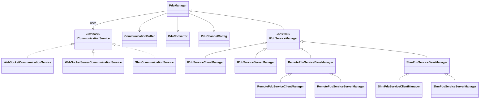

# hakoniwa-pdu-python

[](https://github.com/hakoniwalab/hakoniwa-pdu-python/actions/workflows/tests.yml)

**Python PDU communication library for the Hakoniwa simulator.**
Provides a unified transport layer where **RPC** and **Pub/Sub (topics)** run seamlessly over WebSocket.
For high-speed use cases, a **Shared Memory (SHM)** backend is also available.
The architecture is extensible to **Zenoh**, enabling scalable and distributed systems.
Binary ⇔ JSON ⇔ Python type conversion is built-in, reducing boilerplate to a minimum.

---

## ✨ Features

* **Unified layer**: RPC and Pub/Sub integrated on top of WebSocket
* **Automatic type conversion**: safely convert between binary, JSON, and Python types with offset definitions
* **Transport flexibility**: choose between **WebSocket**, **Shared Memory (SHM)**, and extensible backends such as **Zenoh**
* **Explicit & secure connections**: WebSocket URIs (`ws://...`) clearly define communication scope
* **Event-driven & polling support**: register handlers or poll buffers as needed
* **Ready-to-run samples**: minimal examples for `Twist` (topic) and `AddTwoInts` (RPC) included

---

## 📦 Installation

```bash
pip install hakoniwa-pdu
pip show hakoniwa-pdu   # check version
```

### Environment Variables

Specify the directory containing `.offset` files for PDU conversion:

```bash
export HAKO_BINARY_PATH=/your/path/to/offset
```

Default path if unset:

```
/usr/local/lib/hakoniwa/hako_binary/offset
```

---

## 🚀 Quick Start (3 commands)

> Example 1: **WebSocket Topic** (`geometry_msgs/Twist` publish → subscribe)

1. **Publisher (server)**

```bash
python examples/topic/websocket/remote_publisher.py \
  --uri ws://localhost:8080 \
  --pdu-config examples/pdu_config.json \
  --service-config examples/service.json
```

2. **Subscriber (client)**

```bash
python examples/topic/websocket/remote_subscriber.py \
  --uri ws://localhost:8080 \
  --pdu-config examples/pdu_config.json \
  --service-config examples/service.json
```

3. **Output**

```
[INFO] Received Twist: linear.x=0 angular.z=0
[INFO] Received Twist: linear.x=1 angular.z=1
```

---

> Example 2: **WebSocket RPC** (`AddTwoInts` service)

1. **RPC Server**

```bash
python examples/rpc/websocket/remote_rpc_server.py \
  --uri ws://localhost:8080 \
  --pdu-config examples/pdu_config.json \
  --service-config examples/service.json
```

2. **RPC Client**

```bash
python examples/rpc/websocket/remote_rpc_client.py \
  --uri ws://localhost:8080 \
  --pdu-config examples/pdu_config.json \
  --service-config examples/service.json
```

3. **Output**

```
Response: 3
```

---

## 📡 Event-Driven PDU Handling

Server:

```python
server_manager.register_handler_pdu_data(on_pdu)

def on_pdu(client_id, packet):
    ...
```

Client:

```python
client_manager.register_handler_pdu_data(on_pdu)

def on_pdu(packet):
    ...
```

Polling via `contains_buffer()` / `get_buffer()` is also available.

---

## 📁 Project Structure

```
hakoniwa_pdu/
├── pdu_manager.py
├── impl/
│   ├── icommunication_service.py
│   ├── websocket_communication_service.py
│   ├── websocket_server_communication_service.py
│   ├── shm_communication_service.py
│   ├── pdu_convertor.py
│   └── hako_binary/
├── rpc/
│   ├── ipdu_service_manager.py
│   ├── protocol_client.py
│   ├── protocol_server.py
│   ├── auto_wire.py
│   ├── remote/
│   └── shm/
├── resources/
│   └── offset/
└── examples/
```

---

## 🧭 Class Overview

### PduManager

* Orchestrates PDU buffers and delegates to a transport (`ICommunicationService`).
* Direct I/O: `declare_pdu_for_read/write` → `flush_pdu_raw_data()` / `read_pdu_raw_data()`.
* For RPC: extended via `rpc.IPduServiceManager` (handles `register_client`, `start_rpc_service`, etc.).

### Transport Implementations (`impl/`)

* `ICommunicationService` defines the transport API.
* `WebSocketCommunicationService` / `WebSocketServerCommunicationService`: WebSocket backend (explicit URI-based connection, simple & secure).
* `ShmCommunicationService`: high-speed shared memory backend.
* **Pluggable design**: additional transports (e.g., **Zenoh**) can be integrated without changing application code.

### RPC Layer (`rpc/`)

* `IPduServiceManager` family provides RPC APIs (client/server).
* `protocol_client.py` / `protocol_server.py`: user-friendly helpers.
* `auto_wire.py`: auto-loads generated converters.
* `remote/`: WebSocket managers.
* `shm/`: SHM managers.

---

## 🧩 Class Diagram (Mermaid)



---

## 🔗 Links

* 📘 GitHub: [https://github.com/hakoniwalab/hakoniwa-pdu-python](https://github.com/hakoniwalab/hakoniwa-pdu-python)
* 🌐 Hakoniwa Lab: [https://hakoniwa-lab.net](https://hakoniwa-lab.net)

---

## 📚 Documentation

For detailed API usage:
➡️ [API Reference (api-doc.md)](./api-doc.md)

---

## 📜 License

MIT License — see [LICENSE](./LICENSE)

