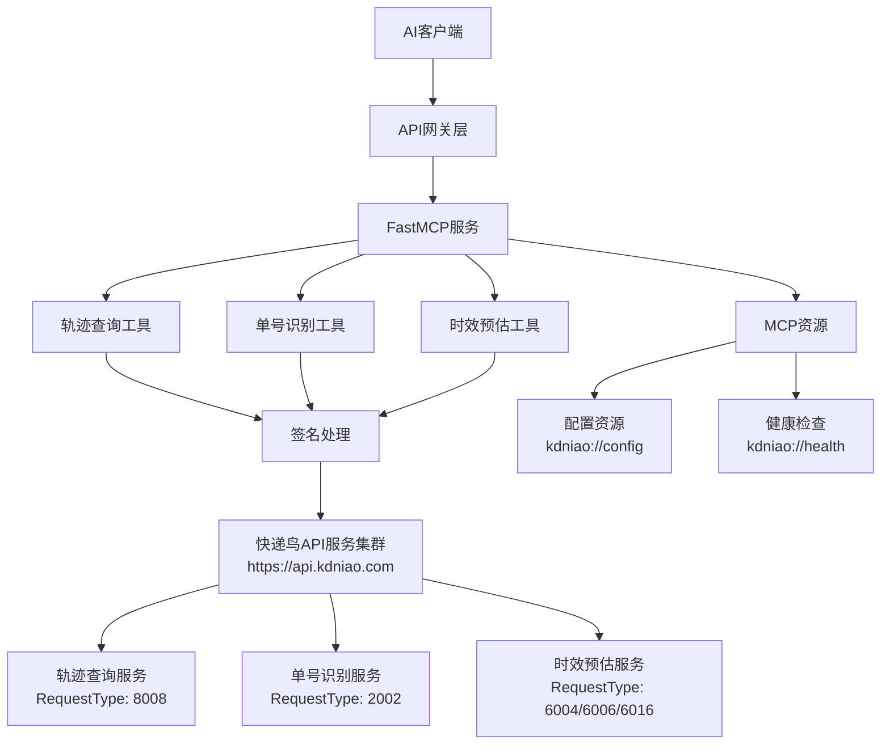

# 快递鸟MCP服务技术方案

## 概述

基于 FastMCP 框架构建的快递服务MCP平台，为AI助手提供快递轨迹查询、快递单号识别和快递时效预估功能。采用简洁的MCP工具注册架构，确保服务的高效性和可维护性。

## 技术栈

- **MCP框架**: FastMCP 0.15.0+
- **语言**: Python 3.8+
- **HTTP客户端**: httpx (异步HTTP请求)
- **数据验证**: Pydantic 2.5.0+
- **日志系统**: loguru
- **配置管理**: pydantic-settings + python-dotenv
- **异步支持**: anyio 4.0.0+
- **数据序列化**: orjson

## MCP协议简介

MCP (Model Context Protocol) 是由Anthropic开发的开放标准协议，专门用于AI模型与外部工具和数据源之间的安全、标准化通信。

### 核心特性

- **标准化工具接口**: 统一的工具发现、调用和参数传递格式
- **类型安全**: 强类型参数验证和返回值定义
- **安全通信**: 权限控制和数据隔离机制
- **多传输协议**: 支持stdio、SSE等多种传输方式

### 与传统API的优势

| 特性 | 传统REST API | MCP协议 |
|------|-------------|--------|
| 接口标准 | 自定义格式 | 统一标准格式 |
| 工具发现 | 手动配置 | 自动发现机制 |
| 类型安全 | 依赖文档 | 内置Schema验证 |
| AI集成 | 需要适配层 | 原生AI友好 |

## 系统架构

### 整体架构图



### 架构层次说明

#### 1. API网关层
- **负载均衡**: 分发客户端请求到多个MCP服务实例
- **认证授权**: 统一的身份验证和访问控制
- **限流熔断**: 保护后端服务，防止过载
- **监控日志**: 统一的请求监控和日志记录
- **协议转换**: 支持HTTP/WebSocket等多种协议接入

#### 2. FastMCP服务层
- **工具注册**: 自动注册tracking、recognize、timeline三个MCP工具
- **资源管理**: 提供配置和健康检查资源
- **协议处理**: 处理MCP协议通信
- **参数验证**: 基于Pydantic的强类型验证

#### 3. 业务工具层
- **TrackingTool**: 快递轨迹查询工具
- **RecognizeTool**: 快递单号识别工具
- **TimelineTool**: 快递时效预估工具

#### 4. 签名处理层
- **签名算法**: MD5+Base64签名处理
- **HTTP客户端**: 基于httpx的异步HTTP客户端
- **错误处理**: 统一的异常处理机制
- **重试机制**: 支持请求重试和超时控制

#### 5. 快递鸟API服务集群
- **接口地址**: https://api.kdniao.com/api/dist
- **轨迹查询服务**: RequestType 8008 - 实时轨迹查询
- **单号识别服务**: RequestType 2002 - 快递公司识别
- **时效预估服务**: RequestType 6004/6006/6016 - 配送时效预估
- **服务特点**: 高可用、负载均衡、统一签名验证

## 核心功能

### 1. 快递轨迹查询 (track_logistics)

**功能描述**: 查询快递包裹的实时物流轨迹信息

**输入参数**:
- `shipper_code` (必需): 快递公司编码
- `logistic_code` (必需): 快递单号
- `customer_name` (可选): 收件人姓名（顺丰必填）
- `mobile` (可选): 收件人手机号后4位（顺丰必填）

**返回数据**:
- 物流状态和轨迹详情
- 快递公司信息
- 时间戳和位置信息

### 2. 快递单号识别 (recognize_logistics_code)

**功能描述**: 自动识别快递单号对应的快递公司

**输入参数**:
- `logistic_code` (必需): 需要识别的快递单号

**返回数据**:
- 可能的快递公司列表
- 识别置信度

### 3. 快递时效预估 (estimate_delivery_time)

**功能描述**: 预估快递配送时间和路线

**输入参数**:
- `shipper_code` (必需): 快递公司编码
- 发件地址信息 (省/市/区)
- 收件地址信息 (省/市/区)
- `logistic_code` (可选): 快递单号
- 联系人信息 (顺丰必填)

**返回数据**:
- 预估配送天数
- 预估到达时间
- 配送路线信息

## MCP资源

### 1. 配置资源 (kdniao://config)
提供服务配置信息，包括支持的快递公司列表和API配置。

### 2. 健康检查资源 (kdniao://health)
提供服务健康状态信息，包括API连接状态和服务可用性。

## 数据模型

### 快递轨迹查询

```python
class TrackingInput(BaseModel):
    shipper_code: str = Field(description="快递公司编码")
    logistic_code: str = Field(description="快递单号")
    customer_name: Optional[str] = Field(default=None, description="收件人姓名")
    mobile: Optional[str] = Field(default=None, description="收件人手机号后4位")
```

### 单号识别

```python
class RecognizeInput(BaseModel):
    logistic_code: str = Field(description="需要识别的快递单号")
```

### 时效预估

```python
class TimelineInput(BaseModel):
    shipper_code: str = Field(description="快递公司编码")
    send_province: str = Field(description="发件省份")
    send_city: str = Field(description="发件城市")
    send_area: str = Field(description="发件区县")
    receive_province: str = Field(description="收件省份")
    receive_city: str = Field(description="收件城市")
    receive_area: str = Field(description="收件区县")
    logistic_code: Optional[str] = Field(default=None, description="快递单号")
```

## 配置管理

### 环境变量配置

```env
# 快递鸟API配置
KDNIAO_EBUSINESS_ID=your_ebusiness_id
KDNIAO_API_KEY=your_api_key
KDNIAO_API_URL=https://api.kdniao.com/api/dist

# MCP服务配置
MCP_SERVER_NAME=快递鸟MCP服务
MCP_SERVER_PORT=8000
MCP_SERVER_HOST=0.0.0.0

# 日志配置
LOG_LEVEL=INFO
LOG_FORMAT=json

# 请求配置
REQUEST_TIMEOUT=30
MAX_RETRIES=3
```

### 配置类结构

- **KDNiaoConfig**: 快递鸟API配置
- **MCPServerConfig**: MCP服务器配置
- **LogConfig**: 日志配置
- **RequestConfig**: 请求配置

## 部署说明

### 1. 环境准备

```bash
# 安装Python依赖
pip install -r requirements.txt

# 配置环境变量
cp .env.example .env
# 编辑.env文件，填入快递鸟API配置
```

### 2. 启动服务

```bash
# 启动MCP服务
python server.py
```

### 3. 服务验证

服务启动后会自动注册以下MCP工具：
- `track_logistics`: 快递轨迹查询
- `recognize_logistics_code`: 快递单号识别
- `estimate_delivery_time`: 快递时效预估

同时提供以下MCP资源：
- `kdniao://config`: 配置信息
- `kdniao://health`: 健康检查

## 错误处理

### 异常类型

- **KDNiaoAPIError**: 快递鸟API调用异常
- **ValidationError**: 参数验证异常
- **ConfigurationError**: 配置错误异常
- **NetworkError**: 网络连接异常

### 错误响应格式

```python
{
    "success": false,
    "error_code": "API_ERROR",
    "error_message": "详细错误描述",
    "timestamp": "2024-01-01T00:00:00Z"
}
```

## 日志记录

### 日志级别
- **DEBUG**: 详细调试信息
- **INFO**: 一般信息记录
- **WARNING**: 警告信息
- **ERROR**: 错误信息

### 日志格式
支持JSON和文本两种格式，便于日志分析和监控。

## 性能优化

### 1. 异步处理
- 使用httpx异步HTTP客户端
- 支持并发请求处理

### 2. 连接复用
- HTTP连接池管理
- 减少连接建立开销

### 3. 错误重试
- 智能重试机制
- 指数退避策略

### 4. 超时控制
- 请求超时设置
- 防止长时间阻塞

## 安全考虑

### 1. API密钥管理
- 环境变量存储
- 避免硬编码

### 2. 参数验证
- Pydantic强类型验证
- 防止注入攻击

### 3. 错误信息
- 避免敏感信息泄露
- 标准化错误响应

## 监控和维护

### 1. 健康检查
- MCP资源提供健康状态
- API连接状态监控

### 2. 日志监控
- 结构化日志记录
- 错误率统计

### 3. 性能监控
- 请求响应时间
- API调用成功率

## 扩展性

### 1. 新工具添加
- 遵循MCP工具注册模式
- 继承基础工具类

### 2. 新快递公司支持
- 扩展快递公司编码映射
- 添加特殊参数处理

### 3. 新功能集成
- 基于FastMCP框架扩展
- 保持架构一致性
