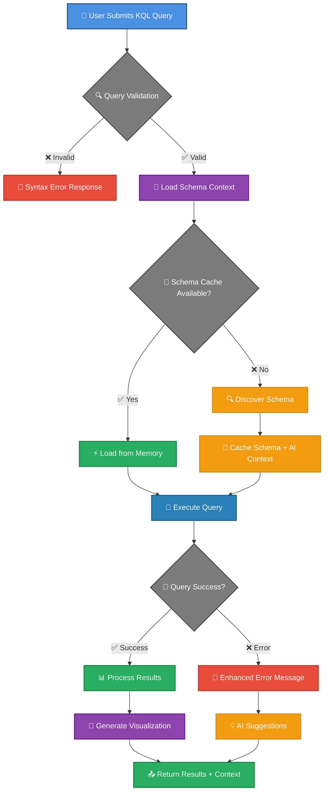
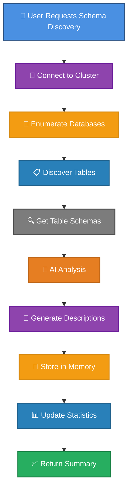
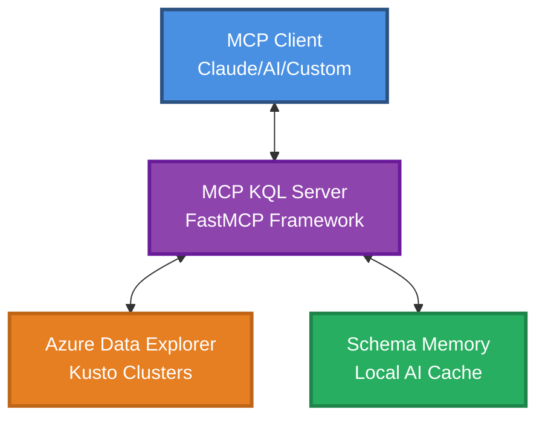

# MCP KQL Server
[](https://mseep.ai/app/4r9un-mcp-kql-server)

> **AI-Powered KQL Query Execution with Intelligent Schema Memory**

A Model Context Protocol (MCP) server that provides intelligent KQL (Kusto Query Language) query execution with AI-powered schema caching and context assistance for Azure Data Explorer clusters.

<!-- Badges Section -->
[](https://mseep.ai/app/18772353-3d90-4b12-a253-cf752efaadd2)
[](https://pypi.org/project/mcp-kql-server/)
[](https://pypi.org/project/mcp-kql-server/)

[](https://github.com/4R9UN/mcp-kql-server/actions)
[](https://codecov.io/gh/4R9UN/mcp-kql-server)
[](https://github.com/4R9UN/mcp-kql-server/security)
[](https://github.com/4R9UN/mcp-kql-server)

[](https://github.com/jlowin/fastmcp)
[](https://azure.microsoft.com/en-us/services/data-explorer/)
[](https://github.com/anthropics/mcp)
[](https://github.com/4R9UN/mcp-kql-server/graphs/commit-activity)
[](https://lobehub.com/mcp/4r9un-mcp-kql-server)


## 🎬 Demo

Watch a quick demo of the MCP KQL Server in action:

[](https://www.youtube.com/watch?v=Ca-yuThJ3Vc)

## 🚀 Features

- **`execute_kql_query`**:
    - **Natural Language to KQL**: Generate KQL queries from natural language descriptions.
    - **Direct KQL Execution**: Execute raw KQL queries.
    - **Multiple Output Formats**: Supports JSON, CSV, and table formats.
    - **Live Schema Validation**: Ensures query accuracy by using live schema discovery.

- **`schema_memory`**:
    - **Schema Discovery**: Discover and cache schemas for tables.
    - **Database Exploration**: List all tables within a database.
    - **AI Context**: Get AI-driven context for tables.
    - **Analysis Reports**: Generate reports with visualizations.
    - **Cache Management**: Clear or refresh the schema cache.
    - **Memory Statistics**: Get statistics about the memory usage.


## 📊 MCP Tools Execution Flow



### Schema Memory Discovery Flow

The `kql_schema_memory` functionality is now seamlessly integrated into the `kql_execute` tool. When you run a query, the server automatically discovers and caches the schema for any tables it hasn't seen before. This on-demand process ensures you always have the context you need without any manual steps.




## 📋 Prerequisites

- Python 3.10 or higher
- [Azure CLI](https://learn.microsoft.com/en-us/cli/azure/install-azure-cli-windows?view=azure-cli-latest&pivots=msi) installed and authenticated (`az login`)
- Access to Azure Data Explorer cluster(s)

## 🚀 One-Command Installation

### Quick Install (Recommended)

#### From Source

```bash
git clone https://github.com/4R9UN/mcp-kql-server.git && cd mcp-kql-server && pip install -e .
```
### Alternative Installation Methods

```bash
pip install mcp-kql-server
```

**That's it!** The server automatically:
- ✅ Sets up memory directories in `%APPDATA%\KQL_MCP` (Windows) or `~/.local/share/KQL_MCP` (Linux/Mac)
- ✅ Configures optimal defaults for production use
- ✅ Suppresses verbose Azure SDK logs
- ✅ No environment variables required


## 📱 MCP Client Configuration

### Claude Desktop

Add to your Claude Desktop MCP settings file (`mcp_settings.json`):

**Location:**
- **Windows**: `%APPDATA%\Claude\mcp_settings.json`
- **macOS**: `~/Library/Application Support/Claude/mcp_settings.json`
- **Linux**: `~/.config/Claude/mcp_settings.json`

```json
{
  "mcpServers": {
    "mcp-kql-server": {
      "command": "python",
      "args": ["-m", "mcp_kql_server"],
      "env": {}
    }
  }
}
```
### VSCode (with MCP Extension)

Add to your VSCode MCP configuration:

**Settings.json location:**
- **Windows**: `%APPDATA%\Code\User\mcp.json`
- **macOS**: `~/Library/Application Support/Code/User/mcp.json`
- **Linux**: `~/.config/Code/User/mcp.json`

```json
{
 "MCP-kql-server": {
			"command": "python",
			"args": [
				"-m",
				"mcp_kql_server"
			],
			"type": "stdio"
		},
}
```

### Roo-code Or Cline (VS-code Extentions)

Ask or Add to your Roo-code Or Cline MCP settings:

**MCP Settings location:**
- **All platforms**: Through Roo-code extension settings or `mcp_settings.json`

```json
{
   "MCP-kql-server": {
      "command": "python",
      "args": [
        "-m",
        "mcp_kql_server"
      ],
      "type": "stdio",
      "alwaysAllow": [
      ]
    },
}
```

### Generic MCP Client

For any MCP-compatible application:

```bash
# Command to run the server
python -m mcp_kql_server

# Server provides these tools:
# - kql_execute: Execute KQL queries with AI context
# - kql_schema_memory: Discover and cache cluster schemas
```
## 🔧 Quick Start

### 1. Authenticate with Azure (One-time setup)

```bash
az login
```

### 2. Start the MCP Server (Zero configuration)

```bash
python -m mcp_kql_server
```

The server starts immediately with:
- 📁 **Auto-created memory path**: `%APPDATA%\KQL_MCP\cluster_memory`
- 🔧 **Optimized defaults**: No configuration files needed
- 🔐 **Secure setup**: Uses your existing Azure CLI credentials

### 3. Use via MCP Client

The server provides two main tools:

> #### `kql_execute` - Execute KQL Queries with AI Context
> #### `kql_schema_memory` - Discover and Cache Cluster Schemas


## 💡 Usage Examples

### Basic Query Execution

Ask your MCP client (like Claude):
> "Execute this KQL query against the help cluster: `cluster('help.kusto.windows.net').database('Samples').StormEvents | take 10` and summarize the result and give me high level insights "

### Complex Analytics Query

Ask your MCP client:
> "Query the Samples database in the help cluster to show me the top 10 states by storm event count, include visualization"

### Schema Discovery

Ask your MCP client:
> "Discover and cache the schema for the help.kusto.windows.net cluster, then tell me what databases and tables are available"

### Data Exploration with Context

Ask your MCP client:
> "Using the StormEvents table in the Samples database on help cluster, show me all tornado events from 2007 with damage estimates over $1M"

### Time-based Analysis

Ask your MCP client:
> "Analyze storm events by month for the year 2007 in the StormEvents table, group by event type and show as a visualization"


## 🎯 Key Benefits

### For Data Analysts
- **⚡ Faster Query Development**: AI-powered autocomplete and suggestions
- **🎨 Rich Visualizations**: Instant markdown tables for data exploration
- **🧠 Context Awareness**: Understand your data structure without documentation

### For DevOps Teams
- **🔄 Automated Schema Discovery**: Keep schema information up-to-date
- **💾 Smart Caching**: Reduce API calls and improve performance
- **🔐 Secure Authentication**: Leverage existing Azure CLI credentials

### For AI Applications
- **🤖 Intelligent Query Assistance**: AI-generated table descriptions and suggestions
- **📊 Structured Data Access**: Clean, typed responses for downstream processing
- **🎯 Context-Aware Responses**: Rich metadata for better AI decision making

## 🏗️ Architecture



## 📁 Project Structure

```
mcp-kql-server/
├── mcp_kql_server/
│   ├── __init__.py          # Package initialization
│   ├── mcp_server.py        # Main MCP server implementation
│   ├── execute_kql.py       # KQL query execution logic
│   ├── memory.py            # Advanced memory management
│   ├── kql_auth.py          # Azure authentication
│   ├── utils.py             # Utility functions
│   └── constants.py         # Configuration constants
├── docs/                    # Documentation
├── Example/                 # Usage examples
├── pyproject.toml          # Project configuration
└── README.md               # This file
```

## 🔒 Security

- **Azure CLI Authentication**: Leverages your existing Azure device login
- **No Credential Storage**: Server doesn't store authentication tokens
- **Local Memory**: Schema cache stored locally, not transmitted

## 🐛 Troubleshooting

### Common Issues

1. **Authentication Errors**
   ```bash
   # Re-authenticate with Azure CLI
   az login --tenant your-tenant-id
   ```

2. **Memory Issues**
   ```bash
   # The memory cache is now managed automatically. If you suspect issues,
   # you can clear the cache directory, and it will be rebuilt on the next query.
   # Windows:
   rmdir /s /q "%APPDATA%\KQL_MCP\unified_memory.json"
   
   # macOS/Linux:
   rm -rf ~/.local/share/KQL_MCP/cluster_memory
   ```

3. **Connection Timeouts**
   - Check cluster URI format
   - Verify network connectivity
   - Confirm Azure permissions

## 🤝 Contributing

We welcome contributions! Please do. 

## 📞 Support

- **Issues**: [GitHub Issues](https://github.com/4R9UN/mcp-kql-server/issues)
- **PyPI Package**: [PyPI Project Page](https://pypi.org/project/mcp-kql-server/)
- **Author**: [Arjun Trivedi](mailto:arjuntrivedi42@yahoo.com)
- **Certified** : [MCPHub](https://mcphub.com/mcp-servers/4R9UN/mcp-kql-server)

## 🌟 Star History

[](https://star-history.com/#4R9UN/mcp-kql-server&Date)

---

**Happy Querying! 🎉**
