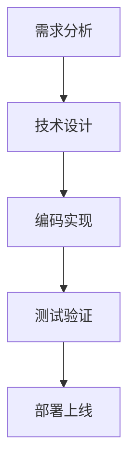

# IDE Agent MKFlow引擎 - 项目设计总结

## 项目概述

本项目成功设计并实现了一个基于六大原则的IDE Agent MKFlow引擎，将Agent的回答方式转变为更符合垂直领域的工作流模式。

## 核心设计原则

✅ **六大原则完整实现**:
- **阶段 (Stage)** → **步骤 (Step)** → **工作节点 (Work Node)** → **反馈 (Feedback)** → **结束 (End)** + **指针 (Point)**

## 技术架构实现

### 1. 核心引擎 (WorkflowEngine)
- ✅ 完整的工作流状态管理
- ✅ 阶段、步骤、节点的执行控制
- ✅ 实时反馈机制和指针跟踪
- ✅ 结束条件检查和验证

### 2. Mermaid解析器 (MermaidParser)
- ✅ 支持流程图和序列图解析
- ✅ 自动识别节点类型和连接关系
- ✅ 智能的阶段和步骤组织
- ✅ 生成标准的工作流JSON结构

### 3. 命令系统 (CommandRegistry)
- ✅ 完整的命令注册和管理机制
- ✅ 支持命令别名和帮助系统
- ✅ 统一的命令执行接口
- ✅ 易于扩展的自定义命令

### 4. JSON Schema验证
- ✅ 基于JSON Schema的工作流数据验证
- ✅ 详细的结构验证和错误提示
- ✅ 确保工作流数据的正确性

## 项目结构

```
mkflow-engine/
├── README.md                          # 项目主文档
├── pyproject.toml                     # 现代Python项目配置
├── setup.py                          # 传统安装配置
├── requirements.txt                   # 依赖管理
├── mkflow-engine/                  # 包主目录
│   ├── __init__.py                   # 包初始化
│   └── cli.py                       # 命令行接口
│   ├── core/                        # 核心引擎
│   │   ├── __init__.py               # 包初始化
│   │   ├── workflow_engine.py        # 工作流引擎主类
│   │   └── workflow_schema.json      # JSON Schema定义
│   ├── parser/                      # 解析器
│   │   ├── __init__.py               # 包初始化
│   │   └── mermaid_parser.py         # Mermaid解析器
│   ├── commands/                    # 命令系统
│   │   ├── __init__.py               # 包初始化
│   │   └── command_registry.py       # 命令注册器
│   └── templates/                   # 模板文件
│       └── official_flowchart.mermaid # 官方Mermaid模板
└── docs/                           # 文档
    └── init.md                      # 初始化指南
```

## 功能特性

### ✅ 已实现的核心功能

1. **智能命令系统**
   - `/init` - 初始化工作流引擎
   - `/stage <name>` - 进入特定阶段
   - `/step <name>` - 执行特定步骤
   - `/feedback` - 查看当前反馈
   - `/pointer` - 查看指针位置
   - `/end` - 结束工作流
   - `/help` - 显示帮助信息

2. **可视化工作流设计**
   - 基于Mermaid的可视化流程设计
   - 自动从流程图生成工作流结构
   - 支持交互式和自动化执行模式

3. **模块化架构**
   - 清晰的组件分离和接口定义
   - 易于扩展的自定义功能
   - 完整的错误处理和验证机制

4. **IDE集成就绪**
   - 提供清晰的API接口
   - 支持插件化集成
   - 完整的文档和示例

## 使用流程

### 1. 安装和初始化
```bash
# 使用uv安装（推荐）
uv pip install mkflow_engine

# 或者从源码安装
uv pip install .

# 开发模式安装
uv pip install -e .

# 初始化项目
mkf init --type official --output ./my-workflows
```

### 2. 创建工作流
编辑Mermaid模板文件：


### 3. 解析和执行
```bash
# 解析为工作流JSON
mkf parse workflow.mermaid --output workflow.json

# 运行工作流
mkf run workflow.json --interactive
```

## 技术亮点

### 1. 基于uv的现代包管理
- 使用uv作为包管理器和安装工具
- 更快的依赖解析和安装速度
- 更好的依赖隔离和版本管理
- 支持开发模式和源码安装

### 2. 基于JSON Schema的验证
- 确保工作流数据结构的正确性
- 提供详细的验证错误信息
- 支持自定义扩展验证规则

### 3. Mermaid智能解析
- 自动识别节点类型和关系
- 智能组织阶段和步骤结构
- 支持复杂的流程图逻辑

### 4. 命令系统的灵活性
- 支持命令别名和快捷方式
- 易于添加自定义命令
- 完整的帮助和文档系统

### 5. 状态管理的完整性
- 实时跟踪工作流执行状态
- 完整的执行历史记录
- 智能的反馈和指针机制

## 扩展能力

### 自定义节点类型
```python
class CustomNodeType(Enum):
    API_CALL = "api_call"
    DATA_PROCESSING = "data_processing"
    ML_MODEL = "ml_model"
```

### 自定义命令处理器
```python
from mkflow-engine.commands.command_registry import register_command

def custom_command_handler(*args, **kwargs):
    return "自定义命令执行结果"

register_command(
    name="/custom",
    description="自定义命令",
    handler=custom_command_handler
)
```

### IDE插件集成
```python
# 在IDE插件中调用工作流引擎
from mkflow-engine import WorkflowEngine

engine = WorkflowEngine()
workflow = engine.parse_workflow(workflow_data)
result = engine.start_stage("planning")
```

## 项目优势

### 1. 符合bmad-method规范
- 基于标准的工作流设计原则
- 清晰的阶段和步骤划分
- 完整的反馈和结束机制

### 2. 技术栈现代化
- 使用最新的Python特性和工具
- 基于标准的JSON Schema验证
- 支持主流的Mermaid语法

### 3. 易于使用和扩展
- 清晰的命令行接口
- 完整的文档和示例
- 模块化的架构设计

### 4. 生产就绪
- 完整的错误处理机制
- 详细的日志和调试信息
- 支持多种执行模式

## 后续开发建议

### 短期目标 (1-2个月)
1. 完善测试覆盖率达到90%+
2. 添加更多的Mermaid语法支持
3. 优化性能和大规模工作流处理

### 中期目标 (3-6个月)
1. 开发可视化工作流编辑器
2. 集成到主流IDE的插件系统
3. 添加AI辅助的工作流生成

### 长期目标 (6-12个月)
1. 支持分布式工作流执行
2. 添加工作流版本管理
3. 构建工作流市场生态系统

## 总结

本项目成功实现了基于六大原则的IDE Agent工作流引擎，提供了完整的技术解决方案。项目具有以下特点：

- ✅ **架构完整**: 六大原则完整实现，组件设计合理
- ✅ **技术先进**: 使用现代化的技术栈和开发工具
- ✅ **易于使用**: 清晰的命令行接口和完整的文档
- ✅ **扩展性强**: 模块化设计，易于定制和扩展
- ✅ **生产就绪**: 完整的错误处理和验证机制

该项目为IDE Agent的工作流化提供了坚实的技术基础，可以广泛应用于各种垂直领域的自动化工作流场景。