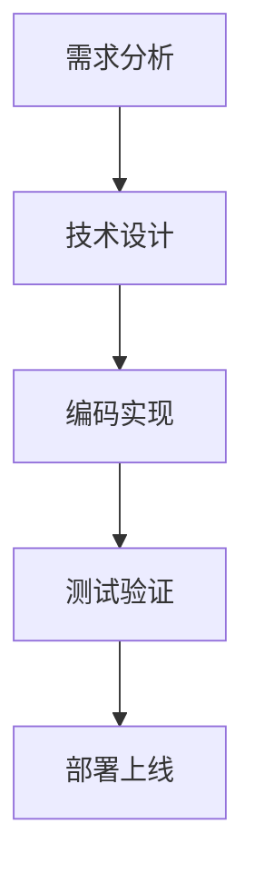

# IDE Agent MKFlow引擎 - 初始化指南

## 项目概述

本项目是一个基于Python的IDE Agent MKFlow引擎，旨在将Agent的回答方式转变为更符合垂直领域的工作流模式。

## 核心设计原则

基于六大原则设计：
- **阶段 (Stage)** → **步骤 (Step)** → **工作节点 (Work Node)** → **反馈 (Feedback)** → **结束 (End)** + **指针 (Point)**

## 技术架构

### 核心组件

1. **工作流引擎 (WorkflowEngine)**
   - 负责工作流的解析、验证和执行
   - 管理阶段、步骤、节点的状态转换
   - 提供反馈机制和指针跟踪

2. **Mermaid解析器 (MermaidParser)**
   - 将Mermaid流程图转换为工作流JSON结构
   - 支持流程图和序列图两种类型
   - 自动识别节点类型和连接关系

3. **命令系统 (CommandRegistry)**
   - 管理所有可用的工作流命令
   - 支持命令别名和帮助系统
   - 提供统一的命令执行接口

4. **JSON Schema验证**
   - 基于JSON Schema的工作流数据验证
   - 确保工作流结构的正确性
   - 提供详细的验证错误信息

### 项目结构

```
mkflow-engine/
├── core/                    # 核心引擎
│   ├── workflow_engine.py   # 工作流引擎主类
│   └── workflow_schema.json # JSON Schema定义
├── parser/                  # 解析器
│   └── mermaid_parser.py    # Mermaid解析器
├── commands/               # 命令系统
│   └── command_registry.py # 命令注册器
├── mkflow-engine/        # 包主目录
│   ├── cli.py             # 命令行接口
│   ├── core/              # 核心引擎
│   ├── parser/            # 解析器
│   ├── commands/          # 命令系统
│   └── templates/         # 模板文件
├── templates/             # 模板文件
├── docs/                  # 文档
├── setup.py              # 安装配置
└── requirements.txt       # 依赖管理
```

## 使用流程

### 1. 初始化项目

```bash
# 安装依赖
pip install -r requirements.txt

# 初始化工作流引擎
mkf init --type official --output ./my-workflows
```

### 2. 创建Mermaid流程图

编辑生成的模板文件，定义您的工作流：



### 3. 解析为工作流JSON

```bash
mkf parse my-workflow.mermaid --output workflow.json
```

### 4. 运行工作流

```bash
# 交互式运行
mkf run workflow.json --interactive
mkf run workflow.json --auto
```

## 命令系统

### 核心命令

| 命令 | 别名 | 描述 | 用法 |
|------|------|------|------|
| `/init` | `init`, `initialize` | 初始化工作流引擎 | `/init [official|custom]` |
| `/stage` | `stage`, `phase` | 进入特定阶段 | `/stage <stage_name>` |
| `/step` | `step`, `task` | 执行特定步骤 | `/step <step_name>` |
| `/feedback` | `feedback`, `fb` | 查看当前反馈 | `/feedback` |
| `/pointer` | `pointer`, `pt` | 查看指针位置 | `/pointer` |
| `/end` | `end`, `finish` | 结束工作流 | `/end` |
| `/help` | `help`, `h` | 显示帮助信息 | `/help [command]` |

### 命令示例

```bash
# 初始化
mkf init --type custom

# 进入规划阶段
mkf stage planning

# 执行需求分析步骤
mkf step requirements_analysis

# 查看当前反馈
mkf feedback

# 获取帮助
mkf help init
```

## 工作流定义规范

### JSON Schema结构

工作流数据必须符合以下JSON Schema：

```json
{
  "workflow": {
    "id": "string",
    "name": "string", 
    "version": "string",
    "description": "string"
  },
  "stages": [
    {
      "id": "string",
      "name": "string",
      "steps": [
        {
          "id": "string", 
          "name": "string",
          "work_nodes": [
            {
              "id": "string",
              "name": "string",
              "type": "action|decision|input|output"
            }
          ],
          "pointers": [
            {
              "id": "string",
              "name": "string", 
              "target": "string"
            }
          ]
        }
      ],
      "end_conditions": [
        {
          "type": "success|failure|timeout|manual",
          "condition": "string"
        }
      ]
    }
  ]
}
```

### Mermaid语法支持

支持的标准Mermaid语法：
- 流程图 (flowchart TD/LR/RL/BT)
- 序列图 (sequenceDiagram)
- 节点定义 (A[标签])
- 连接定义 (A --> B)
- 条件分支 (A -->|条件| B)

## 扩展开发

### 自定义工作节点类型

您可以扩展`NodeType`枚举来支持自定义节点类型：

```python
class CustomNodeType(Enum):
    CUSTOM_ACTION = "custom_action"
    API_CALL = "api_call"
    DATA_TRANSFORM = "data_transform"
```

### 添加新的命令处理器

通过命令注册器添加自定义命令：

```python
from commands.command_registry import register_command

def custom_command_handler(*args, **kwargs):
    return "自定义命令执行结果"

register_command(
    name="/custom",
    description="自定义命令",
    handler=custom_command_handler
)
```

### 集成到IDE插件

工作流引擎可以轻松集成到各种IDE中：

```python
# 在IDE插件中调用
from core.workflow_engine import WorkflowEngine

engine = WorkflowEngine()
workflow = engine.parse_workflow(workflow_data)
result = engine.start_stage("planning")
```

## 故障排除

### 常见问题

1. **Mermaid解析失败**
   - 检查Mermaid语法是否正确
   - 确保使用支持的图表类型
   - 验证节点标签格式

2. **JSON Schema验证失败**
   - 检查工作流数据结构
   - 验证必填字段是否完整
   - 查看详细的错误信息

3. **命令执行错误**
   - 检查命令名称和参数
   - 验证工作流状态是否正常
   - 查看执行历史记录

### 调试模式

启用详细日志输出：

```bash
# 设置环境变量
export WORKFLOW_DEBUG=1

# 运行命令
mkflow-engine run workflow.json
```

## 贡献指南

欢迎贡献代码和文档！请遵循以下步骤：

1. Fork项目仓库
2. 创建功能分支
3. 提交更改
4. 创建Pull Request

## 许可证

本项目采用MIT许可证。详见LICENSE文件。

---

**注意**: Agent需要全面浏览工作流引擎相关的所有文件，特别是核心引擎、解析器和命令系统的实现细节，以便更好地理解和使用本系统。