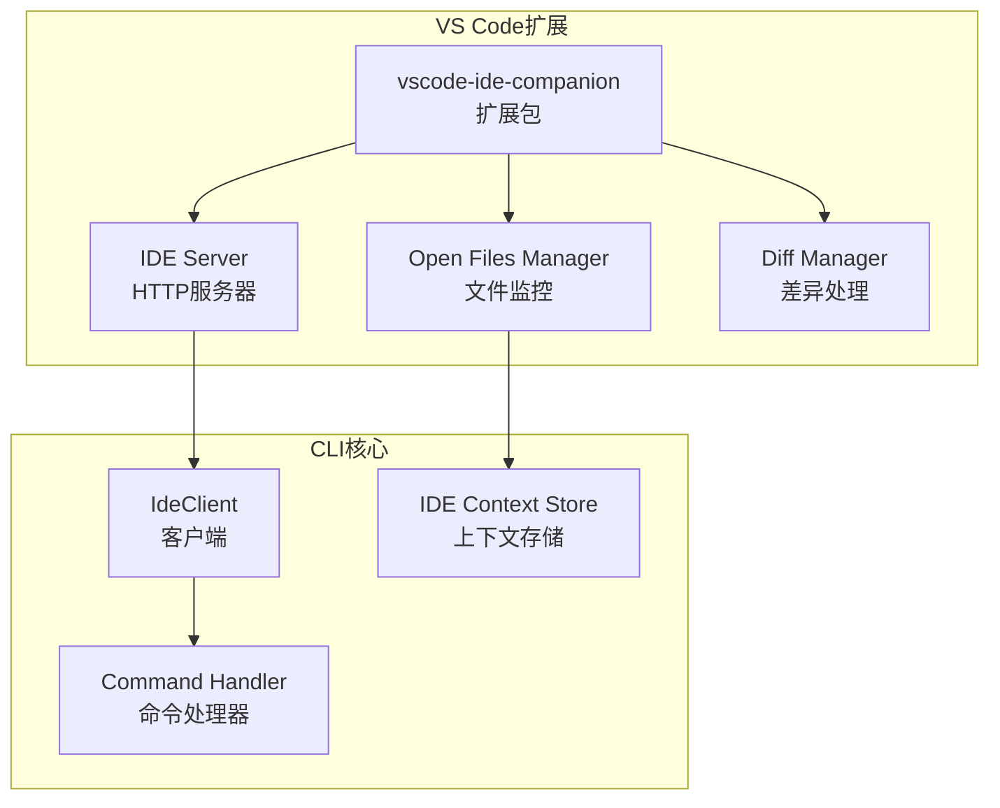
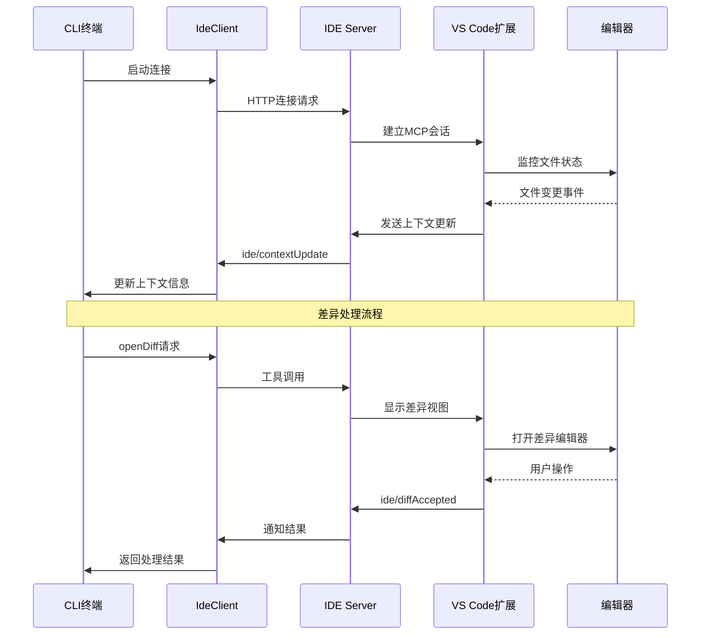
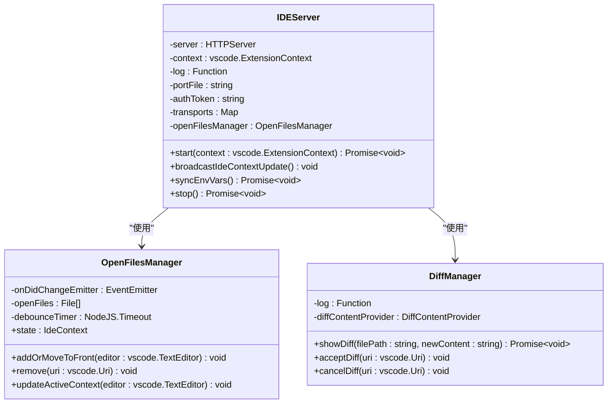
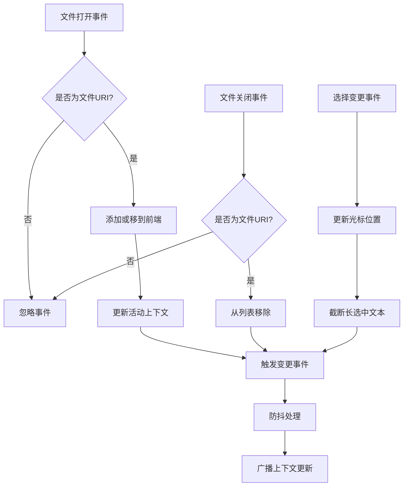
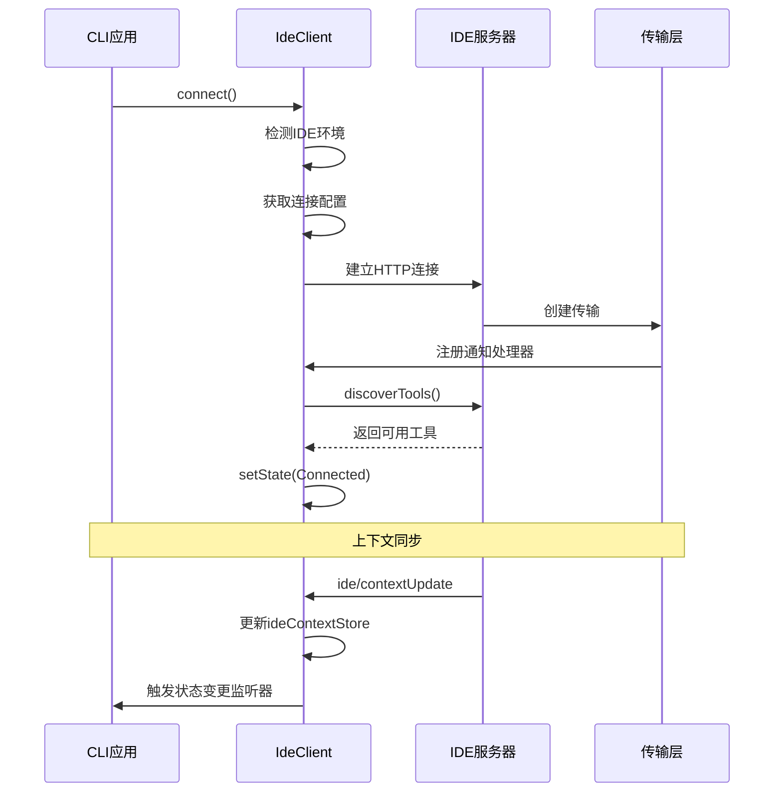
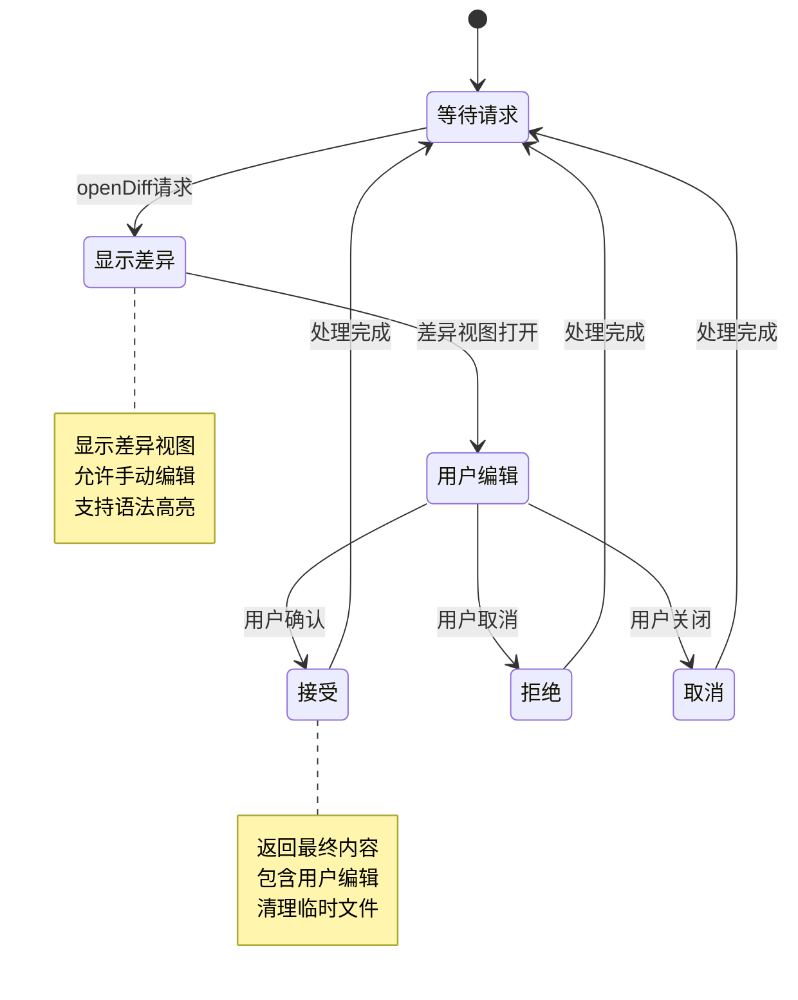
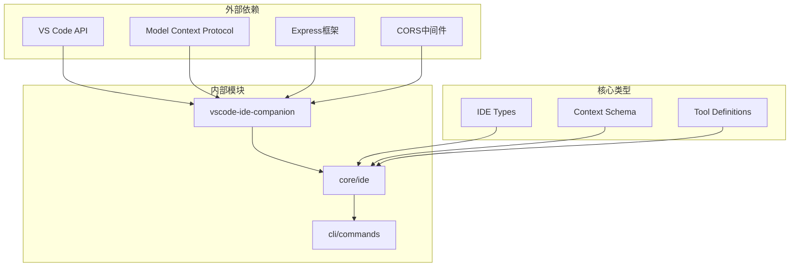

# IDE集成

<cite>
**本文档中引用的文件**
- [packages/vscode-ide-companion/src/extension.ts](file://packages/vscode-ide-companion/src/extension.ts)
- [packages/vscode-ide-companion/src/ide-server.ts](file://packages/vscode-ide-companion/src/ide-server.ts)
- [packages/vscode-ide-companion/src/open-files-manager.ts](file://packages/vscode-ide-companion/src/open-files-manager.ts)
- [packages/vscode-ide-companion/src/diff-manager.ts](file://packages/vscode-ide-companion/src/diff-manager.ts)
- [packages/core/src/ide/ide-client.ts](file://packages/core/src/ide/ide-client.ts)
- [packages/core/src/ide/types.ts](file://packages/core/src/ide/types.ts)
- [packages/cli/src/ui/commands/ideCommand.ts](file://packages/cli/src/ui/commands/ideCommand.ts)
- [packages/cli/src/ui/commands/ideCommand.test.ts](file://packages/cli/src/ui/commands/ideCommand.test.ts)
- [packages/vscode-ide-companion/README.md](file://packages/vscode-ide-companion/README.md)
- [packages/vscode-ide-companion/development.md](file://packages/vscode-ide-companion/development.md)
</cite>

## 目录
1. [简介](#简介)
2. [项目结构](#项目结构)
3. [核心组件](#核心组件)
4. [架构概览](#架构概览)
5. [详细组件分析](#详细组件分析)
6. [依赖关系分析](#依赖关系分析)
7. [性能考虑](#性能考虑)
8. [故障排除指南](#故障排除指南)
9. [结论](#结论)

## 简介

Gemini CLI的IDE集成系统是一个强大的桥梁，将VS Code编辑器与gemini-cli核心服务无缝连接。该系统通过vscode-ide-companion扩展实现了双向通信，使CLI能够访问编辑器的上下文信息，并在编辑器中直接处理代码变更。

该集成支持以下核心功能：
- 同步打开的文件列表和编辑上下文
- 实时文件状态监控和变更通知
- 原生代码差异视图和交互式编辑
- 跨平台兼容性和多种连接方式
- 安全的身份验证和会话管理

## 项目结构

IDE集成系统由两个主要部分组成：



**图表来源**
- [packages/vscode-ide-companion/src/extension.ts](file://packages/vscode-ide-companion/src/extension.ts#L1-L50)
- [packages/vscode-ide-companion/src/ide-server.ts](file://packages/vscode-ide-companion/src/ide-server.ts#L1-L100)

**章节来源**
- [packages/vscode-ide-companion/src/extension.ts](file://packages/vscode-ide-companion/src/extension.ts#L1-L228)
- [packages/vscode-ide-companion/README.md](file://packages/vscode-ide-companion/README.md#L1-L25)

## 核心组件

### VS Code扩展组件

**vscode-ide-companion扩展**是整个集成系统的核心，负责在编辑器环境中建立和维护与CLI的连接。

#### 主要职责：
- **服务器启动和管理**：启动本地HTTP服务器提供MCP协议支持
- **文件状态监控**：实时跟踪用户打开的文件和编辑操作
- **差异视图管理**：处理代码变更的可视化和用户交互
- **环境变量同步**：确保CLI和编辑器之间的配置一致性

#### 关键特性：
- 支持多工作区环境
- 自动更新检查和管理
- 安全的认证机制
- 可靠的错误处理和恢复

**章节来源**
- [packages/vscode-ide-companion/src/extension.ts](file://packages/vscode-ide-companion/src/extension.ts#L1-L228)

### CLI客户端组件

**IdeClient**类是CLI端的核心组件，负责与VS Code扩展进行通信。

#### 主要功能：
- **连接管理**：建立和维护与IDE服务器的连接
- **工具发现**：自动检测可用的IDE工具
- **上下文同步**：传输编辑器状态到CLI
- **差异处理**：管理代码变更的接受和拒绝流程

#### 连接策略：
- **HTTP连接**：优先使用基于端口的HTTP连接
- **STDIO连接**：备用的进程间通信方式
- **自动重连**：在网络中断时自动尝试重新连接

**章节来源**
- [packages/core/src/ide/ide-client.ts](file://packages/core/src/ide/ide-client.ts#L1-L846)

## 架构概览

IDE集成系统采用分层架构设计，确保了模块化和可扩展性：



**图表来源**
- [packages/core/src/ide/ide-client.ts](file://packages/core/src/ide/ide-client.ts#L200-L300)
- [packages/vscode-ide-companion/src/ide-server.ts](file://packages/vscode-ide-companion/src/ide-server.ts#L150-L250)

## 详细组件分析

### IDE服务器（IDE Server）

IDE服务器是vscode-ide-companion扩展的核心组件，负责处理所有与CLI的通信。



**图表来源**
- [packages/vscode-ide-companion/src/ide-server.ts](file://packages/vscode-ide-companion/src/ide-server.ts#L80-L120)
- [packages/vscode-ide-companion/src/open-files-manager.ts](file://packages/vscode-ide-companion/src/open-files-manager.ts#L20-L60)

#### 服务器启动流程

IDE服务器的启动过程包含多个关键步骤：

1. **初始化Express应用**：设置JSON解析和CORS策略
2. **配置身份验证**：生成随机认证令牌并设置安全头
3. **创建MCP服务器**：注册差异处理工具
4. **启动HTTP服务器**：监听本地回环地址
5. **写入端口文件**：保存服务器信息供CLI访问

#### 安全机制

服务器实施了多层安全保护：

- **CORS限制**：仅允许非浏览器请求
- **身份验证**：基于Bearer令牌的认证
- **主机验证**：严格检查请求主机头
- **会话管理**：自动清理过期会话

**章节来源**
- [packages/vscode-ide-companion/src/ide-server.ts](file://packages/vscode-ide-companion/src/ide-server.ts#L80-L200)

### 文件状态管理系统

OpenFilesManager负责实时跟踪编辑器中的文件状态变化：



**图表来源**
- [packages/vscode-ide-companion/src/open-files-manager.ts](file://packages/vscode-ide-companion/src/open-files-manager.ts#L30-L80)

#### 文件状态特性

- **最大文件限制**：最多跟踪10个最近打开的文件
- **文本长度限制**：选中文本不超过16KB
- **活动文件标记**：唯一标识当前活跃文件
- **防抖优化**：减少频繁的上下文更新

**章节来源**
- [packages/vscode-ide-companion/src/open-files-manager.ts](file://packages/vscode-ide-companion/src/open-files-manager.ts#L1-L183)

### CLI客户端通信机制

IdeClient类实现了与VS Code扩展的可靠通信：



**图表来源**
- [packages/core/src/ide/ide-client.ts](file://packages/core/src/ide/ide-client.ts#L150-L250)

#### 连接状态管理

客户端实现了完整的连接生命周期管理：

- **连接状态枚举**：Connected、Disconnected、Connecting
- **状态变更监听**：支持多个监听器订阅状态变化
- **自动重连机制**：在网络异常时自动尝试重新连接
- **错误处理**：优雅处理各种连接失败场景

**章节来源**
- [packages/core/src/ide/ide-client.ts](file://packages/core/src/ide/ide-client.ts#L50-L150)

### 差异处理系统

差异处理系统提供了原生的代码变更可视化和交互功能：



**图表来源**
- [packages/vscode-ide-companion/src/diff-manager.ts](file://packages/vscode-ide-companion/src/diff-manager.ts#L1-L50)

#### 差异处理特性

- **互斥锁机制**：防止同时打开多个差异视图
- **内容预处理**：自动截断超长内容
- **通知系统**：向CLI报告处理结果
- **资源清理**：自动删除临时差异文件

**章节来源**
- [packages/core/src/ide/ide-client.ts](file://packages/core/src/ide/ide-client.ts#L200-L300)

## 依赖关系分析

IDE集成系统的依赖关系展现了清晰的分层架构：



**图表来源**
- [packages/vscode-ide-companion/package.json](file://packages/vscode-ide-companion/package.json#L1-L30)
- [packages/core/src/ide/types.ts](file://packages/core/src/ide/types.ts#L1-L50)

### 模块间通信

各模块之间通过明确定义的接口进行通信：

- **类型定义**：统一的数据结构和接口规范
- **事件驱动**：基于事件的松耦合通信
- **工具注册**：动态发现和注册可用工具
- **状态同步**：实时的上下文状态共享

**章节来源**
- [packages/core/src/ide/types.ts](file://packages/core/src/ide/types.ts#L1-L149)

## 性能考虑

### 内存管理

系统采用了多项内存优化策略：

- **文件数量限制**：控制同时跟踪的文件数量
- **文本截断**：避免大文本块占用过多内存
- **定时器清理**：及时释放不再需要的定时器
- **会话过期**：自动清理长时间未使用的会话

### 网络优化

- **连接复用**：HTTP连接池和Keep-Alive
- **防抖机制**：减少不必要的网络请求
- **压缩传输**：启用Gzip压缩减少带宽使用
- **超时控制**：合理的请求超时设置

### 并发处理

- **互斥锁**：防止差异视图的并发访问
- **Promise链**：保证异步操作的顺序执行
- **事件队列**：有序处理文件变更事件
- **资源池**：复用昂贵的资源对象

## 故障排除指南

### 常见连接问题

#### 问题1：无法找到IDE服务器

**症状**：CLI显示"Failed to connect to IDE companion extension"错误

**解决方案**：
1. 检查VS Code扩展是否已正确安装
2. 验证扩展版本是否兼容
3. 查看输出面板中的日志信息
4. 尝试重新安装扩展

#### 问题2：认证失败

**症状**：收到"Unauthorized"响应

**解决方案**：
1. 检查认证令牌的有效性
2. 验证请求头格式是否正确
3. 确认服务器仍在运行
4. 重启IDE服务器

#### 问题3：文件同步延迟

**症状**：编辑器中的文件变更未及时反映到CLI

**解决方案**：
1. 检查防抖定时器设置
2. 验证文件监听器是否正常工作
3. 确认网络连接稳定
4. 重启文件管理器

### 调试技巧

#### 启用详细日志

```javascript
// 在CLI中设置环境变量
process.env['DEBUG'] = 'gemini-cli:*'
```

#### 检查服务器状态

```javascript
// 使用CLI命令检查连接状态
/gemini ide status
```

#### 验证端口文件

```bash
# 检查端口文件是否存在
ls /tmp/gemini-ide-server-*.json

# 查看服务器配置
cat /tmp/gemini-ide-server-*.json
```

**章节来源**
- [packages/core/src/ide/ide-client.ts](file://packages/core/src/ide/ide-client.ts#L477-L516)
- [packages/cli/src/ui/commands/ideCommand.ts](file://packages/cli/src/ui/commands/ideCommand.ts#L81-L132)

## 结论

Gemini CLI的IDE集成系统展现了现代开发工具集成的最佳实践。通过精心设计的架构和可靠的通信机制，它成功地将VS Code的强大编辑能力与CLI的灵活性结合起来。

### 主要优势

1. **无缝集成**：提供原生的编辑器体验
2. **实时同步**：即时反映编辑器状态变化
3. **安全可靠**：多重安全机制保障数据安全
4. **易于维护**：清晰的模块化设计便于扩展

### 未来发展方向

- **多IDE支持**：扩展到其他主流编辑器
- **增强功能**：添加更多编辑器特定功能
- **性能优化**：进一步提升响应速度和资源效率
- **用户体验**：改进错误处理和调试体验

该集成系统为开发者提供了强大而直观的工具，显著提升了使用Gemini CLI进行代码编辑和协作的效率。通过持续的改进和扩展，它将继续为开发者社区提供价值。