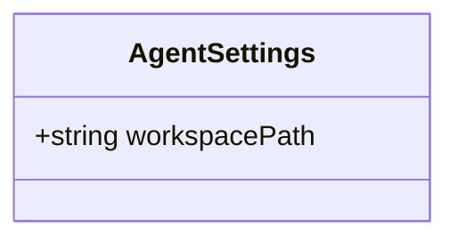
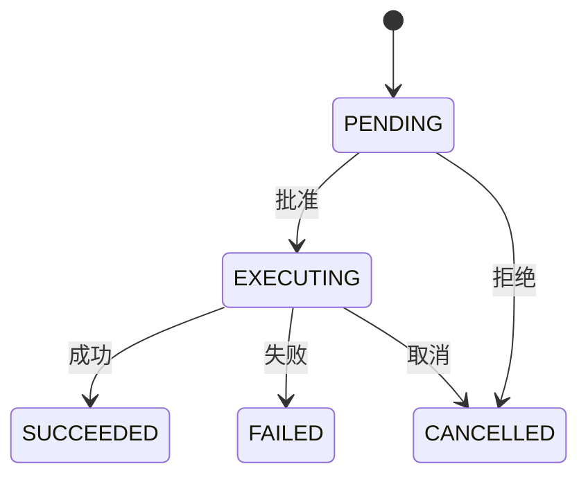
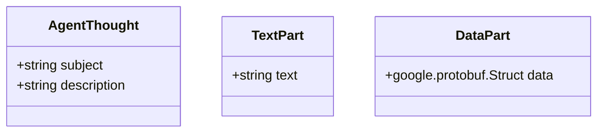

# MCP协议规范

<cite>
**本文档中引用的文件**  
- [development-extension-rfc.md](file://packages/a2a-server/development-extension-rfc.md)
- [config.ts](file://packages/a2a-server/src/config/config.ts)
- [types.ts](file://packages/a2a-server/src/types.ts)
- [task.ts](file://packages/a2a-server/src/agent/task.ts)
- [executor.ts](file://packages/a2a-server/src/agent/executor.ts)
- [mcp-tool.ts](file://packages/core/src/tools/mcp-tool.ts)
- [tools.ts](file://packages/core/src/tools/tools.ts)
- [endpoints.test.ts](file://packages/a2a-server/src/http/endpoints.test.ts)
</cite>

## 目录
1. [引言](#引言)
2. [通信流程](#通信流程)
3. [开发工具扩展](#开发工具扩展)
4. [AgentSettings配置对象](#agentsettings配置对象)
5. [ToolCall状态机](#toolcall状态机)
6. [确认请求与确认消息](#确认请求与确认消息)
7. [消息类型定义](#消息类型定义)
8. [MCP方法定义](#mcp方法定义)
9. [版本控制与兼容性](#版本控制与兼容性)

## 引言

MCP（Model Context Protocol）协议是基于A2A协议的开发工具扩展，旨在标准化客户端与Gemini CLI代理之间的通信。该协议通过扩展A2A协议的核心概念（如任务、消息和流式事件），为Gemini CLI代理的客户端集成提供了稳健的基础。通过采用基于扩展的方法，MCP协议能够利用A2A协议的成熟架构，同时定义支持丰富交互工作流所需的具体功能。

**Section sources**
- [development-extension-rfc.md](file://packages/a2a-server/development-extension-rfc.md#L1-L50)

## 通信流程

MCP协议的交互遵循A2A协议基于任务和流式的模式。客户端发送`message/stream`请求，代理则响应一个`contextId`/`taskId`以及一系列事件流。`TaskStatusUpdateEvent`事件用于传达任务的整体状态。当代理发送一个最终的`TaskStatusUpdateEvent`，其`final`字段为`true`且状态为`completed`或`failed`时，任务即完成。

对于可能断开连接的客户端，应通过初始的`message/stream`方法或后续的`tasks/pushNotificationConfig/set`方法向代理提供`PushNotificationConfig`，以便代理在有更新时能够回调。

**Section sources**
- [development-extension-rfc.md](file://packages/a2a-server/development-extension-rfc.md#L51-L70)

## 开发工具扩展

`development-tool`扩展为客户端与Gemini CLI代理之间的工作流建立了通信契约。它包含一组专门的模式，嵌入在核心A2A数据结构中，使代理能够实时流式传输其状态和思维过程。这些模式还提供了代理在执行工具前请求用户许可的机制。

代理卡（Agent Card）示例展示了代理的名称、描述和能力，其中`capabilities.extensions.uri`字段指向扩展规范的URL，客户端通过解析此URL中的语义版本号来确定兼容性。

**Section sources**
- [development-extension-rfc.md](file://packages/a2a-server/development-extension-rfc.md#L71-L100)

## AgentSettings配置对象

会话中的第一条消息必须在其元数据中包含一个`AgentSettings`对象。该对象为代理提供必要的配置信息以进行正确初始化。`AgentSettings`对象包含工作区路径等关键配置。

**Diagram sources**
- [types.ts](file://packages/a2a-server/src/types.ts#L40-L43)
- [config.ts](file://packages/a2a-server/src/config/config.ts#L150-L155)

**Section sources**
- [types.ts](file://packages/a2a-server/src/types.ts#L40-L43)
- [config.ts](file://packages/a2a-server/src/config/config.ts#L150-L155)

## ToolCall状态机

`ToolCall`模式设计用于提供工具执行生命周期的结构化表示。该协议定义了清晰的状态机，并为常见开发任务（文件编辑、shell命令、MCP工具）提供了详细的模式，确保客户端能够构建可靠的UI，而不受特定代理实现的束缚。

**ToolCall生命周期**：
1. **创建**：代理发送一个`status: PENDING`的`ToolCall`对象。如果需要用户许可，`confirmation_request`字段将被填充。
2. **确认**：如果客户端需要确认消息，客户端将发送一个`ToolCallConfirmation`。如果客户端响应取消，执行将被跳过。
3. **执行**：一旦获得批准（或不需要批准），代理发送一个`status: EXECUTING`的更新。它可以通过更新`live_content`字段来流式传输实时进度。
4. **完成**：代理发送一个最终更新，状态设置为`SUCCEEDED`、`FAILED`或`CANCELLED`，并填充相应的结果字段。

**Diagram sources**
- [development-extension-rfc.md](file://packages/a2a-server/development-extension-rfc.md#L150-L200)
- [task.ts](file://packages/a2a-server/src/agent/task.ts#L500-L600)

**Section sources**
- [development-extension-rfc.md](file://packages/a2a-server/development-extension-rfc.md#L150-L200)
- [task.ts](file://packages/a2a-server/src/agent/task.ts#L500-L600)

## 确认请求与确认消息

当代理发送一个`status.state`设置为`input-required`且其消息包含`ConfirmationRequest`的`TaskStatusUpdateEvent`时，客户端必须通过发送一个新的`message/stream`请求来响应。此新请求必须包含正在进行的任务的`contextId`和`taskId`，并包含一个`ToolCallConfirmation`对象，该对象传达用户对等待批准的工具调用的决定。

`ConfirmationRequest`包含用户选择的选项列表和需要用户确认的操作的详细信息。对于Shell、FileEdit和MCP工具，确认细节分别通过`ExecuteDetails`、`FileDiff`和`McpDetails`提供。

**Section sources**
- [development-extension-rfc.md](file://packages/a2a-server/development-extension-rfc.md#L244-L284)
- [mcp-tool.ts](file://packages/core/src/tools/mcp-tool.ts#L50-L100)

## 消息类型定义

MCP协议定义了多种消息类型，包括`AgentThought`、`TextPart`和`DataPart`，用于在代理和客户端之间传递结构化信息。

**Diagram sources**
- [development-extension-rfc.md](file://packages/a2a-server/development-extension-rfc.md#L285-L300)
- [types.ts](file://packages/a2a-server/src/types.ts#L60-L65)

**Section sources**
- [development-extension-rfc.md](file://packages/a2a-server/development-extension-rfc.md#L285-L300)
- [types.ts](file://packages/a2a-server/src/types.ts#L60-L65)

## MCP方法定义

`development-tool`扩展定义了新的方法，如`commands/get`和`command/execute`，用于发现和执行斜杠命令。

`commands/get`方法允许客户端发现Gemini CLI支持的斜杠命令。客户端应在启动时调用此方法以动态填充其命令列表。

`command/execute`方法允许客户端执行斜杠命令。在初始的`ExecuteSlashCommandResponse`之后，代理将使用标准流式机制来通信命令的进度和输出。

**Section sources**
- [development-extension-rfc.md](file://packages/a2a-server/development-extension-rfc.md#L301-L350)

## 版本控制与兼容性

代理卡`uri`字段包含嵌入的语义版本。客户端必须提取此版本以确定与代理扩展的兼容性，使用语义版本2.0.0规范中定义的兼容性逻辑。

**Section sources**
- [development-extension-rfc.md](file://packages/a2a-server/development-extension-rfc.md#L101-L110)