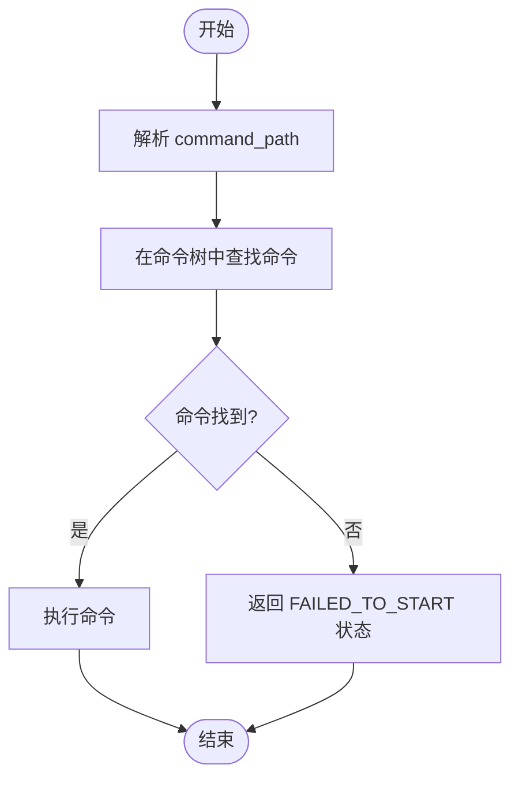
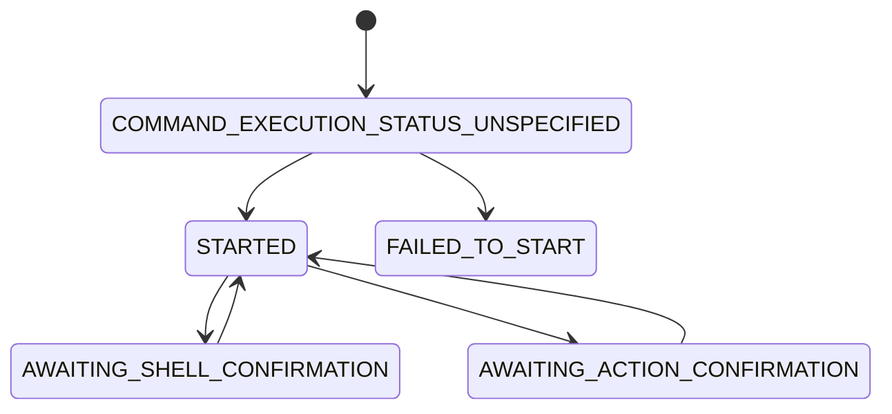
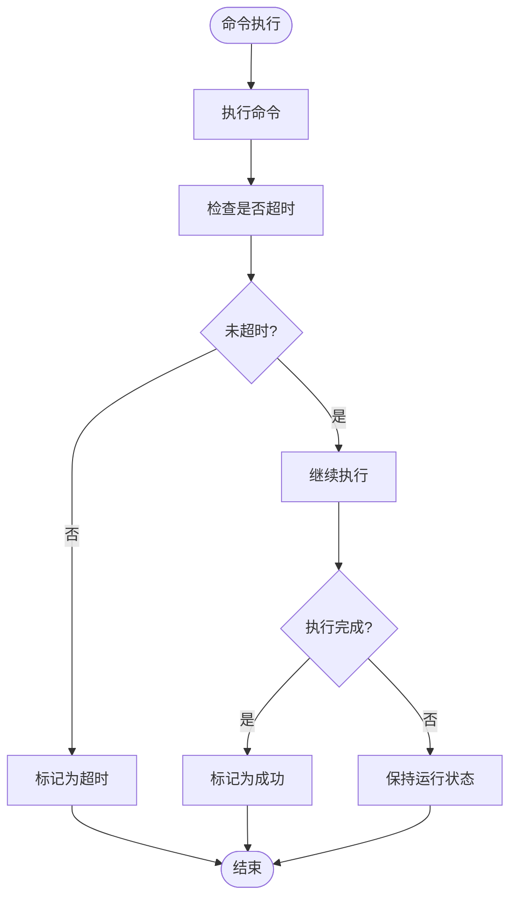
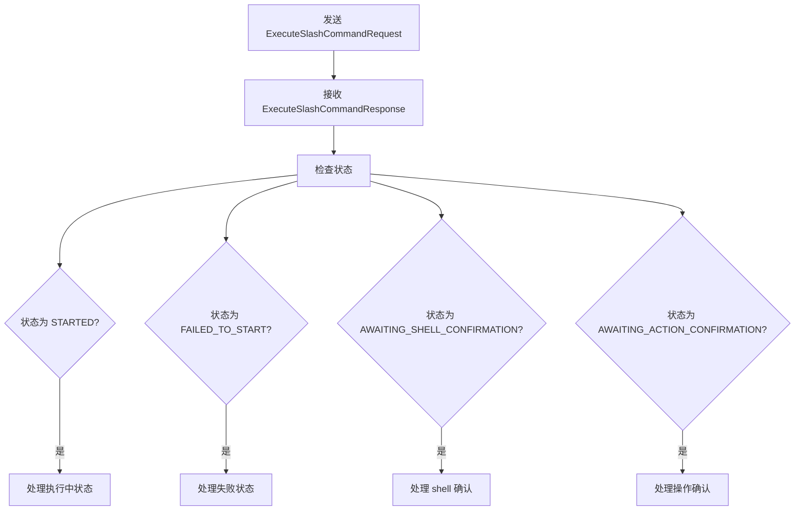

# command/execute 方法

<cite>
**本文档中引用的文件**  
- [development-extension-rfc.md](file://packages/a2a-server/development-extension-rfc.md#L363-L390)
- [FileCommandLoader.ts](file://packages/cli/src/services/FileCommandLoader.ts#L243-L279)
- [shellProcessor.ts](file://packages/cli/src/services/prompt-processors/shellProcessor.ts#L160-L187)
- [types.ts](file://packages/cli/src/ui/commands/types.ts#L200-L215)
- [commands.ts](file://packages/cli/src/utils/commands.ts#L0-L34)
- [memoryCommand.ts](file://packages/cli/src/ui/commands/memoryCommand.ts#L0-L153)
</cite>

## 目录
1. [简介](#简介)
2. [异步执行模型](#异步执行模型)
3. [请求参数解析](#请求参数解析)
4. [响应结构定义](#响应结构定义)
5. [执行ID的作用](#执行id的作用)
6. [错误处理与超时策略](#错误处理与超时策略)
7. [客户端处理示例](#客户端处理示例)

## 简介
`command/execute` 方法是 Gemini CLI 系统中用于执行斜杠命令的核心接口。该方法采用异步执行模型，允许客户端发起命令执行请求后立即获得响应，而实际的命令执行过程则在后台进行。系统通过流式事件通知客户端命令执行的进度和结果。

**Section sources**
- [development-extension-rfc.md](file://packages/a2a-server/development-extension-rfc.md#L363-L390)

## 异步执行模型
`command/execute` 方法采用异步执行模型，其工作流程如下：客户端发送 `ExecuteSlashCommandRequest` 请求后，服务器立即返回 `ExecuteSlashCommandResponse` 响应，其中包含执行ID和初始状态。随后，服务器通过流式事件（streaming events）向客户端推送命令执行过程中的各种状态更新。

这种异步模型的主要优势包括：
- 客户端无需长时间等待命令执行完成
- 可以实时获取命令执行进度
- 支持长时间运行的命令
- 提供更好的用户体验

命令执行的生命周期由 `CommandExecutionStatus` 枚举值表示，系统会根据执行过程中的不同阶段更新状态。

**Section sources**
- [development-extension-rfc.md](file://packages/a2a-server/development-extension-rfc.md#L363-L390)

## 请求参数解析
`ExecuteSlashCommandRequest` 请求包含两个关键参数：`command_path` 和 `args`。

### command_path 参数
`command_path` 是一个字符串数组，表示要执行的命令路径。例如，对于 `/memory add` 命令，`command_path` 为 `["memory", "add"]`。系统通过遍历命令树来解析此路径，找到对应的命令处理器。

**Diagram sources**
- [commands.ts](file://packages/cli/src/utils/commands.ts#L0-L34)
- [FileCommandLoader.ts](file://packages/cli/src/services/FileCommandLoader.ts#L243-L279)

### args 参数
`args` 参数是命令的参数字符串，包含命令名称之后的所有内容。例如，在 `/memory add some data` 命令中，`args` 为 `"some data"`。这些参数会被传递给命令的执行处理器，由处理器决定如何解析和使用。

命令解析器会处理各种特殊情况，如额外的空白字符、别名等。系统支持命令别名和子命令别名，提高了命令使用的灵活性。

**Section sources**
- [commands.ts](file://packages/cli/src/utils/commands.ts#L0-L34)
- [commands.test.ts](file://packages/cli/src/utils/commands.test.ts#L89-L126)

## 响应结构定义
`ExecuteSlashCommandResponse` 响应包含命令执行的初始状态信息。

### 响应结构
响应包含以下三个主要字段：
- `execution_id`: 唯一的任务ID，用于跟踪特定的命令执行
- `status`: 命令执行的初始状态，由 `CommandExecutionStatus` 枚举定义
- `message`: 可选的消息，用于解释命令为何无法启动

### CommandExecutionStatus 枚举
`CommandExecutionStatus` 枚举定义了命令执行的各种状态：

**Diagram sources**
- [development-extension-rfc.md](file://packages/a2a-server/development-extension-rfc.md#L363-L390)

#### STARTED 状态
`STARTED` 状态表示命令已成功接收并开始执行。这是最常见的情况，表明命令解析成功，执行流程已启动。客户端收到此状态后，应准备接收后续的流式事件更新。

#### FAILED_TO_START 状态
`FAILED_TO_START` 状态表示命令未能启动，可能的原因包括：
- 命令未找到
- 命令格式无效
- 必需的配置缺失

当返回此状态时，响应中的 `message` 字段会包含具体的错误信息，帮助客户端和用户理解失败原因。

#### AWAITING_SHELL_CONFIRMATION 状态
`AWAITING_SHELL_CONFIRMATION` 状态表示命令执行已暂停，等待用户确认一组 shell 命令。这通常发生在命令需要执行潜在危险的 shell 操作时，系统会暂停执行并请求用户确认，以确保安全性。

#### AWAITING_ACTION_CONFIRMATION 状态
`AWAITING_ACTION_CONFIRMATION` 状态表示命令执行已暂停，等待用户确认特定操作。与 shell 命令确认不同，这种确认通常涉及其他类型的敏感操作，如文件修改、网络请求等。

**Section sources**
- [development-extension-rfc.md](file://packages/a2a-server/development-extension-rfc.md#L363-L390)

## 执行ID的作用
执行ID（execution_id）在跟踪命令生命周期中起着关键作用：

1. **唯一标识**: 每个命令执行都有唯一的执行ID，用于区分不同的执行实例
2. **状态跟踪**: 客户端可以使用执行ID来查询命令的当前状态和历史
3. **结果关联**: 所有与该命令执行相关的流式事件都与执行ID关联
4. **错误诊断**: 在出现问题时，执行ID可用于日志追踪和问题诊断

执行ID由系统在命令执行开始时生成，并在 `ExecuteSlashCommandResponse` 中返回给客户端。客户端应在后续的所有状态查询和事件处理中使用此ID。

**Section sources**
- [development-extension-rfc.md](file://packages/a2a-server/development-extension-rfc.md#L363-L390)

## 错误处理与超时策略
系统实现了全面的错误处理和超时策略，确保命令执行的可靠性和稳定性。

### 错误处理
当命令执行过程中发生错误时，系统会：
1. 捕获异常并生成有意义的错误消息
2. 更新命令状态为相应的错误状态
3. 通过流式事件通知客户端
4. 记录详细的错误日志用于诊断

对于 shell 命令执行，系统会特别处理启动失败的情况，如命令不存在或权限不足。

### 超时策略
系统实现了合理的超时机制：
- 对于长时间运行的命令，保持连接并持续发送进度更新
- 对于无响应的命令，设置合理的超时阈值
- 超时后自动终止命令执行并通知客户端

**Diagram sources**
- [shellProcessor.ts](file://packages/cli/src/services/prompt-processors/shellProcessor.ts#L160-L187)
- [FileCommandLoader.ts](file://packages/cli/src/services/FileCommandLoader.ts#L243-L279)

## 客户端处理示例
客户端处理不同状态响应的典型流程如下：

1. 发送 `ExecuteSlashCommandRequest` 请求
2. 接收 `ExecuteSlashCommandResponse` 响应
3. 根据 `status` 字段处理不同情况

对于 `STARTED` 状态，客户端应：
- 显示命令正在执行的指示器
- 准备接收流式事件
- 使用执行ID跟踪命令状态

对于 `FAILED_TO_START` 状态，客户端应：
- 显示错误消息给用户
- 提供可能的解决方案建议
- 记录错误用于诊断

对于 `AWAITING_SHELL_CONFIRMATION` 和 `AWAITING_ACTION_CONFIRMATION` 状态，客户端应：
- 显示确认对话框
- 展示需要确认的具体操作
- 等待用户输入确认或取消

**Diagram sources**
- [types.ts](file://packages/cli/src/ui/commands/types.ts#L200-L215)
- [memoryCommand.ts](file://packages/cli/src/ui/commands/memoryCommand.ts#L0-L153)