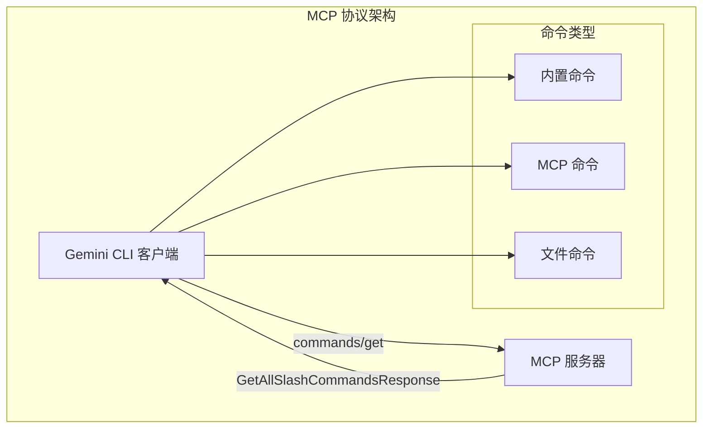
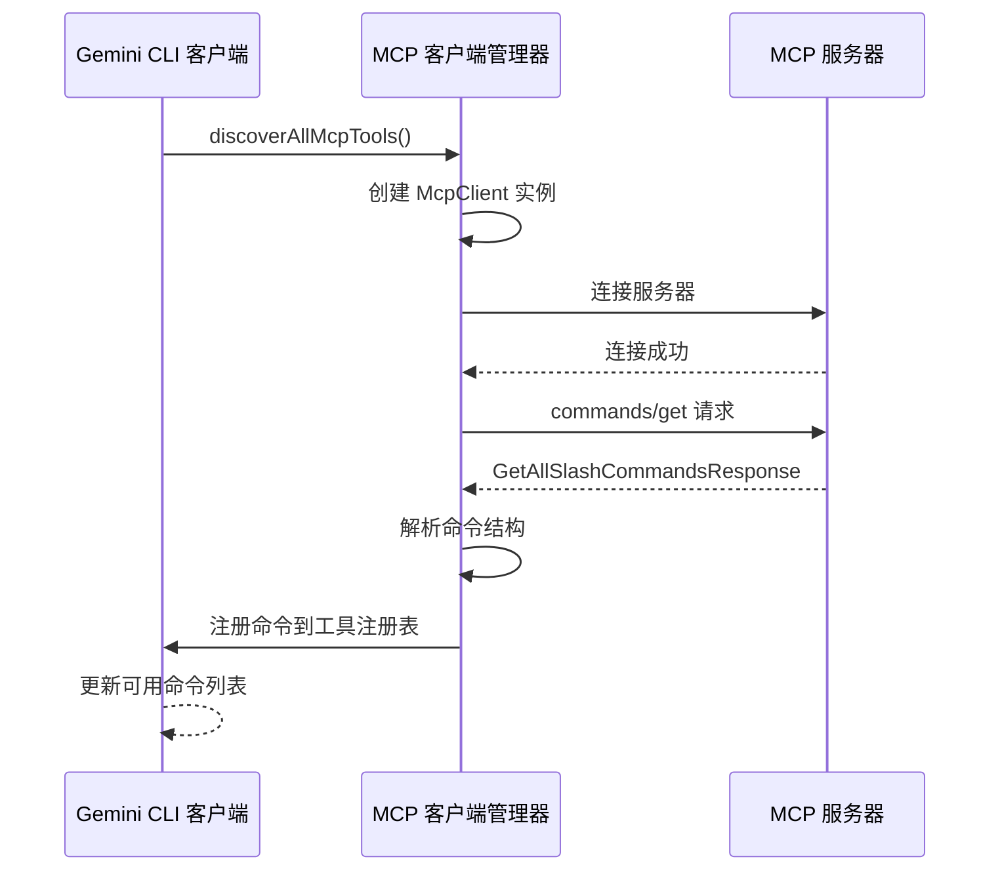
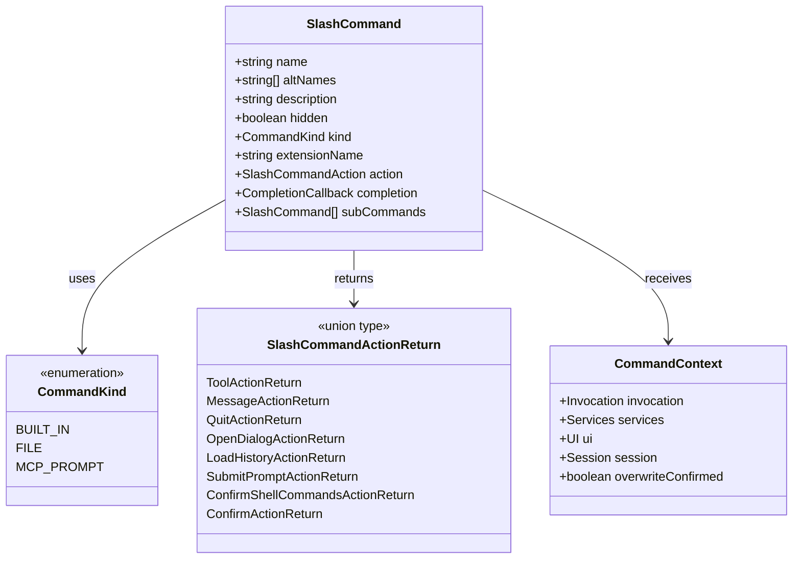
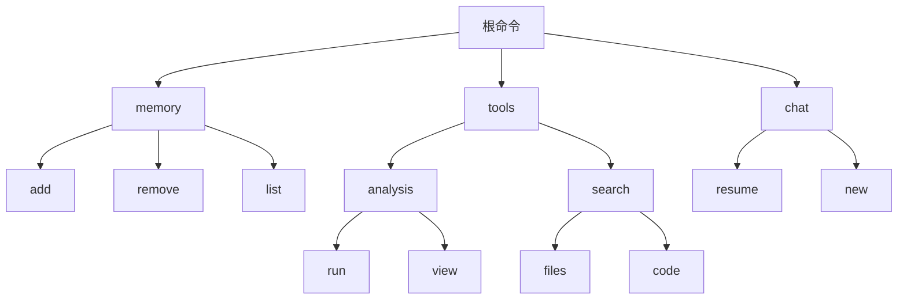
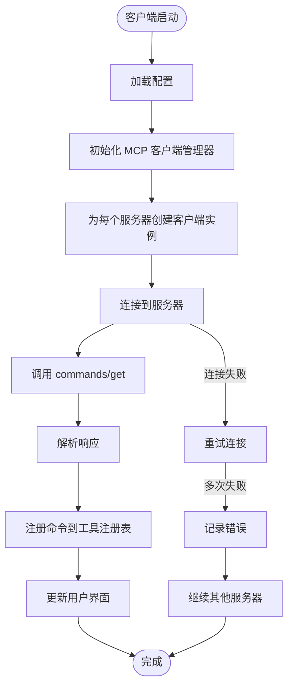
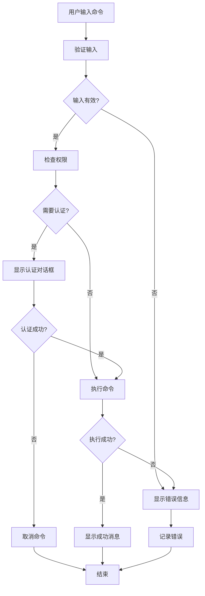

# MCP 协议中 commands/get 方法详细说明

<cite>
**本文档引用的文件**
- [packages/cli/src/ui/commands/types.ts](file://packages/cli/src/ui/commands/types.ts)
- [packages/core/src/tools/mcp-tool.ts](file://packages/core/src/tools/mcp-tool.ts)
- [packages/core/src/tools/mcp-client.ts](file://packages/core/src/tools/mcp-client.ts)
- [packages/core/src/tools/mcp-client-manager.ts](file://packages/core/src/tools/mcp-client-manager.ts)
- [packages/cli/src/services/McpPromptLoader.ts](file://packages/cli/src/services/McpPromptLoader.ts)
- [packages/cli/src/services/CommandService.ts](file://packages/cli/src/services/CommandService.ts)
- [packages/cli/src/ui/hooks/slashCommandProcessor.ts](file://packages/cli/src/ui/hooks/slashCommandProcessor.ts)
</cite>

## 目录
1. [简介](#简介)
2. [MCP 协议概述](#mcp-协议概述)
3. [commands/get 方法架构](#commandsg-get-方法架构)
4. [SlashCommand 数据模型](#slashcommand-数据模型)
5. [命令路径层级结构](#命令路径层级结构)
6. [客户端发现机制](#客户端发现机制)
7. [实际代码示例](#实际代码示例)
8. [IDE 集成应用场景](#ide-集成应用场景)
9. [性能考虑](#性能考虑)
10. [故障排除指南](#故障排除指南)
11. [总结](#总结)

## 简介

MCP（Model Context Protocol）协议中的 `commands/get` 方法是 Gemini CLI 客户端在启动时动态发现和注册外部服务器支持的斜杠命令的核心机制。该方法实现了客户端与 MCP 服务器之间的双向通信，使客户端能够自动识别和集成来自不同来源的命令功能。

本文档详细说明了 `commands/get` 方法的工作原理、数据结构定义以及在实际应用中的使用方式，特别关注客户端如何解析和使用返回的命令列表。

## MCP 协议概述

MCP 是一个标准化的协议，用于在 AI 模型和各种工具之间建立通信桥梁。它允许外部服务器向客户端提供可执行的命令，这些命令可以扩展客户端的功能而不必修改核心代码。



**图表来源**
- [packages/cli/src/services/CommandService.ts](file://packages/cli/src/services/CommandService.ts#L1-L50)
- [packages/core/src/tools/mcp-client.ts](file://packages/core/src/tools/mcp-client.ts#L1-L100)

## commands/get 方法架构

`commands/get` 方法采用异步请求-响应模式，客户端通过 JSON-RPC 协议向 MCP 服务器发送请求，服务器返回可用命令的完整列表。



**图表来源**
- [packages/core/src/tools/mcp-client-manager.ts](file://packages/core/src/tools/mcp-client-manager.ts#L50-L100)
- [packages/core/src/tools/mcp-client.ts](file://packages/core/src/tools/mcp-client.ts#L100-L200)

**章节来源**
- [packages/core/src/tools/mcp-client-manager.ts](file://packages/core/src/tools/mcp-client-manager.ts#L1-L130)
- [packages/core/src/tools/mcp-client.ts](file://packages/core/src/tools/mcp-client.ts#L1-L200)

## SlashCommand 数据模型

`SlashCommand` 接口定义了命令的基本结构，包含了名称、描述、类型和执行逻辑等关键属性。

```typescript
interface SlashCommand {
  name: string;
  altNames?: string[];
  description: string;
  hidden?: boolean;
  kind: CommandKind;
  extensionName?: string;
  action?: (context: CommandContext, args: string) => 
    | void 
    | SlashCommandActionReturn 
    | Promise<void | SlashCommandActionReturn>;
  completion?: (context: CommandContext, partialArg: string) => Promise<string[]>;
  subCommands?: SlashCommand[];
}
```

### 数据模型详解



**图表来源**
- [packages/cli/src/ui/commands/types.ts](file://packages/cli/src/ui/commands/types.ts#L150-L215)

**章节来源**
- [packages/cli/src/ui/commands/types.ts](file://packages/cli/src/ui/commands/types.ts#L1-L216)

## 命令路径层级结构

MCP 协议中的命令路径采用层级结构，类似于文件系统路径，支持多级子命令的组织方式。

### 路径映射规则

- **根命令**：直接位于根级别的命令，如 `/help`
- **子命令**：具有父命令的命令，如 `/memory add` 对应于命令路径 `['memory', 'add']`
- **嵌套结构**：支持多层嵌套，如 `/tools/analysis/run`



### 实际映射示例

| 命令路径 | 实际命令格式 | 描述 |
|---------|-------------|------|
| `['memory', 'add']` | `/memory add` | 向内存添加内容 |
| `['tools', 'analysis', 'run']` | `/tools analysis run` | 执行分析工具 |
| `['chat', 'new']` | `/chat new` | 开始新的聊天会话 |

**章节来源**
- [packages/cli/src/services/McpPromptLoader.ts](file://packages/cli/src/services/McpPromptLoader.ts#L24-L57)

## 客户端发现机制

客户端通过一系列协调的服务来发现和注册 MCP 服务器提供的命令。



**图表来源**
- [packages/core/src/tools/mcp-client-manager.ts](file://packages/core/src/tools/mcp-client-manager.ts#L50-L100)
- [packages/cli/src/services/CommandService.ts](file://packages/cli/src/services/CommandService.ts#L40-L80)

### 发现流程详解

1. **配置加载阶段**：从配置文件中读取所有已配置的 MCP 服务器
2. **客户端创建**：为每个服务器创建独立的 `McpClient` 实例
3. **连接建立**：通过标准传输协议（STDIO、HTTP、SSE）建立连接
4. **命令获取**：发送 `commands/get` 请求获取可用命令列表
5. **命令注册**：将解析后的命令注册到全局命令服务中
6. **冲突解决**：处理命名冲突，确保命令唯一性

**章节来源**
- [packages/core/src/tools/mcp-client-manager.ts](file://packages/core/src/tools/mcp-client-manager.ts#L50-L130)
- [packages/cli/src/services/CommandService.ts](file://packages/cli/src/services/CommandService.ts#L1-L104)

## 实际代码示例

### 基本命令发现示例

```typescript
// MCP 服务器响应示例
const getAllSlashCommandsResponse = {
  commands: [
    {
      name: "memory",
      description: "Manage memory storage",
      subCommands: [
        {
          name: "add",
          description: "Add content to memory",
          arguments: [
            {
              name: "content",
              description: "Content to add",
              required: true
            },
            {
              name: "tags",
              description: "Tags for categorization",
              required: false
            }
          ]
        },
        {
          name: "remove",
          description: "Remove content from memory",
          arguments: [
            {
              name: "id",
              description: "Memory item ID",
              required: true
            }
          ]
        }
      ]
    },
    {
      name: "tools",
      description: "External tool integration",
      subCommands: [
        {
          name: "analysis",
          description: "Run code analysis",
          arguments: [
            {
              name: "target",
              description: "Target file or directory",
              required: true
            }
          ]
        }
      ]
    }
  ]
};
```

### 客户端解析和使用示例

```typescript
// 命令解析和执行
const handleSlashCommand = async (rawQuery: string) => {
  const trimmed = rawQuery.trim();
  if (!trimmed.startsWith('/')) {
    return false;
  }

  // 解析命令路径
  const { commandToExecute, args, canonicalPath } = parseSlashCommand(
    trimmed, 
    availableCommands
  );

  // 执行命令
  if (commandToExecute?.action) {
    const result = await commandToExecute.action(commandContext, args);
    
    switch (result.type) {
      case 'message':
        // 显示消息给用户
        break;
      case 'tool':
        // 调度工具执行
        break;
      case 'submit_prompt':
        // 提交提示给模型
        break;
    }
  }
};
```

### 命令注册示例

```typescript
// MCP 提示加载器中的命令注册
class McpPromptLoader implements ICommandLoader {
  async loadCommands(signal: AbortSignal): Promise<SlashCommand[]> {
    const promptCommands: SlashCommand[] = [];
    
    for (const serverName in mcpServers) {
      const prompts = getMCPServerPrompts(this.config, serverName) || [];
      
      for (const prompt of prompts) {
        const newPromptCommand: SlashCommand = {
          name: prompt.name,
          description: prompt.description || `Invoke prompt ${prompt.name}`,
          kind: CommandKind.MCP_PROMPT,
          subCommands: [
            {
              name: 'help',
              description: 'Show help for this prompt',
              kind: CommandKind.MCP_PROMPT,
              action: async () => {
                // 显示帮助信息
                return {
                  type: 'message',
                  messageType: 'info',
                  content: `Help for ${prompt.name}`
                };
              }
            }
          ],
          action: async (context, args) => {
            // 执行提示
            const result = await prompt.invoke(parseArgs(args, prompt.arguments));
            return {
              type: 'submit_prompt',
              content: JSON.stringify(result.messages[0].content.text)
            };
          }
        };
        
        promptCommands.push(newPromptCommand);
      }
    }
    
    return promptCommands;
  }
}
```

**章节来源**
- [packages/cli/src/services/McpPromptLoader.ts](file://packages/cli/src/services/McpPromptLoader.ts#L24-L150)
- [packages/cli/src/ui/hooks/slashCommandProcessor.ts](file://packages/cli/src/ui/hooks/slashCommandProcessor.ts#L200-L300)

## IDE 集成应用场景

### VS Code 集成

在 VS Code 中，MCP 命令可以通过以下方式集成：

```typescript
// VS Code 扩展中的命令注册
vscode.commands.registerCommand('gemini.memory.add', async () => {
  const input = await vscode.window.showInputBox({
    prompt: 'Enter content to add to memory'
  });
  
  if (input) {
    await vscode.commands.executeCommand('workbench.action.chat.runSlashCommand', `/memory add "${input}"`);
  }
});
```

### 自动补全功能

```typescript
// 自动补全提供程序
class SlashCommandCompletionProvider implements vscode.CompletionItemProvider {
  provideCompletionItems(document: vscode.TextDocument, position: vscode.Position) {
    const linePrefix = document.lineAt(position).text.substr(0, position.character);
    
    if (linePrefix.endsWith('/')) {
      const commands = this.getAvailableCommands();
      return commands.map(cmd => new vscode.CompletionItem(cmd.name, vscode.CompletionItemKind.Function));
    }
    
    return [];
  }
}
```

### 快捷键绑定

```typescript
// 快捷键配置
[
  {
    "key": "ctrl+alt+m",
    "command": "workbench.action.chat.runSlashCommand",
    "args": "/memory add",
    "when": "editorTextFocus"
  },
  {
    "key": "ctrl+alt+t",
    "command": "workbench.action.chat.runSlashCommand",
    "args": "/tools analysis run",
    "when": "editorTextFocus"
  }
]
```

### 错误处理和用户体验



**图表来源**
- [packages/cli/src/ui/hooks/slashCommandProcessor.ts](file://packages/cli/src/ui/hooks/slashCommandProcessor.ts#L300-L400)

## 性能考虑

### 并发处理

```typescript
// 并发发现多个服务器的命令
async function discoverAllMcpTools(cliConfig: Config): Promise<void> {
  const servers = populateMcpServerCommand(mcpServers, mcpServerCommand);
  
  // 并行处理所有服务器
  const discoveryPromises = Object.entries(servers).map(async ([name, config]) => {
    const client = new McpClient(name, config, toolRegistry, promptRegistry);
    
    try {
      await client.connect();
      await client.discover(cliConfig);
    } catch (error) {
      console.error(`Error during discovery for server '${name}': ${getErrorMessage(error)}`);
      // 记录错误但不中断其他服务器的发现
    }
  });
  
  await Promise.all(discoveryPromises);
}
```

### 缓存策略

```typescript
// 命令缓存实现
class CommandCache {
  private cache = new Map<string, { commands: SlashCommand[], timestamp: number }>();
  private readonly TTL = 5 * 60 * 1000; // 5分钟
  
  getCachedCommands(serverName: string): SlashCommand[] | null {
    const cached = this.cache.get(serverName);
    if (cached && Date.now() - cached.timestamp < this.TTL) {
      return cached.commands;
    }
    return null;
  }
  
  setCachedCommands(serverName: string, commands: SlashCommand[]): void {
    this.cache.set(serverName, {
      commands,
      timestamp: Date.now()
    });
  }
}
```

### 内存优化

```typescript
// 使用 WeakMap 减少内存占用
const commandWeakMap = new WeakMap<object, SlashCommand[]>();

// 在组件卸载时清理资源
useEffect(() => {
  return () => {
    // 清理命令上下文
    commandWeakMap.delete(componentInstance);
  };
}, []);
```

## 故障排除指南

### 常见问题和解决方案

#### 1. 连接超时

**症状**：MCP 服务器连接失败或超时
**原因**：网络问题、服务器未启动或配置错误
**解决方案**：
```typescript
// 增加连接超时时间
const timeoutMs = 30000; // 30秒
const client = await connectToMcpServer(serverName, serverConfig, debugMode, workspaceContext, timeoutMs);
```

#### 2. 命令解析错误

**症状**：命令无法正确解析或执行
**原因**：命令格式错误或参数不匹配
**解决方案**：
```typescript
// 添加详细的错误日志
try {
  const result = await commandToExecute.action(context, args);
  return result;
} catch (error) {
  console.error(`Command execution failed: ${error.message}`);
  console.error(`Command: ${commandToExecute.name}`);
  console.error(`Arguments: ${JSON.stringify(args)}`);
  throw error;
}
```

#### 3. 权限拒绝

**症状**：某些命令被拒绝执行
**原因**：权限不足或安全策略限制
**解决方案**：
```typescript
// 实现权限检查
const shouldConfirmExecute = async (command: SlashCommand): Promise<boolean> => {
  if (command.kind === CommandKind.MCP_PROMPT) {
    // 检查是否需要确认
    return !isTrustedFolder() || !command.trust;
  }
  return false;
};
```

### 调试技巧

```typescript
// 启用调试模式
const debugMode = process.env.DEBUG_MCP === 'true';

// 添加详细的日志记录
const logCommandExecution = (command: SlashCommand, args: string, result: any) => {
  if (debugMode) {
    console.log(`Executing command: ${command.name}`);
    console.log(`Arguments: ${args}`);
    console.log(`Result: ${JSON.stringify(result, null, 2)}`);
  }
};
```

**章节来源**
- [packages/core/src/tools/mcp-client.ts](file://packages/core/src/tools/mcp-client.ts#L100-L200)
- [packages/cli/src/services/McpPromptLoader.ts](file://packages/cli/src/services/McpPromptLoader.ts#L100-L200)

## 总结

MCP 协议中的 `commands/get` 方法为 Gemini CLI 提供了一个强大而灵活的命令发现机制。通过这个方法，客户端能够：

1. **动态发现**：在运行时自动发现和集成来自不同 MCP 服务器的命令
2. **类型安全**：通过 TypeScript 类型系统确保命令结构的一致性和安全性
3. **层次化组织**：支持多级命令结构，便于复杂功能的组织和管理
4. **扩展性强**：允许第三方开发者轻松添加自定义命令
5. **用户体验好**：提供自动补全、帮助信息和错误处理等功能

该机制不仅简化了命令系统的维护，还为未来的功能扩展奠定了坚实的基础。通过合理的架构设计和错误处理，确保了系统的稳定性和可靠性。

对于开发者而言，理解 `commands/get` 方法的工作原理有助于更好地利用 MCP 协议的强大功能，构建更加智能和高效的开发工具。