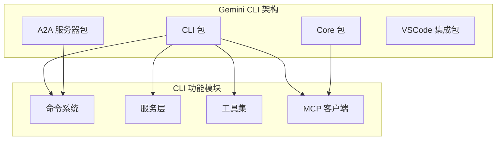
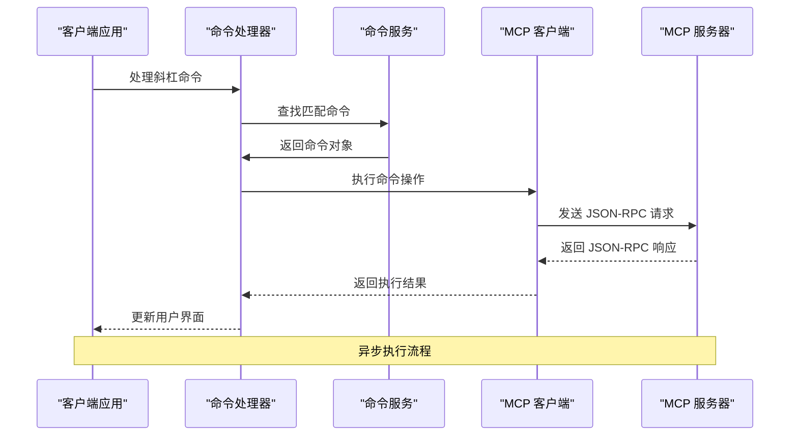
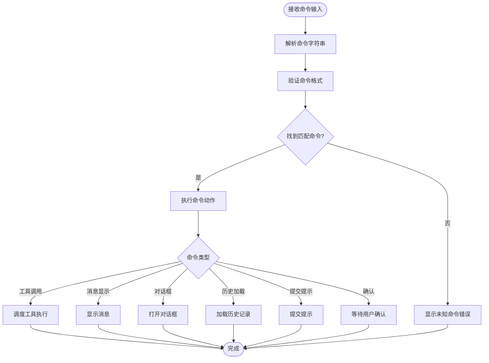
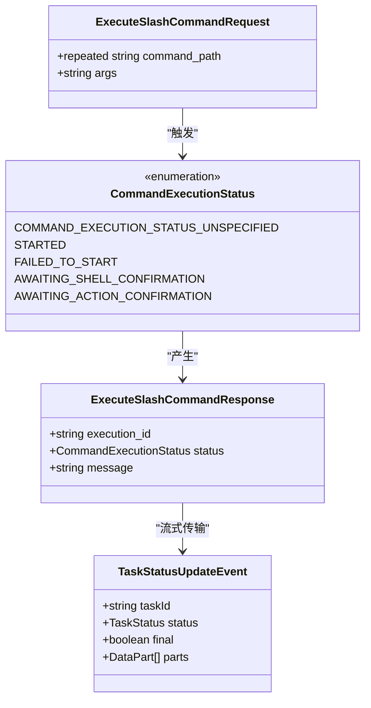
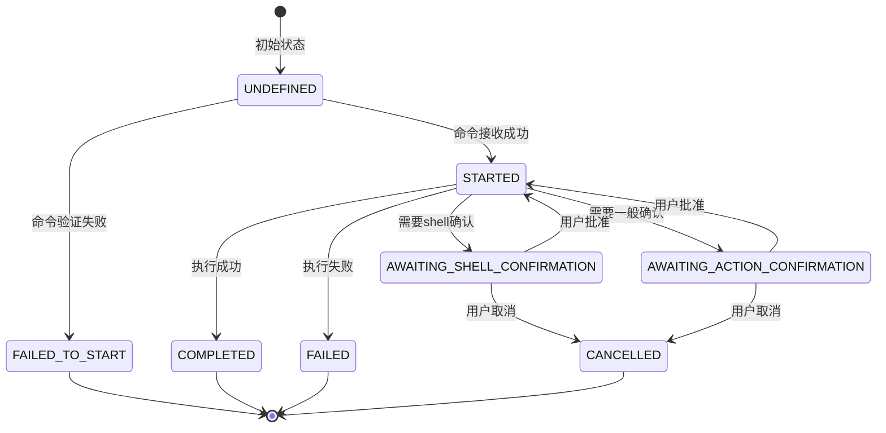
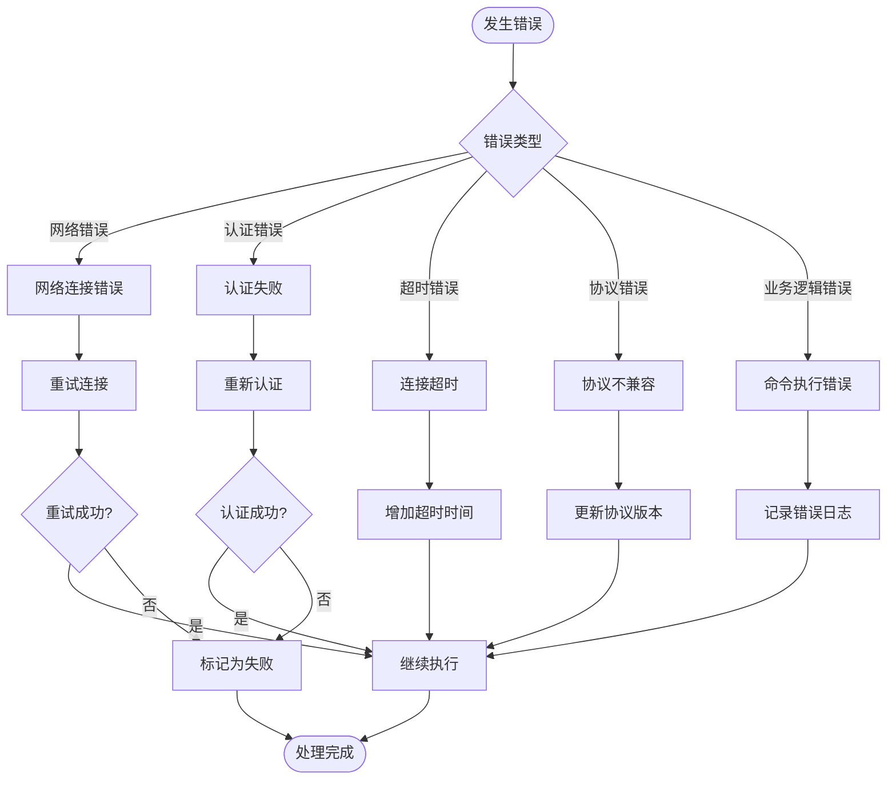
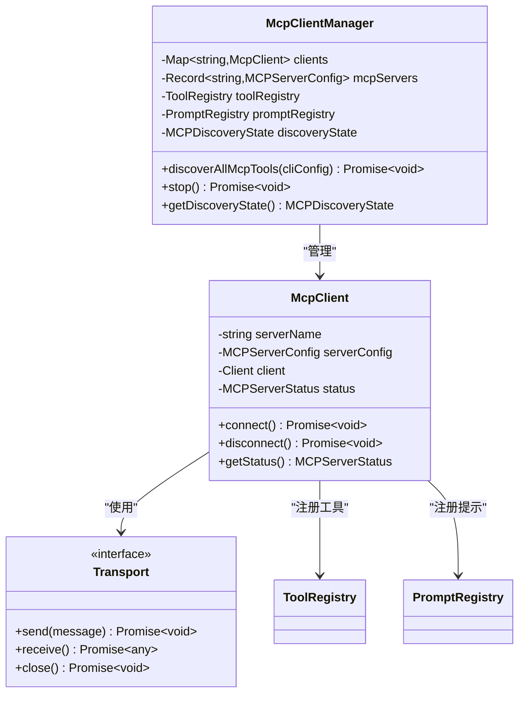
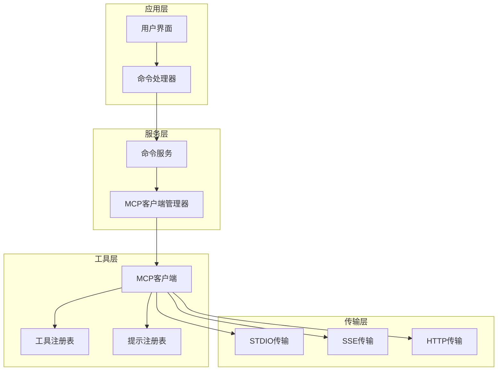

# 方法调用规范

<cite>
**本文档中引用的文件**
- [packages/cli/src/ui/commands/types.ts](file://packages/cli/src/ui/commands/types.ts)
- [packages/a2a-server/development-extension-rfc.md](file://packages/a2a-server/development-extension-rfc.md)
- [packages/cli/src/services/CommandService.ts](file://packages/cli/src/services/CommandService.ts)
- [packages/cli/src/ui/hooks/slashCommandProcessor.ts](file://packages/cli/src/ui/hooks/slashCommandProcessor.ts)
- [packages/core/src/tools/mcp-client.ts](file://packages/core/src/tools/mcp-client.ts)
- [packages/core/src/tools/mcp-client-manager.ts](file://packages/core/src/tools/mcp-client-manager.ts)
- [integration-tests/mcp_server_cyclic_schema.test.ts](file://integration-tests/mcp_server_cyclic_schema.test.ts)
- [packages/cli/src/commands/mcp/add.ts](file://packages/cli/src/commands/mcp/add.ts)
- [packages/cli/src/config/settingsSchema.ts](file://packages/cli/src/config/settingsSchema.ts)
</cite>

## 目录
1. [简介](#简介)
2. [项目结构概览](#项目结构概览)
3. [核心组件分析](#核心组件分析)
4. [架构概览](#架构概览)
5. [详细组件分析](#详细组件分析)
6. [依赖关系分析](#依赖关系分析)
7. [性能考虑](#性能考虑)
8. [故障排除指南](#故障排除指南)
9. [结论](#结论)

## 简介

本文档详细定义了MCP（Model Context Protocol）协议的远程方法调用接口，重点关注`commands/get`和`command/execute`方法的请求/响应模式。该协议为Gemini CLI提供了标准化的命令执行机制，支持异步执行、状态管理和错误处理。

MCP协议建立在JSON-RPC 2.0基础上，通过标准化的接口实现了客户端与服务器之间的可靠通信。该协议支持多种传输方式（STDIO、SSE、HTTP），并提供了完整的生命周期管理功能。

## 项目结构概览

Gemini CLI采用模块化架构，主要包含以下核心包：



**图表来源**
- [packages/cli/src/index.ts](file://packages/cli/src/index.ts)
- [packages/core/src/index.ts](file://packages/core/src/index.ts)

**章节来源**
- [packages/cli/src/index.ts](file://packages/cli/src/index.ts)
- [packages/core/src/index.ts](file://packages/core/src/index.ts)

## 核心组件分析

### SlashCommand 数据结构

SlashCommand是MCP协议的核心数据结构，定义了命令的基本属性和行为：

```typescript
export interface SlashCommand {
  name: string;
  altNames?: string[];
  description: string;
  hidden?: boolean;
  kind: CommandKind;
  extensionName?: string;
  action?: (context: CommandContext, args: string) => 
    | void 
    | SlashCommandActionReturn 
    | Promise<void | SlashCommandActionReturn>;
  completion?: (context: CommandContext, partialArg: string) => Promise<string[]>;
  subCommands?: SlashCommand[];
}
```

### CommandContext 上下文对象

CommandContext提供了命令执行所需的完整上下文信息：

```typescript
export interface CommandContext {
  invocation?: {
    raw: string;
    name: string;
    args: string;
  };
  services: {
    config: Config | null;
    settings: LoadedSettings;
    git: GitService | undefined;
    logger: Logger;
  };
  ui: {
    addItem: UseHistoryManagerReturn['addItem'];
    clear: () => void;
    setDebugMessage: (message: string) => void;
    pendingItem: HistoryItemWithoutId | null;
    setPendingItem: (item: HistoryItemWithoutId | null) => void;
    loadHistory: UseHistoryManagerReturn['loadHistory'];
    toggleCorgiMode: () => void;
    toggleVimEnabled: () => Promise<boolean>;
    setGeminiMdFileCount: (count: number) => void;
    reloadCommands: () => void;
    extensionsUpdateState: Map<string, ExtensionUpdateStatus>;
    dispatchExtensionStateUpdate: (action: ExtensionUpdateAction) => void;
    addConfirmUpdateExtensionRequest: (value: ConfirmationRequest) => void;
  };
  session: {
    stats: SessionStatsState;
    sessionShellAllowlist: Set<string>;
  };
  overwriteConfirmed?: boolean;
}
```

**章节来源**
- [packages/cli/src/ui/commands/types.ts](file://packages/cli/src/ui/commands/types.ts#L193-L214)
- [packages/cli/src/ui/commands/types.ts](file://packages/cli/src/ui/commands/types.ts#L15-L100)

## 架构概览

MCP协议的架构基于分层设计，支持多种传输协议和认证机制：



**图表来源**
- [packages/cli/src/ui/hooks/slashCommandProcessor.ts](file://packages/cli/src/ui/hooks/slashCommandProcessor.ts#L200-L300)
- [packages/core/src/tools/mcp-client.ts](file://packages/core/src/tools/mcp-client.ts#L686-L737)

## 详细组件分析

### commands/get 方法的请求/响应模式

`commands/get`方法负责解析和验证斜杠命令，返回匹配的命令对象：



**图表来源**
- [packages/cli/src/ui/hooks/slashCommandProcessor.ts](file://packages/cli/src/ui/hooks/slashCommandProcessor.ts#L200-L400)

### command/execute 方法的异步执行模型

`command/execute`方法实现了完整的异步执行流程，支持状态跟踪和用户交互：



**图表来源**
- [packages/a2a-server/development-extension-rfc.md](file://packages/a2a-server/development-extension-rfc.md#L349-L390)

### ExecuteSlashCommandRequest 参数详解

#### command_path 参数

`command_path`是一个字符串数组，表示命令的层级路径：

- **格式**: `["memory", "add"]` 对应 `/memory add`
- **用途**: 指定要执行的具体命令位置
- **长度**: 支持多级子命令嵌套
- **验证**: 必须匹配已注册的命令树结构

#### args 参数

`args`是一个字符串，包含传递给命令的所有参数：

- **格式**: `"data to add"`
- **用途**: 提供命令执行所需的所有额外信息
- **解析**: 由命令处理器进行参数分割和验证
- **长度**: 受系统限制，通常不超过几千字符

### ExecuteSlashCommandResponse 状态枚举

`CommandExecutionStatus`枚举定义了命令执行的不同状态：

```typescript
enum CommandExecutionStatus {
  // 默认未指定状态
  COMMAND_EXECUTION_STATUS_UNSPECIFIED = 0;
  // 命令成功接收并开始执行
  STARTED = 1;
  // 命令启动失败（如命令未找到、格式无效）
  FAILED_TO_START = 2;
  // 命令暂停，等待用户确认一组shell命令
  AWAITING_SHELL_CONFIRMATION = 3;
  // 命令暂停，等待用户确认特定操作
  AWAITING_ACTION_CONFIRMATION = 4;
}
```

#### 状态转换图



**章节来源**
- [packages/a2a-server/development-extension-rfc.md](file://packages/a2a-server/development-extension-rfc.md#L363-L390)

### 错误处理和超时策略

#### 连接超时配置

MCP客户端支持灵活的超时配置：

```typescript
// 默认超时时间
const MCP_DEFAULT_TIMEOUT_MSEC = 30000;

// 连接超时设置
await mcpClient.connect(transport, {
  timeout: mcpServerConfig.timeout ?? MCP_DEFAULT_TIMEOUT_MSEC,
});
```

#### 错误分类和处理



**图表来源**
- [packages/core/src/tools/mcp-client.ts](file://packages/core/src/tools/mcp-client.ts#L800-L900)

#### 传输层错误处理

MCP协议支持多种传输方式，每种都有相应的错误处理策略：

1. **STDIO传输**: 子进程管理、进程重启、缓冲区溢出检测
2. **SSE传输**: 连接重试、心跳检测、断线重连
3. **HTTP传输**: 超时控制、重试机制、状态码处理

**章节来源**
- [packages/core/src/tools/mcp-client.ts](file://packages/core/src/tools/mcp-client.ts#L800-L950)

### MCP客户端管理器

MCP客户端管理器负责协调多个MCP服务器的生命周期：



**图表来源**
- [packages/core/src/tools/mcp-client-manager.ts](file://packages/core/src/tools/mcp-client-manager.ts#L15-L50)

**章节来源**
- [packages/core/src/tools/mcp-client-manager.ts](file://packages/core/src/tools/mcp-client-manager.ts#L15-L129)

## 依赖关系分析

MCP协议的依赖关系体现了清晰的分层架构：



**图表来源**
- [packages/cli/src/services/CommandService.ts](file://packages/cli/src/services/CommandService.ts#L15-L50)
- [packages/core/src/tools/mcp-client-manager.ts](file://packages/core/src/tools/mcp-client-manager.ts#L15-L50)

**章节来源**
- [packages/cli/src/services/CommandService.ts](file://packages/cli/src/services/CommandService.ts#L15-L103)
- [packages/core/src/tools/mcp-client-manager.ts](file://packages/core/src/tools/mcp-client-manager.ts#L15-L129)

## 性能考虑

### 并发处理优化

MCP协议支持并发命令执行，通过以下机制提升性能：

1. **异步执行**: 所有命令都以非阻塞方式执行
2. **流式响应**: 使用事件流传输中间结果
3. **连接池**: 复用MCP服务器连接减少开销
4. **缓存机制**: 缓存工具发现结果避免重复查询

### 内存管理

```typescript
// 工具注册表内存优化
class ToolRegistry {
  private tools = new Map<string, DiscoveredMCPTool>();
  
  registerTool(tool: DiscoveredMCPTool): void {
    // 避免重复注册
    if (!this.tools.has(tool.name)) {
      this.tools.set(tool.name, tool);
    }
  }
}
```

### 网络优化

- **连接复用**: TCP连接复用减少握手开销
- **压缩传输**: HTTP传输支持gzip压缩
- **批量请求**: 合并小的JSON-RPC请求

## 故障排除指南

### 常见错误类型

#### 1. 命令未找到错误

**症状**: `Command not found` 或 `Method not found`

**解决方案**:
```bash
# 检查MCP服务器状态
/mcp list

# 重新添加服务器
/mcp add <server-name> <command>

# 验证服务器配置
cat ~/.gemini/settings.json | grep mcpServers
```

#### 2. 认证失败

**症状**: `401 Unauthorized` 错误

**解决方案**:
```bash
# 重新认证
/mcp auth <server-name>

# 检查OAuth配置
/mcp list --verbose
```

#### 3. 连接超时

**症状**: `Timeout exceeded` 错误

**解决方案**:
```bash
# 增加超时时间
/mcp add <server-name> <command> --timeout 60000

# 检查网络连接
ping <server-host>
```

### 调试技巧

#### 启用调试模式

```bash
# 设置环境变量
export MCP_DEBUG=true
export VERBOSE=true

# 运行命令
gemini "你的问题"
```

#### 日志分析

```typescript
// MCP调试日志示例
const debugEnabled = process.env['MCP_DEBUG'] === 'true';
function debug(msg: string) {
  if (debugEnabled) {
    fs.writeSync(2, `[MCP-DEBUG] ${msg}\n`);
  }
}
```

**章节来源**
- [packages/core/src/tools/mcp-client.ts](file://packages/core/src/tools/mcp-client.ts#L25-L35)

## 结论

MCP协议为Gemini CLI提供了强大而灵活的远程方法调用接口。通过标准化的JSON-RPC 2.0基础，该协议实现了：

1. **统一的命令接口**: 支持多种类型的命令执行
2. **异步执行模型**: 非阻塞的命令处理机制
3. **完整的生命周期管理**: 从连接到断开的全流程控制
4. **强大的错误处理**: 多层次的错误检测和恢复机制
5. **灵活的传输方式**: 支持STDIO、SSE和HTTP等多种传输协议

该协议的设计充分考虑了可扩展性、性能和可靠性，为构建复杂的AI驱动应用程序提供了坚实的基础。通过合理的配置和监控，开发者可以充分利用MCP协议的强大功能，构建出色的用户体验。