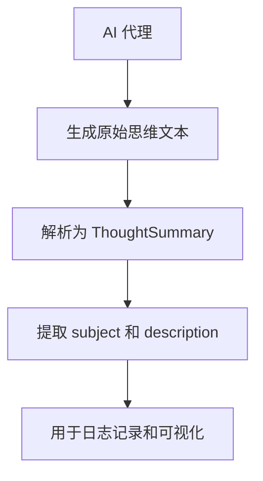
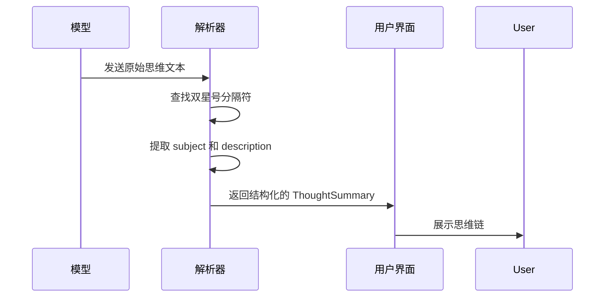
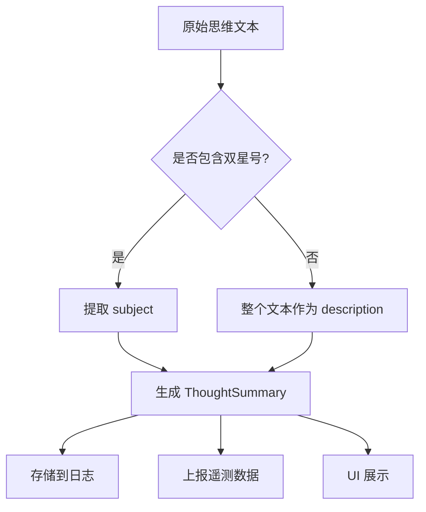

# AgentThought 思维消息

<cite>
**本文档引用的文件**
- [thoughtUtils.ts](file://packages/core/src/utils/thoughtUtils.ts)
- [thoughtUtils.test.ts](file://packages/core/src/utils/thoughtUtils.test.ts)
- [turn.ts](file://packages/core/src/core/turn.ts)
- [executor.ts](file://packages/core/src/agents/executor.ts)
- [development-extension-rfc.md](file://packages/a2a-server/development-extension-rfc.md)
- [mcp-client.ts](file://packages/core/src/tools/mcp-client.ts)
</cite>

## 目录
1. [引言](#引言)
2. [AgentThought 消息设计目的](#agentthought-消息设计目的)
3. [subject 和 description 字段的协同工作机制](#subject-和-description-字段的协同工作机制)
4. [在提示工程中的应用与价值](#在提示工程中的应用与价值)
5. [日志记录与可视化展示](#日志记录与可视化展示)
6. [隐私保护与敏感信息过滤](#隐私保护与敏感信息过滤)
7. [结论](#结论)

## 引言
AgentThought 消息是 MCP（Model Context Protocol）协议中的核心组成部分，用于清晰传达 AI 代理的内部推理过程、决策依据和执行意图。通过结构化的 subject 和 description 字段，系统能够有效地解析和展示代理的思维链，从而增强模型行为的可解释性，并支持调试和用户界面的可视化。本文将深入解析 AgentThought 消息的设计目的与实现机制，并探讨其在实际应用中的最佳实践。

## AgentThought 消息设计目的
AgentThought 消息的设计旨在提供一种标准化的方式来表达 AI 代理的内部思考过程。其主要目的包括：
- **增强可解释性**：通过明确的 subject 和 description 字段，使用户能够理解代理的决策逻辑。
- **支持调试**：为开发者提供详细的思维链信息，便于识别和修复问题。
- **促进人机协作**：通过清晰的思维展示，帮助用户更好地与 AI 代理进行交互。

**Diagram sources**
- [thoughtUtils.ts](file://packages/core/src/utils/thoughtUtils.ts#L25-L53)

**Section sources**
- [thoughtUtils.ts](file://packages/core/src/utils/thoughtUtils.ts#L1-L54)
- [development-extension-rfc.md](file://packages/a2a-server/development-extension-rfc.md#L99-L300)

## subject 和 description 字段的协同工作机制
AgentThought 消息中的 subject 和 description 字段通过特定的解析规则协同工作，以确保思维链的清晰表达。具体机制如下：
- **subject 字段**：表示思维的主题或标题，通常用双星号（**）包围，如 **Subject**。
- **description 字段**：包含对 subject 的详细描述，位于 subject 前后的内容。

解析函数 `parseThought` 负责将原始文本转换为结构化的 `ThoughtSummary` 对象。该函数首先查找双星号作为分隔符，提取 subject 内容，然后将剩余部分作为 description。

**Diagram sources**
- [thoughtUtils.ts](file://packages/core/src/utils/thoughtUsers.ts#L25-L53)
- [turn.ts](file://packages/core/src/core/turn.ts#L247-L250)

**Section sources**
- [thoughtUtils.ts](file://packages/core/src/utils/thoughtUtils.ts#L25-L53)
- [turn.ts](file://packages/core/src/core/turn.ts#L240-L370)

## 在提示工程中的应用与价值
AgentThought 消息在提示工程中具有重要价值，主要体现在以下几个方面：
- **引导模型行为**：通过预设的 subject 和 description 格式，引导模型生成符合预期的思维链。
- **增强可解释性**：结构化的输出使得模型的决策过程更加透明，便于用户理解和信任。
- **支持调试**：详细的思维链信息有助于开发者快速定位问题，优化模型性能。

例如，在 `executor.ts` 中，`parseThought` 函数被用于提取模型响应中的 subject，并通过活动事件（activity event）进行广播，从而实现实时的思维链监控。

**Section sources**
- [executor.ts](file://packages/core/src/agents/executor.ts#L262-L265)
- [thoughtUtils.ts](file://packages/core/src/utils/thoughtUtils.ts#L25-L53)

## 日志记录与可视化展示
为了有效利用 AgentThought 消息，系统提供了多种日志记录和可视化展示方式：
- **日志记录**：将解析后的 subject 和 description 存储在日志文件中，便于后续分析。
- **遥测上报**：通过遥测系统收集思维链数据，用于性能监控和模型优化。
- **用户界面展示**：在用户界面中以结构化的方式展示思维链，提升用户体验。

**Diagram sources**
- [thoughtUtils.ts](file://packages/core/src/utils/thoughtUtils.ts#L25-L53)
- [turn.ts](file://packages/core/src/core/turn.ts#L247-L250)

**Section sources**
- [thoughtUtils.ts](file://packages/core/src/utils/thoughtUtils.ts#L25-L53)
- [turn.ts](file://packages/core/src/core/turn.ts#L240-L370)

## 隐私保护与敏感信息过滤
在处理 AgentThought 消息时，必须考虑隐私保护和敏感信息过滤。具体措施包括：
- **数据脱敏**：在日志记录和遥测上报前，对敏感信息进行脱敏处理。
- **访问控制**：限制对思维链数据的访问权限，确保只有授权人员可以查看。
- **合规性检查**：定期审查数据处理流程，确保符合相关法律法规。

**Section sources**
- [thoughtUtils.ts](file://packages/core/src/utils/thoughtUtils.ts#L25-L53)
- [mcp-client.ts](file://packages/core/src/tools/mcp-client.ts#L686-L737)

## 结论
AgentThought 消息通过结构化的 subject 和 description 字段，实现了 AI 代理内部推理过程的清晰传达。其设计不仅增强了模型行为的可解释性，还支持了高效的调试和用户界面的可视化展示。结合提示工程实践，AgentThought 消息在引导模型行为、增强可解释性和支持调试方面具有重要价值。同时，通过合理的隐私保护和敏感信息过滤策略，可以确保数据的安全性和合规性。