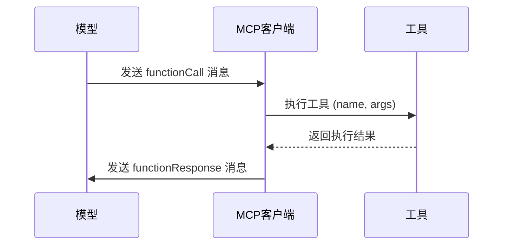
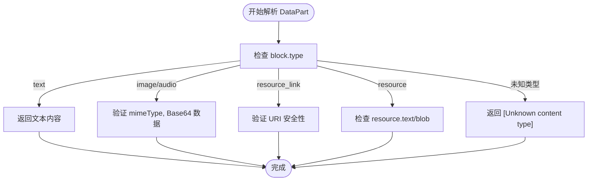

# DataPart 消息类型

<cite>
**本文档引用的文件**
- [partUtils.ts](file://packages/core/src/utils/partUtils.ts)
- [coreToolScheduler.ts](file://packages/core/src/core/coreToolScheduler.ts)
- [mcp-tool.ts](file://packages/core/src/tools/mcp-tool.ts)
</cite>

## 目录
1. [简介](#简介)
2. [DataPart 子类型定义与使用场景](#datapart-子类型定义与使用场景)
3. [DataPart 与 TextPart 的互斥性规则](#datapart-与-textpart-的互斥性规则)
4. [二进制数据的序列化与安全校验](#二进制数据的序列化与安全校验)
5. [总结](#总结)

## 简介
本文件系统化地定义了 MCP（Model Context Protocol）协议中的 `DataPart` 消息类型。`DataPart` 是一种用于在模型与工具之间传递结构化数据的核心消息格式，它支持多种子类型，包括 `functionCall`、`functionResponse`、`inlineData` 和 `fileData`。这些子类型在工具调用、多模态输入处理和函数响应传递中扮演着关键角色。本文档将详细阐述每种子类型的结构、使用场景、构造方法以及相关的安全处理机制。

**Section sources**
- [partUtils.ts](file://packages/core/src/utils/partUtils.ts#L0-L169)

## DataPart 子类型定义与使用场景

`DataPart` 消息类型通过其不同的子类型来支持丰富的交互模式。在代码实现中，`Part` 类型是一个联合类型，可以包含 `text`、`functionCall`、`functionResponse`、`inlineData` 或 `fileData` 等字段。

### functionCall
`functionCall` 子类型用于表示模型发起的工具调用请求。它包含一个 `name` 字段，指定要调用的工具名称，以及一个 `args` 字段，包含调用所需的参数。

**使用场景**：当模型决定需要执行一个外部操作（如执行 shell 命令、读取文件）时，会生成一个 `functionCall` 消息。该消息被发送给 MCP 客户端，由客户端负责执行相应的工具。

**Diagram sources**
- [mcp-tool.ts](file://packages/core/src/tools/mcp-tool.ts#L172-L200)
- [coreToolScheduler.ts](file://packages/core/src/core/coreToolScheduler.ts#L171-L214)

### functionResponse
`functionResponse` 子类型用于封装工具执行的结果，并将其返回给模型。它包含 `name`（工具名）、`id`（调用ID）和 `response`（响应内容）。

**使用场景**：当工具执行完毕后，MCP 客户端会将结果包装成 `functionResponse` 消息。该消息是模型理解外部世界状态变化的主要途径。

### inlineData
`inlineData` 子类型用于在消息中直接嵌入二进制数据，如图像或音频。它包含 `mimeType`（MIME类型）和 `data`（Base64编码的数据）。

**使用场景**：当用户上传一张图片作为输入，或工具需要向模型返回一张生成的图像时，会使用 `inlineData`。例如，在 `mcp-tool.ts` 中，`transformImageAudioBlock` 函数会将 MCP 协议中的媒体块转换为包含 `inlineData` 的 `Part`。

### fileData
`fileData` 子类型用于引用文件系统中的文件。它包含 `fileUri`（文件URI）和 `mimeType`。

**使用场景**：当需要处理大型文件或避免在消息中传输大量数据时，可以使用 `fileData` 来引用文件。这在处理大型日志文件或数据集时非常有用。

**Section sources**
- [partUtils.ts](file://packages/core/src/utils/partUtils.ts#L0-L169)
- [mcp-tool.ts](file://packages/core/src/tools/mcp-tool.ts#L0-L400)
- [coreToolScheduler.ts](file://packages/core/src/core/coreToolScheduler.ts#L0-L250)

## DataPart 与 TextPart 的互斥性规则

在 `DataPart` 的设计中，`text` 字段与其他字段（如 `functionCall`、`inlineData`）是互斥的。一个 `Part` 对象在同一时间只能包含一种主要的数据类型。

**规则分析**：
1.  **构造规则**：当构造一个 `Part` 时，开发者必须明确指定其类型。例如，一个包含 `text` 字段的 `Part` 不应同时包含 `inlineData`。
2.  **处理逻辑**：在 `coreToolScheduler.ts` 的 `convertToFunctionResponse` 函数中，处理逻辑是按优先级顺序检查 `Part` 的不同字段。它首先检查是否为字符串或数组，然后依次检查 `functionResponse`、`inlineData`/`fileData`，最后检查 `text`。这种顺序确保了即使一个 `Part` 被错误地构造了多个字段，系统也会根据预定义的优先级进行处理，从而保证了行为的确定性。
3.  **语义清晰性**：这种互斥性保证了消息语义的清晰。一个 `Part` 要么是纯文本，要么是一个函数调用，要么是二进制数据，避免了歧义。

**Section sources**
- [coreToolScheduler.ts](file://packages/core/src/core/coreToolScheduler.ts#L171-L214)
- [partUtils.ts](file://packages/core/src/utils/partUtils.ts#L0-L169)

## 二进制数据的序列化与安全校验

### 序列化过程
当处理二进制数据（如图像）时，必须将其转换为适合在 JSON 消息中传输的格式。这通过 **Base64 编码**来实现。

1.  **编码**：原始的二进制数据（字节流）被转换为 Base64 字符串。
2.  **封装**：编码后的字符串被放入 `inlineData.data` 字段，同时 `inlineData.mimeType` 字段被设置为正确的 MIME 类型（如 `image/png`）。
3.  **传输**：整个 `Part` 对象被序列化为 JSON 并通过 MCP 协议传输。

### 安全校验机制
为了防止恶意负载注入，客户端在解析和处理 `DataPart` 时实施了严格的安全校验。

1.  **类型检查**：在 `mcp-tool.ts` 的 `transformMcpContentToParts` 函数中，代码使用 `switch` 语句对 `McpContentBlock.type` 进行检查。任何未知的 `type` 都会被忽略或标记为 `[Unknown content type]`，从而防止了对未定义类型的处理。
2.  **数据过滤**：转换函数（如 `transformImageAudioBlock`）在构造新的 `Part` 时，会明确地从源数据中提取必要的字段（`mimeType`, `data`），并丢弃任何其他潜在的、未预期的字段。
3.  **错误处理**：如果响应格式不正确（例如，`mcpContent` 不是数组），系统会返回一个明确的错误消息，而不是尝试解析可疑数据。
4.  **内容摘要**：对于 CLI 显示，`getStringifiedResultForDisplay` 函数会生成一个摘要，而不是直接显示原始数据，这有助于用户识别潜在的异常。

这些机制共同作用，确保了即使接收到恶意或格式错误的数据，系统也能安全地处理，避免执行任意代码或泄露敏感信息。

**Diagram sources**
- [mcp-tool.ts](file://packages/core/src/tools/mcp-tool.ts#L342-L385)
- [mcp-tool.ts](file://packages/core/src/tools/mcp-tool.ts#L200-L250)

**Section sources**
- [mcp-tool.ts](file://packages/core/src/tools/mcp-tool.ts#L0-L400)

## 总结
`DataPart` 是 MCP 协议中实现模型与外部工具之间丰富交互的基石。通过 `functionCall` 和 `functionResponse`，实现了安全的工具调用；通过 `inlineData` 和 `fileData`，支持了多模态输入和输出。其严格的互斥性规则保证了消息的清晰语义，而基于类型检查和数据过滤的安全校验机制则有效防范了恶意负载注入的风险。对 `DataPart` 的深入理解和正确使用，是构建安全、可靠、功能强大的 MCP 集成应用的关键。