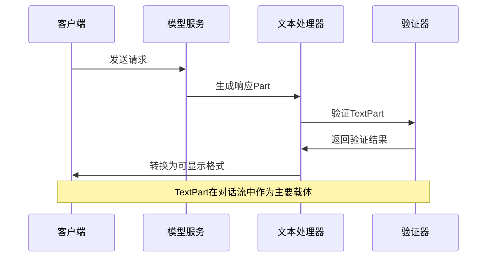
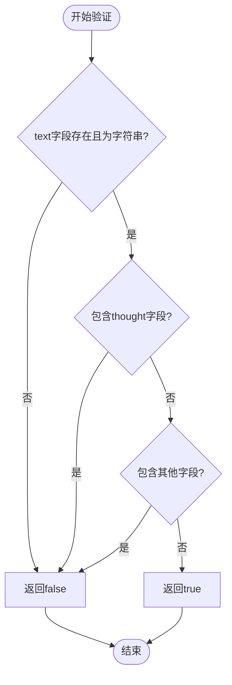

# MCP协议中TextPart消息类型详细说明

<cite>
**本文档引用的文件**
- [partUtils.ts](file://packages/core/src/utils/partUtils.ts)
- [generateContentResponseUtilities.ts](file://packages/core/src/utils/generateContentResponseUtilities.ts)
- [geminiChat.ts](file://packages/core/src/core/geminiChat.ts)
- [converter.ts](file://packages/core/src/code_assist/converter.ts)
- [mcp-tool.ts](file://packages/core/src/tools/mcp-tool.ts)
- [mcp-client.ts](file://packages/core/src/tools/mcp-client.ts)
</cite>

## 目录
1. [简介](#简介)
2. [TextPart消息类型结构定义](#textpart消息类型结构定义)
3. [语义含义与设计原理](#语义含义与设计原理)
4. [核心工具函数详解](#核心工具函数详解)
5. [验证机制](#验证机制)
6. [实际应用示例](#实际应用示例)
7. [性能优化建议](#性能优化建议)
8. [故障排除指南](#故障排除指南)
9. [总结](#总结)

## 简介

MCP（Model Context Protocol）协议中的TextPart消息类型是对话系统中最基础且最重要的数据结构之一。它作为主要的文本载体，在模型与客户端之间的通信中发挥着核心作用。本文档将深入探讨TextPart的消息类型定义、语义含义、验证机制以及在实际应用中的最佳实践。

## TextPart消息类型结构定义

### 基本结构

TextPart消息类型基于Google GenAI SDK的标准Part接口，具有以下核心属性：

```typescript
interface TextPart {
  text: string;
  thought?: string;
  functionCall?: FunctionCall;
  functionResponse?: FunctionResponse;
  inlineData?: InlineData;
  fileData?: FileData;
}
```

### 数据结构层次

```mermaid
classDiagram
class Part {
+string text
+string thought
+FunctionCall functionCall
+FunctionResponse functionResponse
+InlineData inlineData
+FileData fileData
}
class TextPart {
+string text
+validateTextPart() boolean
+toString() string
}
class PartUnion {
<<union>>
+string
+Part
}
class PartListUnion {
<<union>>
+string
+Part
+Part[]
}
Part <|-- TextPart
PartUnion <|-- Part
PartUnion <|-- string
PartListUnion <|-- Part
PartListUnion <|-- string
PartListUnion <|-- Part[]
```

**图表来源**
- [partUtils.ts](file://packages/core/src/utils/partUtils.ts#L1-L20)
- [converter.ts](file://packages/core/src/code_assist/converter.ts#L212-L253)

**章节来源**
- [partUtils.ts](file://packages/core/src/utils/partUtils.ts#L1-L170)
- [converter.ts](file://packages/core/src/code_assist/converter.ts#L212-L253)

## 语义含义与设计原理

### 主要文本载体设计

TextPart的核心设计理念是作为对话系统中的主要文本传输单元。它的text字段承载着模型生成的主要内容，确保了：

1. **语义完整性**：保持原始文本的语义信息不被破坏
2. **格式保留**：支持各种文本格式（Markdown、代码块等）
3. **多语言支持**：兼容Unicode字符集
4. **可扩展性**：为未来功能预留空间

### 在对话流中的作用



**图表来源**
- [geminiChat.ts](file://packages/core/src/core/geminiChat.ts#L51-L95)
- [partUtils.ts](file://packages/core/src/utils/partUtils.ts#L53-L89)

## 核心工具函数详解

### appendToLastTextPart函数

该函数负责向对话历史的最后一个TextPart追加文本内容：

```typescript
export function appendToLastTextPart(
  prompt: PartUnion[],
  textToAppend: string,
  separator = '\n\n',
): PartUnion[] {
  if (!textToAppend) {
    return prompt;
  }

  if (prompt.length === 0) {
    return [{ text: textToAppend }];
  }

  const newPrompt = [...prompt];
  const lastPart = newPrompt.at(-1);

  if (typeof lastPart === 'string') {
    newPrompt[newPrompt.length - 1] = `${lastPart}${separator}${textToAppend}`;
  } else if (lastPart && 'text' in lastPart) {
    newPrompt[newPrompt.length - 1] = {
      ...lastPart,
      text: `${lastPart.text}${separator}${textToAppend}`,
    };
  } else {
    newPrompt.push({ text: `${separator}${textToAppend}` });
  }

  return newPrompt;
}
```

**设计特点**：
- 支持多种输入格式（字符串、Part对象、数组）
- 自动处理分隔符添加
- 保持原有Part对象的其他属性不变

### flatMapTextParts函数

该函数用于对TextPart进行异步转换处理：

```typescript
export async function flatMapTextParts(
  parts: PartListUnion,
  transform: (text: string) => Promise<PartUnion[]>,
): Promise<PartUnion[]> {
  const result: PartUnion[] = [];
  const partArray = Array.isArray(parts)
    ? parts
    : typeof parts === 'string'
      ? [{ text: parts }]
      : [parts];

  for (const part of partArray) {
    let textToProcess: string | undefined;
    if (typeof part === 'string') {
      textToProcess = part;
    } else if ('text' in part) {
      textToProcess = part.text;
    }

    if (textToProcess !== undefined) {
      const transformedParts = await transform(textToProcess);
      result.push(...transformedParts);
    } else {
      // 保持非文本部分不变
      result.push(part);
    }
  }
  return result;
}
```

**处理逻辑**：
1. 将输入统一转换为Part数组格式
2. 过滤出所有包含text字段的Part
3. 对每个text字段执行异步转换
4. 保持非文本Part原样返回

**章节来源**
- [partUtils.ts](file://packages/core/src/utils/partUtils.ts#L89-L170)

## 验证机制

### isValidNonThoughtTextPart函数

该函数专门用于验证非思维模式的TextPart的有效性：

```typescript
export function isValidNonThoughtTextPart(part: Part): boolean {
  return (
    typeof part.text === 'string' &&
    !part.thought &&
    // 技术上，模型不应该生成同时包含text和其他字段的部分
    // 但我们不信任它们，所以还是要检查
    !part.functionCall &&
    !part.functionResponse &&
    !part.inlineData &&
    !part.fileData
  );
}
```

**验证规则**：
1. **必需字段检查**：确保text字段存在且为字符串类型
2. **排除思维字段**：排除包含thought字段的Part
3. **互斥性验证**：确保TextPart不与其他类型Part混用
4. **数据完整性**：验证所有必要字段都符合预期格式

### 验证流程图



**图表来源**
- [geminiChat.ts](file://packages/core/src/core/geminiChat.ts#L85-L95)

**章节来源**
- [geminiChat.ts](file://packages/core/src/core/geminiChat.ts#L85-L95)

## 实际应用示例

### 响应解析最佳实践

使用getResponseTextFromParts函数提取纯文本内容：

```typescript
import { getResponseTextFromParts } from './generateContentResponseUtilities';

// 示例：从MCP响应中提取文本内容
async function processMcpResponse(parts: Part[]): Promise<string> {
  // 提取文本段落
  const textSegments = parts
    .map((part) => part.text)
    .filter((text): text is string => typeof text === 'string');

  if (textSegments.length === 0) {
    return '';
  }
  
  return textSegments.join('');
}
```

### 编码处理策略

```typescript
// 处理不同类型的Part内容
function processPartContent(part: Part): string {
  if (part.text) {
    // 处理标准文本
    return part.text;
  }
  
  if (part.functionCall) {
    // 处理函数调用
    return `[函数调用: ${part.functionCall.name}]`;
  }
  
  if (part.inlineData) {
    // 处理内联数据
    return `[数据: ${part.inlineData.mimeType}]`;
  }
  
  return ''; // 默认情况
}
```

### 空值过滤机制

```typescript
// 安全的文本提取函数
function safeGetText(parts: Part[]): string {
  if (!parts || parts.length === 0) {
    return '';
  }
  
  return parts
    .map(part => part.text || '')
    .filter(text => text.trim().length > 0)
    .join('\n');
}
```

**章节来源**
- [generateContentResponseUtilities.ts](file://packages/core/src/utils/generateContentResponseUtilities.ts#L1-L50)

## 性能优化建议

### 内存管理优化

1. **及时释放大型文本**：对于超长文本，考虑使用流式处理
2. **缓存策略**：对频繁访问的文本片段建立缓存
3. **垃圾回收**：定期清理不再使用的Part对象引用

### 处理效率提升

```typescript
// 批量处理优化
async function batchProcessTextParts(
  parts: Part[],
  batchSize: number = 100
): Promise<Part[]> {
  const results: Part[] = [];
  
  for (let i = 0; i < parts.length; i += batchSize) {
    const batch = parts.slice(i, i + batchSize);
    const processedBatch = await Promise.all(
      batch.map(async part => {
        if (part.text) {
          return await processTextAsync(part.text);
        }
        return part;
      })
    );
    results.push(...processedBatch);
  }
  
  return results;
}
```

### 并发处理策略

```typescript
// 并行处理多个TextPart
async function parallelProcessTextParts(parts: Part[]): Promise<Part[]> {
  return Promise.all(
    parts.map(async part => {
      if (part.text) {
        // 并行执行文本处理任务
        const [processedText, validated] = await Promise.all([
          processTextAsync(part.text),
          validateTextAsync(part.text)
        ]);
        
        return { ...part, text: processedText };
      }
      return part;
    })
  );
}
```

## 故障排除指南

### 常见问题诊断

1. **文本为空或undefined**
   ```typescript
   // 问题检测
   function diagnoseEmptyText(part: Part): string {
     if (!part.text) {
       return '文本字段缺失或为空';
     }
     if (typeof part.text !== 'string') {
       return '文本字段类型错误';
     }
     return '文本字段正常';
   }
   ```

2. **编码问题**
   ```typescript
   // 编码验证
   function validateEncoding(text: string): boolean {
     try {
       // 尝试UTF-8解码
       const encoder = new TextEncoder();
       const decoder = new TextDecoder('utf-8', { fatal: true });
       const encoded = encoder.encode(text);
       decoder.decode(encoded);
       return true;
     } catch (error) {
       console.error('编码错误:', error);
       return false;
     }
   }
   ```

3. **内存泄漏预防**
   ```typescript
   // 内存监控
   function monitorMemoryUsage(): void {
     if ('memory' in performance) {
       const memInfo = (performance as any).memory;
       console.log(`已使用内存: ${memInfo.usedJSHeapSize / 1024 / 1024} MB`);
     }
   }
   ```

### 错误恢复机制

```typescript
// 安全的Part处理
async function safeProcessPart(part: Part): Promise<Part> {
  try {
    if (part.text) {
      const processed = await processTextAsync(part.text);
      return { ...part, text: processed };
    }
    return part;
  } catch (error) {
    console.warn('处理Part失败，使用原始内容:', error);
    return part;
  }
}
```

**章节来源**
- [partUtils.ts](file://packages/core/src/utils/partUtils.ts#L53-L89)

## 总结

MCP协议中的TextPart消息类型是一个精心设计的数据结构，它不仅承载着对话系统中的主要文本内容，还通过完善的验证机制和工具函数确保了系统的稳定性和可靠性。通过合理使用提供的工具函数和遵循最佳实践，开发者可以构建高效、稳定的对话应用程序。

关键要点包括：
- **结构清晰**：明确的字段定义和类型约束
- **验证严格**：多层次的验证机制确保数据质量
- **工具丰富**：提供了完整的文本处理工具链
- **性能优化**：支持批量处理和并发操作
- **错误处理**：完善的异常处理和恢复机制

这些特性使得TextPart成为MCP协议中不可或缺的核心组件，为构建现代化的AI对话系统奠定了坚实的基础。