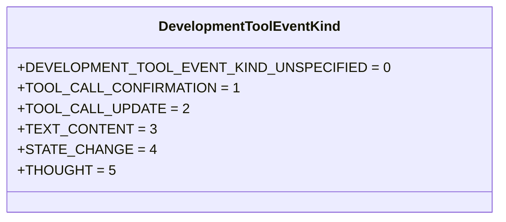
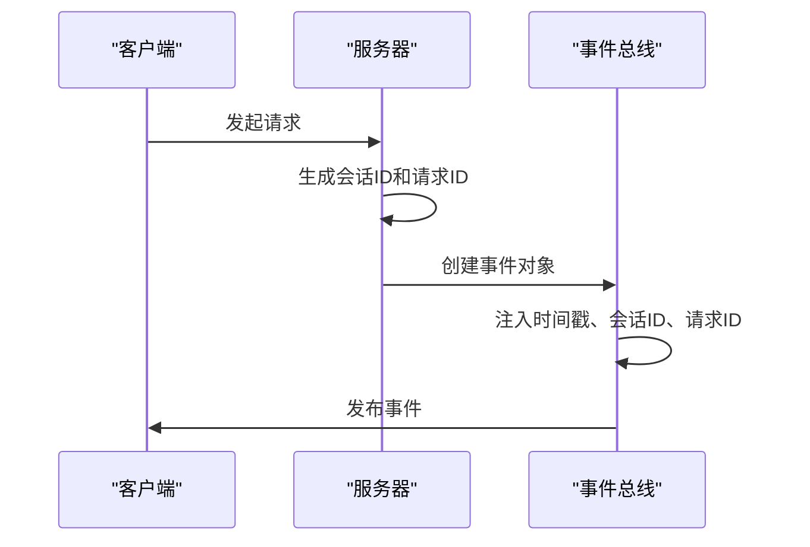
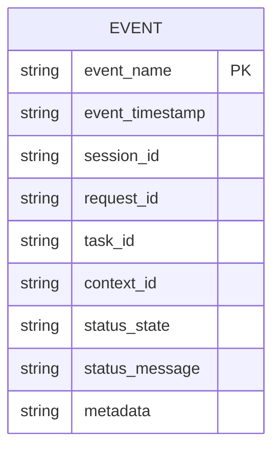

# 事件消息封装机制

<cite>
**本文档中引用的文件**  
- [task.ts](file://packages/a2a-server/src/agent/task.ts)
- [development-extension-rfc.md](file://packages/a2a-server/development-extension-rfc.md)
- [types.ts](file://packages/core/src/telemetry/types.ts)
- [schemaValidator.ts](file://packages/core/src/utils/schemaValidator.ts)
- [schema-utils.ts](file://packages/core/src/agents/schema-utils.ts)
</cite>

## 目录
1. [引言](#引言)
2. [事件对象封装机制](#事件对象封装机制)
3. [开发工具事件类型枚举](#开发工具事件类型枚举)
4. [事件元数据注入机制](#事件元数据注入机制)
5. [事件序列化与JSON Schema](#事件序列化与json-schema)
6. [版本控制与向后兼容性](#版本控制与向后兼容性)
7. [结论](#结论)

## 引言
本文档详细阐述了TaskStatusUpdateEvent等事件对象如何封装MCP消息以实现状态同步，解释DevelopmentToolEventKind枚举类型在指导客户端路由和解析不同事件类型中的核心作用，描述事件元数据（如时间戳、会话ID、请求ID）的注入机制及其在分布式追踪中的应用，并提供事件序列化的JSON Schema定义，说明版本控制策略和向后兼容性保障措施，确保跨版本系统间的平稳通信。

## 事件对象封装机制

事件对象封装机制通过TaskStatusUpdateEvent实现MCP消息的状态同步。该机制在任务状态变更时创建状态更新事件，并通过事件总线发布，确保客户端能够实时获取任务状态变化。事件对象包含任务ID、上下文ID、状态信息、时间戳等关键属性，形成完整的状态同步消息。

**Section sources**
- [task.ts](file://packages/a2a-server/src/agent/task.ts#L234-L285)

## 开发工具事件类型枚举

DevelopmentToolEventKind枚举类型在指导客户端路由和解析不同事件类型中起着核心作用。该枚举定义了多种事件类型，包括工具调用确认、工具调用更新、文本内容、状态变更和思考过程等，使客户端能够根据事件类型进行相应的处理和路由。

**Diagram sources**
- [development-extension-rfc.md](file://packages/a2a-server/development-extension-rfc.md#L244-L284)

## 事件元数据注入机制

事件元数据注入机制负责在事件对象中注入时间戳、会话ID、请求ID等关键信息，这些元数据在分布式追踪中发挥重要作用。时间戳用于记录事件发生的具体时间，会话ID用于关联同一会话中的多个事件，请求ID用于追踪特定请求的完整处理流程。

**Diagram sources**
- [types.ts](file://packages/core/src/telemetry/types.ts#L91-L141)

## 事件序列化与JSON Schema

事件序列化采用JSON Schema定义，确保事件数据的结构化和标准化。JSON Schema定义了事件对象的属性类型、必填字段和数据格式，通过schemaValidator进行验证，保证事件数据的完整性和正确性。

**Diagram sources**
- [schemaValidator.ts](file://packages/core/src/utils/schemaValidator.ts#L0-L25)
- [schema-utils.ts](file://packages/core/src/agents/schema-utils.ts#L0-L90)

## 版本控制与向后兼容性

版本控制策略通过语义化版本号管理事件格式的变更，确保向后兼容性。当事件格式发生变更时，通过增加可选字段而非修改现有字段的方式，保证旧版本客户端仍能正确解析事件数据。同时，通过详细的文档记录和测试用例验证，确保跨版本系统间的平稳通信。

**Section sources**
- [development-extension-rfc.md](file://packages/a2a-server/development-extension-rfc.md#L244-L284)
- [schemaValidator.ts](file://packages/core/src/utils/schemaValidator.ts#L0-L25)

## 结论
本文档详细阐述了事件消息封装机制的各个方面，包括事件对象封装、开发工具事件类型枚举、事件元数据注入、事件序列化与JSON Schema以及版本控制与向后兼容性。这些机制共同确保了系统内部状态同步的可靠性和跨版本通信的平稳性，为构建稳定高效的分布式系统提供了坚实的基础。