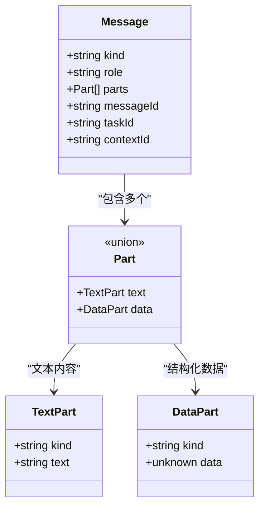
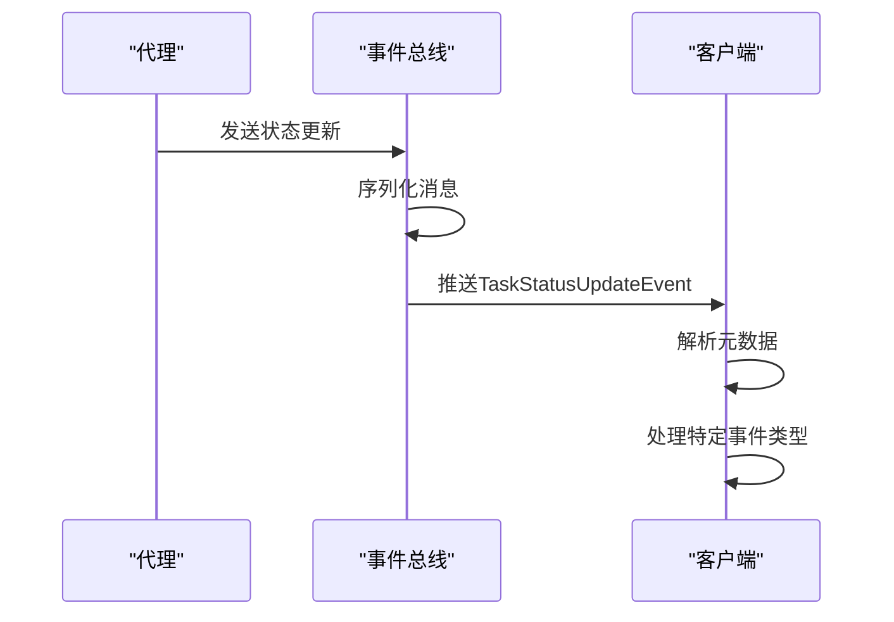
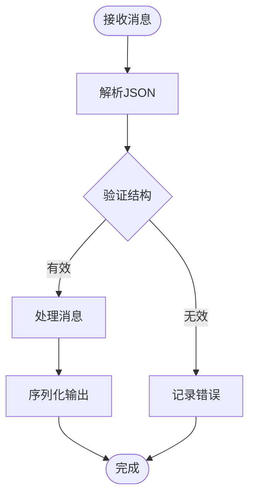
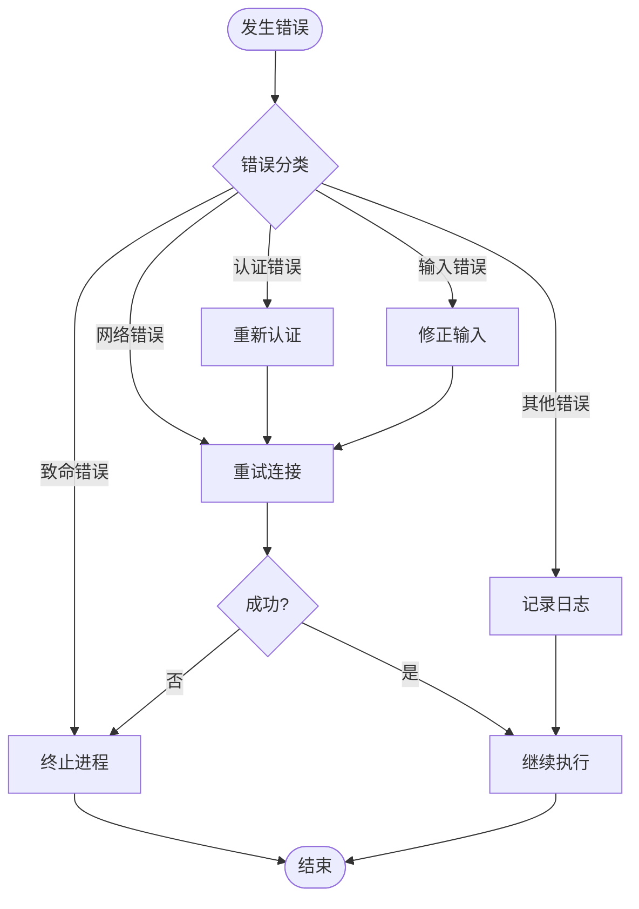
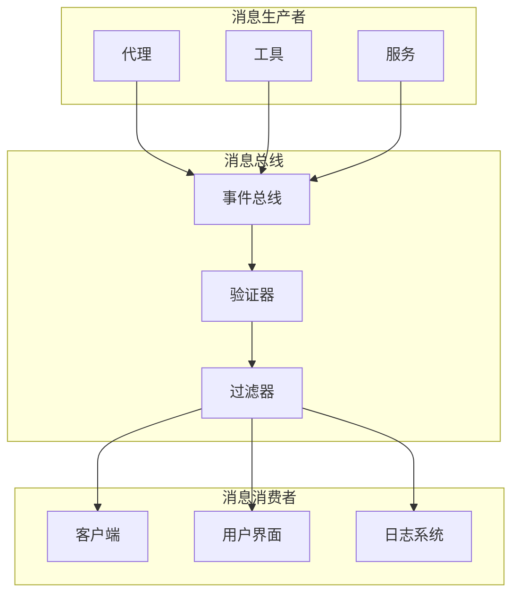

# 消息协议

<cite>
**本文档中引用的文件**
- [packages/a2a-server/src/types.ts](file://packages/a2a-server/src/types.ts)
- [packages/a2a-server/development-extension-rfc.md](file://packages/a2a-server/development-extension-rfc.md)
- [packages/core/src/confirmation-bus/message-bus.ts](file://packages/core/src/confirmation-bus/message-bus.ts)
- [packages/core/src/confirmation-bus/message-bus.test.ts](file://packages/core/src/confirmation-bus/message-bus.test.ts)
- [packages/core/src/utils/safeJsonStringify.ts](file://packages/core/src/utils/safeJsonStringify.ts)
- [packages/core/src/utils/errors.ts](file://packages/core/src/utils/errors.ts)
- [packages/core/src/tools/mcp-client.ts](file://packages/core/src/tools/mcp-client.ts)
- [packages/a2a-server/src/agent/task.ts](file://packages/a2a-server/src/agent/task.ts)
- [integration-tests/mcp_server_cyclic_schema.test.ts](file://integration-tests/mcp_server_cyclic_schema.test.ts)
</cite>

## 目录
1. [简介](#简介)
2. [核心消息类型](#核心消息类型)
3. [消息序列化与反序列化](#消息序列化与反序列化)
4. [错误处理策略](#错误处理策略)
5. [消息流架构](#消息流架构)
6. [最佳实践](#最佳实践)
7. [故障排除指南](#故障排除指南)
8. [总结](#总结)

## 简介

MCP（Model Context Protocol）协议定义了一套标准化的消息交换格式，用于在客户端和服务器之间进行通信。该协议支持多种消息类型，包括文本内容、数据部分、代理思考过程和状态更新等。本文档详细说明了消息协议的设计原则、实现细节和最佳实践。

## 核心消息类型

### TextPart 和 DataPart 数据结构

MCP协议支持两种主要的消息内容格式：TextPart和DataPart。



**图表来源**
- [packages/a2a-server/src/agent/task.ts](file://packages/a2a-server/src/agent/task.ts#L452-L497)

#### TextPart 特性
- **用途**：用于标准文本消息
- **结构简单**：仅包含文本内容
- **无需自定义模式**：直接使用字符串格式
- **适用场景**：简单的文本回复、提示信息等

#### DataPart 特性
- **用途**：用于复杂、结构化的对象
- **支持多种数据类型**：字符串、文件差异、结构化JSON数据
- **适用场景**：工具调用结果、代理思考过程、状态更新等

### AgentThought 消息结构

AgentThought消息通过subject和description字段传达代理的思维过程：

```typescript
interface AgentThought {
  // 思考的主题或标题
  subject: string;
  
  // 对思考内容的详细描述
  description: string;
}
```

**图表来源**
- [packages/a2a-server/development-extension-rfc.md](file://packages/a2a-server/development-extension-rfc.md#L275-L284)

#### Subject 字段的作用
- **简洁明了**：提供思考的核心主题
- **快速理解**：帮助用户快速把握代理的思路
- **分类标识**：便于客户端对不同类型的思考进行分类处理

#### Description 字段的作用
- **详细阐述**：提供思考的详细内容和背景信息
- **上下文补充**：为用户提供完整的思考上下文
- **决策依据**：展示代理做出决策的逻辑和依据

### TaskStatusUpdateEvent 封装方式

TaskStatusUpdateEvent是MCP协议中用于封装各种状态更新的核心机制：



**图表来源**
- [packages/a2a-server/src/agent/task.ts](file://packages/a2a-server/src/agent/task.ts#L234-L285)

### DevelopmentToolEventKind 枚举

DevelopmentToolEventKind枚举指导客户端正确解析消息：

```typescript
enum DevelopmentToolEventKind {
  DEVELOPMENT_TOOL_EVENT_KIND_UNSPECIFIED = 0,
  TOOL_CALL_CONFIRMATION = 1,
  TOOL_CALL_UPDATE = 2,
  TEXT_CONTENT = 3,
  STATE_CHANGE = 4,
  THOUGHT = 5,
}
```

**图表来源**
- [packages/a2a-server/development-extension-rfc.md](file://packages/a2a-server/development-extension-rfc.md#L255-L265)

## 消息序列化与反序列化

### 序列化最佳实践

MCP协议采用JSON格式进行消息序列化，确保跨平台兼容性和可读性：

```typescript
// 安全的JSON序列化函数
export function safeJsonStringify(
  obj: unknown,
  space?: string | number,
): string {
  const seen = new WeakSet();
  return JSON.stringify(
    obj,
    (key, value) => {
      if (typeof value === 'object' && value !== null) {
        if (seen.has(value)) {
          return '[Circular]';
        }
        seen.add(value);
      }
      return value;
    },
    space,
  );
}
```

**图表来源**
- [packages/core/src/utils/safeJsonStringify.ts](file://packages/core/src/utils/safeJsonStringify.ts#L10-L32)

#### 序列化特性
- **循环引用检测**：自动检测并处理循环引用
- **安全处理**：防止内存泄漏和无限递归
- **格式化选项**：支持缩进和空格控制
- **类型安全**：保持原始数据类型信息

### 反序列化处理



**图表来源**
- [packages/core/src/confirmation-bus/message-bus.ts](file://packages/core/src/confirmation-bus/message-bus.ts#L25-L45)

## 错误处理策略

### 错误类型分类

MCP协议定义了多种错误类型以提供详细的错误信息：

```typescript
// 基础错误类
export class FatalError extends Error {
  constructor(
    message: string,
    readonly exitCode: number,
  ) {
    super(message);
  }
}

// 特定错误类型
export class FatalAuthenticationError extends FatalError {
  constructor(message: string) {
    super(message, 41);
  }
}

export class FatalInputError extends FatalError {
  constructor(message: string) {
    super(message, 42);
  }
}

export class BadRequestError extends Error {}
export class UnauthorizedError extends Error {}
export class ForbiddenError extends Error {}
```

**图表来源**
- [packages/core/src/utils/errors.ts](file://packages/core/src/utils/errors.ts#L20-L70)

### 消息总线错误处理

```typescript
// 消息总线的错误处理机制
private emitMessage(message: Message): void {
  this.emit(message.type, message);
}

publish(message: Message): void {
  try {
    if (!this.isValidMessage(message)) {
      throw new Error(
        `Invalid message structure: ${safeJsonStringify(message)}`,
      );
    }
    
    // 处理特定类型的消息
    if (message.type === MessageBusType.TOOL_CONFIRMATION_REQUEST) {
      const decision = this.policyEngine.check(message.toolCall);
      // ...
    }
    
    this.emitMessage(message);
  } catch (error) {
    // 记录错误但不中断流程
    this.emit('error', error);
  }
}
```

**图表来源**
- [packages/core/src/confirmation-bus/message-bus.ts](file://packages/core/src/confirmation-bus/message-bus.ts#L25-L45)

### 错误恢复策略



**图表来源**
- [packages/core/src/utils/errors.ts](file://packages/core/src/utils/errors.ts#L70-L112)

## 消息流架构

### 事件驱动的消息传递

MCP协议采用事件驱动的架构，通过消息总线实现松耦合的组件通信：



**图表来源**
- [packages/core/src/confirmation-bus/message-bus.ts](file://packages/core/src/confirmation-bus/message-bus.ts#L10-L45)

### 消息生命周期管理

```typescript
// 任务状态更新事件的创建和发布
private _createStatusUpdateEvent(
  stateToReport: TaskState,
  coderAgentMessage: CoderAgentMessage,
  message?: Message,
  final = false,
  timestamp?: string,
  metadataError?: string,
): TaskStatusUpdateEvent {
  const metadata: {
    coderAgent: CoderAgentMessage;
    model: string;
    userTier?: UserTierId;
    error?: string;
  } = {
    coderAgent: coderAgentMessage,
    model: this.config.getModel(),
    userTier: this.config.getUserTier(),
  };

  if (metadataError) {
    metadata.error = metadataError;
  }

  return {
    kind: 'status-update',
    taskId: this.id,
    contextId: this.contextId,
    status: {
      state: stateToReport,
      message, // 缩写属性
      timestamp: timestamp || new Date().toISOString(),
    },
    final,
    metadata,
  };
}
```

**图表来源**
- [packages/a2a-server/src/agent/task.ts](file://packages/a2a-server/src/agent/task.ts#L200-L236)

## 最佳实践

### 消息设计原则

1. **单一职责**：每个消息只负责一个明确的功能
2. **向后兼容**：新版本应保持与旧版本的兼容性
3. **错误容错**：具备良好的错误处理和恢复能力
4. **性能优化**：避免不必要的数据传输和计算

### 实现建议

```typescript
// 推荐的消息验证模式
private isValidMessage(message: Message): boolean {
  if (!message || !message.type) {
    return false;
  }

  if (
    message.type === MessageBusType.TOOL_CONFIRMATION_REQUEST &&
    !('correlationId' in message)
  ) {
    return false;
  }

  return true;
}

// 推荐的错误处理模式
try {
  // 执行业务逻辑
  const result = await processMessage(message);
  return result;
} catch (error) {
  // 记录详细错误信息
  logger.error('Message processing failed:', {
    error: getErrorMessage(error),
    messageType: message.type,
    messageId: message.id,
  });
  
  // 返回友好的错误响应
  return createErrorResponse(error);
}
```

### 性能优化策略

- **批量处理**：合并多个小消息为单个大消息
- **压缩传输**：对大型消息进行压缩
- **缓存机制**：缓存频繁访问的数据
- **异步处理**：使用异步操作避免阻塞

## 故障排除指南

### 常见问题诊断

#### 消息格式错误
```typescript
// 问题：消息结构不符合预期
// 解决方案：添加验证和转换逻辑
function validateAndFixMessage(message: unknown): Message | null {
  if (!isValidStructure(message)) {
    console.warn('Invalid message structure:', message);
    return convertToValidFormat(message);
  }
  return message as Message;
}
```

#### 连接超时问题
```typescript
// 问题：网络连接不稳定
// 解决方案：实现重连机制
async function reconnectWithBackoff(retries: number = 3): Promise<void> {
  for (let i = 0; i < retries; i++) {
    try {
      await establishConnection();
      return;
    } catch (error) {
      const delay = Math.pow(2, i) * 1000; // 指数退避
      await sleep(delay);
    }
  }
  throw new Error('Max retries exceeded');
}
```

#### 内存泄漏防护
```typescript
// 问题：长时间运行导致内存泄漏
// 解决方案：定期清理资源
setInterval(() => {
  // 清理过期的消息
  messageCache.cleanupExpired();
  
  // 释放未使用的连接
  connectionPool.releaseUnused();
  
  // 监控内存使用
  const memUsage = process.memoryUsage();
  if (memUsage.heapUsed > MAX_MEMORY_USAGE) {
    triggerGC();
  }
}, CLEANUP_INTERVAL);
```

### 调试技巧

1. **启用调试模式**：设置环境变量开启详细日志
2. **消息追踪**：记录所有消息的完整生命周期
3. **性能监控**：监控消息处理时间和吞吐量
4. **错误统计**：收集和分析错误类型和频率

**章节来源**
- [packages/core/src/utils/errors.ts](file://packages/core/src/utils/errors.ts#L1-L113)
- [packages/core/src/confirmation-bus/message-bus.ts](file://packages/core/src/confirmation-bus/message-bus.ts#L1-L45)
- [packages/core/src/utils/safeJsonStringify.ts](file://packages/core/src/utils/safeJsonStringify.ts#L1-L33)

## 总结

MCP协议的消息交换格式设计遵循了现代软件架构的最佳实践，提供了：

- **灵活的消息类型**：支持文本和结构化数据
- **强大的错误处理**：多层次的错误分类和恢复机制
- **高效的序列化**：安全且高性能的JSON处理
- **可靠的事件驱动架构**：松耦合的组件通信

通过遵循本文档提供的最佳实践和故障排除指南，开发者可以构建稳定、高效且易于维护的MCP协议实现。未来的版本将继续演进，以适应不断变化的需求和技术发展。