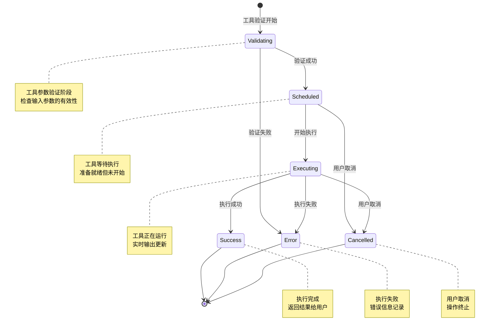
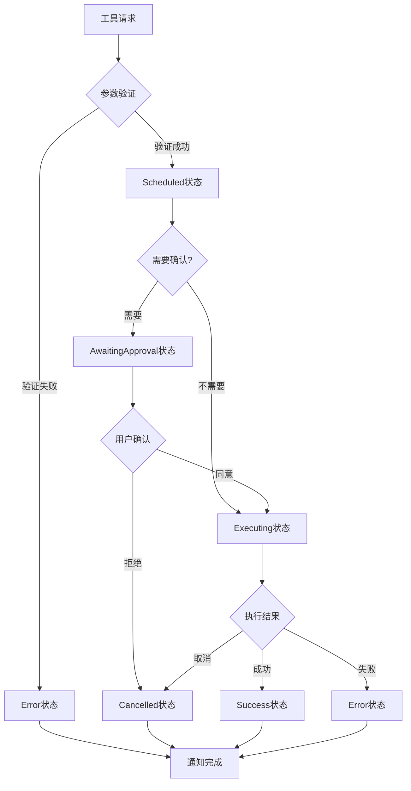
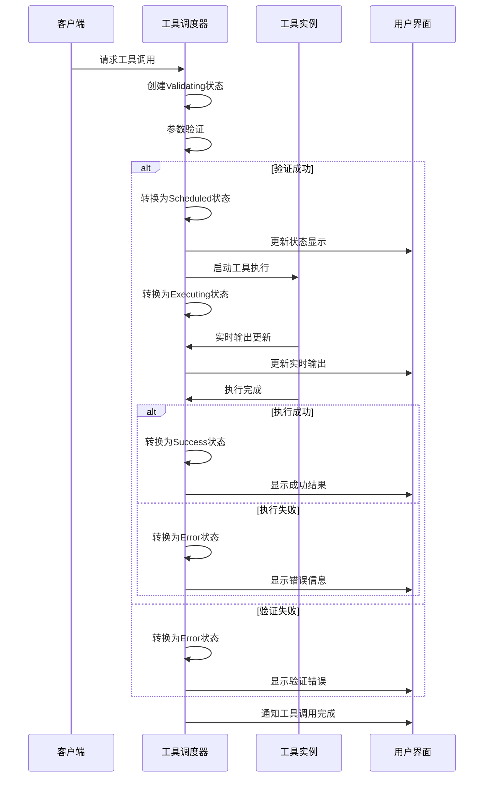
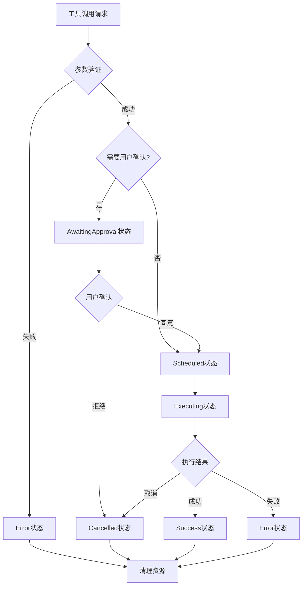
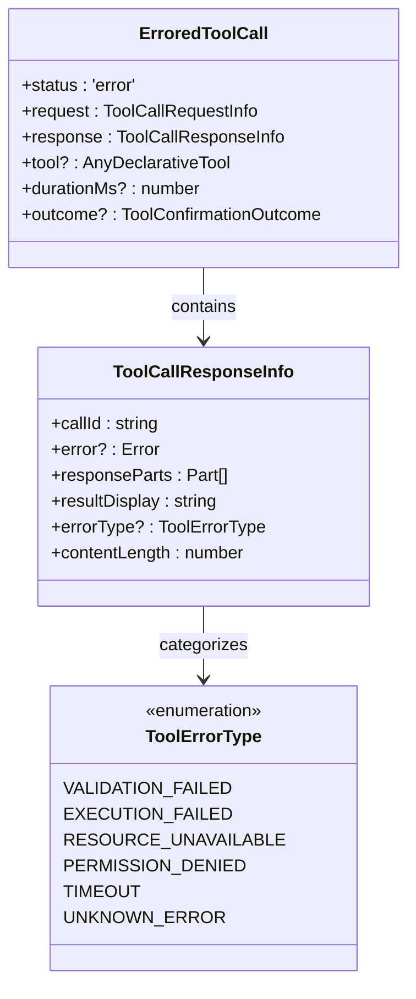

# ToolCall状态机：状态定义与转换机制

<cite>
**本文档引用的文件**
- [development-extension-rfc.md](file://packages/a2a-server/development-extension-rfc.md)
- [coreToolScheduler.ts](file://packages/core/src/core/coreToolScheduler.ts)
- [useReactToolScheduler.ts](file://packages/cli/src/ui/hooks/useReactToolScheduler.ts)
- [constants.ts](file://packages/cli/src/ui/constants.ts)
- [types.ts](file://packages/cli/src/ui/types.ts)
- [coreToolScheduler.test.ts](file://packages/core/src/core/coreToolScheduler.test.ts)
</cite>

## 目录
1. [简介](#简介)
2. [状态机架构概览](#状态机架构概览)
3. [核心状态定义](#核心状态定义)
4. [状态转换机制](#状态转换机制)
5. [状态映射与UI显示](#状态映射与ui显示)
6. [状态转换流程图](#状态转换流程图)
7. [实际代码示例](#实际代码示例)
8. [错误处理与异常状态](#错误处理与异常状态)
9. [性能考虑](#性能考虑)
10. [故障排除指南](#故障排除指南)
11. [总结](#总结)

## 简介

ToolCall状态机是Gemini CLI系统中负责管理工具调用生命周期的核心组件。该状态机定义了工具从请求到完成的完整生命周期，并通过四个主要状态（PENDING、EXECUTING、SUCCEEDED/FAILED）来精确跟踪每个工具调用的执行过程。

本文档基于development-extension-rfc.md中的ToolCallStatus枚举和coreToolScheduler.ts中的ToolCall联合类型，深入分析各个状态的语义、数据结构特征和触发条件，为开发者提供全面的技术参考。

## 状态机架构概览

ToolCall状态机采用有限状态自动机（Finite State Machine）的设计模式，确保工具调用的生命周期管理具有确定性和可预测性。



**图表来源**
- [coreToolScheduler.ts](file://packages/core/src/core/coreToolScheduler.ts#L356-L523)
- [development-extension-rfc.md](file://packages/a2a-server/development-extension-rfc.md#L200-L220)

## 核心状态定义

### 1. Validating状态（验证中）

**语义描述**：
Validating状态表示工具调用正在进行参数验证和预检查的过程。在这个阶段，系统会验证传入的参数是否符合工具的预期格式和约束条件。

**数据结构特征**：
```typescript
export type ValidatingToolCall = {
  status: 'validating';
  request: ToolCallRequestInfo;
  tool: AnyDeclarativeTool;
  invocation: AnyToolInvocation;
  startTime?: number;
  outcome?: ToolConfirmationOutcome;
};
```

**触发条件**：
- 工具被调度但尚未开始执行
- 参数验证阶段启动
- 系统需要确认工具的可用性和参数有效性

**状态特性**：
- 临时状态，持续时间较短
- 不包含工具实例（仅在后续状态中添加）
- 可能直接跳转到Scheduled或Error状态

### 2. Scheduled状态（已调度）

**语义描述**：
Scheduled状态表示工具已经准备好执行，但尚未开始实际的执行过程。此时工具处于等待队列中，等待获得执行资源。

**数据结构特征**：
```typescript
export type ScheduledToolCall = {
  status: 'scheduled';
  request: ToolCallRequestInfo;
  tool: AnyDeclarativeTool;
  invocation: AnyToolInvocation;
  startTime?: number;
  outcome?: ToolConfirmationOutcome;
};
```

**触发条件**：
- Validating状态验证成功
- 工具参数完全有效且符合要求
- 系统资源可用，可以开始执行

**状态特性**：
- 表示工具已准备好但未开始执行
- 包含完整的工具实例信息
- 可能直接进入Executing状态或被取消

### 3. Executing状态（执行中）

**语义描述**：
Executing状态表示工具正在实际执行过程中。这是工具调用生命周期中最活跃的阶段，可能会产生实时输出和进度更新。

**数据结构特征**：
```typescript
export type ExecutingToolCall = {
  status: 'executing';
  request: ToolCallRequestInfo;
  tool: AnyDeclarativeTool;
  invocation: AnyToolInvocation;
  liveOutput?: string | AnsiOutput;
  startTime?: number;
  outcome?: ToolConfirmationOutcome;
  pid?: number;
};
```

**触发条件**：
- Scheduled状态的工具开始执行
- 获得必要的系统资源和权限
- 开始实际的业务逻辑处理

**状态特性**：
- 可能产生实时输出（liveOutput）
- 支持进程ID追踪（pid）
- 可能包含ANSI颜色输出
- 可能被用户或系统取消

### 4. Success状态（成功）

**语义描述**：
Success状态表示工具执行成功完成，返回了预期的结果。这是工具调用的正常完成状态。

**数据结构特征**：
```typescript
export type SuccessfulToolCall = {
  status: 'success';
  request: ToolCallRequestInfo;
  tool: AnyDeclarativeTool;
  response: ToolCallResponseInfo;
  invocation: AnyToolInvocation;
  durationMs?: number;
  outcome?: ToolConfirmationOutcome;
};
```

**触发条件**：
- Executing状态的工具成功完成
- 所有业务逻辑执行完毕且无错误
- 结果符合预期并返回给调用者

**状态特性**：
- 包含完整的响应信息
- 记录执行时长（durationMs）
- 包含结果展示文本（resultDisplay）
- 不再接收新的输出更新

### 5. Error状态（错误）

**语义描述**：
Error状态表示工具执行过程中发生错误，无法正常完成。系统会记录错误信息并提供错误详情。

**数据结构特征**：
```typescript
export type ErroredToolCall = {
  status: 'error';
  request: ToolCallRequestInfo;
  response: ToolCallResponseInfo;
  tool?: AnyDeclarativeTool;
  durationMs?: number;
  outcome?: ToolConfirmationOutcome;
};
```

**触发条件**：
- Executing状态的工具遇到不可恢复的错误
- 系统资源不足导致执行失败
- 工具本身逻辑错误或异常

**状态特性**：
- 包含详细的错误信息
- 可能包含错误类型标识
- 记录执行时长
- 提供错误恢复建议

### 6. Cancelled状态（已取消）

**语义描述**：
Cancelled状态表示工具执行被用户或系统主动取消。这可能是由于用户干预、超时或其他系统策略。

**数据结构特征**：
```typescript
export type CancelledToolCall = {
  status: 'cancelled';
  request: ToolCallRequestInfo;
  response: ToolCallResponseInfo;
  tool: AnyDeclarativeTool;
  invocation: AnyToolInvocation;
  durationMs?: number;
  outcome?: ToolConfirmationOutcome;
};
```

**触发条件**：
- 用户主动取消工具执行
- 执行超时或资源限制
- 系统策略强制取消

**状态特性**：
- 包含取消原因说明
- 记录执行时长
- 可能包含部分执行结果
- 清理相关资源

**章节来源**
- [coreToolScheduler.ts](file://packages/core/src/core/coreToolScheduler.ts#L35-L100)
- [development-extension-rfc.md](file://packages/a2a-server/development-extension-rfc.md#L200-L220)

## 状态转换机制

### 内部状态转换逻辑

状态转换由`setStatusInternal`方法控制，该方法实现了状态机的核心逻辑：

```typescript
private setStatusInternal(
  targetCallId: string,
  newStatus: Status,
  auxiliaryData?: unknown,
): void {
  this.toolCalls = this.toolCalls.map((currentCall) => {
    if (
      currentCall.request.callId !== targetCallId ||
      currentCall.status === 'success' ||
      currentCall.status === 'error' ||
      currentCall.status === 'cancelled'
    ) {
      return currentCall;
    }
    
    // 状态转换逻辑...
  });
}
```

### 转换规则

1. **非终端状态转换**：
   - Validating → Scheduled：验证成功
   - Scheduled → Executing：开始执行
   - Executing → Success/Error/Cancelled：执行完成

2. **终端状态**：
   - Success、Error、Cancelled状态不可逆向转换
   - 这些状态标志着工具调用生命周期的结束

3. **取消处理**：
   - 任何非终端状态都可以被转换为Cancelled状态
   - Cancelled状态会清理相关资源

### 状态转换触发器



**图表来源**
- [coreToolScheduler.ts](file://packages/core/src/core/coreToolScheduler.ts#L356-L523)

**章节来源**
- [coreToolScheduler.ts](file://packages/core/src/core/coreToolScheduler.ts#L356-L523)

## 状态映射与UI显示

### Core状态到UI状态的映射

UI层使用不同的状态枚举，需要通过映射函数进行转换：

```typescript
function mapCoreStatusToDisplayStatus(coreStatus: CoreStatus): ToolCallStatus {
  switch (coreStatus) {
    case 'validating':
      return ToolCallStatus.Executing;  // 映射为执行中
    case 'awaiting_approval':
      return ToolCallStatus.Confirming;  // 映射为确认中
    case 'executing':
      return ToolCallStatus.Executing;   // 映射为执行中
    case 'success':
      return ToolCallStatus.Success;     // 映射为成功
    case 'cancelled':
      return ToolCallStatus.Canceled;    // 映射为已取消
    case 'error':
      return ToolCallStatus.Error;       // 映射为错误
    case 'scheduled':
      return ToolCallStatus.Pending;     // 映射为待处理
    default: {
      const exhaustiveCheck: never = coreStatus;
      console.warn(`Unknown core status encountered: ${exhaustiveCheck}`);
      return ToolCallStatus.Error;
    }
  }
}
```

### UI状态符号表示

UI界面使用特定的字符来表示不同状态：

```typescript
export const TOOL_STATUS = {
  SUCCESS: '✓',      // 成功状态
  PENDING: 'o',      // 待处理状态
  EXECUTING: '⊷',    // 执行中状态
  CONFIRMING: '?',   // 等待确认状态
  CANCELED: '-',     // 已取消状态
  ERROR: 'x',        // 错误状态
} as const;
```

### 状态映射关系表

| Core状态 | UI状态 | 符号 | 描述 |
|----------|--------|------|------|
| validating | Executing | ⊶ | 正在验证参数 |
| scheduled | Pending | o | 已调度等待执行 |
| executing | Executing | ⊶ | 正在执行中 |
| awaiting_approval | Confirming | ? | 等待用户确认 |
| success | Success | ✓ | 执行成功 |
| error | Error | x | 执行出错 |
| cancelled | Canceled | - | 操作已取消 |

**章节来源**
- [useReactToolScheduler.ts](file://packages/cli/src/ui/hooks/useReactToolScheduler.ts#L180-L200)
- [constants.ts](file://packages/cli/src/ui/constants.ts#L23-L29)

## 状态转换流程图

### 完整状态转换图



**图表来源**
- [coreToolScheduler.ts](file://packages/core/src/core/coreToolScheduler.ts#L356-L523)
- [useReactToolScheduler.ts](file://packages/cli/src/ui/hooks/useReactToolScheduler.ts#L200-L240)

### 条件分支状态转换



**图表来源**
- [coreToolScheduler.ts](file://packages/core/src/core/coreToolScheduler.ts#L356-L523)

## 实际代码示例

### 状态转换示例

以下是一个典型的工具调用状态转换示例：

```typescript
// 1. 创建工具调用请求
const request: ToolCallRequestInfo = {
  callId: 'unique-call-id',
  name: 'shell',
  args: { command: 'ls -la' }
};

// 2. 调度工具调用
await scheduler.schedule([request], abortController.signal);

// 3. 状态转换序列
// 第一阶段：Validating → Scheduled
expect(statusUpdates).toContain('validating');
expect(statusUpdates).toContain('scheduled');

// 第二阶段：Scheduled → Executing
expect(statusUpdates).toContain('executing');

// 第三阶段：Executing → Success
expect(statusUpdates).toContain('success');
```

### 状态映射示例

```typescript
// Core状态对象
const coreToolCall: ValidatingToolCall = {
  status: 'validating',
  request: toolRequest,
  tool: mockTool,
  invocation: mockInvocation
};

// 映射为UI状态
const uiStatus = mapCoreStatusToDisplayStatus(coreToolCall.status);
// 返回: ToolCallStatus.Executing

// 转换为UI显示对象
const displayObject = mapToDisplay(coreToolCall);
// 包含: callId, name, description, status, resultDisplay等属性
```

### 错误处理示例

```typescript
// 处理工具执行错误
try {
  const result = await tool.execute();
  // 成功状态处理
  scheduler.setStatus(targetCallId, 'success', {
    callId: targetCallId,
    resultDisplay: result.returnDisplay,
    responseParts: []
  });
} catch (error) {
  // 错误状态处理
  scheduler.setStatus(targetCallId, 'error', {
    callId: targetCallId,
    error: error,
    resultDisplay: error.message,
    responseParts: []
  });
}
```

**章节来源**
- [coreToolScheduler.test.ts](file://packages/core/src/core/coreToolScheduler.test.ts#L895-L936)
- [useReactToolScheduler.ts](file://packages/cli/src/ui/hooks/useReactToolScheduler.ts#L200-L240)

## 错误处理与异常状态

### 异常状态处理机制

系统设计了完善的异常处理机制来应对各种异常情况：

1. **验证失败**：
   ```typescript
   // 参数验证失败时的状态转换
   const validationError = createErrorResponse(request, validationError, ToolErrorType.VALIDATION_FAILED);
   return {
     request,
     status: 'error',
     response: validationError,
     durationMs: Date.now() - startTime,
     outcome
   };
   ```

2. **执行超时**：
   ```typescript
   // 超时处理
   if (executionTimeout) {
     scheduler.setStatus(targetCallId, 'cancelled', 'Execution timed out');
   }
   ```

3. **资源不足**：
   ```typescript
   // 系统资源不足时的处理
   if (!resourceAvailable) {
     scheduler.setStatus(targetCallId, 'cancelled', 'Insufficient resources');
   }
   ```

### 错误状态分类



**图表来源**
- [coreToolScheduler.ts](file://packages/core/src/core/coreToolScheduler.ts#L320-L350)

**章节来源**
- [coreToolScheduler.ts](file://packages/core/src/core/coreToolScheduler.ts#L320-L350)

## 性能考虑

### 状态转换性能优化

1. **状态缓存**：
   - 使用Map结构存储工具调用状态，O(1)时间复杂度查找
   - 避免重复的状态查询和计算

2. **批量更新**：
   - 批量处理多个工具调用的状态更新
   - 减少UI重绘次数，提高渲染性能

3. **内存管理**：
   - 终止状态的工具调用及时清理相关资源
   - 避免内存泄漏和不必要的对象保留

### 并发处理优化

```typescript
// 并发工具调用处理
export class CoreToolScheduler {
  private toolCalls: ToolCall[] = [];
  
  async schedule(requests: ToolCallRequestInfo[], signal: AbortSignal): Promise<void> {
    // 批量处理请求
    const batchResults = await Promise.allSettled(
      requests.map(req => this.processRequest(req, signal))
    );
    
    // 处理批量结果
    batchResults.forEach((result, index) => {
      if (result.status === 'fulfilled') {
        // 成功处理
      } else {
        // 错误处理
        this.handleBatchError(requests[index], result.reason);
      }
    });
  }
}
```

## 故障排除指南

### 常见问题诊断

1. **状态转换异常**：
   - 检查工具调用ID是否正确传递
   - 验证状态转换逻辑的完整性
   - 确认异步操作的正确处理

2. **UI状态不匹配**：
   - 检查状态映射函数的正确性
   - 验证UI状态枚举的一致性
   - 确认状态更新的通知机制

3. **资源泄漏问题**：
   - 监控工具调用的生命周期
   - 检查取消信号的正确传播
   - 验证资源清理的完整性

### 调试技巧

```typescript
// 状态监控工具
function monitorToolCallStatus(callId: string, scheduler: CoreToolScheduler): void {
  const originalSetStatus = scheduler.setStatus.bind(scheduler);
  
  scheduler.setStatus = (targetCallId, status, auxiliaryData) => {
    console.log(`[DEBUG] ToolCall ${targetCallId}: ${status}`);
    if (auxiliaryData) {
      console.log('[DEBUG] Auxiliary data:', auxiliaryData);
    }
    return originalSetStatus(targetCallId, status, auxiliaryData);
  };
}
```

**章节来源**
- [coreToolScheduler.ts](file://packages/core/src/core/coreToolScheduler.ts#L356-L523)

## 总结

ToolCall状态机是Gemini CLI系统中至关重要的组件，它通过清晰的状态定义和严格的转换规则，确保了工具调用生命周期的可靠性和可预测性。

### 关键要点

1. **状态完整性**：四种核心状态（PENDING、EXECUTING、SUCCEEDED/FAILED）覆盖了工具调用的所有可能状态
2. **转换确定性**：状态转换遵循明确的规则，避免了不确定的状态行为
3. **错误处理**：完善的错误处理机制确保系统稳定性
4. **UI一致性**：统一的状态映射保证了前后端状态的一致性
5. **性能优化**：高效的实现方式支持高并发的工具调用场景

### 最佳实践建议

1. **状态管理**：始终使用状态机提供的方法进行状态转换，避免直接修改状态
2. **错误处理**：在所有异步操作中正确处理错误状态
3. **资源清理**：确保在所有状态下都能正确清理相关资源
4. **监控调试**：建立完善的状态监控和调试机制
5. **测试覆盖**：编写充分的单元测试覆盖所有状态转换路径

通过深入理解和正确使用ToolCall状态机，开发者可以构建更加稳定、可靠的工具调用系统，为用户提供优秀的开发体验。