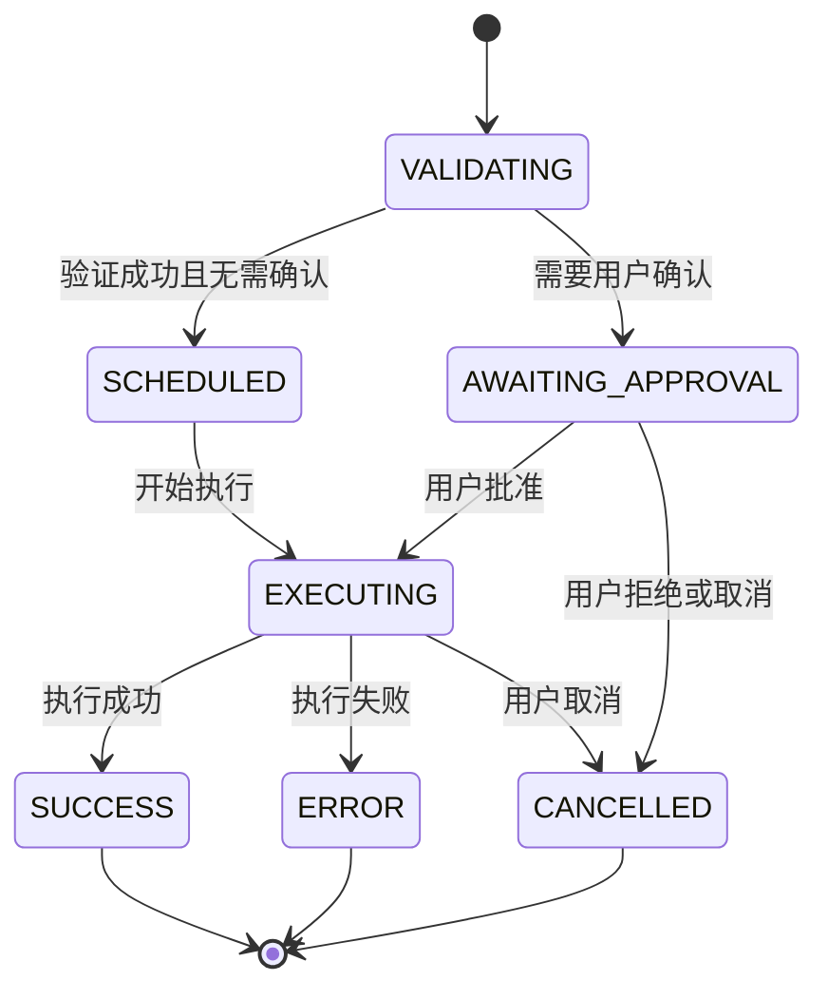
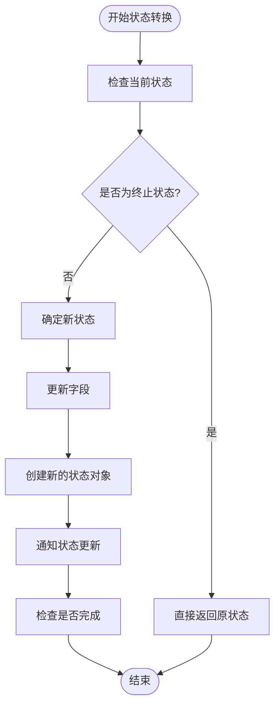
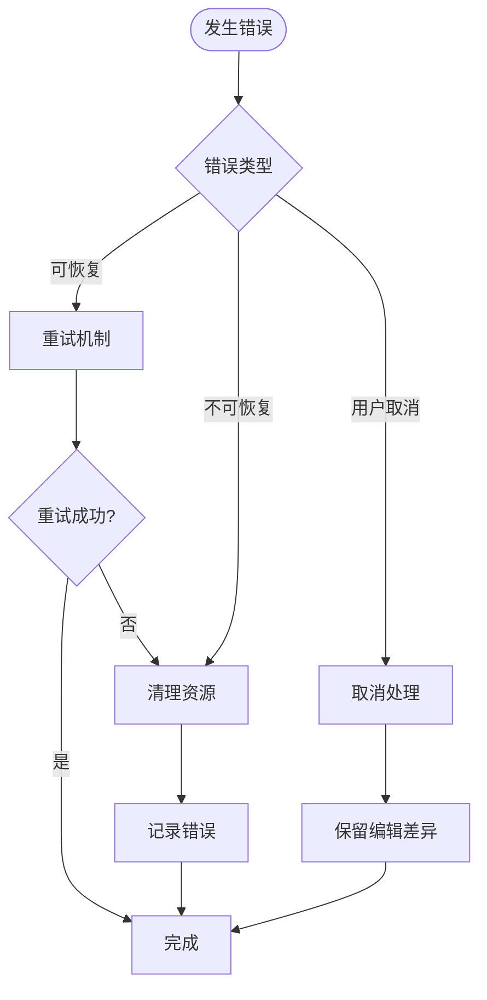

# 状态机与生命周期

<cite>
**本文档中引用的文件**
- [coreToolScheduler.ts](file://packages/core/src/core/coreToolScheduler.ts)
- [tools.ts](file://packages/core/src/tools/tools.ts)
- [shell.ts](file://packages/core/src/tools/shell.ts)
- [ToolConfirmationMessage.tsx](file://packages/cli/src/ui/components/messages/ToolConfirmationMessage.tsx)
- [tool-registry.ts](file://packages/core/src/tools/tool-registry.ts)
- [coreToolScheduler.test.ts](file://packages/core/src/core/coreToolScheduler.test.ts)
- [mcp-tool.ts](file://packages/core/src/tools/mcp-tool.ts)
- [mcp-client.ts](file://packages/core/src/tools/mcp-client.ts)
</cite>

## 目录
1. [简介](#简介)
2. [状态机架构概览](#状态机架构概览)
3. [核心状态详解](#核心状态详解)
4. [状态转换机制](#状态转换机制)
5. [确认请求处理](#确认请求处理)
6. [工具类型与确认模式](#工具类型与确认模式)
7. [错误处理与恢复](#错误处理与恢复)
8. [性能考虑](#性能考虑)
9. [故障排除指南](#故障排除指南)
10. [结论](#结论)

## 简介

Gemini CLI 的 ToolCall 状态机是一个复杂而精密的系统，负责管理所有工具执行的生命周期。该状态机通过四个核心状态（PENDING、EXECUTING、SUCCEEDED、FAILED）以及中间状态（VALIDATING、SCHEDULED、AWAITING_APPROVAL、CANCELLED）来确保工具调用的安全性、可靠性和可追踪性。

状态机的设计遵循了严格的生命周期管理原则，每个状态都有明确的职责和转换条件。这种设计不仅保证了系统的稳定性，还为用户提供了清晰的操作反馈和错误恢复机制。

## 状态机架构概览



**图表来源**
- [coreToolScheduler.ts](file://packages/core/src/core/coreToolScheduler.ts#L356-L523)

状态机的核心组件包括：

1. **CoreToolScheduler**: 状态机的主控制器，负责状态管理和调度
2. **ToolCall**: 表示单个工具调用的状态实例
3. **ToolCallConfirmationDetails**: 定义不同类型的确认请求
4. **ToolConfirmationOutcome**: 确认结果枚举

**章节来源**
- [coreToolScheduler.ts](file://packages/core/src/core/coreToolScheduler.ts#L1-L100)
- [tools.ts](file://packages/core/src/tools/tools.ts#L580-L636)

## 核心状态详解

### VALIDATING 状态

VALIDATING 状态是工具调用生命周期的第一个阶段，负责验证工具参数和准备执行环境。

```typescript
export type ValidatingToolCall = {
  status: 'validating';
  request: ToolCallRequestInfo;
  tool: AnyDeclarativeTool;
  invocation: AnyToolInvocation;
  startTime?: number;
  outcome?: ToolConfirmationOutcome;
};
```

在这个阶段，系统会：
- 验证工具参数的有效性
- 检查工具是否存在于注册表中
- 确认工作目录的合法性
- 计算工具执行的预期时间

### SCHEDULED 状态

当工具验证通过且不需要用户确认时，状态机进入 SCHEDULED 状态。

```typescript
export type ScheduledToolCall = {
  status: 'scheduled';
  request: ToolCallRequestInfo;
  tool: AnyDeclarativeTool;
  invocation: AnyToolInvocation;
  startTime?: number;
  outcome?: ToolConfirmationOutcome;
};
```

SCHEDULED 状态的特点：
- 工具参数已验证通过
- 不需要额外的用户交互
- 准备就绪等待执行

### EXECUTING 状态

EXECUTING 状态表示工具正在实际执行过程中。

```typescript
export type ExecutingToolCall = {
  status: 'executing';
  request: ToolCallRequestInfo;
  tool: AnyDeclarativeTool;
  invocation: AnyToolInvocation;
  liveOutput?: string | AnsiOutput;
  startTime?: number;
  outcome?: ToolConfirmationOutcome;
  pid?: number;
};
```

EXECUTING 状态的关键特性：
- 实时输出流监控
- 进程 ID 跟踪
- 支持中断和取消操作
- 动态输出更新

### AWAITING_APPROVAL 状态

这是最复杂的状态之一，涉及用户交互和安全确认。

```typescript
export type WaitingToolCall = {
  status: 'awaiting_approval';
  request: ToolCallRequestInfo;
  tool: AnyDeclarativeTool;
  invocation: AnyToolInvocation;
  confirmationDetails: ToolCallConfirmationDetails;
  startTime?: number;
  outcome?: ToolConfirmationOutcome;
};
```

**章节来源**
- [coreToolScheduler.ts](file://packages/core/src/core/coreToolScheduler.ts#L40-L100)

## 状态转换机制

状态转换由 `setStatusInternal` 方法控制，该方法确保状态的一致性和完整性。



**图表来源**
- [coreToolScheduler.ts](file://packages/core/src/core/coreToolScheduler.ts#L356-L452)

### 状态转换触发条件

1. **VALIDATING → SCHEDULED**: 验证成功且无需确认
2. **VALIDATING → AWAITING_APPROVAL**: 需要用户确认
3. **AWAITING_APPROVAL → EXECUTING**: 用户批准
4. **AWAITING_APPROVAL → CANCELLED**: 用户拒绝或取消
5. **EXECUTING → SUCCESS**: 执行成功完成
6. **EXECUTING → ERROR**: 执行过程中发生错误
7. **EXECUTING → CANCELLED**: 用户主动取消

**章节来源**
- [coreToolScheduler.ts](file://packages/core/src/core/coreToolScheduler.ts#L356-L452)

## 确认请求处理

### ToolCallConfirmationDetails 类型系统

系统支持四种类型的确认请求：

```typescript
export type ToolCallConfirmationDetails =
  | ToolEditConfirmationDetails
  | ToolExecuteConfirmationDetails
  | ToolMcpConfirmationDetails
  | ToolInfoConfirmationDetails;
```

### 编辑工具确认 (ToolEditConfirmationDetails)

编辑工具涉及文件修改，需要详细的差异展示：

```typescript
export interface ToolEditConfirmationDetails {
  type: 'edit';
  title: string;
  onConfirm: (
    outcome: ToolConfirmationOutcome,
    payload?: ToolConfirmationPayload,
  ) => Promise<void>;
  fileName: string;
  filePath: string;
  fileDiff: string;
  originalContent: string | null;
  newContent: string;
  isModifying?: boolean;
  ideConfirmation?: Promise<DiffUpdateResult>;
}
```

### Shell 命令确认 (ToolExecuteConfirmationDetails)

Shell 命令执行需要用户明确授权：

```typescript
export interface ToolExecuteConfirmationDetails {
  type: 'exec';
  title: string;
  onConfirm: (outcome: ToolConfirmationOutcome) => Promise<void>;
  command: string;
  rootCommand: string;
}
```

### MCP 工具确认 (ToolMcpConfirmationDetails)

MCP 服务器工具需要特定的确认流程：

```typescript
export interface ToolMcpConfirmationDetails {
  type: 'mcp';
  title: string;
  serverName: string;
  toolName: string;
  toolDisplayName: string;
  onConfirm: (outcome: ToolConfirmationOutcome) => Promise<void>;
}
```

### 确认结果枚举

```typescript
export enum ToolConfirmationOutcome {
  ProceedOnce = 'proceed_once',
  ProceedAlways = 'proceed_always',
  ProceedAlwaysServer = 'proceed_always_server',
  ProceedAlwaysTool = 'proceed_always_tool',
  ModifyWithEditor = 'modify_with_editor',
  Cancel = 'cancel',
}
```

**章节来源**
- [tools.ts](file://packages/core/src/tools/tools.ts#L585-L636)
- [ToolConfirmationMessage.tsx](file://packages/cli/src/ui/components/messages/ToolConfirmationMessage.tsx#L1-L100)

## 工具类型与确认模式

### 工具分类

根据功能和风险级别，工具被分为以下几类：

```typescript
export enum Kind {
  Read = 'read',
  Edit = 'edit',
  Delete = 'delete',
  Move = 'move',
  Search = 'search',
  Execute = 'execute',
  Think = 'think',
  Fetch = 'fetch',
  Other = 'other',
}
```

### 可变工具 (Mutator Kinds)

具有副作用的工具需要特别的确认处理：

```typescript
export const MUTATOR_KINDS: Kind[] = [
  Kind.Edit,
  Kind.Delete,
  Kind.Move,
  Kind.Execute,
] as const;
```

### 确认策略

不同的工具类型采用不同的确认策略：

1. **低风险工具**: 自动执行，无需确认
2. **中等风险工具**: 首次执行需要确认
3. **高风险工具**: 持续执行都需要确认

**章节来源**
- [tools.ts](file://packages/core/src/tools/tools.ts#L637-L673)
- [shell.ts](file://packages/core/src/tools/shell.ts#L100-L150)

## 错误处理与恢复

### 错误状态管理

```typescript
export type ErroredToolCall = {
  status: 'error';
  request: ToolCallRequestInfo;
  response: ToolCallResponseInfo;
  tool?: AnyDeclarativeTool;
  durationMs?: number;
  outcome?: ToolConfirmationOutcome;
};
```

### 取消状态处理

```typescript
export type CancelledToolCall = {
  status: 'cancelled';
  request: ToolCallRequestInfo;
  response: ToolCallResponseInfo;
  tool: AnyDeclarativeTool;
  invocation: AnyToolInvocation;
  durationMs?: number;
  outcome?: ToolConfirmationOutcome;
};
```

### 错误恢复机制



**图表来源**
- [coreToolScheduler.ts](file://packages/core/src/core/coreToolScheduler.ts#L452-L490)

### 输出截断和保存

对于大型输出，系统提供智能截断功能：

```typescript
export async function truncateAndSaveToFile(
  content: string,
  callId: string,
  projectTempDir: string,
  threshold: number,
  truncateLines: number,
): Promise<{ content: string; outputFile?: string }>
```

**章节来源**
- [coreToolScheduler.ts](file://packages/core/src/core/coreToolScheduler.ts#L200-L300)

## 性能考虑

### 并发控制

状态机实现了严格的并发控制：

```typescript
private isRunning(): boolean {
  return (
    this.isFinalizingToolCalls ||
    this.toolCalls.some(
      (call) =>
        call.status === 'executing' || call.status === 'awaiting_approval',
    )
  );
}
```

### 请求队列管理

```typescript
private requestQueue: Array<{
  request: ToolCallRequestInfo | ToolCallRequestInfo[];
  signal: AbortSignal;
  resolve: () => void;
  reject: (reason?: Error) => void;
}> = [];
```

### 内存优化

- 使用 LRU 缓存管理工具实例
- 及时释放已完成的工具调用
- 智能输出流管理

## 故障排除指南

### 常见问题诊断

1. **工具未找到错误**
   - 检查工具注册表
   - 验证工具名称拼写
   - 查看工具发现日志

2. **确认超时**
   - 检查网络连接
   - 验证 IDE 集成
   - 查看超时配置

3. **执行失败**
   - 检查工作目录权限
   - 验证命令语法
   - 查看详细错误日志

### 调试工具

```typescript
// 启用调试模式
const mockConfig = {
  getDebugMode: () => true,
  // ... 其他配置
};
```

### 日志记录

系统提供详细的日志记录功能：

```typescript
logToolCall(callId: string, toolName: string, status: string, durationMs?: number)
```

**章节来源**
- [coreToolScheduler.ts](file://packages/core/src/core/coreToolScheduler.ts#L600-L700)

## 结论

Gemini CLI 的 ToolCall 状态机是一个高度成熟和可靠的系统，它通过精心设计的状态转换、完善的确认机制和强大的错误处理能力，确保了工具执行的安全性和可靠性。

该状态机的主要优势包括：

1. **安全性**: 通过多层确认机制防止意外操作
2. **可靠性**: 完善的错误处理和恢复机制
3. **可扩展性**: 支持多种工具类型和确认模式
4. **用户体验**: 清晰的状态反馈和交互界面

未来的改进方向可能包括：
- 更智能的工具发现机制
- 增强的并发执行能力
- 更丰富的错误恢复选项
- 改进的用户界面体验