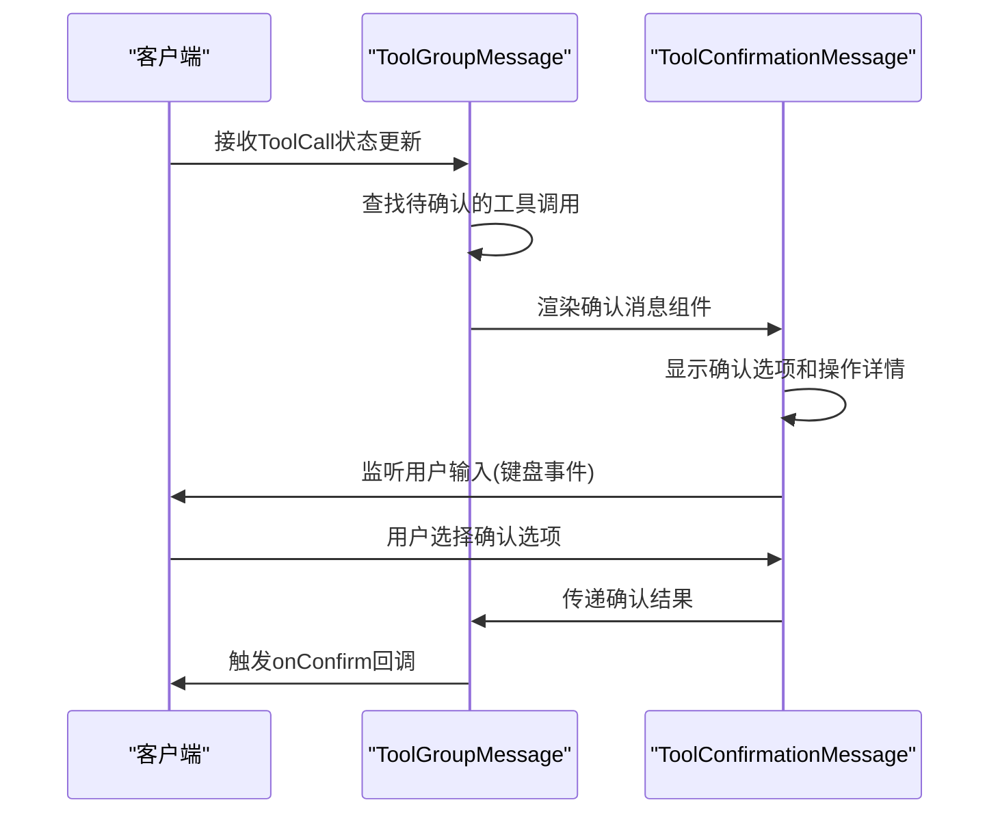
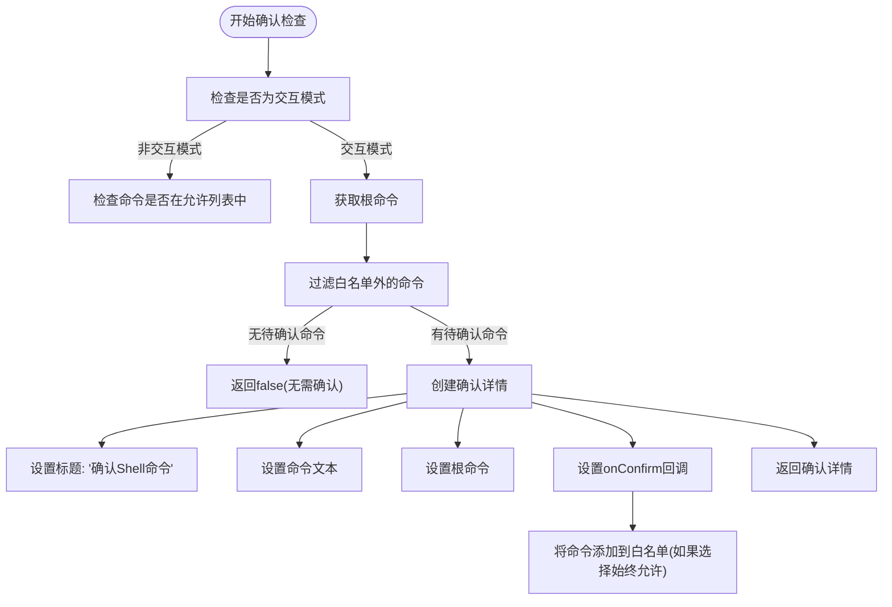
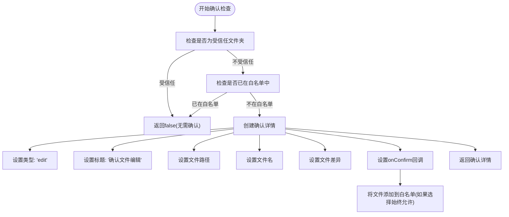
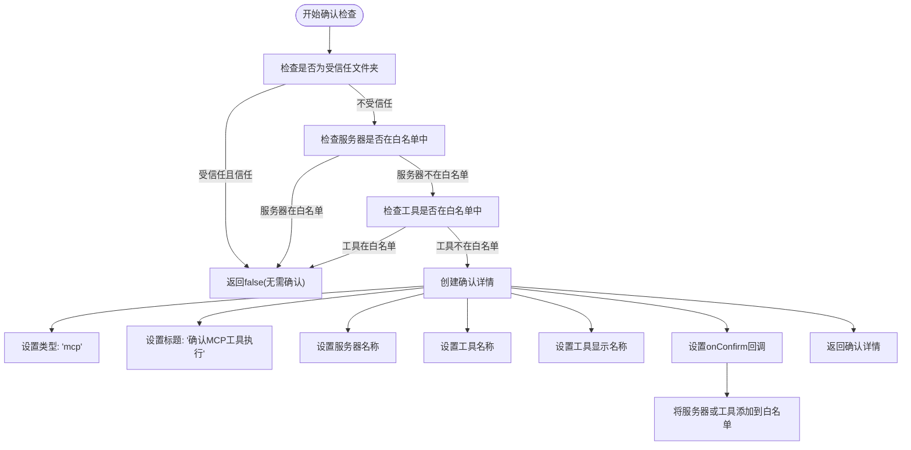
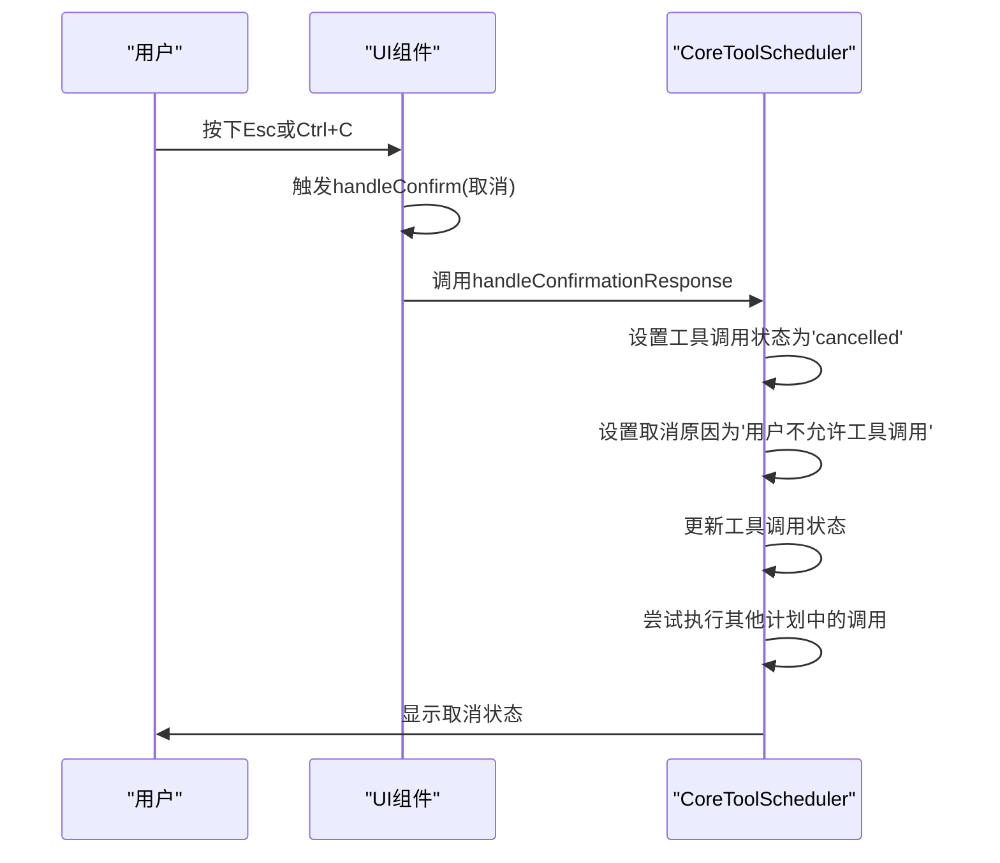
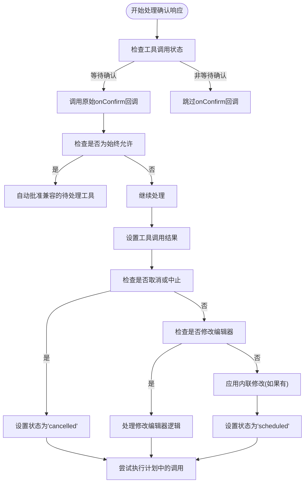

# 确认交互流程

<cite>
**本文档引用的文件**   
- [development-extension-rfc.md](file://packages/a2a-server/development-extension-rfc.md)
- [coreToolScheduler.ts](file://packages/core/src/core/coreToolScheduler.ts)
- [shell.ts](file://packages/core/src/tools/shell.ts)
- [edit.ts](file://packages/core/src/tools/edit.ts)
- [mcp-tool.ts](file://packages/core/src/tools/mcp-tool.ts)
- [tools.ts](file://packages/core/src/tools/tools.ts)
- [ToolGroupMessage.tsx](file://packages/cli/src/ui/components/messages/ToolGroupMessage.tsx)
- [ToolConfirmationMessage.tsx](file://packages/cli/src/ui/components/messages/ToolConfirmationMessage.tsx)
</cite>

## 目录
1. [确认机制概述](#确认机制概述)
2. [消息结构定义](#消息结构定义)
3. [客户端确认对话框渲染](#客户端确认对话框渲染)
4. [工具类型确认差异](#工具类型确认差异)
5. [用户取消操作处理](#用户取消操作处理)
6. [错误恢复机制](#错误恢复机制)

## 确认机制概述

Gemini CLI的ToolCall确认机制采用基于A2A协议的`development-tool`扩展，实现了标准化的客户端与代理之间的交互流程。该机制通过定义清晰的状态机和消息结构，确保了不同IDE和客户端表面的一致性体验。

确认流程遵循任务驱动的流式模式：客户端发送`message/stream`请求，代理响应包含`contextId`/`taskId`的事件流。当代理需要用户确认时，会发送包含`ConfirmationRequest`的`TaskStatusUpdateEvent`，客户端处理用户响应后，通过新的`message/stream`请求发送`ToolCallConfirmation`。

**Section sources**
- [development-extension-rfc.md](file://packages/a2a-server/development-extension-rfc.md#L1-L419)

## 消息结构定义

### ConfirmationRequest消息结构

`ConfirmationRequest`消息由代理发送到客户端，请求用户对工具调用的许可。其结构包含多个确认选项和具体的操作细节。

```mermaid
classDiagram
class ConfirmationRequest {
+repeated ConfirmationOption options
+oneof details {
ExecuteDetails execute_details
FileDiff file_edit_details
McpDetails mcp_details
GenericDetails generic_details
}
}
class ConfirmationOption {
+string id
+string name
+optional string description
}
class ExecuteDetails {
+string command
+optional string working_directory
}
class FileDiff {
+string file_name
+string file_path
+optional string old_content
+string new_content
+optional string formatted_diff
}
class McpDetails {
+string server_name
+string tool_name
}
class GenericDetails {
+string description
}
ConfirmationRequest --> ConfirmationOption : "包含"
ConfirmationRequest --> ExecuteDetails : "执行详情"
ConfirmationRequest --> FileDiff : "文件编辑详情"
ConfirmationRequest --> McpDetails : "MCP详情"
ConfirmationRequest --> GenericDetails : "通用详情"
```

**Diagram sources **
- [development-extension-rfc.md](file://packages/a2a-server/development-extension-rfc.md#L200-L300)

### ToolCallConfirmation消息结构

`ToolCallConfirmation`消息是客户端对`ConfirmationRequest`的响应，包含用户选择的确认选项和可能的修改内容。

```mermaid
classDiagram
class ToolCallConfirmation {
+string tool_call_id
+string selected_option_id
+oneof modified_details {
ModifiedFileDetails file_details
}
}
class ModifiedFileDetails {
+string new_content
}
ToolCallConfirmation --> ModifiedFileDetails : "包含"
```

**Diagram sources **
- [development-extension-rfc.md](file://packages/a2a-server/development-extension-rfc.md#L301-L350)

**Section sources**
- [development-extension-rfc.md](file://packages/a2a-server/development-extension-rfc.md#L200-L350)

## 客户端确认对话框渲染

客户端通过`ToolGroupMessage`组件渲染确认对话框，该组件负责管理工具调用组的显示和用户交互。



**Diagram sources **
- [ToolGroupMessage.tsx](file://packages/cli/src/ui/components/messages/ToolGroupMessage.tsx#L1-L154)
- [ToolConfirmationMessage.tsx](file://packages/cli/src/ui/components/messages/ToolConfirmationMessage.tsx#L1-L330)

在渲染过程中，`ToolGroupMessage`组件会查找第一个状态为`Confirming`的工具调用，并为其渲染`ToolConfirmationMessage`。该组件根据确认详情的类型（编辑、执行、MCP）显示不同的UI元素和选项。

对于文件编辑确认，会显示差异渲染器(`DiffRenderer`)来展示文件更改；对于shell命令执行，会显示命令文本和工作目录；对于MCP工具，会显示服务器名称和工具名称。

**Section sources**
- [ToolGroupMessage.tsx](file://packages/cli/src/ui/components/messages/ToolGroupMessage.tsx#L1-L154)
- [ToolConfirmationMessage.tsx](file://packages/cli/src/ui/components/messages/ToolConfirmationMessage.tsx#L1-L330)

## 工具类型确认差异

不同类型的工具在确认细节上存在显著差异，主要体现在`shouldConfirmExecute`方法的实现上。

### Shell工具确认

Shell工具的确认机制基于命令白名单，只有不在白名单中的命令才需要用户确认。



**Diagram sources **
- [shell.ts](file://packages/core/src/tools/shell.ts#L1-L492)

### 文件编辑工具确认

文件编辑工具的确认机制基于文件路径和编辑内容，确保用户了解即将发生的更改。



**Diagram sources **
- [edit.ts](file://packages/core/src/tools/edit.ts#L1-L588)

### MCP工具确认

MCP工具的确认机制基于服务器和工具名称，提供细粒度的权限控制。



**Diagram sources **
- [mcp-tool.ts](file://packages/core/src/tools/mcp-tool.ts#L1-L401)

**Section sources**
- [shell.ts](file://packages/core/src/tools/shell.ts#L1-L492)
- [edit.ts](file://packages/core/src/tools/edit.ts#L1-L588)
- [mcp-tool.ts](file://packages/core/src/tools/mcp-tool.ts#L1-L401)

## 用户取消操作处理

当用户取消工具调用时，系统会通过`handleConfirmationResponse`方法处理取消操作，设置相应的状态和结果。



**Diagram sources **
- [coreToolScheduler.ts](file://packages/core/src/core/coreToolScheduler.ts#L800-L999)
- [ToolConfirmationMessage.tsx](file://packages/cli/src/ui/components/messages/ToolConfirmationMessage.tsx#L1-L330)

在`handleConfirmationResponse`方法中，当收到`ToolConfirmationOutcome.Cancel`或信号被中止时，系统会将工具调用状态设置为`cancelled`，并提供相应的取消原因。这确保了用户能够清楚地了解操作已被取消。

**Section sources**
- [coreToolScheduler.ts](file://packages/core/src/core/coreToolScheduler.ts#L800-L999)

## 错误恢复机制

系统通过`outcome`状态的传递和最终状态的设置来实现错误恢复机制，确保在各种异常情况下都能正确处理。



**Diagram sources **
- [coreToolScheduler.ts](file://packages/core/src/core/coreToolScheduler.ts#L800-L999)

错误恢复机制的关键在于`handleConfirmationResponse`方法中的状态转换逻辑。该方法不仅处理用户确认，还处理各种异常情况，如信号中止、修改编辑器请求等。通过统一的状态管理，系统能够确保在任何情况下都能正确地更新工具调用状态并继续执行流程。

**Section sources**
- [coreToolScheduler.ts](file://packages/core/src/core/coreToolScheduler.ts#L800-L999)