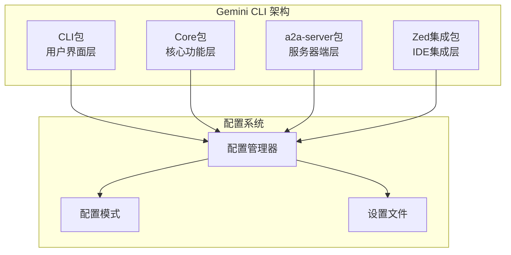
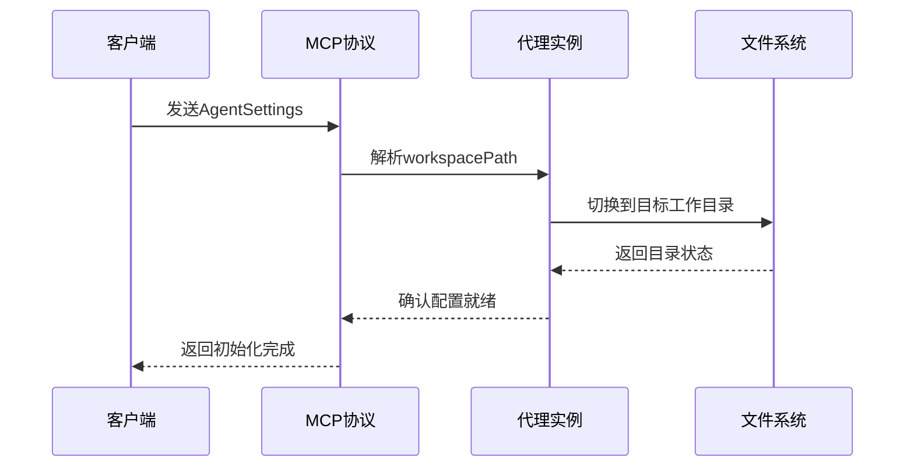
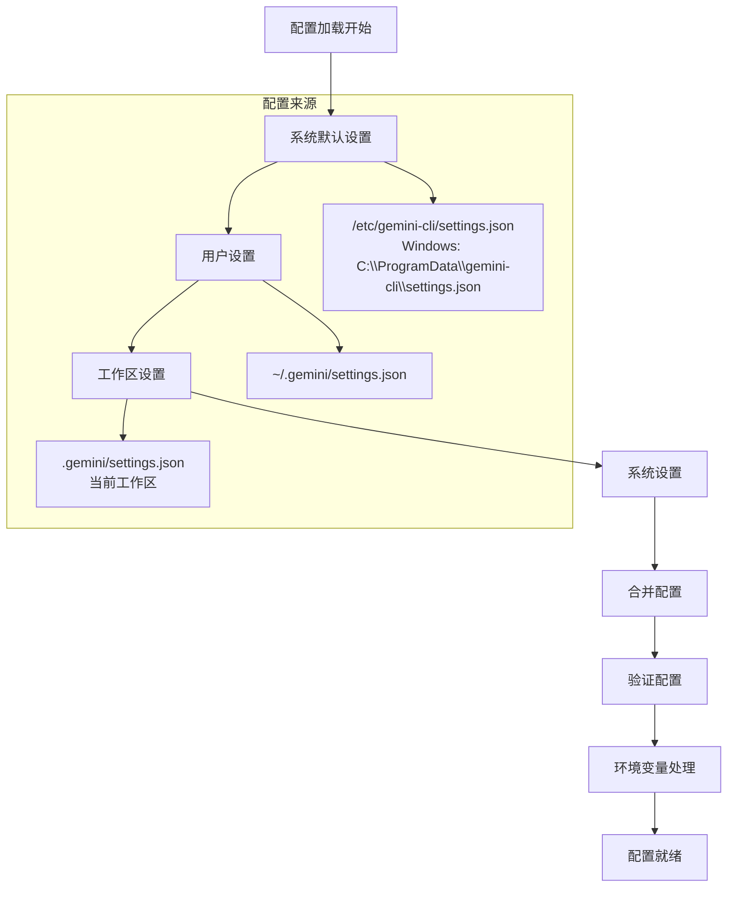
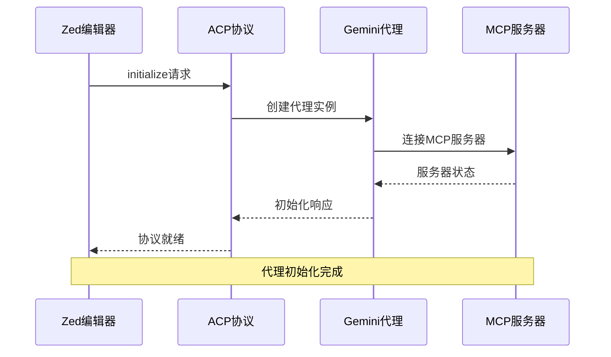
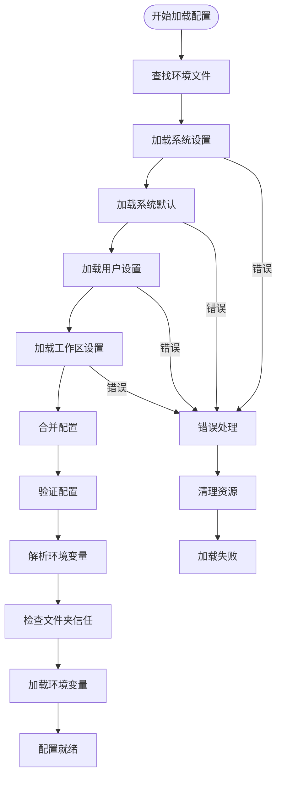

# MCP协议配置规范

<cite>
**本文档引用的文件**
- [packages/cli/src/config/settings.ts](file://packages/cli/src/config/settings.ts)
- [packages/cli/src/config/settingsSchema.ts](file://packages/cli/src/config/settingsSchema.ts)
- [packages/a2a-server/src/types.ts](file://packages/a2a-server/src/types.ts)
- [packages/a2a-server/src/config/config.ts](file://packages/a2a-server/src/config/config.ts)
- [packages/cli/src/zed-integration/zedIntegration.ts](file://packages/cli/src/zed-integration/zedIntegration.ts)
- [packages/cli/src/zed-integration/schema.ts](file://packages/cli/src/zed-integration/schema.ts)
- [packages/cli/src/commands/mcp/add.ts](file://packages/cli/src/commands/mcp/add.ts)
- [packages/core/src/tools/mcp-client.ts](file://packages/core/src/tools/mcp-client.ts)
</cite>

## 目录
1. [简介](#简介)
2. [项目结构概览](#项目结构概览)
3. [AgentSettings配置对象详解](#agentsettings配置对象详解)
4. [配置层次结构](#配置层次结构)
5. [MCP服务器配置](#mcp服务器配置)
6. [Zed集成中的配置](#zed集成中的配置)
7. [配置处理流程](#配置处理流程)
8. [版本控制与向后兼容性](#版本控制与向后兼容性)
9. [实际使用示例](#实际使用示例)
10. [故障排除指南](#故障排除指南)
11. [总结](#总结)

## 简介

MCP（Model Context Protocol）协议配置规范是Gemini CLI项目中用于管理AI代理配置的核心机制。该规范定义了AgentSettings配置对象的结构，特别是workspacePath字段的语义和在会话初始化中的关键作用。本文档详细解释了配置信息如何通过message/stream请求的metadata字段传递，以及其在代理初始化过程中的处理流程。

## 项目结构概览

Gemini CLI项目采用模块化架构，主要包含以下核心包：



**图表来源**
- [packages/cli/src/config/settings.ts](file://packages/cli/src/config/settings.ts#L1-L50)
- [packages/a2a-server/src/config/config.ts](file://packages/a2a-server/src/config/config.ts#L1-L50)

## AgentSettings配置对象详解

### 基本结构定义

AgentSettings是MCP协议中用于传递代理配置的核心数据结构：

```typescript
export interface AgentSettings {
  kind: CoderAgentEvent.StateAgentSettingsEvent;
  workspacePath: string;
}
```

### 字段语义分析

#### workspacePath字段

`workspacePath`字段是AgentSettings中最关键的组成部分，它定义了代理操作的工作目录：

- **类型**: `string`
- **用途**: 指定代理应该操作的文件系统根路径
- **优先级**: 可以被环境变量`CODER_AGENT_WORKSPACE_PATH`覆盖
- **验证**: 路径必须可解析且有效

#### kind字段

`kind`字段标识消息类型，对于AgentSettings来说：

- **值**: `CoderAgentEvent.StateAgentSettingsEvent`
- **作用**: 帮助接收方识别消息类型并正确处理

### 配置传递机制

配置信息通过以下方式传递：



**图表来源**
- [packages/a2a-server/src/config/config.ts](file://packages/a2a-server/src/config/config.ts#L138-L171)
- [packages/cli/src/zed-integration/zedIntegration.ts](file://packages/cli/src/zed-integration/zedIntegration.ts#L100-L150)

**章节来源**
- [packages/a2a-server/src/types.ts](file://packages/a2a-server/src/types.ts#L41-L43)
- [packages/a2a-server/src/config/config.ts](file://packages/a2a-server/src/config/config.ts#L138-L171)

## 配置层次结构

### 设置优先级体系

Gemini CLI采用分层配置系统，具有明确的优先级顺序：



**图表来源**
- [packages/cli/src/config/settings.ts](file://packages/cli/src/config/settings.ts#L400-L450)

### 配置合并策略

不同层级的配置采用不同的合并策略：

1. **REPLACE**: 默认策略，新值完全替换旧值
2. **CONCAT**: 数组连接
3. **UNION**: 数组去重合并
4. **SHALLOW_MERGE**: 浅层对象合并

### 环境变量支持

配置系统支持多种环境变量：

- `GEMINI_CLI_SYSTEM_SETTINGS_PATH`: 自定义系统设置路径
- `GEMINI_CLI_SYSTEM_DEFAULTS_PATH`: 自定义系统默认路径
- `CODER_AGENT_WORKSPACE_PATH`: 代理工作区路径覆盖
- `GEMINI_API_KEY`: Gemini API密钥
- `USE_CCPA`: 使用CCPA认证

**章节来源**
- [packages/cli/src/config/settings.ts](file://packages/cli/src/config/settings.ts#L100-L200)
- [packages/a2a-server/src/config/config.ts](file://packages/a2a-server/src/config/config.ts#L172-L205)

## MCP服务器配置

### 配置结构

MCP服务器配置通过`mcpServers`字段管理：

```typescript
mcpServers: {
  type: 'object',
  label: 'MCP Servers',
  category: 'Advanced',
  requiresRestart: true,
  default: {} as Record<string, MCPServerConfig>,
  description: 'Configuration for MCP servers.',
  showInDialog: false,
  mergeStrategy: MergeStrategy.SHALLOW_MERGE,
}
```

### 支持的传输协议

系统支持三种传输协议：

1. **STDIO**: 标准输入输出传输
2. **SSE**: 服务器发送事件
3. **HTTP**: HTTP传输

### 配置参数详解

每个MCP服务器配置包含以下参数：

```typescript
interface MCPServerConfig {
  command?: string;           // 启动命令
  args?: string[];           // 命令行参数
  env?: Record<string, string>; // 环境变量
  url?: string;              // SSE URL
  httpUrl?: string;          // HTTP URL
  headers?: Record<string, string>; // HTTP头
  timeout?: number;          // 连接超时
  trust?: boolean;           // 是否信任服务器
  description?: string;      // 服务器描述
  includeTools?: string[];   // 包含的工具列表
  excludeTools?: string[];   // 排除的工具列表
}
```

### 配置示例

```json
{
  "mcpServers": {
    "my-server": {
      "command": "python",
      "args": ["-m", "my_mcp_server"],
      "env": {
        "PYTHONPATH": "/path/to/python/libs"
      },
      "timeout": 30000,
      "trust": false,
      "description": "My custom MCP server"
    }
  }
}
```

**章节来源**
- [packages/cli/src/config/settingsSchema.ts](file://packages/cli/src/config/settingsSchema.ts#L50-L70)
- [packages/cli/src/commands/mcp/add.ts](file://packages/cli/src/commands/mcp/add.ts#L20-L100)

## Zed集成中的配置

### 协议版本

Zed集成使用MCP协议版本1：

```typescript
export const PROTOCOL_VERSION = 1;
```

### 初始化流程

Zed集成的初始化过程包括以下步骤：



**图表来源**
- [packages/cli/src/zed-integration/zedIntegration.ts](file://packages/cli/src/zed-integration/zedIntegration.ts#L70-L120)

### 会话管理

Zed集成支持会话管理：

```typescript
export const newSessionRequestSchema = z.object({
  cwd: z.string(),
  mcpServers: z.array(mcpServerSchema),
});

export const loadSessionRequestSchema = z.object({
  cwd: z.string(),
  mcpServers: z.array(mcpServerSchema),
  sessionId: z.string(),
});
```

### 客户端能力

Zed集成支持以下客户端能力：

- **文件系统访问**: 读写文本文件
- **权限请求**: 工具调用确认
- **会话更新**: 实时状态更新

**章节来源**
- [packages/cli/src/zed-integration/schema.ts](file://packages/cli/src/zed-integration/schema.ts#L297-L319)
- [packages/cli/src/zed-integration/zedIntegration.ts](file://packages/cli/src/zed-integration/zedIntegration.ts#L100-L200)

## 配置处理流程

### 加载流程

配置加载遵循严格的顺序：



**图表来源**
- [packages/cli/src/config/settings.ts](file://packages/cli/src/config/settings.ts#L500-L600)

### 配置验证

系统使用Zod进行配置验证：

```typescript
export const mcpServerSchema = z.object({
  args: z.array(z.string()),
  command: z.string(),
  env: z.array(envVariableSchema),
  name: z.string(),
});
```

### 错误处理

配置加载过程包含完善的错误处理机制：

1. **语法错误**: JSON格式错误
2. **类型错误**: 数据类型不匹配
3. **路径错误**: 文件路径无效
4. **权限错误**: 访问权限不足

**章节来源**
- [packages/cli/src/config/settings.ts](file://packages/cli/src/config/settings.ts#L600-L700)
- [packages/cli/src/zed-integration/schema.ts](file://packages/cli/src/zed-integration/schema.ts#L200-L250)

## 版本控制与向后兼容性

### 配置迁移

系统支持从V1配置迁移到V2配置：

```typescript
const MIGRATION_MAP: Record<string, string> = {
  accessibility: 'ui.accessibility',
  allowedTools: 'tools.allowed',
  allowMCPServers: 'mcp.allowed',
  autoAccept: 'tools.autoAccept',
  // ... 更多映射
};
```

### 兼容性策略

1. **渐进式迁移**: 支持混合配置格式
2. **回退机制**: V2配置损坏时自动回退到V1
3. **警告提示**: 迁移过程中显示警告信息
4. **备份保留**: 迁移前保留原始配置文件

### 版本检测

```typescript
export function needsMigration(settings: Record<string, unknown>): boolean {
  const hasV1Keys = Object.entries(MIGRATION_MAP).some(([v1Key, v2Path]) => {
    if (!(v1Key in settings)) return false;
    // 检查是否为容器对象而非需要迁移的键
    if (KNOWN_V2_CONTAINERS.has(v1Key) && 
        typeof settings[v1Key] === 'object' && 
        settings[v1Key] !== null) {
      return false;
    }
    return true;
  });
  return hasV1Keys;
}
```

**章节来源**
- [packages/cli/src/config/settings.ts](file://packages/cli/src/config/settings.ts#L150-L250)

## 实际使用示例

### 基本配置示例

```json
{
  "$schema": "./node_modules/@google/gemini-cli-core/config.schema.json",
  "mcpServers": {
    "file-system": {
      "command": "python",
      "args": ["-m", "mcp_server", "--type", "filesystem"],
      "env": {
        "WORKSPACE_PATH": "/home/user/projects"
      }
    }
  },
  "security": {
    "auth": {
      "selectedType": "use_gemini"
    }
  }
}
```

### Zed集成配置

```typescript
// 在Zed集成中使用AgentSettings
const agentSettings: AgentSettings = {
  kind: CoderAgentEvent.StateAgentSettingsEvent,
  workspacePath: "/path/to/project"
};

// 通过ACPI协议传递
await client.initialize({
  protocolVersion: 1,
  agentCapabilities: {
    loadSession: false,
    promptCapabilities: {
      image: true,
      audio: true,
      embeddedContext: true
    }
  },
  authMethods: [
    {
      id: AuthType.LOGIN_WITH_GOOGLE,
      name: "Log in with Google",
      description: null
    }
  ]
});
```

### 扩展配置

```typescript
// 扩展配置合并
export function mergeMcpServers(settings: Settings, extensions: Extension[]) {
  const mcpServers = { ...(settings.mcpServers || {}) };
  for (const extension of extensions) {
    Object.entries(extension.config.mcpServers || {}).forEach(
      ([key, server]) => {
        if (mcpServers[key]) {
          console.warn(
            `Skipping extension MCP config for server with key "${key}" as it already exists.`
          );
          return;
        }
        mcpServers[key] = server;
      }
    );
  }
  return mcpServers;
}
```

**章节来源**
- [packages/cli/src/commands/mcp/add.ts](file://packages/cli/src/commands/mcp/add.ts#L150-L200)
- [packages/a2a-server/src/config/config.ts](file://packages/a2a-server/src/config/config.ts#L117-L137)

## 故障排除指南

### 常见问题

1. **配置文件格式错误**
   - 症状: JSON解析错误
   - 解决: 使用JSON验证器检查格式

2. **MCP服务器连接失败**
   - 症状: 服务器无法启动或连接超时
   - 解决: 检查命令路径和环境变量

3. **权限问题**
   - 症状: 文件访问被拒绝
   - 解决: 检查文件夹信任设置

4. **配置优先级冲突**
   - 症状: 设置未生效
   - 解决: 检查配置文件优先级

### 调试技巧

```typescript
// 启用调试模式
process.env.DEBUG = 'true';

// 检查配置合并结果
console.log('Merged settings:', settings.merged);

// 验证MCP服务器状态
const serverStatus = await mcpClient.getStatus();
console.log('Server status:', serverStatus);
```

### 日志记录

系统提供详细的日志记录：

```typescript
logger.info(`[CoderAgentExecutor] Overriding workspace path to: ${targetDir}`);
logger.error(`[Config] Error resolving workspace path: ${e}`);
```

**章节来源**
- [packages/a2a-server/src/config/config.ts](file://packages/a2a-server/src/config/config.ts#L150-L170)

## 总结

MCP协议配置规范为Gemini CLI项目提供了强大而灵活的配置管理机制。通过AgentSettings配置对象的精心设计，系统实现了：

1. **清晰的配置层次**: 系统默认 → 用户 → 工作区 → 系统设置
2. **灵活的传输协议**: 支持STDIO、SSE、HTTP三种传输方式
3. **强大的Zed集成**: 完整的ACPI协议支持
4. **完善的错误处理**: 多层次的错误检测和恢复机制
5. **向后兼容性**: 平滑的配置迁移和版本控制

该规范确保了配置的一致性和可靠性，为开发者提供了直观而强大的配置体验。通过合理的抽象和模块化设计，系统能够适应各种复杂的部署场景和使用需求。