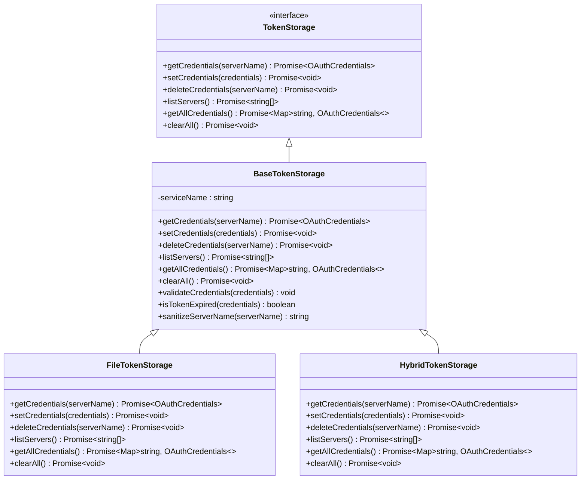

# MCP安全与配置

<cite>
**本文档中引用的文件**  
- [settings.ts](file://packages/cli/src/config/settings.ts)
- [settingsSchema.ts](file://packages/cli/src/config/settingsSchema.ts)
- [config.ts](file://packages/core/src/config/config.ts)
- [mcp-client.ts](file://packages/core/src/tools/mcp-client.ts)
- [mcp-client-manager.ts](file://packages/core/src/tools/mcp-client-manager.ts)
- [oauth-provider.ts](file://packages/core/src/mcp/oauth-provider.ts)
- [token-storage/index.ts](file://packages/core/src/mcp/token-storage/index.ts)
- [token-storage/base-token-storage.ts](file://packages/core/src/mcp/token-storage/base-token-storage.ts)
- [policy-engine.ts](file://packages/core/src/policy/policy-engine.ts)
</cite>

## 目录
1. [简介](#简介)
2. [MCP服务器配置](#mcp服务器配置)
3. [工具过滤机制](#工具过滤机制)
4. [企业级安全模式](#企业级安全模式)
5. [环境变量与令牌安全](#环境变量与令牌安全)
6. [最小权限原则应用](#最小权限原则应用)
7. [结论](#结论)

## 简介
本指南详细阐述了Gemini CLI中MCP（Model Context Protocol）的安全与配置管理机制。文档涵盖了MCP服务器的配置方法、工具过滤的安全价值、企业级部署中的安全策略、环境变量注入的安全实践以及令牌存储的加密策略。通过本指南，用户可以深入了解如何安全地配置和管理MCP服务器，确保系统的安全性和可靠性。

## MCP服务器配置
MCP服务器的配置通过`settings.json`文件中的`mcpServers`配置块进行定义。该配置块允许用户指定服务器的连接方式、超时设置、环境变量等参数。

### mcpServers配置块
`mcpServers`配置块是一个对象，其键为服务器名称，值为服务器配置对象。配置对象包含以下参数：

- **command**: 用于启动MCP服务器的命令。
- **args**: 传递给命令的参数数组。
- **env**: 环境变量对象，用于在启动服务器时注入环境变量。
- **timeout**: 连接超时时间（毫秒）。
- **trust**: 是否信任该服务器，绕过所有工具调用确认提示。
- **description**: 服务器的描述信息。
- **includeTools**: 要包含的工具列表。
- **excludeTools**: 要排除的工具列表。

**Section sources**
- [settingsSchema.ts](file://packages/cli/src/config/settingsSchema.ts#L1-L200)
- [config.ts](file://packages/core/src/config/config.ts#L1-L100)

## 工具过滤机制
工具过滤机制通过`includeTools`和`excludeTools`参数实现，允许用户精确控制哪些工具可以被MCP服务器使用。

### 实现原理
工具过滤在MCP客户端发现工具时进行。当客户端连接到MCP服务器并发现可用工具时，会根据`includeTools`和`excludeTools`配置过滤工具列表。只有符合过滤条件的工具才会被注册到工具注册表中。

### 安全价值
工具过滤机制提供了细粒度的访问控制，防止MCP服务器访问不必要的或潜在危险的工具。通过明确指定允许或禁止的工具，可以显著降低安全风险。

**Section sources**
- [mcp-client.ts](file://packages/core/src/tools/mcp-client.ts#L1-L800)
- [mcp-client-manager.ts](file://packages/core/src/tools/mcp-client-manager.ts#L1-L130)

## 企业级安全模式
企业级部署中，可以通过系统级`settings.json`文件定义服务器allowlist（`mcp.allowed`）以防止用户私自添加不受信的MCP服务器。

### 服务器Allowlist
通过在系统级`settings.json`文件中设置`mcp.allowed`数组，可以指定允许的MCP服务器名称。任何不在该列表中的服务器将被自动阻止。

### 配置优先级
配置的优先级顺序为：命令行参数 > 用户设置 > 系统设置。这意味着命令行参数可以覆盖系统和用户设置，提供了灵活的配置管理。

**Section sources**
- [settings.ts](file://packages/cli/src/config/settings.ts#L1-L800)
- [config.ts](file://packages/core/src/config/config.ts#L758-L808)

## 环境变量与令牌安全
环境变量注入和令牌存储是MCP安全配置的重要组成部分。

### 环境变量注入
环境变量可以通过`env`参数在启动MCP服务器时注入。例如，可以注入`GITHUB_PERSONAL_ACCESS_TOKEN`等敏感信息。为了安全起见，建议使用环境变量而不是硬编码在配置文件中。

### 令牌存储
令牌存储模块负责安全地存储和管理OAuth令牌。令牌存储支持多种后端，包括文件存储和密钥链存储。所有存储的令牌都经过加密处理，确保数据安全。

**Diagram sources**
- [token-storage/index.ts](file://packages/core/src/mcp/token-storage/index.ts#L1-L15)
- [token-storage/base-token-storage.ts](file://packages/core/src/mcp/token-storage/base-token-storage.ts#L1-L50)

## 最小权限原则应用
最小权限原则要求为每个MCP服务器配置独立的认证凭证和作用域，确保每个服务器只能访问其所需的最小资源集。

### 应用示例
为不同的MCP服务器配置不同的认证凭证和作用域，可以有效限制每个服务器的权限。例如，一个服务器可能只需要读取权限，而另一个服务器可能需要读写权限。通过这种方式，可以最大限度地减少潜在的安全风险。

**Section sources**
- [oauth-provider.ts](file://packages/core/src/mcp/oauth-provider.ts#L1-L800)
- [config.ts](file://packages/core/src/config/config.ts#L1-L100)

## 结论
通过合理配置MCP服务器、使用工具过滤机制、实施企业级安全模式、安全地管理环境变量和令牌，以及应用最小权限原则，可以显著提高Gemini CLI系统的安全性。这些措施共同构成了一个全面的安全框架，确保系统在各种部署环境中的安全性和可靠性。