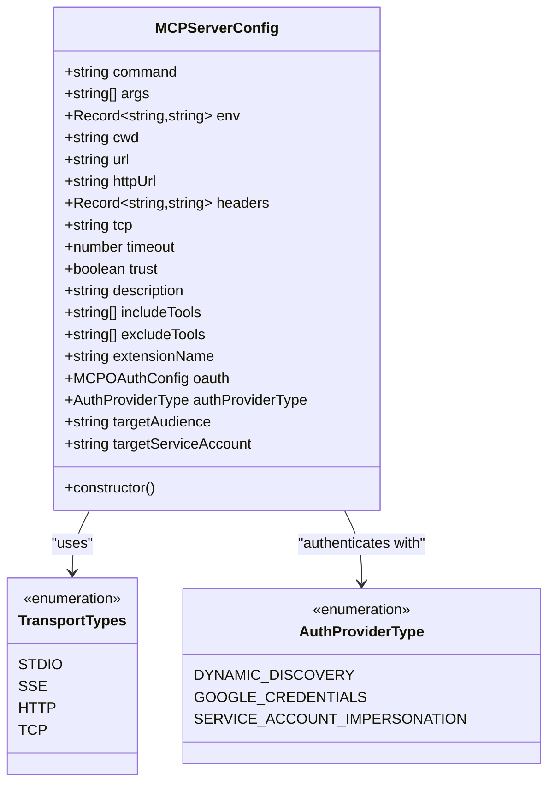
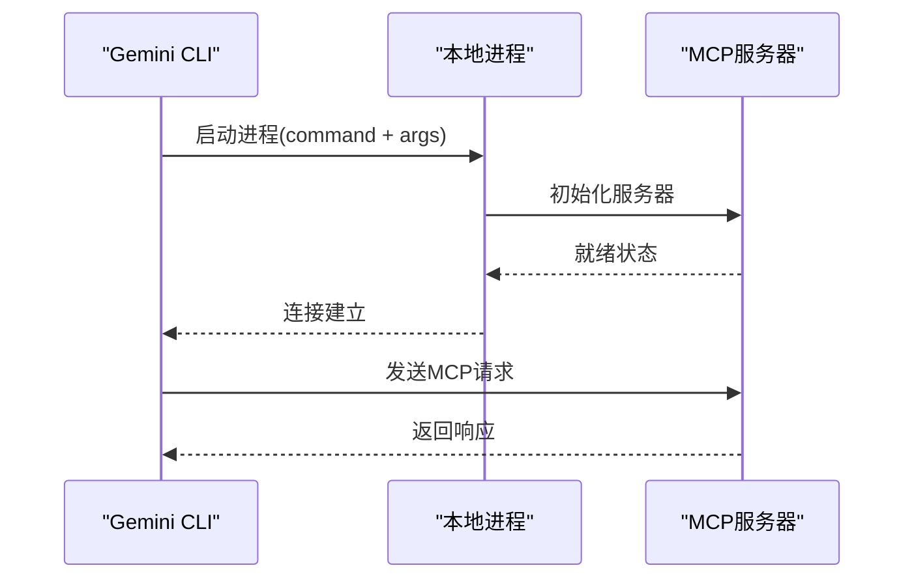

# MCP服务器配置语法

<cite>
**本文档中引用的文件**
- [packages/core/src/config/config.ts](file://packages/core/src/config/config.ts)
- [packages/cli/src/commands/mcp/add.ts](file://packages/cli/src/commands/mcp/add.ts)
- [packages/cli/src/commands/mcp/list.ts](file://packages/cli/src/commands/mcp/list.ts)
- [packages/core/src/tools/mcp-client.ts](file://packages/core/src/tools/mcp-client.ts)
- [packages/core/src/tools/mcp-client-manager.ts](file://packages/core/src/tools/mcp-client-manager.ts)
- [docs/cli/enterprise.md](file://docs/cli/enterprise.md)
- [docs/get-started/configuration-v1.md](file://docs/get-started/configuration-v1.md)
</cite>

## 目录
1. [简介](#简介)
2. [MCPServerConfig类概述](#mcpserverconfig类概述)
3. [核心配置参数详解](#核心配置参数详解)
4. [传输协议配置](#传输协议配置)
5. [安全配置选项](#安全配置选项)
6. [完整配置示例](#完整配置示例)
7. [最佳实践与安全考虑](#最佳实践与安全考虑)
8. [故障排除指南](#故障排除指南)

## 简介

MCP（Model-Context Protocol）服务器配置是Gemini CLI系统中的关键组件，它允许用户连接到各种外部工具和服务。通过MCPServerConfig类，用户可以定义本地和远程MCP服务器的连接参数、认证信息、传输协议以及其他相关设置。

本文档将详细介绍MCPServerConfig类中各个参数的用途和配置方法，帮助用户正确配置MCP服务器以满足不同的使用场景和安全需求。

## MCPServerConfig类概述

MCPServerConfig是一个用于配置MCP服务器连接的核心类，支持多种传输协议和认证方式。该类的设计遵循了灵活性和安全性的原则，允许用户根据具体需求选择合适的配置方案。



**图表来源**
- [packages/core/src/config/config.ts](file://packages/core/src/config/config.ts#L100-L130)

**章节来源**
- [packages/core/src/config/config.ts](file://packages/core/src/config/config.ts#L100-L130)

## 核心配置参数详解

### 命令行启动参数（command, args, env, cwd）

这些参数专门用于配置基于STDIO传输的本地MCP服务器。

#### command（启动命令）
- **类型**: `string`
- **必需**: 是（对于STDIO传输）
- **描述**: 指定启动MCP服务器的可执行文件路径或命令名称
- **示例**: `"python"`, `"node"`, `"/usr/local/bin/custom-server"`

#### args（命令行参数）
- **类型**: `string[]`
- **可选**: 是
- **描述**: 传递给启动命令的参数数组
- **示例**: `["mcp_server.py", "--port", "8080"]`

#### env（环境变量）
- **类型**: `Record<string, string>`
- **可选**: 是
- **描述**: 设置服务器进程的环境变量
- **示例**: `{"API_KEY": "$MY_API_TOKEN", "DEBUG": "true"}`

#### cwd（工作目录）
- **类型**: `string`
- **可选**: 是
- **描述**: 指定服务器进程的工作目录
- **示例**: `"./mcp_tools/python"`

### 超时设置（timeout）

- **类型**: `number`
- **可选**: 是
- **默认值**: 600000毫秒（10分钟）
- **描述**: 设置服务器连接的超时时间（毫秒）
- **安全考虑**: 合理设置超时时间可以防止长时间挂起的连接占用资源

### 元数据字段（description, extensionName）

#### description（描述）
- **类型**: `string`
- **可选**: 是
- **描述**: 为服务器提供人类可读的描述信息
- **用途**: 在列表显示和错误消息中使用

#### extensionName（扩展来源）
- **类型**: `string`
- **可选**: 是
- **描述**: 标识服务器配置的来源扩展名称
- **用途**: 用于跟踪配置的来源和管理权限

**章节来源**
- [packages/core/src/config/config.ts](file://packages/core/src/config/config.ts#L100-L130)
- [packages/cli/src/commands/mcp/add.ts](file://packages/cli/src/commands/mcp/add.ts#L40-L80)

## 传输协议配置

MCP服务器支持多种传输协议，每种协议适用于不同的使用场景：

### STDIO传输（本地进程）

STDIO传输是最常用的本地MCP服务器配置方式，适用于运行在本地机器上的服务器。



**图表来源**
- [packages/cli/src/commands/mcp/add.ts](file://packages/cli/src/commands/mcp/add.ts#L70-L85)

#### 配置示例：
```json
{
  "command": "python",
  "args": ["mcp_server.py", "--port", "8080"],
  "cwd": "./mcp_tools/python",
  "env": {
    "API_KEY": "$MY_API_TOKEN"
  }
}
```

### SSE传输（服务器发送事件）

SSE传输适用于基于HTTP的服务器，支持实时双向通信。

#### url（SSE URL）
- **类型**: `string`
- **必需**: 是（对于SSE传输）
- **描述**: SSE事件流的URL地址
- **示例**: `"http://localhost:8081/events"`

#### headers（HTTP头部）
- **类型**: `Record<string, string>`
- **可选**: 是
- **描述**: 自定义HTTP请求头
- **常见用途**: 认证令牌、自定义标头

### HTTP传输（流式HTTP）

HTTP传输适用于需要高性能和低延迟的场景。

#### httpUrl（HTTP URL）
- **类型**: `string`
- **必需**: 是（对于HTTP传输）
- **描述**: 流式HTTP端点的URL地址
- **示例**: `"http://localhost:8082/stream"`

### TCP传输

TCP传输适用于需要直接网络连接的场景。

#### tcp（TCP地址）
- **类型**: `string`
- **必需**: 是（对于TCP传输）
- **描述**: TCP连接的目标地址
- **格式**: `"host:port"` 或 `"ip:port"`
- **示例**: `"localhost:8083"`

**章节来源**
- [packages/cli/src/commands/mcp/add.ts](file://packages/cli/src/commands/mcp/add.ts#L50-L85)
- [packages/core/src/tools/mcp-client.ts](file://packages/core/src/tools/mcp-client.ts#L1200-L1240)

## 安全配置选项

### 工具访问控制

#### includeTools（包含工具）
- **类型**: `string[]`
- **可选**: 是
- **描述**: 明确列出允许使用的工具名称
- **安全优势**: 实现最小权限原则
- **示例**: `["code-search", "file-reader"]`

#### excludeTools（排除工具）
- **类型**: `string[]`
- **可选**: 是
- **描述**: 列出禁止使用的工具名称
- **安全风险**: 可能被绕过，不如includeTools安全

### 信任模式（trust）

- **类型**: `boolean`
- **可选**: 是
- **默认值**: `false`
- **描述**: 是否信任服务器而不进行工具调用确认
- **安全影响**: 绕过所有工具调用提示，存在安全风险

### 认证配置

#### oauth（OAuth配置）
- **类型**: `MCPOAuthConfig`
- **可选**: 是
- **描述**: OAuth 2.0认证配置
- **适用场景**: 第三方服务集成

#### authProviderType（认证提供者类型）
- **类型**: `AuthProviderType`
- **可选**: 是
- **枚举值**:
  - `DYNAMIC_DISCOVERY`: 动态发现认证方式
  - `GOOGLE_CREDENTIALS`: Google凭据认证
  - `SERVICE_ACCOUNT_IMPERSONATION`: 服务账户模拟

#### targetAudience（目标受众）
- **类型**: `string`
- **可选**: 是
- **描述**: 目标客户端ID
- **格式**: `CLIENT_ID.apps.googleusercontent.com`

#### targetServiceAccount（目标服务账户）
- **类型**: `string`
- **可选**: 是
- **描述**: 服务账户标识符
- **格式**: `<service-account-name>@<project-id>.iam.gserviceaccount.com`

**章节来源**
- [packages/core/src/config/config.ts](file://packages/core/src/config/config.ts#L100-L130)
- [packages/core/src/tools/mcp-client.ts](file://packages/core/src/tools/mcp-client.ts#L1200-L1240)

## 完整配置示例

### 本地Python服务器配置

```json
{
  "mcpServers": {
    "python-analyzer": {
      "command": "python",
      "args": ["mcp_server.py", "--port", "8080"],
      "cwd": "./mcp_tools/python",
      "env": {
        "API_KEY": "$MY_API_TOKEN",
        "DEBUG": "false"
      },
      "timeout": 5000,
      "description": "Python代码分析器",
      "includeTools": ["code-search", "file-reader"],
      "trust": false
    }
  }
}
```

### 本地Node.js服务器配置

```json
{
  "mcpServers": {
    "node-tools": {
      "command": "node",
      "args": ["mcp_server.js", "--verbose"],
      "cwd": "./mcp_tools/node",
      "env": {
        "NODE_ENV": "production",
        "PORT": "8081"
      },
      "timeout": 10000,
      "description": "Node.js工具集",
      "excludeTools": ["dangerous_tool", "file_deleter"],
      "trust": false
    }
  }
}
```

### Docker容器配置

```json
{
  "mcpServers": {
    "docker-container": {
      "command": "docker",
      "args": ["run", "-i", "--rm", "-e", "API_KEY", "ghcr.io/foo/bar"],
      "env": {
        "API_KEY": "$DOCKER_API_TOKEN"
      },
      "timeout": 30000,
      "description": "Docker容器化工具",
      "includeTools": ["container-list", "image-pull"]
    }
  }
}
```

### 远程HTTP服务器配置

```json
{
  "mcpServers": {
    "remote-http-server": {
      "httpUrl": "https://api.example.com/mcp/stream",
      "headers": {
        "Authorization": "Bearer $REMOTE_TOKEN",
        "X-API-Version": "v1"
      },
      "timeout": 15000,
      "description": "远程HTTP MCP服务器",
      "includeTools": ["data-query", "file-upload"]
    }
  }
}
```

### SSE服务器配置

```json
{
  "mcpServers": {
    "sse-server": {
      "url": "https://api.example.com/events",
      "headers": {
        "Authorization": "Bearer $SSE_TOKEN"
      },
      "timeout": 10000,
      "description": "SSE事件流服务器",
      "excludeTools": ["admin_tool"]
    }
  }
}
```

### 企业级安全配置

```json
{
  "mcp": {
    "allowed": ["corp-api", "source-analyzer"]
  },
  "mcpServers": {
    "corp-api": {
      "command": "/usr/local/bin/start-corp-api.sh",
      "timeout": 5000,
      "includeTools": ["data-query", "report-gen"],
      "authProviderType": "SERVICE_ACCOUNT_IMPERSONATION",
      "targetServiceAccount": "mcp-service@corp-project.iam.gserviceaccount.com"
    },
    "source-analyzer": {
      "command": "/usr/local/bin/start-analyzer.sh",
      "excludeTools": ["dangerous_op"],
      "trust": false
    }
  }
}
```

**章节来源**
- [docs/get-started/configuration-v1.md](file://docs/get-started/configuration-v1.md#L180-L220)
- [docs/cli/enterprise.md](file://docs/cli/enterprise.md#L40-L120)

## 最佳实践与安全考虑

### 环境变量安全

#### 敏感信息处理
- **避免**: 直接在配置中硬编码敏感信息
- **推荐**: 使用环境变量引用
- **示例**: `"API_KEY": "$MY_API_TOKEN"`

#### 环境变量注入风险
- **风险**: 恶意配置可能泄露环境变量
- **防护措施**:
  - 限制环境变量的暴露范围
  - 使用安全的环境变量存储
  - 定期轮换API密钥

### 工具访问控制

#### 最小权限原则
- **实现方法**: 使用`includeTools`明确列出所需工具
- **优势**: 防止意外或恶意工具调用
- **示例**: 只允许安全的只读操作

#### 工具黑名单 vs 白名单
- **黑名单**: `excludeTools` - 不推荐，容易被绕过
- **白名单**: `includeTools` - 推荐，更安全可控
- **混合策略**: 结合使用以实现细粒度控制

### 连接安全

#### 超时设置
- **建议**: 根据网络条件调整超时时间
- **默认值**: 10分钟（600000毫秒）
- **特殊情况**: 
  - 内网连接：30秒
  - 外网连接：2分钟

#### 传输协议选择
- **STDIO**: 本地开发，高安全性
- **HTTP/SSE**: 远程服务，实时通信
- **TCP**: 高性能要求，直接网络访问

### 配置验证

#### 配置文件结构验证
- **JSON格式**: 确保有效的JSON语法
- **必需字段**: 检查传输协议对应的必需参数
- **类型检查**: 验证参数类型匹配

#### 连接测试
- **自动测试**: 启动时自动测试连接
- **健康检查**: 定期验证服务器可用性
- **状态监控**: 实时监控连接状态

**章节来源**
- [packages/cli/src/commands/mcp/list.ts](file://packages/cli/src/commands/mcp/list.ts#L44-L97)
- [docs/cli/enterprise.md](file://docs/cli/enterprise.md#L200-L250)

## 故障排除指南

### 常见配置错误

#### 1. 传输协议配置错误
**问题**: 使用错误的传输协议参数
**解决方案**: 
- STDIO服务器使用`command`和`args`
- HTTP服务器使用`httpUrl`
- SSE服务器使用`url`
- TCP服务器使用`tcp`

#### 2. 环境变量解析失败
**问题**: 环境变量未正确解析
**解决方案**:
- 检查环境变量名是否正确
- 确认环境变量已设置
- 使用绝对路径而非相对路径

#### 3. 工作目录不存在
**问题**: `cwd`指定的目录不存在
**解决方案**:
- 创建必要的目录结构
- 使用相对路径时注意当前工作目录
- 检查目录权限

### 连接问题诊断

#### 1. 进程启动失败
**症状**: 服务器无法启动
**排查步骤**:
```bash
# 手动测试命令
python mcp_server.py --port 8080

# 检查依赖安装
pip list | grep mcp

# 查看错误日志
python mcp_server.py --port 8080 2>&1 | tee error.log
```

#### 2. 网络连接问题
**症状**: 远程服务器无法连接
**排查步骤**:
```bash
# 测试网络连通性
curl -I https://api.example.com/mcp/stream

# 检查防火墙设置
telnet api.example.com 8080

# 验证认证信息
curl -H "Authorization: Bearer $TOKEN" https://api.example.com/mcp/stream
```

#### 3. 工具访问被拒绝
**症状**: 工具调用失败
**排查步骤**:
- 检查`includeTools`配置
- 验证`excludeTools`规则
- 确认服务器权限设置

### 性能优化

#### 1. 超时设置优化
- **内网环境**: 减少超时时间至30-60秒
- **外网环境**: 增加超时时间至2-5分钟
- **高负载环境**: 设置适中的超时时间

#### 2. 并发连接管理
- 监控同时连接数
- 实施连接池管理
- 设置合理的重试机制

#### 3. 缓存策略
- 启用工具发现缓存
- 配置适当的缓存过期时间
- 监控缓存命中率

### 日志分析

#### 关键日志位置
- **配置加载**: 用户主目录下的`.gemini`目录
- **服务器日志**: 服务器进程的标准输出/错误输出
- **连接日志**: Gemini CLI的调试模式输出

#### 日志级别配置
```json
{
  "debugMode": true,
  "mcpServers": {
    "debug-server": {
      "command": "python",
      "args": ["mcp_server.py", "--debug"]
    }
  }
}
```

**章节来源**
- [packages/cli/src/commands/mcp/list.ts](file://packages/cli/src/commands/mcp/list.ts#L94-L138)
- [packages/core/src/tools/mcp-client.ts](file://packages/core/src/tools/mcp-client.ts#L250-L306)