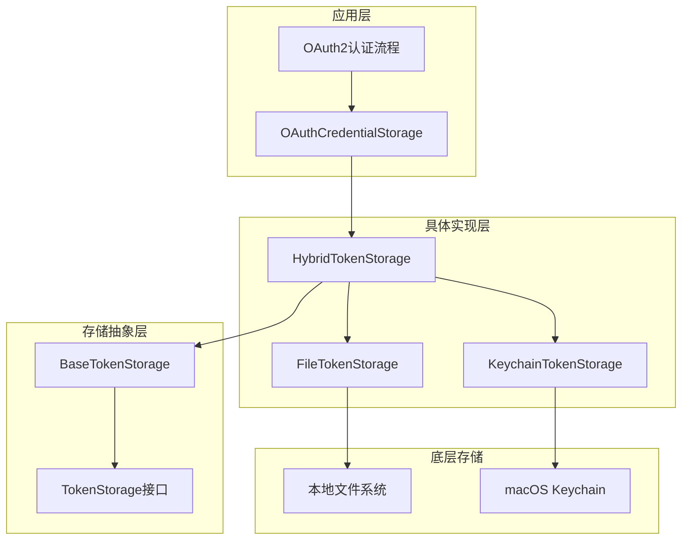
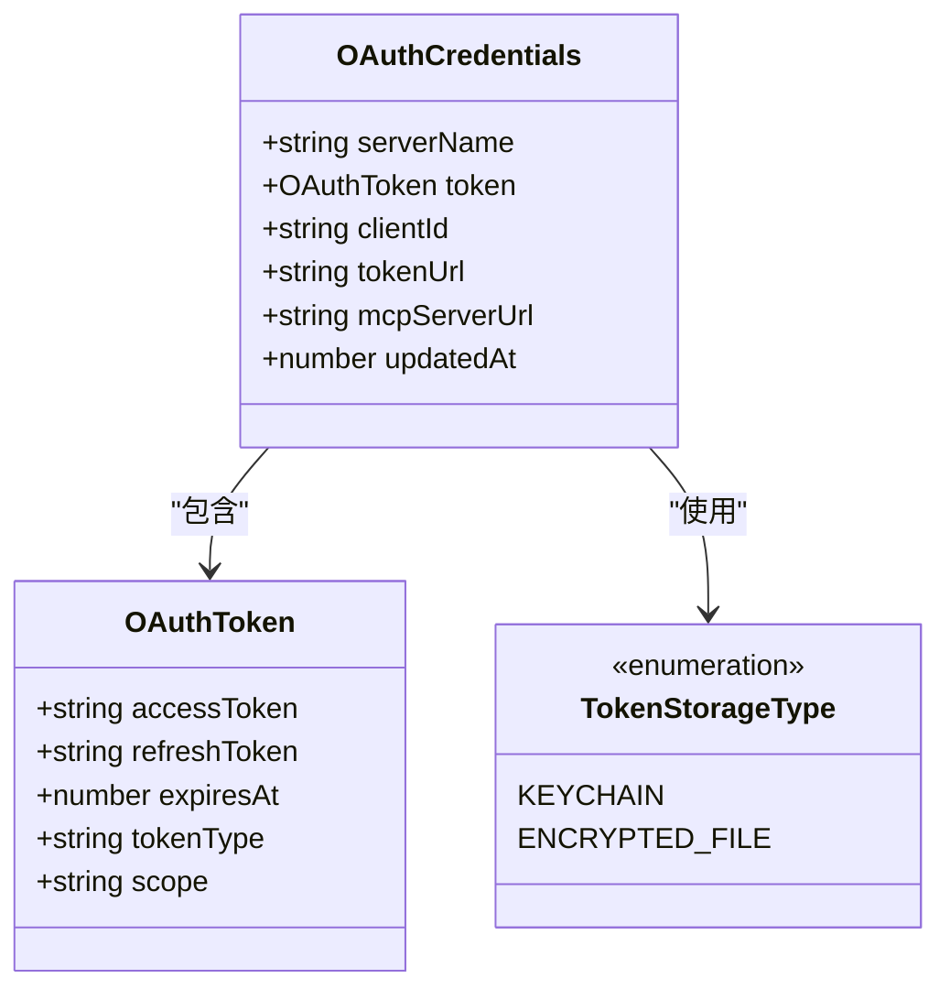
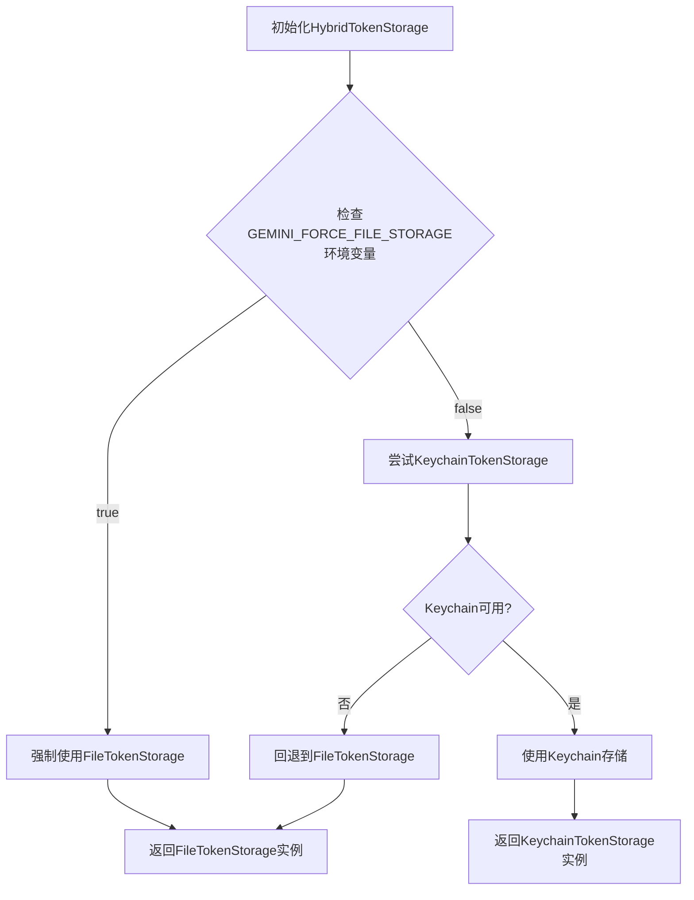
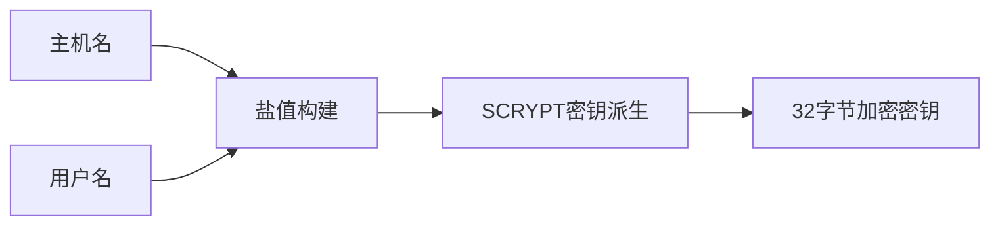
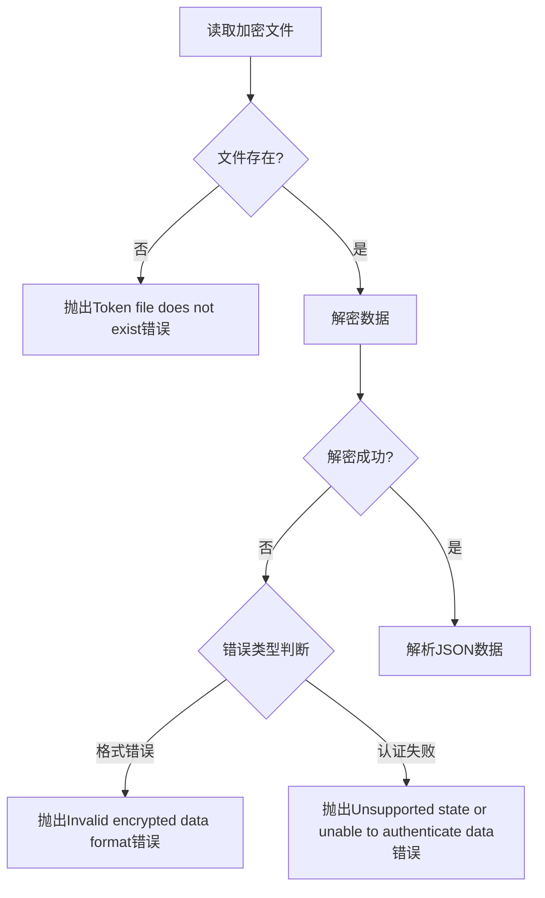
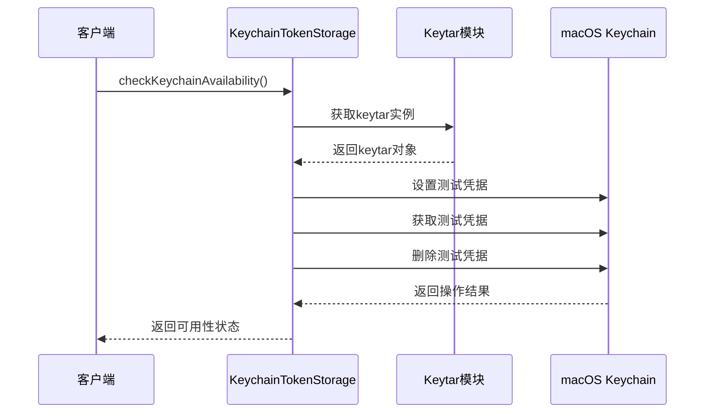
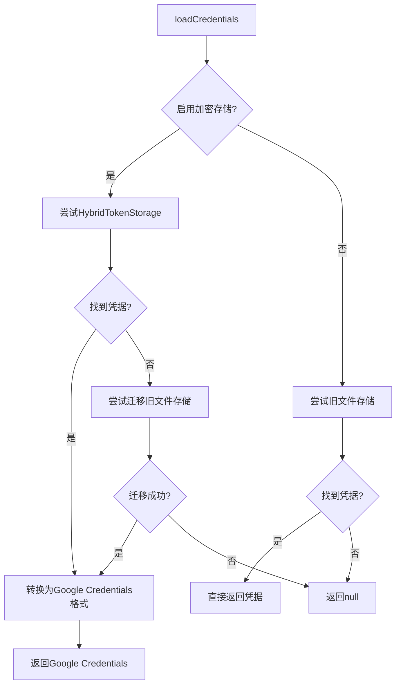

# 令牌存储与加密系统

<cite>
**本文档中引用的文件**
- [types.ts](file://packages/core/src/mcp/token-storage/types.ts)
- [base-token-storage.ts](file://packages/core/src/mcp/token-storage/base-token-storage.ts)
- [hybrid-token-storage.ts](file://packages/core/src/mcp/token-storage/hybrid-token-storage.ts)
- [file-token-storage.ts](file://packages/core/src/mcp/token-storage/file-token-storage.ts)
- [keychain-token-storage.ts](file://packages/core/src/mcp/token-storage/keychain-token-storage.ts)
- [oauth-credential-storage.ts](file://packages/core/src/code_assist/oauth-credential-storage.ts)
- [storage.ts](file://packages/core/src/config/storage.ts)
</cite>

## 目录
1. [简介](#简介)
2. [系统架构概览](#系统架构概览)
3. [核心组件分析](#核心组件分析)
4. [HybridTokenStorage智能存储机制](#hybridtokenstorage智能存储机制)
5. [FileTokenStorage AES-256-GCM加密实现](#filetokenstorage-aes-256-gcm加密实现)
6. [KeychainTokenStorage macOS密钥链集成](#keychaintokenstorage-macos密钥链集成)
7. [OAuthCredentials生命周期管理](#oauthcredentials生命周期管理)
8. [安全审计要点](#安全审计要点)
9. [故障排除指南](#故障排除指南)
10. [总结](#总结)

## 简介

Gemini CLI采用了一套先进的混合令牌存储系统，旨在为不同操作系统提供最优的令牌存储解决方案。该系统通过HybridTokenStorage类实现了智能的存储选择机制，能够根据运行环境自动选择Keychain（macOS）或加密文件存储，确保令牌数据的安全性和可用性。

系统的核心设计理念是安全性与兼容性的平衡，通过多层加密保护、智能降级机制和严格的访问控制，为用户提供可靠的身份验证凭据存储服务。

## 系统架构概览



**图表来源**
- [hybrid-token-storage.ts](file://packages/core/src/mcp/token-storage/hybrid-token-storage.ts#L1-L98)
- [base-token-storage.ts](file://packages/core/src/mcp/token-storage/base-token-storage.ts#L1-L48)

**章节来源**
- [hybrid-token-storage.ts](file://packages/core/src/mcp/token-storage/hybrid-token-storage.ts#L1-L98)
- [types.ts](file://packages/core/src/mcp/token-storage/types.ts#L1-L43)

## 核心组件分析

### TokenStorage接口设计

系统采用统一的TokenStorage接口定义，确保所有存储实现都遵循一致的契约：

```typescript
export interface TokenStorage {
  getCredentials(serverName: string): Promise<OAuthCredentials | null>;
  setCredentials(credentials: OAuthCredentials): Promise<void>;
  deleteCredentials(serverName: string): Promise<void>;
  listServers(): Promise<string[]>;
  getAllCredentials(): Promise<Map<string, OAuthCredentials>>;
  clearAll(): Promise<void>;
}
```

### OAuthCredentials数据模型



**图表来源**
- [types.ts](file://packages/core/src/mcp/token-storage/types.ts#L10-L30)

**章节来源**
- [types.ts](file://packages/core/src/mcp/token-storage/types.ts#L1-L43)

## HybridTokenStorage智能存储机制

HybridTokenStorage是整个令牌存储系统的核心控制器，它实现了智能的存储选择机制，能够在Keychain和文件存储之间无缝切换。

### 存储选择策略



**图表来源**
- [hybrid-token-storage.ts](file://packages/core/src/mcp/token-storage/hybrid-token-storage.ts#L25-L45)

### 智能初始化过程

系统采用了单例模式和延迟初始化策略，确保存储选择只执行一次并缓存结果：

```typescript
private async getStorage(): Promise<TokenStorage> {
  if (this.storage !== null) {
    return this.storage;
  }

  // 使用单个初始化promise避免竞争条件
  if (!this.storageInitPromise) {
    this.storageInitPromise = this.initializeStorage();
  }

  // 等待初始化完成
  return await this.storageInitPromise;
}
```

### 环境变量控制

系统提供了`GEMINI_FORCE_FILE_STORAGE`环境变量，允许用户强制使用文件存储：

```bash
# 强制使用文件存储
export GEMINI_FORCE_FILE_STORAGE=true

# 使用默认的智能选择
unset GEMINI_FORCE_FILE_STORAGE
```

**章节来源**
- [hybrid-token-storage.ts](file://packages/core/src/mcp/token-storage/hybrid-token-storage.ts#L1-L98)

## FileTokenStorage AES-256-GCM加密实现

FileTokenStorage提供了基于AES-256-GCM对称加密的文件存储解决方案，确保令牌数据在本地文件系统中的安全性。

### 加密密钥派生机制



**图表来源**
- [file-token-storage.ts](file://packages/core/src/mcp/token-storage/file-token-storage.ts#L30-L35)

系统使用SCRYPT算法基于主机名和用户名派生加密密钥：

```typescript
private deriveEncryptionKey(): Buffer {
  const salt = `${os.hostname()}-${os.userInfo().username}-gemini-cli`;
  return crypto.scryptSync('gemini-cli-oauth', salt, 32);
}
```

### 加密数据格式

FileTokenStorage采用标准的AES-256-GCM加密，数据格式为：

```
IV(16字节):认证标签(16字节):密文
```

加密过程：

```typescript
private encrypt(text: string): string {
  const iv = crypto.randomBytes(16);
  const cipher = crypto.createCipheriv('aes-256-gcm', this.encryptionKey, iv);

  let encrypted = cipher.update(text, 'utf8', 'hex');
  encrypted += cipher.final('hex');

  const authTag = cipher.getAuthTag();
  return iv.toString('hex') + ':' + authTag.toString('hex') + ':' + encrypted;
}
```

### 文件权限控制

系统严格控制令牌文件的访问权限：

- **目录权限**: `0o700`（仅用户可读写执行）
- **文件权限**: `0o600`（仅用户可读写）

```typescript
await fs.writeFile(this.tokenFilePath, encrypted, { mode: 0o600 });
```

### 错误处理机制



**图表来源**
- [file-token-storage.ts](file://packages/core/src/mcp/token-storage/file-token-storage.ts#L75-L95)

**章节来源**
- [file-token-storage.ts](file://packages/core/src/mcp/token-storage/file-token-storage.ts#L1-L185)

## KeychainTokenStorage macOS密钥链集成

KeychainTokenStorage为macOS系统提供了原生的密钥链集成，利用系统级别的安全存储机制保护令牌数据。

### Keytar模块集成

系统通过动态导入方式集成keytar模块：

```typescript
async getKeytar(): Promise<Keytar | null> {
  if (this.keytarLoadAttempted) {
    return this.keytarModule;
  }

  this.keytarLoadAttempted = true;

  try {
    const moduleName = 'keytar';
    const module = await import(moduleName);
    this.keytarModule = module.default || module;
  } catch (error) {
    console.error(error);
  }
  return this.keytarModule;
}
```

### 密钥链可用性检测

系统实现了完善的密钥链可用性检测机制：



**图表来源**
- [keychain-token-storage.ts](file://packages/core/src/mcp/token-storage/keychain-token-storage.ts#L200-L230)

### 凭据存储格式

KeychainTokenStorage将OAuthCredentials序列化为JSON字符串后存储：

```typescript
const data = JSON.stringify(updatedCredentials);
await keytar.setPassword(this.serviceName, sanitizedName, data);
```

### 服务器名称清理

系统会对服务器名称进行清理，确保符合密钥链命名规范：

```typescript
protected sanitizeServerName(serverName: string): string {
  return serverName.replace(/[^a-zA-Z0-9-_.]/g, '_');
}
```

**章节来源**
- [keychain-token-storage.ts](file://packages/core/src/mcp/token-storage/keychain-token-storage.ts#L1-L252)

## OAuthCredentials生命周期管理

OAuthCredentialStorage作为OAuth2认证流程与令牌存储之间的桥梁，负责管理OAuth凭据的完整生命周期。

### 凭据加载流程



**图表来源**
- [oauth-credential-storage.ts](file://packages/core/src/code_assist/oauth-credential-storage.ts#L25-L50)

### 凭据保存机制

```typescript
static async saveCredentials(credentials: Credentials): Promise<void> {
  if (!credentials.access_token) {
    throw new Error('Attempted to save credentials without an access token.');
  }

  // 转换为OAuthCredentials格式
  const mcpCredentials: OAuthCredentials = {
    serverName: MAIN_ACCOUNT_KEY,
    token: {
      accessToken: credentials.access_token,
      refreshToken: credentials.refresh_token || undefined,
      tokenType: credentials.token_type || 'Bearer',
      scope: credentials.scope || undefined,
      expiresAt: credentials.expiry_date || undefined,
    },
    updatedAt: Date.now(),
  };

  await this.storage.setCredentials(mcpCredentials);
}
```

### 自动迁移机制

系统提供了从旧文件存储向新密钥链存储的自动迁移功能：

```typescript
private static async migrateFromFileStorage(): Promise<Credentials | null> {
  const oldFilePath = path.join(os.homedir(), GEMINI_DIR, OAUTH_FILE);

  let credsJson: string;
  try {
    credsJson = await fs.readFile(oldFilePath, 'utf-8');
  } catch (error: unknown) {
    if (typeof error === 'object' && error !== null && 'code' in error && error.code === 'ENOENT') {
      return null;
    }
    throw error;
  }

  const credentials = JSON.parse(credsJson) as Credentials;
  
  // 保存到新存储
  await this.saveCredentials(credentials);
  
  // 迁移完成后删除旧文件
  await fs.rm(oldFilePath, { force: true }).catch(() => {});

  return credentials;
}
```

**章节来源**
- [oauth-credential-storage.ts](file://packages/core/src/code_assist/oauth-credential-storage.ts#L1-L131)

## 安全审计要点

### 访问权限审计

1. **文件权限检查**
   ```bash
   # 检查令牌文件权限
   ls -la ~/.gemini/mcp-oauth-tokens-v2.json
   
   # 检查目录权限
   ls -ld ~/.gemini/
   ```

2. **存储类型验证**
   ```javascript
   // 验证当前使用的存储类型
   const storage = new HybridTokenStorage('gemini-cli-oauth');
   const storageType = await storage.getStorageType();
   console.log(`当前存储类型: ${storageType}`);
   ```

### 加密强度验证

1. **密钥派生验证**
   - 确认使用SCRYPT算法
   - 验证32字节密钥长度
   - 检查盐值包含主机名和用户名

2. **加密算法验证**
   - 确认使用AES-256-GCM
   - 验证随机IV生成
   - 检查认证标签完整性

### 密钥链可用性检查

```javascript
// 检查Keychain是否可用
const { KeychainTokenStorage } = require('./keychain-token-storage');
const keychain = new KeychainTokenStorage('test-service');
const available = await keychain.isAvailable();
console.log(`Keychain可用性: ${available}`);
```

### 日志监控

系统会在以下情况下记录日志：
- 存储初始化失败
- 密钥链操作异常
- 加密解密错误
- 迁移过程问题

**章节来源**
- [file-token-storage.ts](file://packages/core/src/mcp/token-storage/file-token-storage.ts#L30-L40)
- [keychain-token-storage.ts](file://packages/core/src/mcp/token-storage/keychain-token-storage.ts#L200-L230)

## 故障排除指南

### 常见问题诊断

1. **Keychain不可用**
   ```
   问题症状: 使用文件存储而非密钥链
   解决方案: 
   - 检查keytar模块安装
   - 验证macOS Keychain服务状态
   - 检查应用程序权限
   ```

2. **加密文件损坏**
   ```
   问题症状: "Token file corrupted"错误
   解决方案:
   - 备份并删除损坏的令牌文件
   - 重新登录获取新的令牌
   ```

3. **权限问题**
   ```
   问题症状: "Permission denied"错误
   解决方案:
   - 检查~/.gemini目录权限
   - 确保用户对令牌文件有读写权限
   ```

### 调试工具

1. **存储类型检查**
   ```javascript
   const storage = new HybridTokenStorage('gemini-cli-oauth');
   const type = await storage.getStorageType();
   console.log(`存储类型: ${type}`);
   ```

2. **凭据列表查看**
   ```javascript
   const storage = new HybridTokenStorage('gemini-cli-oauth');
   const servers = await storage.listServers();
   console.log(`已保存的服务器: ${servers.join(', ')}`);
   ```

3. **强制文件存储**
   ```bash
   # 强制使用文件存储进行调试
   export GEMINI_FORCE_FILE_STORAGE=true
   ```

**章节来源**
- [hybrid-token-storage.ts](file://packages/core/src/mcp/token-storage/hybrid-token-storage.ts#L25-L45)
- [file-token-storage.ts](file://packages/core/src/mcp/token-storage/file-token-storage.ts#L75-L95)

## 总结

Gemini CLI的令牌存储与加密系统展现了现代软件开发中安全与可用性平衡的最佳实践。通过HybridTokenStorage的智能选择机制，系统能够在不同环境下提供最优的存储解决方案。

### 主要特性总结

1. **智能存储选择**: 根据环境自动选择Keychain或文件存储
2. **强加密保护**: AES-256-GCM对称加密确保数据安全
3. **严格权限控制**: 0o600文件权限和0o700目录权限
4. **完整生命周期管理**: 从创建到过期的完整凭据管理
5. **自动迁移机制**: 平滑从旧存储向新存储的迁移
6. **健壮错误处理**: 完善的异常处理和恢复机制

### 安全优势

- **多层防护**: 结合系统级密钥链和本地文件加密
- **密钥隔离**: 基于主机名和用户名的密钥派生
- **完整性保护**: AES-256-GCM的认证加密模式
- **访问控制**: 严格的文件系统权限管理

这套系统为开发者提供了一个安全、可靠且易于维护的令牌存储解决方案，充分体现了现代软件工程中安全设计的重要性。