# 企业级MCP安全策略权威指南

<cite>
**本文档引用的文件**
- [packages/cli/src/config/policy.ts](file://packages/cli/src/config/policy.ts)
- [packages/cli/src/config/settings.ts](file://packages/cli/src/config/settings.ts)
- [packages/cli/src/config/trustedFolders.ts](file://packages/cli/src/config/trustedFolders.ts)
- [packages/cli/src/config/policy-engine.integration.test.ts](file://packages/cli/src/config/policy-engine.integration.test.ts)
- [packages/cli/src/config/policy.test.ts](file://packages/cli/src/config/policy.test.ts)
- [packages/cli/src/commands/mcp/add.ts](file://packages/cli/src/commands/mcp/add.ts)
- [packages/cli/src/commands/mcp/list.ts](file://packages/cli/src/commands/mcp/list.ts)
- [packages/core/src/tools/mcp-tool.ts](file://packages/core/src/tools/mcp-tool.ts)
- [README.md](file://README.md)
- [SECURITY.md](file://SECURITY.md)
</cite>

## 目录
1. [概述](#概述)
2. [系统级settings.json配置详解](#系统级settingsjson配置详解)
3. [配置合并规则与作用域优先级](#配置合并规则与作用域优先级)
4. [MCP服务器安全策略机制](#mcp服务器安全策略机制)
5. [企业级安全策略实施](#企业级安全策略实施)
6. [工具过滤机制与纵深防御](#工具过滤机制与纵深防御)
7. [策略冲突处理与最佳实践](#策略冲突处理与最佳实践)
8. [安全审计与监控](#安全审计与监控)
9. [故障排除指南](#故障排除指南)
10. [总结](#总结)

## 概述

Gemini CLI采用多层安全策略架构，通过系统级settings.json文件中的`mcp.allowed`配置项建立服务器allowlist，强制执行企业级安全策略。该系统实现了基于优先级的配置合并机制，确保在企业环境中构建强大的纵深防御体系。

本指南详细阐述了如何通过配置合并规则（系统>工作区>用户）和同名服务器配置的覆盖规则，结合mcp.allowed和工具过滤机制，构建完整的企业级安全防护体系。

## 系统级settings.json配置详解

### mcp.allowed配置项工作机制

`mcp.allowed`配置项是Gemini CLI安全策略的核心组件，它定义了一个允许访问的MCP服务器列表。当配置在系统级settings.json文件中时，具有最高优先级的安全控制能力。


**图表来源**
- [packages/cli/src/config/policy.ts](file://packages/cli/src/config/policy.ts#L60-L85)

### 配置语法与格式

系统级settings.json文件中的mcp.allowed配置遵循以下格式：

```json
{
  "mcp": {
    "allowed": [
      "server-name-1",
      "server-name-2",
      "trusted-server"
    ]
  }
}
```

每个服务器名称对应一个MCP服务器实例，系统会自动生成相应的通配符规则：
- `server-name-1__*` - 允许该服务器的所有工具
- `server-name-2__*` - 允许该服务器的所有工具
- `trusted-server__*` - 允许该服务器的所有工具

**章节来源**
- [packages/cli/src/config/policy.ts](file://packages/cli/src/config/policy.ts#L60-L85)

## 配置合并规则与作用域优先级

### 优先级系统设计

Gemini CLI实现了严格的配置优先级系统，确保企业级安全策略的强制执行：


**图表来源**
- [packages/cli/src/config/policy.ts](file://packages/cli/src/config/policy.ts#L32-L45)
- [packages/cli/src/config/settings.ts](file://packages/cli/src/config/settings.ts#L360-L380)

### 合并算法实现

配置合并采用深度合并算法，按照以下顺序处理：

1. **系统默认设置** - 提供基础配置模板
2. **用户设置** - 用户个性化配置
3. **工作区设置** - 项目特定配置
4. **系统设置** - 最高优先级的企业级配置

```typescript
function mergeSettings(
  system: Settings,
  systemDefaults: Settings,
  user: Settings,
  workspace: Settings,
  isTrusted: boolean,
): Settings {
  const safeWorkspace = isTrusted ? workspace : ({} as Settings);
  
  return customDeepMerge(
    getMergeStrategyForPath,
    {},
    systemDefaults,
    user,
    safeWorkspace,
    system,
  ) as Settings;
}
```

**章节来源**
- [packages/cli/src/config/settings.ts](file://packages/cli/src/config/settings.ts#L360-L380)

## MCP服务器安全策略机制

### 信任级别与安全控制

Gemini CLI支持两种级别的MCP服务器信任机制：


**图表来源**
- [packages/cli/src/config/policy.ts](file://packages/cli/src/config/policy.ts#L85-L105)
- [packages/cli/src/config/trustedFolders.ts](file://packages/cli/src/config/trustedFolders.ts#L55-L109)

### 服务器信任验证流程


**图表来源**
- [packages/core/src/tools/mcp-tool.ts](file://packages/core/src/tools/mcp-tool.ts#L65-L92)

**章节来源**
- [packages/cli/src/config/policy.ts](file://packages/cli/src/config/policy.ts#L85-L105)
- [packages/core/src/tools/mcp-tool.ts](file://packages/core/src/tools/mcp-tool.ts#L65-L92)

## 企业级安全策略实施

### 系统级配置部署

企业管理员可以通过以下步骤部署系统级安全策略：

1. **创建系统级settings.json文件**
```json
{
  "mcp": {
    "allowed": [
      "internal-search-server",
      "database-query-server",
      "file-system-operations"
    ],
    "excluded": [
      "external-public-server",
      "untrusted-service"
    ]
  },
  "security": {
    "folderTrust": {
      "enabled": true
    }
  }
}
```

2. **配置信任文件夹**
```json
{
  "/company/projects": "TRUST_FOLDER",
  "/company/reports": "TRUST_PARENT"
}
```

3. **设置环境变量**
```bash
export GEMINI_CLI_SYSTEM_CONFIG_PATH="/etc/gemini/system-settings.json"
export GEMINI_CLI_TRUSTED_FOLDERS_PATH="/etc/gemini/trusted-folders.json"
```

### 工作区配置覆盖规则

当存在配置冲突时，系统级配置具有最高优先级：


**图表来源**
- [packages/cli/src/config/settings.ts](file://packages/cli/src/config/settings.ts#L360-L380)

**章节来源**
- [packages/cli/src/config/settings.ts](file://packages/cli/src/config/settings.ts#L360-L420)

## 工具过滤机制与纵深防御

### 多层安全过滤架构

Gemini CLI实现了基于优先级的多层安全过滤机制：

```mermaid
graph TD
A["工具请求"] --> B["策略引擎检查"]
B --> C{"信任服务器?"}
C --> |是| D["优先级: 90<br/>自动允许"]
C --> |否| E{"允许列表?"}
E --> |是| F["优先级: 85<br/>自动允许"]
E --> |否| G{"特定工具允许?"}
G --> |是| H["优先级: 100<br/>自动允许"]
G --> |否| I{"特定工具拒绝?"}
I --> |是| J["优先级: 200<br/>拒绝"]
I --> |否| K{"服务器拒绝?"}
K --> |是| L["优先级: 195<br/>拒绝"]
K --> |否| M{"自动接受?"}
M --> |是| N["优先级: 50<br/>只读工具"]
M --> |否| O["需要用户确认"]
D --> P["执行工具"]
F --> P
H --> P
J --> Q["拒绝执行"]
L --> Q
N --> P
O --> R["用户交互"]
```



**图表来源**
- [packages/cli/src/config/policy.ts](file://packages/cli/src/config/policy.ts#L32-L45)
- [packages/cli/src/config/policy.ts](file://packages/cli/src/config/policy.ts#L60-L183)

### 工具分类与安全级别

系统根据工具的功能特性进行分类，并分配相应的安全级别：

#### 只读工具（优先级: 50）
- `glob` - 文件系统搜索
- `grep` - 文本搜索
- `ls` - 列出目录内容
- `readFile` - 读取文件
- `readManyFiles` - 批量读取文件
- `webSearch` - 网络搜索

#### 写入工具（优先级: 10）
- `edit` - 编辑文件
- `memory` - 内存操作
- `shell` - 执行命令
- `writeFile` - 写入文件
- `webFetch` - 网络抓取

#### 特定工具允许（优先级: 100）
- `serverName__specificTool` - 特定服务器的特定工具

#### 特定工具拒绝（优先级: 200）
- `serverName__dangerousTool` - 危险工具明确拒绝

**章节来源**
- [packages/cli/src/config/policy.ts](file://packages/cli/src/config/policy.ts#L15-L30)
- [packages/cli/src/config/policy.ts](file://packages/cli/src/config/policy.ts#L140-L183)

## 策略冲突处理与最佳实践

### 冲突解决策略

当出现策略冲突时，Gemini CLI采用严格的优先级规则：


**图表来源**
- [packages/cli/src/config/policy.ts](file://packages/cli/src/config/policy.ts#L32-L45)

### 边界情况处理

系统特别处理以下边界情况：

1. **服务器信任与排除冲突**
```typescript
// 信任服务器 (优先级 90) vs 排除规则 (优先级 195)
// 排除规则优先级更高，服务器被拒绝
expect(engine.check({ name: 'conflicted-server__tool' })).toBe(PolicyDecision.DENY);
```

2. **特定工具允许与服务器排除冲突**
```typescript
// 服务器被排除 (优先级 195) vs 特定工具允许 (优先级 100)
// 服务器排除规则优先级更高，工具被拒绝
expect(engine.check({ name: 'my-server__specific-tool' })).toBe(PolicyDecision.DENY);
```

**章节来源**
- [packages/cli/src/config/policy-engine.integration.test.ts](file://packages/cli/src/config/policy-engine.integration.test.ts#L282-L316)

### 最佳实践建议

1. **分层安全策略**
   - 使用系统级配置定义核心安全策略
   - 工作区配置用于项目特定需求
   - 用户配置保留个人偏好

2. **最小权限原则**
   - 只允许必要的MCP服务器
   - 明确排除不安全的服务
   - 定期审查和更新策略

3. **监控与审计**
   - 记录所有工具调用
   - 监控异常访问模式
   - 建立安全事件响应流程

## 安全审计与监控

### 策略执行跟踪

Gemini CLI提供了完整的策略执行跟踪功能：


### 审计报告生成

系统可以生成详细的审计报告，包括：

- 工具调用统计
- 策略决策历史
- 异常访问事件
- 安全合规性指标

**章节来源**
- [packages/cli/src/config/policy.ts](file://packages/cli/src/config/policy.ts#L140-L183)

## 故障排除指南

### 常见问题诊断

1. **服务器无法连接**
   - 检查`mcp.allowed`配置
   - 验证服务器信任状态
   - 确认网络连接

2. **策略冲突错误**
   - 分析策略优先级
   - 检查配置文件语法
   - 验证规则覆盖关系

3. **性能问题**
   - 优化策略规则数量
   - 减少不必要的工具允许
   - 调整缓存策略

### 调试工具与方法

使用以下命令进行故障排除：

```bash
# 检查MCP服务器状态
gemini mcp list

# 验证配置文件
gemini config validate

# 查看策略决策
gemini debug policy

# 测试服务器连接
gemini mcp test server-name
```

**章节来源**
- [packages/cli/src/commands/mcp/list.ts](file://packages/cli/src/commands/mcp/list.ts#L44-L97)
- [packages/cli/src/commands/mcp/add.ts](file://packages/cli/src/commands/mcp/add.ts#L113-L134)

## 总结

Gemini CLI的企业级MCP安全策略通过以下关键机制确保安全性：

1. **系统级配置强制执行** - 通过`mcp.allowed`配置项建立服务器allowlist
2. **严格的优先级规则** - 系统>工作区>用户的三层配置合并机制
3. **多层安全过滤** - 基于优先级的工具过滤和信任机制
4. **纵深防御体系** - 结合服务器信任、工具过滤和文件夹信任
5. **实时策略控制** - 动态策略决策和冲突解决机制

这种设计确保了企业环境中的安全合规性，有效防止社会工程学攻击和未经授权的服务器接入，为组织提供了强大而灵活的安全保障。

通过正确实施这些策略，企业可以：
- 建立可信的MCP服务器生态系统
- 实现细粒度的工具访问控制
- 确保符合企业安全政策
- 提供可审计的安全操作记录
- 维护终端用户的安全体验