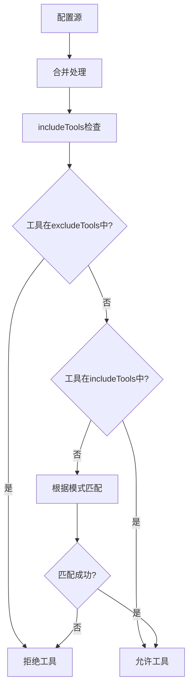
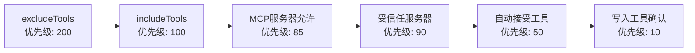
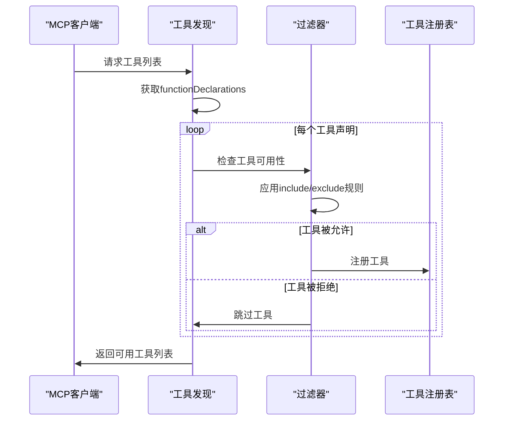
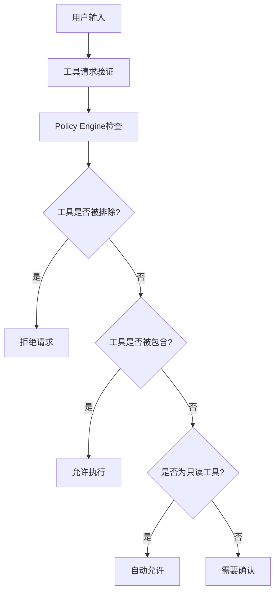

# 工具过滤机制

<cite>
**本文档引用的文件**
- [packages/cli/src/config/config.ts](file://packages/cli/src/config/config.ts)
- [packages/cli/src/config/policy.ts](file://packages/cli/src/config/policy.ts)
- [packages/core/src/tools/mcp-client.ts](file://packages/core/src/tools/mcp-client.ts)
- [packages/core/src/tools/tool-registry.ts](file://packages/core/src/tools/tool-registry.ts)
- [packages/core/src/tools/shell.ts](file://packages/core/src/tools/shell.ts)
- [packages/cli/src/config/config.test.ts](file://packages/cli/src/config/config.test.ts)
- [packages/core/src/config/config.ts](file://packages/core/src/config/config.ts)
</cite>

## 目录
1. [简介](#简介)
2. [核心概念](#核心概念)
3. [配置机制](#配置机制)
4. [过滤优先级](#过滤优先级)
5. [实现原理](#实现原理)
6. [典型应用场景](#典型应用场景)
7. [安全价值](#安全价值)
8. [最佳实践](#最佳实践)
9. [故障排除](#故障排除)
10. [总结](#总结)

## 简介

MCP（Model Context Protocol）工具过滤机制是Gemini CLI中实现最小权限原则的核心安全组件。该机制通过`includeTools`和`excludeTools`两个配置项，为MCP服务器提供了细粒度的工具访问控制能力，确保AI代理只能访问经过授权的系统工具，从而有效防止潜在的安全风险。

## 核心概念

### includeTools配置

`includeTools`配置项用于明确指定允许使用的工具列表。当配置了`includeTools`时，只有列在其中的工具才会被激活和可用。

### excludeTools配置

`excludeTools`配置项用于明确禁止使用的工具列表。当配置了`excludeTools`时，列出的所有工具都将被禁用，无论是否在`includeTools`中。

### 过滤优先级

当`includeTools`和`excludeTools`同时存在时，`excludeTools`具有更高的优先级。这意味着即使某个工具在`includeTools`中被列出，但如果它也在`excludeTools`中，则仍然会被禁用。

## 配置机制

### 基本语法

```typescript
interface MCPServerConfig {
  includeTools?: string[];
  excludeTools?: string[];
}
```

### 配置来源

工具过滤配置可以从多个来源获取：

1. **全局设置** (`settings.tools`)
2. **扩展配置** (`extension.config.excludeTools`)
3. **命令行参数** (`--allowed-tools`)
4. **MCP服务器配置** (`mcpServers`)



**图表来源**
- [packages/core/src/tools/mcp-client.ts](file://packages/core/src/tools/mcp-client.ts#L1338-L1363)

## 过滤优先级

工具过滤机制采用多层优先级系统，确保安全策略的一致性和可预测性：

### 优先级层级

1. **200** - 明确排除的工具（excludeTools）
2. **100** - 明确允许的工具（includeTools）
3. **85** - 允许的MCP服务器
4. **90** - 受信任的MCP服务器
5. **50** - 自动接受的只读工具
6. **10** - 写入工具需要确认



**图表来源**
- [packages/cli/src/config/policy.ts](file://packages/cli/src/config/policy.ts#L40-L183)

**章节来源**
- [packages/cli/src/config/policy.ts](file://packages/cli/src/config/policy.ts#L40-L183)

## 实现原理

### 核心过滤函数

`isEnabled`函数是工具过滤的核心实现：

```typescript
export function isEnabled(
  funcDecl: FunctionDeclaration,
  mcpServerName: string,
  mcpServerConfig: MCPServerConfig,
): boolean {
  if (!funcDecl.name) {
    console.warn(`Discovered a function declaration without a name from MCP server '${mcpServerName}'. Skipping.`);
    return false;
  }
  
  const { includeTools, excludeTools } = mcpServerConfig;

  // excludeTools takes precedence over includeTools
  if (excludeTools && excludeTools.includes(funcDecl.name)) {
    return false;
  }

  return (
    !includeTools ||
    includeTools.some(
      (tool) => tool === funcDecl.name || tool.startsWith(`${funcDecl.name}(`),
    )
  );
}
```

### 工具发现流程



**图表来源**
- [packages/core/src/tools/mcp-client.ts](file://packages/core/src/tools/mcp-client.ts#L565-L601)

### 合并排除工具

`mergeExcludeTools`函数负责从所有配置源合并排除工具：

```typescript
function mergeExcludeTools(
  settings: Settings,
  extensions: Extension[],
  extraExcludes?: string[] | undefined,
): string[] {
  const allExcludeTools = new Set([
    ...(settings.tools?.exclude || []),
    ...(extraExcludes || []),
  ]);
  
  for (const extension of extensions) {
    for (const tool of extension.config.excludeTools || []) {
      allExcludeTools.add(tool);
    }
  }
  
  return [...allExcludeTools];
}
```

**章节来源**
- [packages/core/src/tools/mcp-client.ts](file://packages/core/src/tools/mcp-client.ts#L1338-L1363)
- [packages/cli/src/config/config.ts](file://packages/cli/src/config/config.ts#L810-L825)

## 典型应用场景

### 场景一：仅包含特定工具

**配置示例：**
```json
{
  "mcpServers": {
    "safe-server": {
      "includeTools": ["read_file", "list_directory"],
      "excludeTools": []
    }
  }
}
```

**效果：**
- 只允许`read_file`和`list_directory`工具
- 禁用其他所有工具
- 适用于只读环境或受限访问场景

### 场景二：排除危险工具

**配置示例：**
```json
{
  "mcpServers": {
    "development-server": {
      "includeTools": ["*"],
      "excludeTools": ["run_shell_command(rm -rf)", "write_file(/etc/passwd)"]
    }
  }
}
```

**效果：**
- 允许所有工具（通配符）
- 特别排除危险命令
- 保护系统关键文件和操作

### 场景三：精确控制单个工具

**配置示例：**
```json
{
  "mcpServers": {
    "restricted-shell": {
      "includeTools": ["run_shell_command(ls)", "run_shell_command(pwd)"],
      "excludeTools": ["run_shell_command(*)"]
    }
  }
}
```

**效果：**
- 只允许特定子命令
- 排除所有其他shell命令
- 实现精细化权限控制

### 场景四：包含与排除规则冲突

**配置示例：**
```json
{
  "mcpServers": {
    "conflicting-config": {
      "includeTools": ["dangerous_tool"],
      "excludeTools": ["dangerous_tool"]
    }
  }
}
```

**效果：**
- `excludeTools`优先级更高
- `dangerous_tool`最终被排除
- 确保安全策略不会被意外绕过

**章节来源**
- [packages/cli/src/config/config.test.ts](file://packages/cli/src/config/config.test.ts#L1240-L1439)

## 安全价值

### 最小权限原则

工具过滤机制严格遵循最小权限原则：

1. **默认拒绝** - 所有工具默认被禁用
2. **显式授权** - 只有明确列出的工具才被允许
3. **优先级保护** - 排除规则优先于包含规则

### 多层防护



**图表来源**
- [packages/cli/src/config/policy.ts](file://packages/cli/src/config/policy.ts#L40-L183)

### 动态权限管理

- **运行时调整** - 支持动态修改权限配置
- **条件授权** - 基于上下文的智能授权决策
- **审计追踪** - 记录所有工具访问和执行历史

**章节来源**
- [packages/cli/src/config/policy.ts](file://packages/cli/src/config/policy.ts#L40-L183)

## 最佳实践

### 企业安全策略示例

**开发环境配置：**
```json
{
  "mcp": {
    "allowed": ["development-tools"],
    "excluded": ["production-server"]
  },
  "tools": {
    "allowed": ["read_file", "list_directory"],
    "exclude": ["run_shell_command(*)"]
  }
}
```

**生产环境配置：**
```json
{
  "mcp": {
    "allowed": ["monitoring-server"],
    "excluded": ["development-server", "admin-tools"]
  },
  "tools": {
    "allowed": ["read_file", "list_directory", "web_search"],
    "exclude": ["write_file", "run_shell_command", "edit_file"]
  }
}
```

### 配置验证建议

1. **定期审查** - 定期检查和更新工具权限配置
2. **分层管理** - 使用不同级别的配置文件管理权限
3. **监控告警** - 设置工具访问异常的监控和告警
4. **文档记录** - 详细记录每个权限变更的原因和影响

### 开发者指南

- **测试环境** - 在测试环境中充分验证权限配置
- **渐进式部署** - 逐步开放权限，避免一次性大范围变更
- **回滚计划** - 准备权限配置回滚方案
- **团队协作** - 建立权限配置的审批和审核流程

## 故障排除

### 常见问题

**问题1：工具无法找到**
- 检查`includeTools`配置是否正确
- 验证工具名称拼写和格式
- 确认MCP服务器连接状态

**问题2：权限配置不生效**
- 检查配置文件语法
- 验证配置优先级顺序
- 确认配置文件加载路径

**问题3：排除规则被忽略**
- 确认`excludeTools`优先级高于`includeTools`
- 检查工具名称匹配规则
- 验证配置合并逻辑

### 调试技巧

```typescript
// 启用调试模式查看工具过滤过程
const debugConfig = {
  debugMode: true,
  excludeTools: ['dangerous_tool']
};

// 查看工具注册日志
console.log('Registered tools:', toolRegistry.getAllToolNames());
console.log('Filtered tools:', toolRegistry.getFunctionDeclarations());
```

**章节来源**
- [packages/cli/src/config/config.test.ts](file://packages/cli/src/config/config.test.ts#L1240-L1439)

## 总结

MCP工具过滤机制通过精心设计的`includeTools`和`excludeTools`配置系统，为Gemini CLI提供了强大的安全控制能力。该机制不仅实现了最小权限原则，还通过多层优先级系统确保了安全策略的一致性和可预测性。

### 关键优势

1. **细粒度控制** - 支持精确到单个工具的权限管理
2. **灵活配置** - 支持多种配置来源和合并策略
3. **安全优先** - 排除规则优先于包含规则，确保安全底线
4. **易于维护** - 清晰的配置语法和优先级规则

### 未来展望

随着AI代理在企业环境中的广泛应用，工具过滤机制将继续演进，可能包括：

- 更智能的权限推荐系统
- 基于机器学习的异常检测
- 更丰富的权限模板和预设
- 与企业身份认证系统的深度集成

通过合理配置和使用工具过滤机制，组织可以安全地利用AI代理的强大功能，同时确保系统安全和数据保护。