# MCP客户端集成

<cite>
**本文档引用的文件**
- [mcp-client.ts](file://packages/core/src/tools/mcp-client.ts)
- [mcp-client-manager.ts](file://packages/core/src/tools/mcp-client-manager.ts)
- [mcp-tool.ts](file://packages/core/src/tools/mcp-tool.ts)
- [add.ts](file://packages/cli/src/commands/mcp/add.ts)
- [list.ts](file://packages/cli/src/commands/mcp/list.ts)
- [remove.ts](file://packages/cli/src/commands/mcp/remove.ts)
- [config.ts](file://packages/core/src/config/config.ts)
- [settings.ts](file://packages/cli/src/config/settings.ts)
</cite>

## 目录
1. [简介](#简介)
2. [项目结构](#项目结构)
3. [核心组件](#核心组件)
4. [架构概览](#架构概览)
5. [详细组件分析](#详细组件分析)
6. [依赖关系分析](#依赖关系分析)
7. [性能考虑](#性能考虑)
8. [故障排除指南](#故障排除指南)
9. [结论](#结论)

## 简介

MCP（Model Context Protocol）客户端集成是Gemini CLI的核心功能之一，它允许用户连接到外部MCP服务器并利用其提供的工具和服务。该系统提供了完整的MCP服务器生命周期管理，包括连接、发现、工具注册和错误处理等功能。

本文档详细介绍了McpClient类的连接管理机制、多服务器实例的生命周期管理、工具与提示词的发现流程，以及在CLI中使用各种命令管理MCP服务器的实际示例。

## 项目结构

MCP客户端集成主要分布在以下目录结构中：

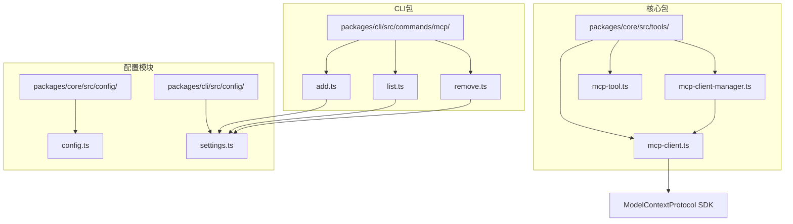

**图表来源**
- [mcp-client.ts](file://packages/core/src/tools/mcp-client.ts#L1-L50)
- [mcp-client-manager.ts](file://packages/core/src/tools/mcp-client-manager.ts#L1-L30)

## 核心组件

### McpClient类

McpClient是MCP客户端集成的核心类，负责单个MCP服务器的连接管理和状态控制。

```typescript
export class McpClient {
  private client: Client | undefined;
  private transport: Transport | undefined;
  private status: MCPServerStatus = MCPServerStatus.DISCONNECTED;

  constructor(
    private readonly serverName: string,
    private readonly serverConfig: MCPServerConfig,
    private readonly toolRegistry: ToolRegistry,
    private readonly promptRegistry: PromptRegistry,
    private readonly workspaceContext: WorkspaceContext,
    private readonly debugMode: boolean,
  ) {}
}
```

### 连接状态枚举

```typescript
export enum MCPServerStatus {
  DISCONNECTED = 'disconnected',
  DISCONNECTING = 'disconnecting',
  CONNECTING = 'connecting',
  CONNECTED = 'connected',
}
```

**章节来源**
- [mcp-client.ts](file://packages/core/src/tools/mcp-client.ts#L40-L80)

## 架构概览

MCP客户端集成采用分层架构设计，包含以下主要层次：

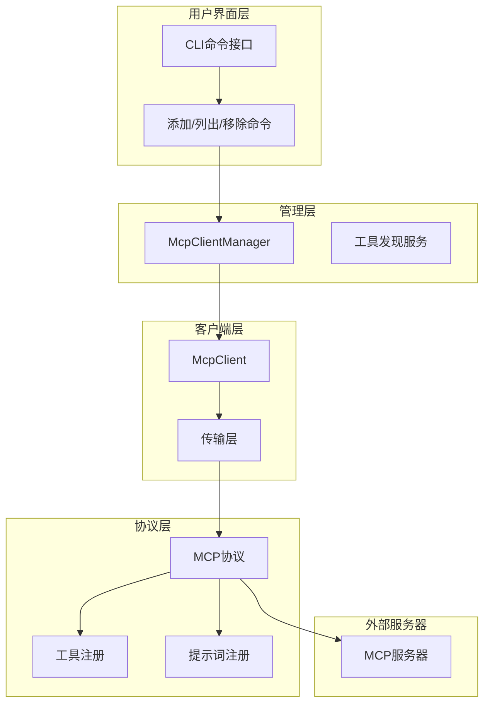

**图表来源**
- [mcp-client-manager.ts](file://packages/core/src/tools/mcp-client-manager.ts#L20-L50)
- [mcp-client.ts](file://packages/core/src/tools/mcp-client.ts#L80-L120)

## 详细组件分析

### McpClient类详细分析

#### 连接管理方法

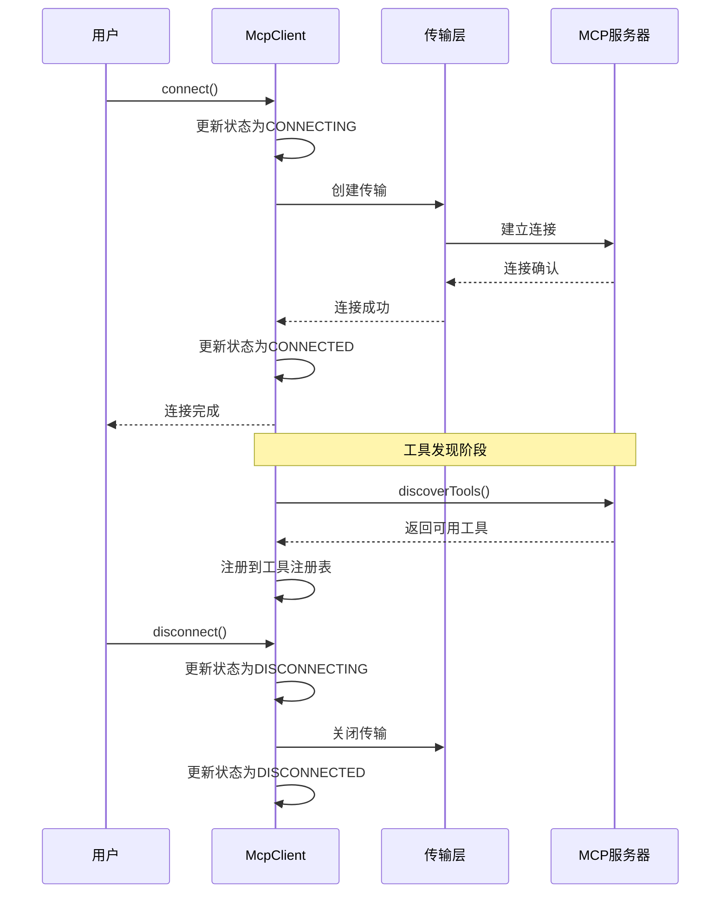

**图表来源**
- [mcp-client.ts](file://packages/core/src/tools/mcp-client.ts#L85-L150)
- [mcp-client.ts](file://packages/core/src/tools/mcp-client.ts#L152-L180)

#### discover()方法实现

discover()方法负责从MCP服务器发现可用的工具和提示词：

```typescript
async discover(cliConfig: Config): Promise<void> {
  if (this.status !== MCPServerStatus.CONNECTED) {
    throw new Error('Client is not connected.');
  }

  const prompts = await this.discoverPrompts();
  const tools = await this.discoverTools(cliConfig);

  if (prompts.length === 0 && tools.length === 0) {
    throw new Error('No prompts or tools found on the server.');
  }

  for (const tool of tools) {
    this.toolRegistry.registerTool(tool);
  }
}
```

#### 错误处理和重试机制

MCP客户端实现了完善的错误处理和自动重试机制：

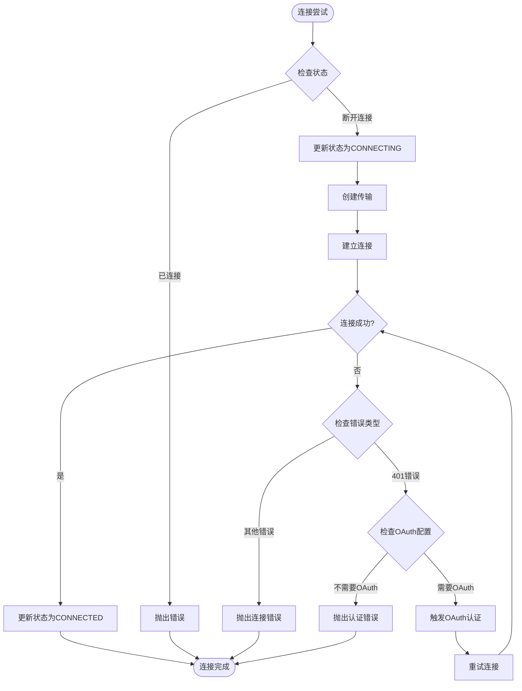

**图表来源**
- [mcp-client.ts](file://packages/core/src/tools/mcp-client.ts#L800-L900)

**章节来源**
- [mcp-client.ts](file://packages/core/src/tools/mcp-client.ts#L152-L180)
- [mcp-client.ts](file://packages/core/src/tools/mcp-client.ts#L800-L1000)

### McpClientManager类分析

McpClientManager负责管理多个MCP客户端实例的生命周期：

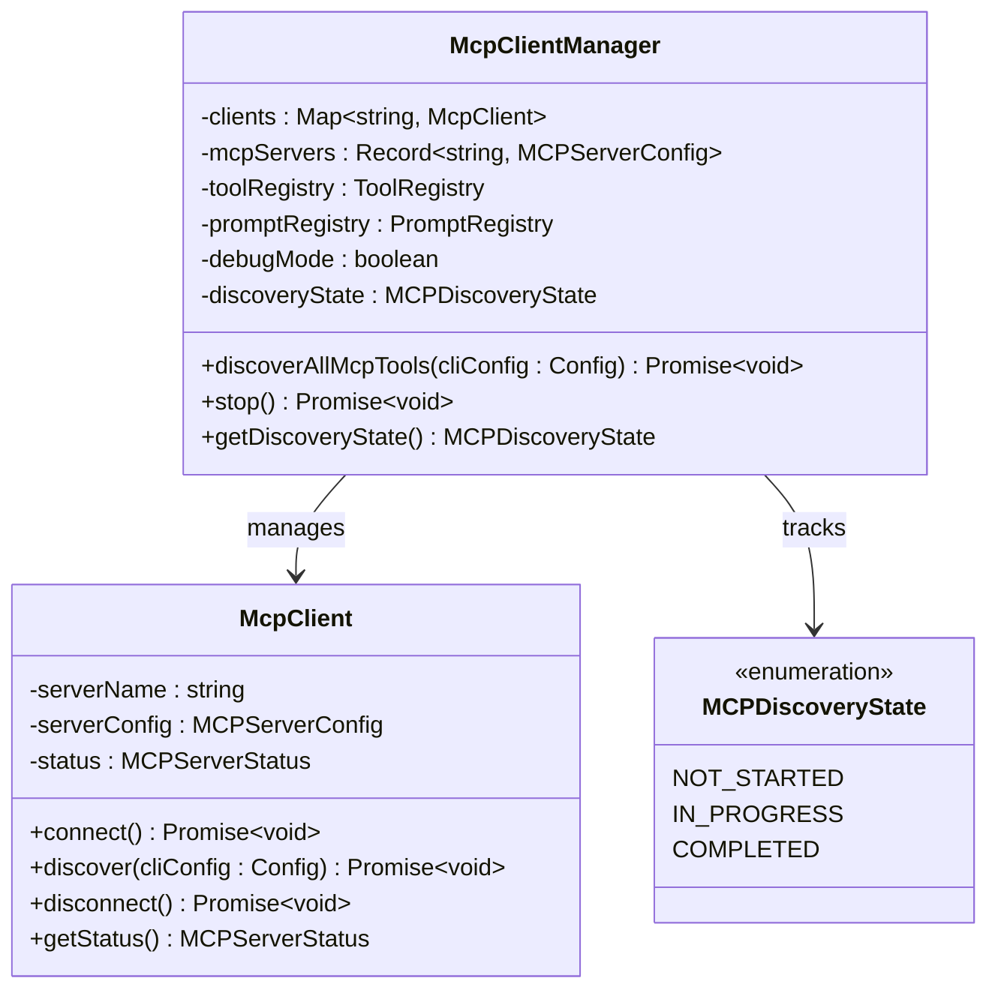

**图表来源**
- [mcp-client-manager.ts](file://packages/core/src/tools/mcp-client-manager.ts#L20-L60)

#### 多服务器发现流程

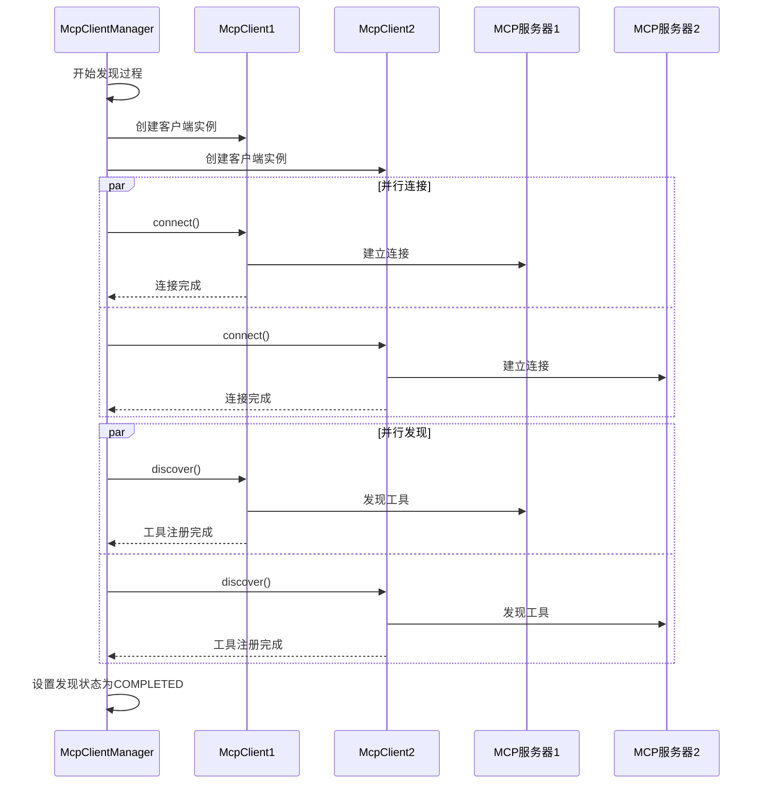

**图表来源**
- [mcp-client-manager.ts](file://packages/core/src/tools/mcp-client-manager.ts#L60-L100)

**章节来源**
- [mcp-client-manager.ts](file://packages/core/src/tools/mcp-client-manager.ts#L20-L130)

### 传输层和认证机制

#### 支持的传输类型

MCP客户端支持多种传输方式：

1. **Stdio传输**：用于本地进程通信
2. **SSE传输**：用于HTTP服务器事件流
3. **HTTP传输**：用于标准HTTP请求

```typescript
// Stdio传输配置
if (mcpServerConfig.command) {
  const transport = new StdioClientTransport({
    command: mcpServerConfig.command,
    args: mcpServerConfig.args || [],
    env: { ...process.env, ...(mcpServerConfig.env || {}) },
    cwd: mcpServerConfig.cwd,
    stderr: 'pipe',
  });
  return transport;
}
```

#### OAuth认证流程

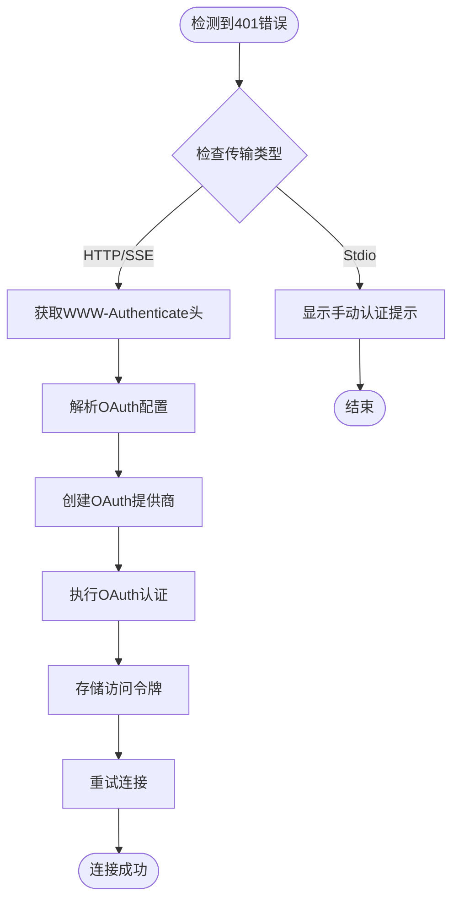

**图表来源**
- [mcp-client.ts](file://packages/core/src/tools/mcp-client.ts#L850-L950)

**章节来源**
- [mcp-client.ts](file://packages/core/src/tools/mcp-client.ts#L1200-L1364)

### 工具注册和发现机制

#### DiscoveredMCPTool类

DiscoveredMCPTool类负责将远程MCP工具包装为本地工具：

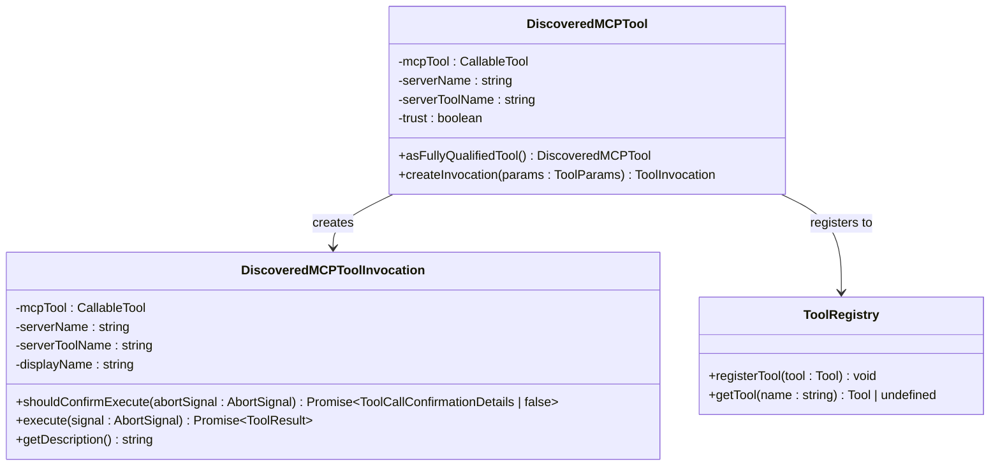

**图表来源**
- [mcp-tool.ts](file://packages/core/src/tools/mcp-tool.ts#L100-L150)

#### 工具发现流程

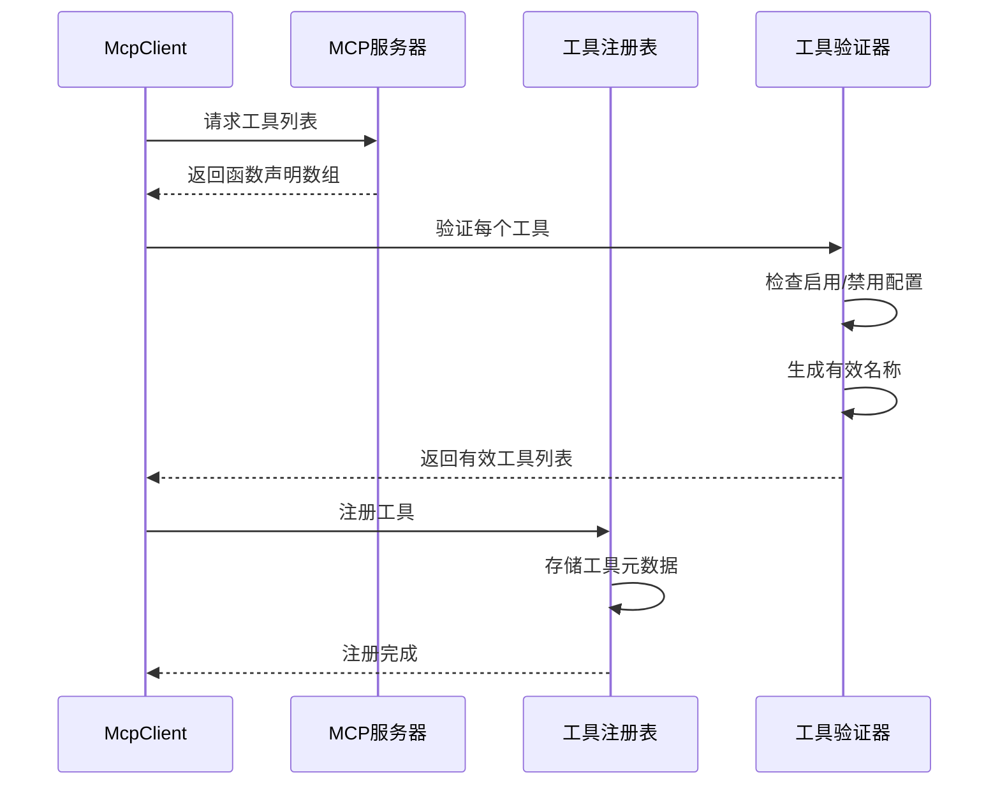

**图表来源**
- [mcp-client.ts](file://packages/core/src/tools/mcp-client.ts#L600-L700)

**章节来源**
- [mcp-tool.ts](file://packages/core/src/tools/mcp-tool.ts#L100-L200)
- [mcp-client.ts](file://packages/core/src/tools/mcp-client.ts#L600-L700)

### CLI命令管理

#### 添加MCP服务器命令

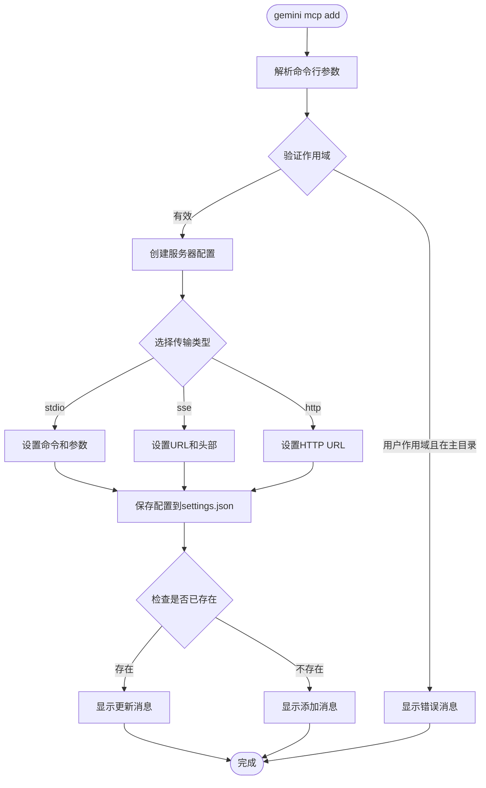

**图表来源**
- [add.ts](file://packages/cli/src/commands/mcp/add.ts#L20-L80)

#### 列表和移除命令

CLI提供了完整的MCP服务器管理命令：

```typescript
// 列表命令
export const listCommand: CommandModule = {
  command: 'list',
  describe: 'List all configured MCP servers',
  handler: async () => {
    await listMcpServers();
  },
};

// 移除命令
export const removeCommand: CommandModule = {
  command: 'remove <name>',
  describe: 'Remove a server',
  handler: async (argv) => {
    await removeMcpServer(argv['name'] as string, {
      scope: argv['scope'] as string,
    });
  },
};
```

**章节来源**
- [add.ts](file://packages/cli/src/commands/mcp/add.ts#L20-L233)
- [list.ts](file://packages/cli/src/commands/mcp/list.ts#L20-L140)
- [remove.ts](file://packages/cli/src/commands/mcp/remove.ts#L20-L61)

## 依赖关系分析

MCP客户端集成的依赖关系如下：

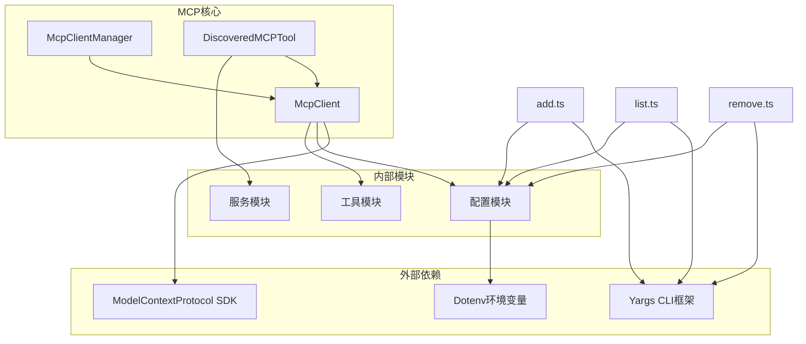

**图表来源**
- [mcp-client.ts](file://packages/core/src/tools/mcp-client.ts#L1-L30)
- [add.ts](file://packages/cli/src/commands/mcp/add.ts#L1-L10)

**章节来源**
- [mcp-client.ts](file://packages/core/src/tools/mcp-client.ts#L1-L50)
- [mcp-client-manager.ts](file://packages/core/src/tools/mcp-client-manager.ts#L1-L30)

## 性能考虑

### 连接池和资源管理

MCP客户端实现了高效的资源管理策略：

1. **延迟初始化**：仅在需要时创建客户端实例
2. **连接复用**：避免重复建立连接
3. **内存优化**：及时清理不再使用的客户端

### 异步操作优化

```typescript
// 并行发现多个服务器的工具
const discoveryPromises = Object.entries(servers).map(
  ([name, config]) => connectAndDiscover(name, config, ...)
);
await Promise.all(discoveryPromises);
```

### 超时和重试策略

- 默认超时时间为10分钟
- 自动重试机制处理临时网络问题
- 连接失败时的优雅降级

## 故障排除指南

### 常见连接问题

1. **401未授权错误**
   - 检查OAuth配置
   - 使用`/mcp auth`命令重新认证
   - 验证服务器URL和凭据

2. **连接超时**
   - 检查网络连接
   - 调整超时设置
   - 验证防火墙设置

3. **工具发现失败**
   - 检查服务器是否支持工具能力
   - 验证工具过滤配置
   - 查看调试日志

### 调试模式

启用调试模式可以获取详细的连接信息：

```bash
gemini --debug mcp list
```

### 日志分析

关键日志点：
- 连接状态变化
- 工具发现进度
- 认证流程详情
- 错误堆栈跟踪

**章节来源**
- [mcp-client.ts](file://packages/core/src/tools/mcp-client.ts#L800-L1000)

## 结论

MCP客户端集成提供了完整而强大的MCP服务器管理功能。通过McpClient类的连接管理、McpClientManager的多服务器协调，以及DiscoveredMCPTool的工具封装，系统能够高效地处理各种MCP服务器场景。

主要特性包括：
- 完整的连接生命周期管理
- 自动化的OAuth认证流程
- 高效的工具发现和注册机制
- 全面的错误处理和重试策略
- 直观的CLI命令接口

该系统设计遵循了良好的软件工程原则，具有高度的可扩展性和维护性，为用户提供了无缝的MCP服务器集成体验。