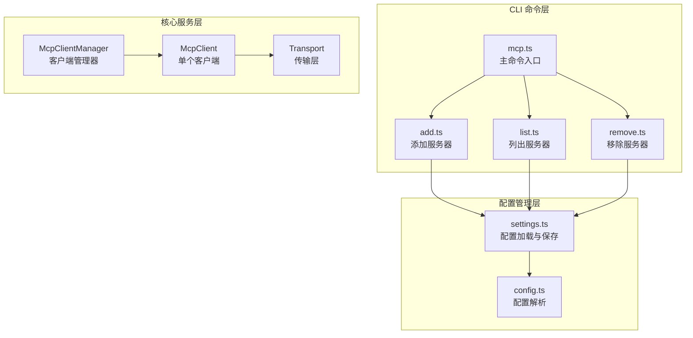
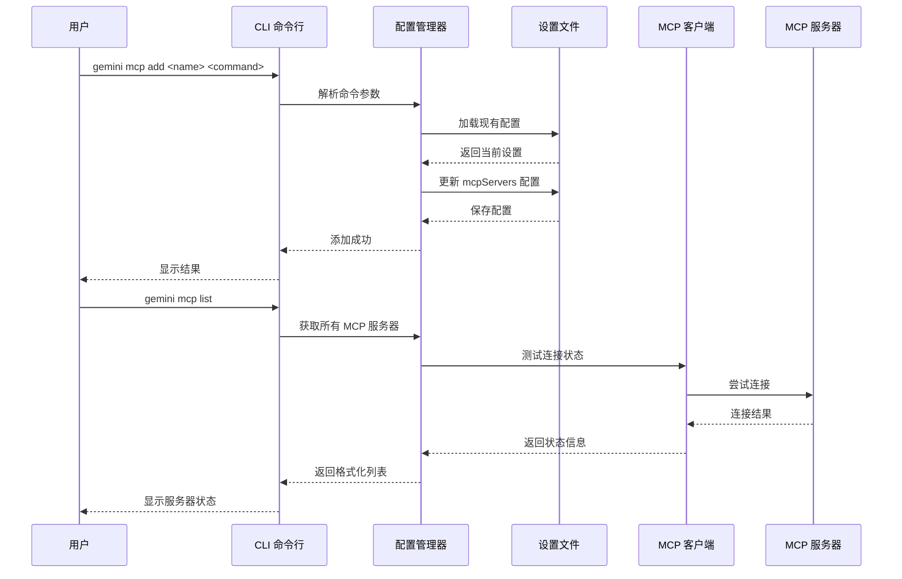
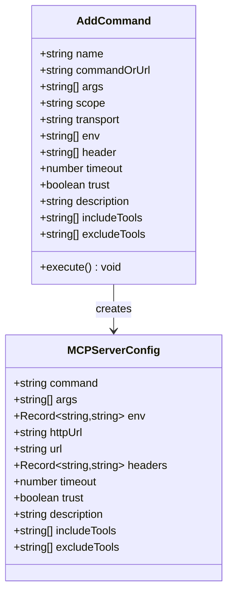
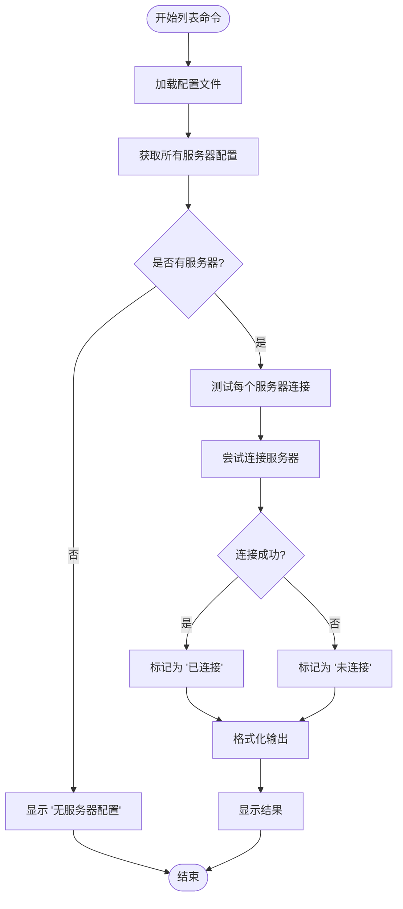
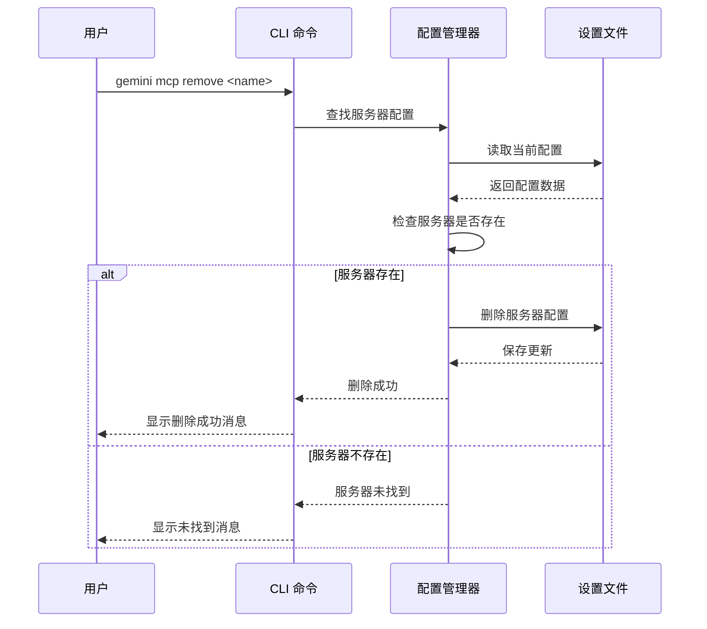
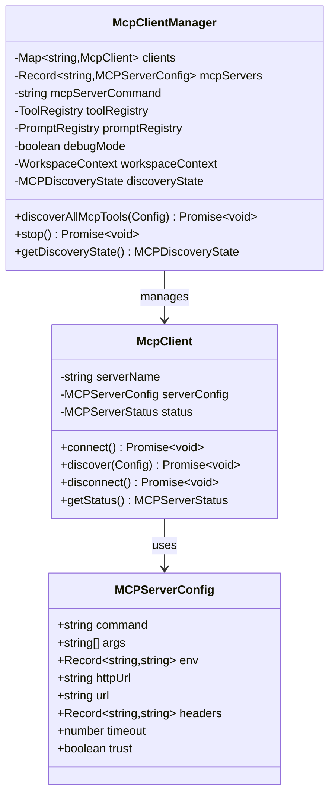
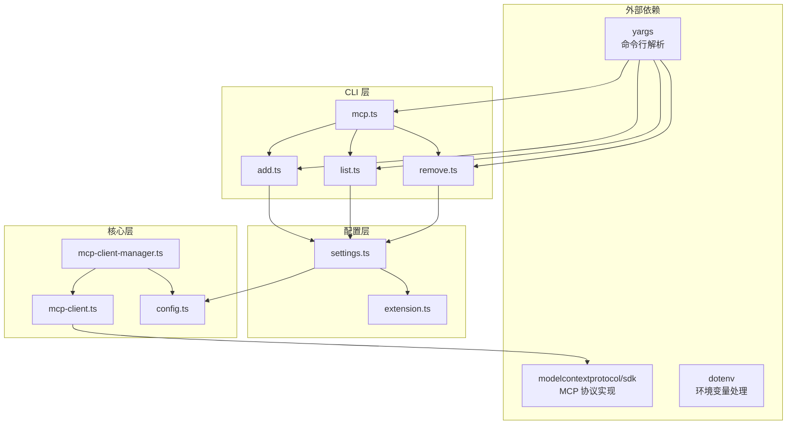

# 命令行接口

<cite>
**本文档中引用的文件**
- [packages/cli/src/commands/mcp.ts](file://packages/cli/src/commands/mcp.ts)
- [packages/cli/src/commands/mcp/add.ts](file://packages/cli/src/commands/mcp/add.ts)
- [packages/cli/src/commands/mcp/list.ts](file://packages/cli/src/commands/mcp/list.ts)
- [packages/cli/src/commands/mcp/remove.ts](file://packages/cli/src/commands/mcp/remove.ts)
- [packages/cli/src/config/settings.ts](file://packages/cli/src/config/settings.ts)
- [packages/core/src/tools/mcp-client-manager.ts](file://packages/core/src/tools/mcp-client-manager.ts)
- [packages/core/src/tools/mcp-client.ts](file://packages/core/src/tools/mcp-client.ts)
- [packages/cli/src/commands/mcp/add.test.ts](file://packages/cli/src/commands/mcp/add.test.ts)
</cite>

## 目录
1. [简介](#简介)
2. [项目结构](#项目结构)
3. [核心组件](#核心组件)
4. [架构概览](#架构概览)
5. [详细组件分析](#详细组件分析)
6. [依赖关系分析](#依赖关系分析)
7. [性能考虑](#性能考虑)
8. [故障排除指南](#故障排除指南)
9. [结论](#结论)

## 简介

Gemini CLI 的 MCP（Model Context Protocol）客户端命令行接口是一个强大的工具集，允许用户管理 Model Context Protocol 服务器实例。该系统提供了三个主要的子命令：`add`、`list` 和 `remove`，用于配置、查询和管理 MCP 服务器。

MCP 是一种标准化协议，允许 AI 模型与外部工具和服务进行交互。通过 Gemini CLI 的 MCP 客户端，用户可以轻松地添加、列出和移除各种类型的 MCP 服务器，支持 stdio、HTTP 和 SSE 三种传输方式。

## 项目结构

Gemini CLI 的 MCP 命令行接口采用模块化的架构设计，主要组件分布在以下目录结构中：



**图表来源**
- [packages/cli/src/commands/mcp.ts](file://packages/cli/src/commands/mcp.ts#L1-L28)
- [packages/cli/src/config/settings.ts](file://packages/cli/src/config/settings.ts#L1-L50)

**章节来源**
- [packages/cli/src/commands/mcp.ts](file://packages/cli/src/commands/mcp.ts#L1-L28)
- [packages/cli/src/commands/mcp/add.ts](file://packages/cli/src/commands/mcp/add.ts#L1-L50)
- [packages/cli/src/commands/mcp/list.ts](file://packages/cli/src/commands/mcp/list.ts#L1-L50)

## 核心组件

### MCP 主命令模块

MCP 命令模块是整个系统的入口点，负责协调三个子命令的执行：

```typescript
export const mcpCommand: CommandModule = {
  command: 'mcp',
  describe: 'Manage MCP servers',
  builder: (yargs: Argv) =>
    yargs
      .command(addCommand)
      .command(removeCommand)
      .command(listCommand)
      .demandCommand(1, 'You need at least one command before continuing.')
      .version(false),
  handler: () => {
    // yargs will automatically show help if no subcommand is provided
  },
};
```

### 配置管理系统

配置管理系统负责处理用户和项目级别的设置存储，支持多种配置范围：

- **用户级别** (`~/.gemini/settings.json`)：全局配置，适用于所有项目
- **项目级别** (`./.gemini/settings.json`)：项目特定配置
- **系统级别**：系统级默认配置

**章节来源**
- [packages/cli/src/commands/mcp.ts](file://packages/cli/src/commands/mcp.ts#L10-L27)
- [packages/cli/src/config/settings.ts](file://packages/cli/src/config/settings.ts#L100-L150)

## 架构概览

Gemini CLI 的 MCP 客户端采用分层架构设计，确保了良好的可维护性和扩展性：



**图表来源**
- [packages/cli/src/commands/mcp/add.ts](file://packages/cli/src/commands/mcp/add.ts#L150-L200)
- [packages/cli/src/commands/mcp/list.ts](file://packages/cli/src/commands/mcp/list.ts#L80-L120)

## 详细组件分析

### gemini mcp add 命令

`gemini mcp add` 命令是用于添加新的 MCP 服务器配置的核心功能。它支持三种不同的传输类型，每种都有特定的用途和配置选项。

#### 命令语法和参数

```bash
gemini mcp add <name> <commandOrUrl> [args...] [options]
```

#### 支持的传输类型

1. **stdio 传输**（默认）
   - 用于本地进程通信
   - 需要指定可执行命令路径
   - 支持环境变量和命令行参数

2. **http 传输**
   - 用于 HTTP API 接口
   - 需要完整的 URL 地址
   - 支持 HTTP 头部配置

3. **sse 传输**
   - 用于 Server-Sent Events 协议
   - 需要 SSE 端点 URL
   - 支持事件流连接

#### 参数详解



**图表来源**
- [packages/cli/src/commands/mcp/add.ts](file://packages/cli/src/commands/mcp/add.ts#L15-L50)
- [packages/cli/src/commands/mcp/add.ts](file://packages/cli/src/commands/mcp/add.ts#L120-L150)

#### 实际使用示例

**stdio 示例**：
```bash
gemini mcp add my-local-server ./my-mcp-server --scope user -e DEBUG=true
```

**http 示例**：
```bash
gemini mcp add api-server https://api.example.com/mcp --transport http \
  -H "Authorization: Bearer token123" \
  -H "X-API-Version: v1"
```

**sse 示例**：
```bash
gemini mcp add stream-server https://stream.example.com/events \
  --transport sse \
  --timeout 30000 \
  --trust
```

**章节来源**
- [packages/cli/src/commands/mcp/add.ts](file://packages/cli/src/commands/mcp/add.ts#L150-L233)
- [packages/cli/src/commands/mcp/add.test.ts](file://packages/cli/src/commands/mcp/add.test.ts#L40-L100)

### gemini mcp list 命令

`gemini mcp list` 命令提供了一个统一的界面来查看所有已配置的 MCP 服务器及其连接状态。

#### 实时状态检测

该命令不仅显示配置信息，还会尝试建立实际的连接来检测服务器的实时状态：



**图表来源**
- [packages/cli/src/commands/mcp/list.ts](file://packages/cli/src/commands/mcp/list.ts#L40-L80)
- [packages/cli/src/commands/mcp/list.ts](file://packages/cli/src/commands/mcp/list.ts#L85-L120)

#### 输出格式

命令输出包含以下信息：
- **状态指示器**：绿色勾号（✓）表示已连接，红色叉号（✗）表示未连接，黄色省略号（…）表示正在连接
- **服务器名称**：配置时指定的唯一标识符
- **传输信息**：命令/URL 和传输类型
- **状态文本**：连接状态描述

**章节来源**
- [packages/cli/src/commands/mcp/list.ts](file://packages/cli/src/commands/mcp/list.ts#L85-L140)

### gemini mcp remove 命令

`gemini mcp remove` 命令用于从配置中删除指定的 MCP 服务器。

#### 删除流程



**图表来源**
- [packages/cli/src/commands/mcp/remove.ts](file://packages/cli/src/commands/mcp/remove.ts#L10-L40)

**章节来源**
- [packages/cli/src/commands/mcp/remove.ts](file://packages/cli/src/commands/mcp/remove.ts#L10-L61)

### MCP 客户端管理器

MCP 客户端管理器是系统的核心组件，负责管理多个 MCP 客户端实例的生命周期。

#### 核心功能



**图表来源**
- [packages/core/src/tools/mcp-client-manager.ts](file://packages/core/src/tools/mcp-client-manager.ts#L20-L80)
- [packages/core/src/tools/mcp-client.ts](file://packages/core/src/tools/mcp-client.ts#L60-L120)

**章节来源**
- [packages/core/src/tools/mcp-client-manager.ts](file://packages/core/src/tools/mcp-client-manager.ts#L1-L130)
- [packages/core/src/tools/mcp-client.ts](file://packages/core/src/tools/mcp-client.ts#L60-L150)

## 依赖关系分析

系统的依赖关系展现了清晰的分层架构：



**图表来源**
- [packages/cli/src/commands/mcp/add.ts](file://packages/cli/src/commands/mcp/add.ts#L1-L10)
- [packages/cli/src/config/settings.ts](file://packages/cli/src/config/settings.ts#L1-L20)

**章节来源**
- [packages/cli/src/commands/mcp/add.ts](file://packages/cli/src/commands/mcp/add.ts#L1-L20)
- [packages/cli/src/config/settings.ts](file://packages/cli/src/config/settings.ts#L1-L30)

## 性能考虑

### 连接超时管理

系统实现了智能的连接超时机制，避免长时间等待不可用的服务器：

- **默认超时**：10分钟（stdio 服务器）
- **HTTP/SSE 超时**：可配置，默认为5秒用于状态检查
- **重试机制**：自动重连失败的连接

### 并发处理

MCP 客户端管理器支持并发处理多个服务器连接，提高整体性能：

```typescript
const discoveryPromises = Object.entries(servers).map(
  async ([name, config]) => {
    const client = new McpClient(/* ... */);
    this.clients.set(name, client);
    try {
      await client.connect();
      await client.discover(cliConfig);
    } catch (error) {
      // 单个服务器失败不影响其他服务器
      console.error(`Error during discovery for server '${name}': ${error}`);
    }
  }
);
await Promise.all(discoveryPromises);
```

### 内存优化

- **延迟初始化**：仅在需要时创建 MCP 客户端实例
- **连接池管理**：复用可用连接，减少资源消耗
- **垃圾回收**：及时清理断开的连接和过期的客户端

## 故障排除指南

### 常见问题和解决方案

#### 1. 服务器连接失败

**症状**：服务器显示为 "Disconnected" 状态

**可能原因**：
- 服务器未启动或地址错误
- 网络连接问题
- 认证凭据无效

**解决步骤**：
```bash
# 检查服务器配置
gemini mcp list

# 手动测试连接
curl -I https://your-server-url.com

# 检查网络连接
ping your-server-host
```

#### 2. 权限问题

**症状**：无法写入配置文件

**解决方法**：
```bash
# 检查文件权限
ls -la ~/.gemini/

# 修复权限
chmod 755 ~/.gemini/
chmod 644 ~/.gemini/settings.json
```

#### 3. 环境变量问题

**症状**：服务器启动失败

**解决方法**：
```bash
# 检查环境变量
gemini mcp add my-server ./script --env DEBUG=true

# 使用 .env 文件
echo "DEBUG=true" > .env
```

**章节来源**
- [packages/cli/src/commands/mcp/list.ts](file://packages/cli/src/commands/mcp/list.ts#L40-L80)
- [packages/cli/src/config/settings.ts](file://packages/cli/src/config/settings.ts#L700-L750)

## 结论

Gemini CLI 的 MCP 客户端命令行接口提供了一个完整、强大且易于使用的工具集，用于管理 Model Context Protocol 服务器。通过三个核心命令（add、list、remove），用户可以轻松地配置和管理各种类型的 MCP 服务器，支持 stdio、HTTP 和 SSE 三种传输方式。

系统的设计遵循了良好的软件工程原则，包括模块化、可扩展性和错误处理。配置管理系统支持多层级设置，确保了灵活性和安全性。MCP 客户端管理器提供了高效的并发处理能力，保证了系统的响应性能。

对于开发者而言，这套工具不仅简化了 MCP 服务器的管理流程，还为构建更复杂的 AI 应用程序奠定了坚实的基础。通过持续的改进和扩展，Gemini CLI 的 MCP 客户端将继续为用户提供更好的体验和更多的可能性。