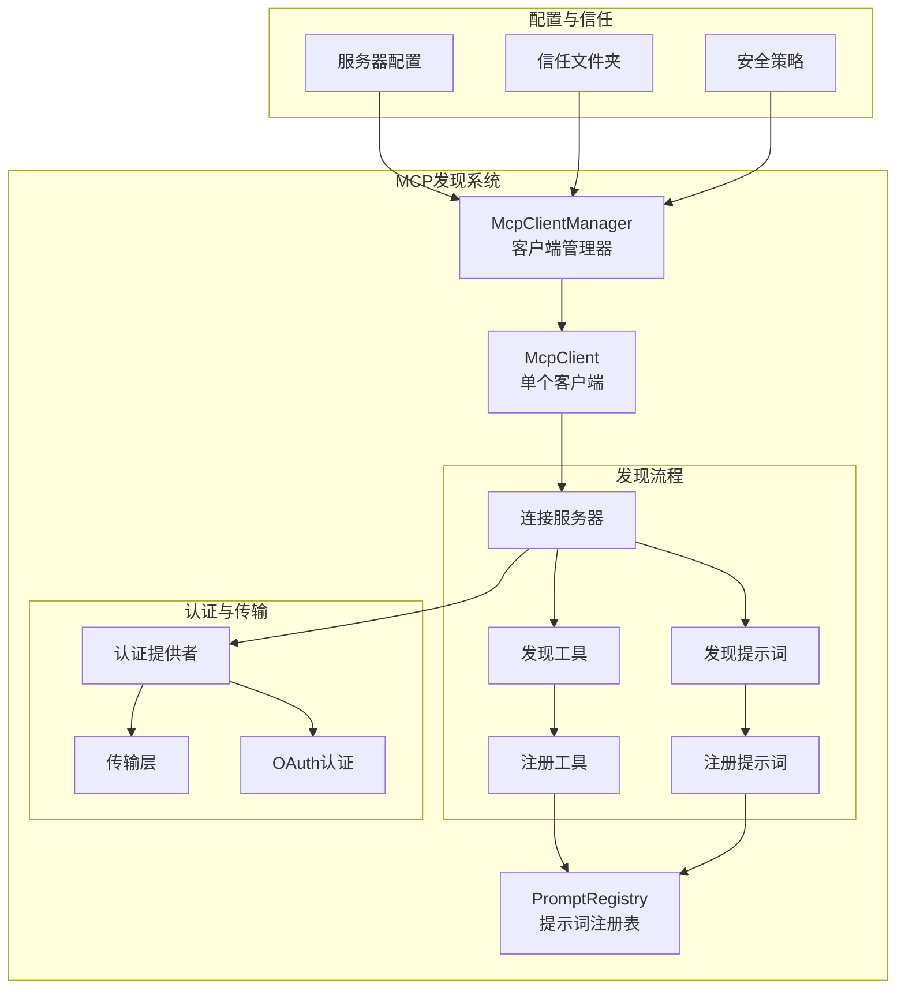
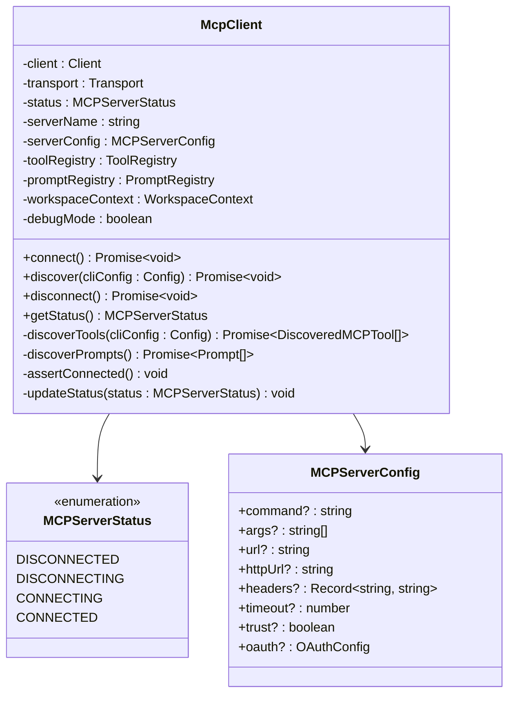
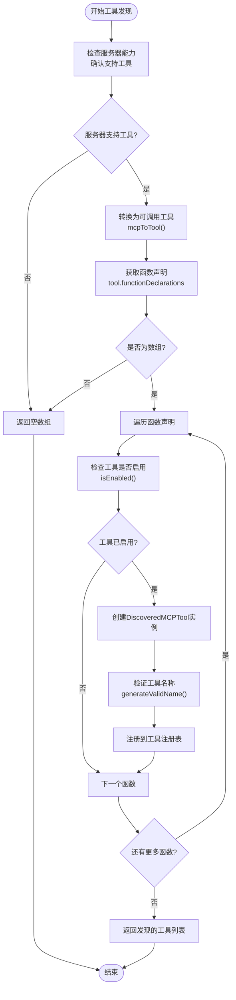
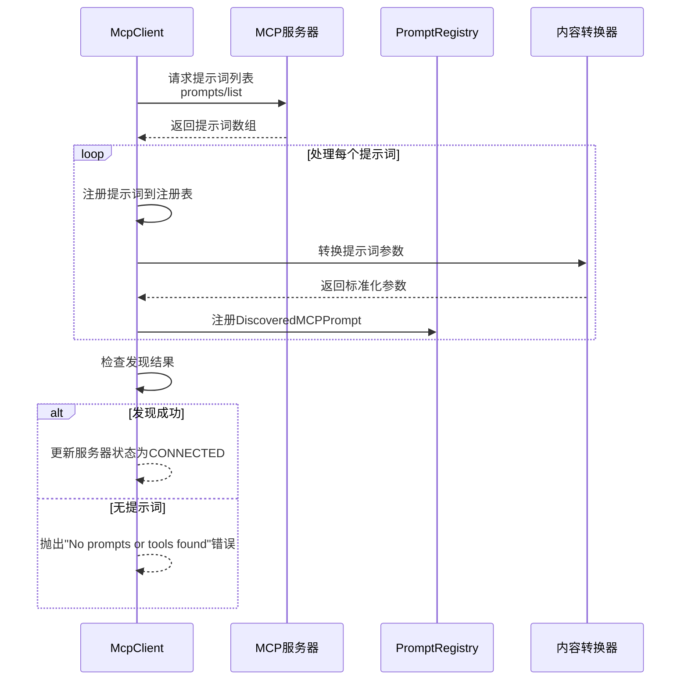
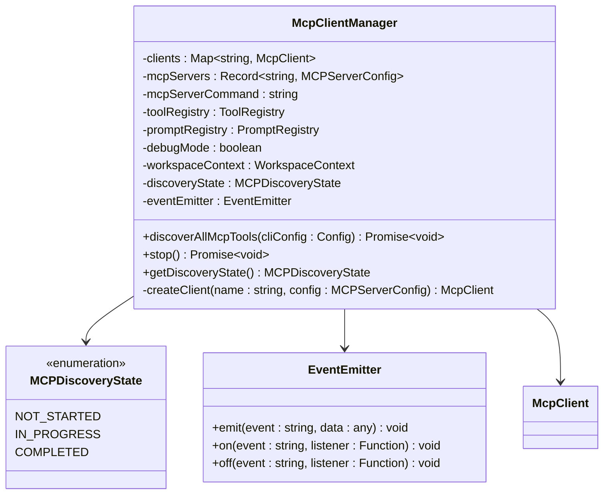
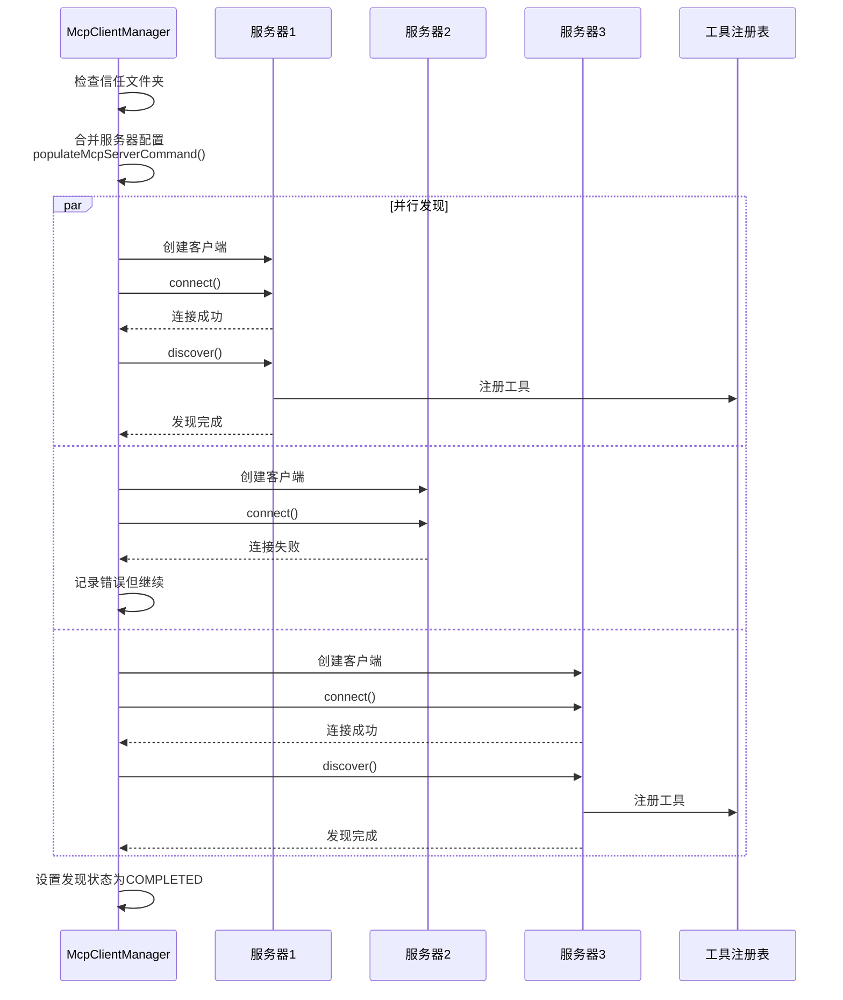
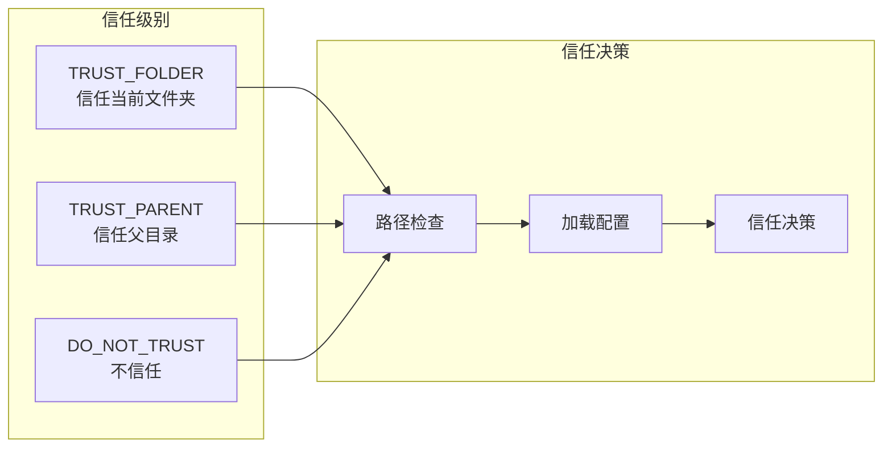
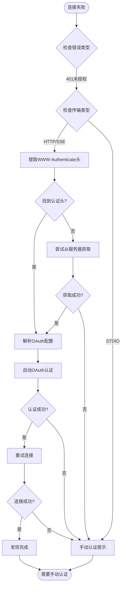
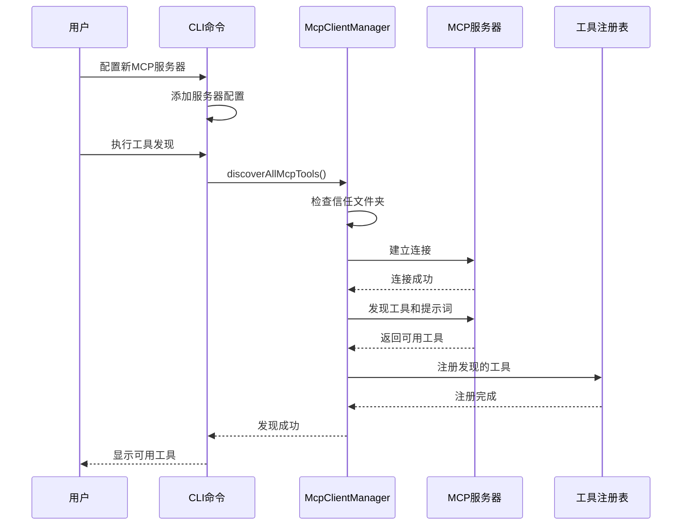

# 工具与提示词发现

<cite>
**本文档引用的文件**
- [mcp-client.ts](file://packages/core/src/tools/mcp-client.ts)
- [mcp-client-manager.ts](file://packages/core/src/tools/mcp-client-manager.ts)
- [mcp-tool.ts](file://packages/core/src/tools/mcp-tool.ts)
- [prompt-registry.ts](file://packages/core/src/prompts/prompt-registry.ts)
- [trustedFolders.ts](file://packages/cli/src/config/trustedFolders.ts)
- [add.ts](file://packages/cli/src/commands/mcp/add.ts)
- [list.ts](file://packages/cli/src/commands/mcp/list.ts)
</cite>

## 目录
1. [简介](#简介)
2. [核心架构概览](#核心架构概览)
3. [McpClient类详解](#mcpclient类详解)
4. [工具发现流程](#工具发现流程)
5. [提示词发现流程](#提示词发现流程)
6. [McpClientManager管理器](#mcpclientmanager管理器)
7. [信任文件夹机制](#信任文件夹机制)
8. [错误处理与重试策略](#错误处理与重试策略)
9. [典型使用场景](#典型使用场景)
10. [故障排除指南](#故障排除指南)

## 简介

MCP（Model Context Protocol）客户端工具与提示词发现是Gemini CLI系统中的核心功能模块，负责从远程MCP服务器动态发现和注册可用的工具和提示词。该系统通过McpClient类实现与远程服务器的连接和通信，通过McpClientManager类协调多个服务器的发现过程，并通过PromptRegistry类管理本地的提示词注册表。

## 核心架构概览



**图表来源**
- [mcp-client-manager.ts](file://packages/core/src/tools/mcp-client-manager.ts#L1-L130)
- [mcp-client.ts](file://packages/core/src/tools/mcp-client.ts#L1-L1364)

## McpClient类详解

McpClient类是MCP发现系统的核心组件，负责与单个MCP服务器建立连接、发现可用工具和提示词，并管理服务器状态。

### 类结构与状态管理



**图表来源**
- [mcp-client.ts](file://packages/core/src/tools/mcp-client.ts#L60-L150)

### 连接生命周期管理

McpClient维护严格的连接状态管理，确保服务器状态的一致性：

```typescript
// 状态转换图
DISCONNECTED --> CONNECTING --> CONNECTED
CONNECTED --> DISCONNECTING --> DISCONNECTED
```

**章节来源**
- [mcp-client.ts](file://packages/core/src/tools/mcp-client.ts#L60-L200)

## 工具发现流程

工具发现是MCP客户端的核心功能之一，通过discoverTools函数实现从远程服务器获取可用工具列表并注册到本地工具注册表。

### discoverTools函数执行流程



**图表来源**
- [mcp-client.ts](file://packages/core/src/tools/mcp-client.ts#L700-L800)

### 工具过滤与验证

discoverTools函数实现了严格的工具过滤机制：

1. **能力检查**：确认服务器支持工具功能
2. **启用状态验证**：通过isEnabled函数检查工具是否被包含或排除
3. **名称规范化**：使用generateValidName函数确保工具名称符合规范
4. **错误处理**：捕获并记录工具发现过程中的异常

**章节来源**
- [mcp-client.ts](file://packages/core/src/tools/mcp-client.ts#L700-L800)

## 提示词发现流程

提示词发现通过discoverPrompts函数实现，负责从远程MCP服务器获取可用提示词并注册到本地PromptRegistry。

### discoverPrompts函数执行流程



**图表来源**
- [mcp-client.ts](file://packages/core/src/tools/mcp-client.ts#L800-L850)

### 提示词注册机制

提示词发现完成后，通过以下步骤完成注册：

1. **参数标准化**：将原始提示词参数转换为标准格式
2. **唯一性检查**：确保提示词名称的唯一性，避免冲突
3. **invoke函数绑定**：为每个提示词绑定invoke函数，支持参数化调用
4. **服务器标识**：添加serverName字段标识提示词来源

**章节来源**
- [mcp-client.ts](file://packages/core/src/tools/mcp-client.ts#L800-L850)

## McpClientManager管理器

McpClientManager类负责协调多个MCP服务器的发现过程，是整个MCP发现系统的中央控制器。

### 管理器架构设计



**图表来源**
- [mcp-client-manager.ts](file://packages/core/src/tools/mcp-client-manager.ts#L20-L80)

### 并发发现策略

McpClientManager采用并行发现策略，同时处理多个MCP服务器：



**图表来源**
- [mcp-client-manager.ts](file://packages/core/src/tools/mcp-client-manager.ts#L50-L100)

**章节来源**
- [mcp-client-manager.ts](file://packages/core/src/tools/mcp-client-manager.ts#L50-L130)

## 信任文件夹机制

信任文件夹机制是MCP发现系统的重要安全特性，确保只有在受信任的工作空间中才执行工具发现操作。

### 信任级别定义



**图表来源**
- [trustedFolders.ts](file://packages/cli/src/config/trustedFolders.ts#L30-L80)

### 信任检查流程

信任文件夹检查在McpClientManager.discoverAllMcpTools方法中执行：

1. **配置检查**：验证当前工作空间是否在信任文件夹配置中
2. **IDE集成**：优先使用IDE提供的信任状态
3. **本地配置**：回退到本地用户配置进行信任判断
4. **安全限制**：如果未信任，则跳过所有工具发现操作

**章节来源**
- [trustedFolders.ts](file://packages/cli/src/config/trustedFolders.ts#L180-L238)

## 错误处理与重试策略

MCP发现系统实现了完善的错误处理和自动重试机制，确保系统的健壮性和可靠性。

### 自动OAuth发现流程



**图表来源**
- [mcp-client.ts](file://packages/core/src/tools/mcp-client.ts#L800-L1200)

### 错误分类与处理策略

系统对不同类型的错误采用不同的处理策略：

1. **网络错误**：提供详细的连接诊断信息
2. **认证错误**：自动触发OAuth发现和认证流程
3. **权限错误**：检查信任文件夹配置
4. **协议错误**：记录详细错误日志并优雅降级

**章节来源**
- [mcp-client.ts](file://packages/core/src/tools/mcp-client.ts#L800-L1200)

## 典型使用场景

### 场景1：首次服务器配置与发现



**图表来源**
- [mcp-client-manager.ts](file://packages/core/src/tools/mcp-client-manager.ts#L50-L100)

### 场景2：多服务器并发发现

当配置多个MCP服务器时，系统会并行处理：

1. **并行连接**：同时尝试连接所有配置的服务器
2. **独立发现**：每个服务器独立执行工具和提示词发现
3. **错误隔离**：单个服务器的失败不影响其他服务器的发现
4. **状态同步**：通过事件系统实时更新客户端状态

### 场景3：认证失败后的自动处理

当遇到认证问题时，系统会：

1. **检测401错误**：识别未授权访问情况
2. **提取认证信息**：从错误响应中提取WWW-Authenticate头
3. **OAuth发现**：自动发现OAuth配置并启动认证流程
4. **重试连接**：使用有效令牌重新建立连接

## 故障排除指南

### 常见问题与解决方案

#### 1. 连接超时问题

**症状**：工具发现过程中出现超时错误
**原因**：网络延迟或服务器响应慢
**解决方案**：
- 检查网络连接稳定性
- 调整服务器配置中的timeout参数
- 使用更可靠的网络环境

#### 2. 认证失败问题

**症状**：收到401未授权错误
**原因**：缺少有效的认证凭据
**解决方案**：
- 使用`/mcp auth <server-name>`命令进行认证
- 检查OAuth配置是否正确
- 验证服务器URL和端点设置

#### 3. 工具发现为空

**症状**：服务器连接成功但没有发现任何工具
**原因**：服务器配置问题或工具被禁用
**解决方案**：
- 检查服务器配置中的includeTools/excludeTools设置
- 验证服务器是否确实提供了工具
- 查看调试日志获取更多信息

#### 4. 信任文件夹限制

**症状**：工具发现被阻止
**原因**：当前工作空间不在信任文件夹列表中
**解决方案**：
- 将当前目录添加到信任文件夹配置
- 在全局配置中启用信任功能
- 使用IDE集成的信任机制

### 调试技巧

1. **启用调试模式**：设置debugMode参数获取详细日志
2. **检查服务器状态**：使用`/mcp list`命令查看服务器连接状态
3. **验证配置**：使用`/mcp test`命令测试服务器连接
4. **查看日志**：检查控制台输出和日志文件中的错误信息

**章节来源**
- [mcp-client.ts](file://packages/core/src/tools/mcp-client.ts#L1200-L1364)