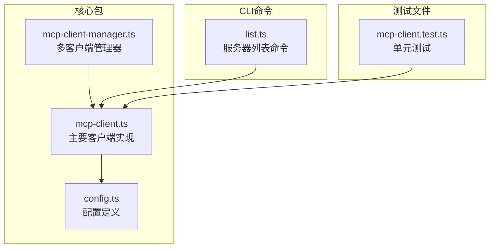
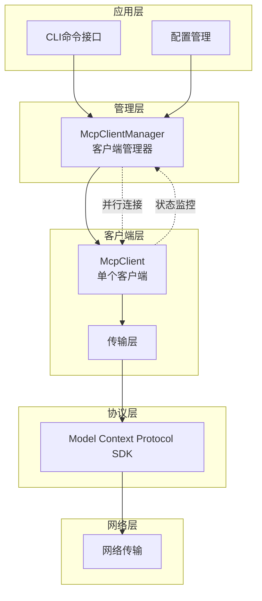
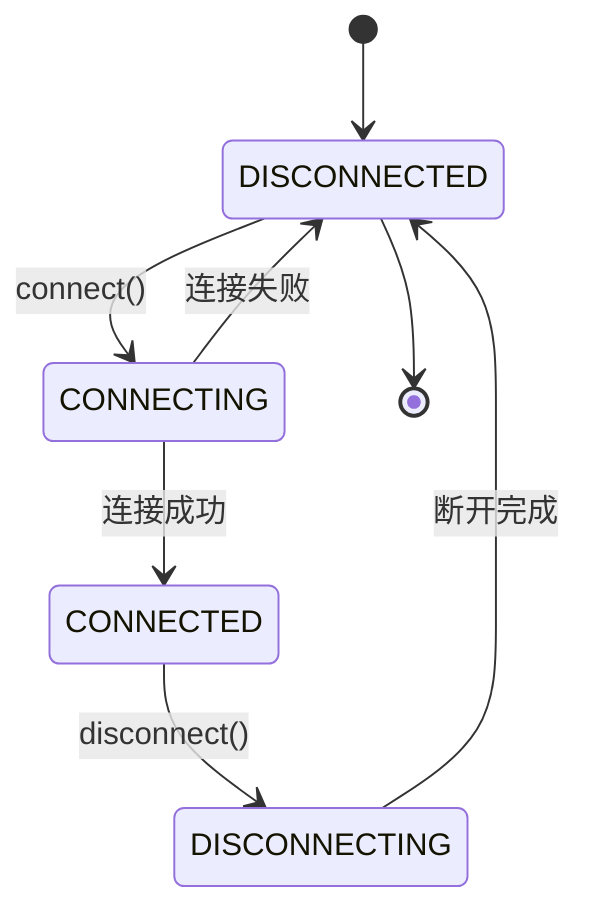
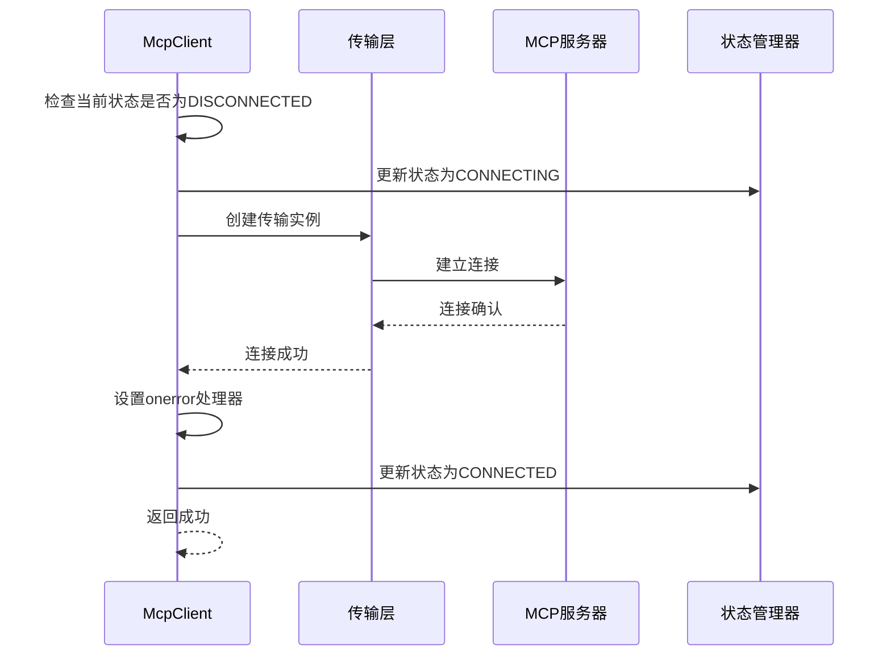
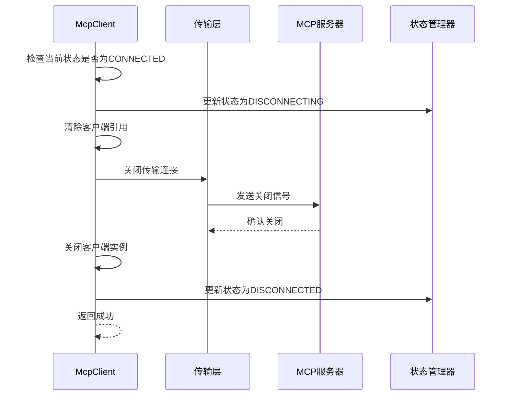
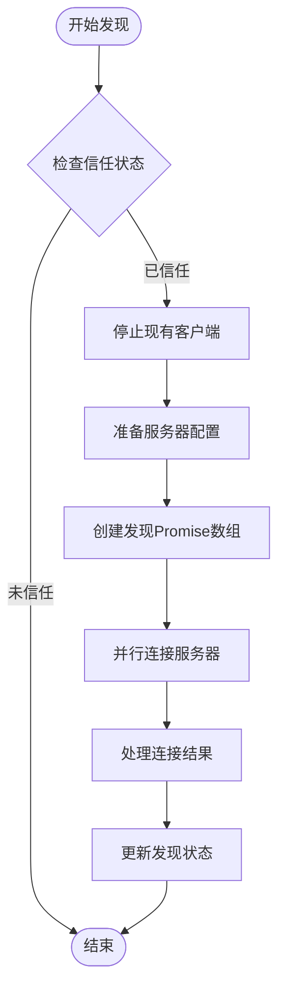
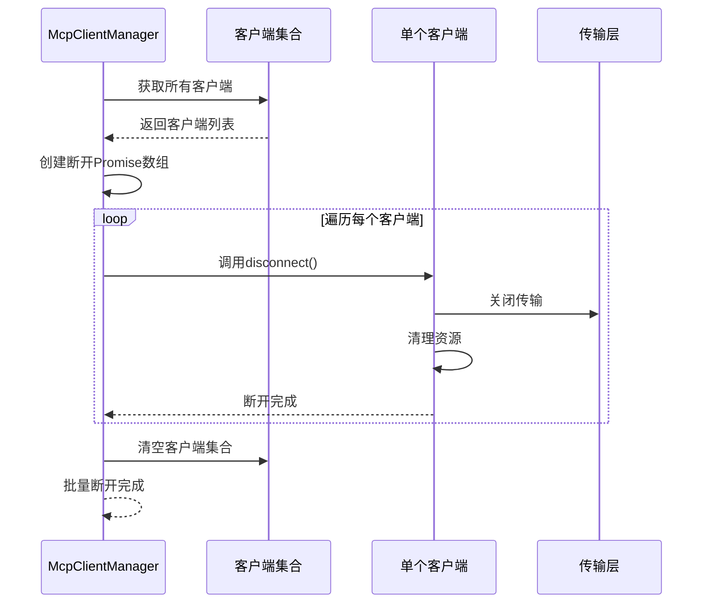
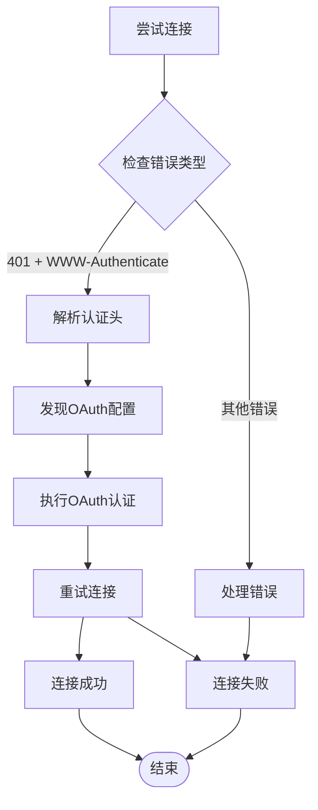
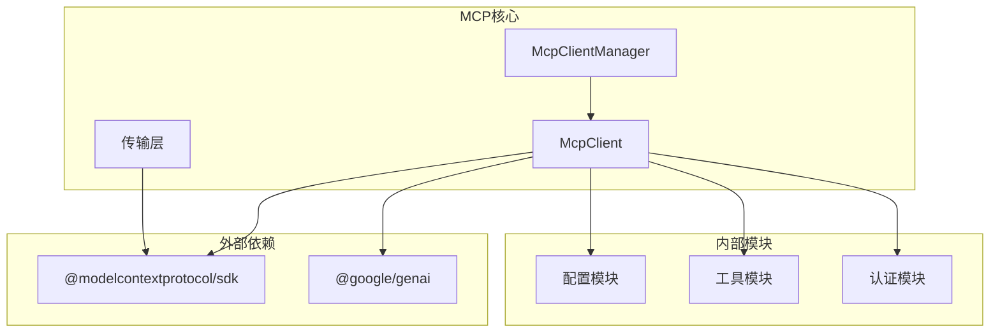

# MCP客户端连接管理

<cite>
**本文档中引用的文件**
- [mcp-client.ts](file://packages/core/src/tools/mcp-client.ts)
- [mcp-client-manager.ts](file://packages/core/src/tools/mcp-client-manager.ts)
- [config.ts](file://packages/core/src/config/config.ts)
- [mcp-client.test.ts](file://packages/core/src/tools/mcp-client.test.ts)
- [list.ts](file://packages/cli/src/commands/mcp/list.ts)
</cite>

## 目录
1. [简介](#简介)
2. [项目结构概览](#项目结构概览)
3. [核心组件](#核心组件)
4. [架构概览](#架构概览)
5. [详细组件分析](#详细组件分析)
6. [依赖关系分析](#依赖关系分析)
7. [性能考虑](#性能考虑)
8. [故障排除指南](#故障排除指南)
9. [结论](#结论)

## 简介

MCP（Model Context Protocol）客户端连接管理系统是Gemini CLI的核心组件之一，负责管理与多个MCP服务器的连接、工具发现和生命周期控制。该系统提供了完整的连接状态管理、错误处理和重试机制，确保在复杂的分布式环境中稳定可靠地运行。

本文档深入分析了McpClient类中connect()和disconnect()方法的实现机制，包括连接状态机（MCPServerStatus）的转换逻辑，以及McpClientManager如何协调多个MCP客户端的生命周期。

## 项目结构概览

MCP客户端连接管理系统的文件组织结构如下：



**图表来源**
- [mcp-client.ts](file://packages/core/src/tools/mcp-client.ts#L1-L50)
- [mcp-client-manager.ts](file://packages/core/src/tools/mcp-client-manager.ts#L1-L30)

**章节来源**
- [mcp-client.ts](file://packages/core/src/tools/mcp-client.ts#L1-L100)
- [mcp-client-manager.ts](file://packages/core/src/tools/mcp-client-manager.ts#L1-L50)

## 核心组件

### 连接状态枚举

系统使用MCPServerStatus枚举来管理连接状态：

```typescript
export enum MCPServerStatus {
  /** 服务器断开连接或出现错误 */
  DISCONNECTED = 'disconnected',
  /** 服务器正在断开连接 */
  DISCONNECTING = 'disconnecting',
  /** 服务器正在连接过程中 */
  CONNECTING = 'connecting',
  /** 服务器已连接并准备使用 */
  CONNECTED = 'connected',
}
```

### MCP服务器配置

MCPServerConfig类定义了服务器的各种连接选项：

```typescript
export class MCPServerConfig {
  constructor(
    // 标准输入输出传输
    readonly command?: string,
    readonly args?: string[],
    readonly env?: Record<string, string>,
    readonly cwd?: string,
    // SSE传输
    readonly url?: string,
    // 流式HTTP传输
    readonly httpUrl?: string,
    readonly headers?: Record<string, string>,
    // WebSocket传输
    readonly tcp?: string,
    // 通用配置
    readonly timeout?: number,
    readonly trust?: boolean,
    // 认证配置
    readonly oauth?: MCPOAuthConfig,
    readonly authProviderType?: AuthProviderType,
    readonly targetAudience?: string,
    readonly targetServiceAccount?: string,
  ) {}
}
```

**章节来源**
- [mcp-client.ts](file://packages/core/src/tools/mcp-client.ts#L40-L80)
- [config.ts](file://packages/core/src/config/config.ts#L100-L150)

## 架构概览

MCP客户端连接管理系统采用分层架构设计：



**图表来源**
- [mcp-client-manager.ts](file://packages/core/src/tools/mcp-client-manager.ts#L20-L60)
- [mcp-client.ts](file://packages/core/src/tools/mcp-client.ts#L80-L120)

## 详细组件分析

### McpClient类分析

McpClient类是整个连接管理系统的核心，负责单个MCP服务器的完整生命周期管理。

#### 连接状态机



**图表来源**
- [mcp-client.ts](file://packages/core/src/tools/mcp-client.ts#L40-L50)

#### connect()方法实现

connect()方法实现了完整的连接流程：



**图表来源**
- [mcp-client.ts](file://packages/core/src/tools/mcp-client.ts#L80-L120)

#### disconnect()方法实现

disconnect()方法确保优雅的断开连接：



**图表来源**
- [mcp-client.ts](file://packages/core/src/tools/mcp-client.ts#L141-L170)

**章节来源**
- [mcp-client.ts](file://packages/core/src/tools/mcp-client.ts#L80-L170)

### McpClientManager类分析

McpClientManager负责管理多个MCP客户端的生命周期：

#### discoverAllMcpTools方法



**图表来源**
- [mcp-client-manager.ts](file://packages/core/src/tools/mcp-client-manager.ts#L50-L90)

#### 并发连接机制

McpClientManager使用Promise.all()实现并发连接：

```typescript
const discoveryPromises = Object.entries(servers).map(
  async ([name, config]) => {
    const client = new McpClient(/* 参数 */);
    this.clients.set(name, client);
    
    try {
      await client.connect();
      await client.discover(cliConfig);
    } catch (error) {
      // 单个服务器失败不影响其他服务器
      console.error(`Error during discovery for server '${name}': ${error}`);
    }
  },
);
await Promise.all(discoveryPromises);
```

#### stop()方法实现



**图表来源**
- [mcp-client-manager.ts](file://packages/core/src/tools/mcp-client-manager.ts#L95-L120)

**章节来源**
- [mcp-client-manager.ts](file://packages/core/src/tools/mcp-client-manager.ts#L50-L120)

### 错误处理和重试机制

#### 自动OAuth认证

系统支持自动OAuth认证流程：



**图表来源**
- [mcp-client.ts](file://packages/core/src/tools/mcp-client.ts#L1060-L1100)

#### 连接测试功能

CLI提供了连接测试功能：

```typescript
async function testMCPConnection(
  serverName: string,
  config: MCPServerConfig,
): Promise<MCPServerStatus> {
  const client = new Client({ name: 'mcp-test-client', version: '0.0.1' });
  
  try {
    const transport = await createTransport(serverName, config, false);
    await client.connect(transport, { timeout: 5000 });
    await client.ping();
    await client.close();
    return MCPServerStatus.CONNECTED;
  } catch (_error) {
    await transport?.close();
    return MCPServerStatus.DISCONNECTED;
  }
}
```

**章节来源**
- [mcp-client.ts](file://packages/core/src/tools/mcp-client.ts#L1060-L1150)
- [list.ts](file://packages/cli/src/commands/mcp/list.ts#L44-L97)

## 依赖关系分析

### 核心依赖图



**图表来源**
- [mcp-client.ts](file://packages/core/src/tools/mcp-client.ts#L1-L30)

### 组件耦合度分析

系统采用松耦合设计：
- McpClientManager不直接操作具体客户端，而是通过抽象接口
- 传输层与协议层分离，支持多种传输方式
- 错误处理独立于业务逻辑，便于维护

**章节来源**
- [mcp-client.ts](file://packages/core/src/tools/mcp-client.ts#L1-L50)
- [mcp-client-manager.ts](file://packages/core/src/tools/mcp-client-manager.ts#L1-L30)

## 性能考虑

### 并发连接优化

系统通过以下方式优化性能：

1. **并行连接**：使用Promise.all()同时连接多个服务器
2. **超时控制**：默认10分钟超时，可配置
3. **资源清理**：及时释放不再使用的客户端实例
4. **状态缓存**：避免重复的状态查询

### 内存管理

- 使用WeakMap存储服务器状态，避免内存泄漏
- 及时清理事件监听器和定时器
- 支持客户端池化复用

## 故障排除指南

### 常见连接问题

1. **连接超时**
   - 检查网络连接
   - 验证服务器地址
   - 调整超时设置

2. **认证失败**
   - 检查OAuth配置
   - 验证凭据有效性
   - 查看认证日志

3. **服务器不可达**
   - 确认服务器运行状态
   - 检查防火墙设置
   - 验证端口配置

### 调试技巧

启用调试模式可以获得更多诊断信息：

```bash
DEBUG=mcp:* gemini-cli mcp list
```

**章节来源**
- [mcp-client.ts](file://packages/core/src/tools/mcp-client.ts#L1120-L1150)

## 结论

MCP客户端连接管理系统提供了完整、可靠的MCP服务器连接解决方案。通过状态机管理、并发处理、自动重试和完善的错误处理，系统能够在各种复杂环境中稳定运行。

关键特性包括：
- 完整的连接生命周期管理
- 多种传输协议支持
- 自动认证和重试机制
- 并发连接优化
- 详细的错误处理和诊断

该系统为Gemini CLI提供了强大的MCP服务器集成能力，支持扩展性和可维护性要求。