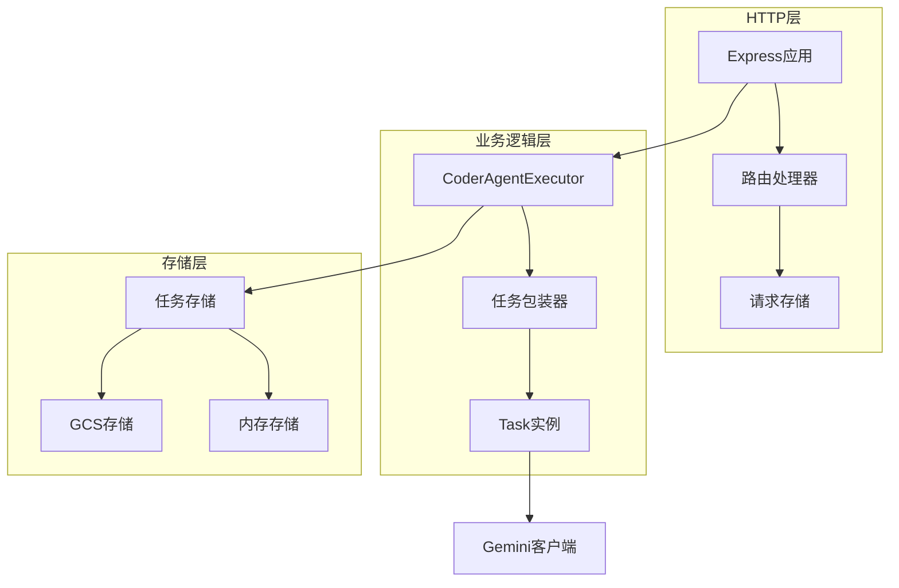
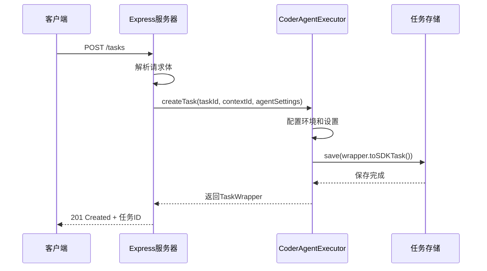
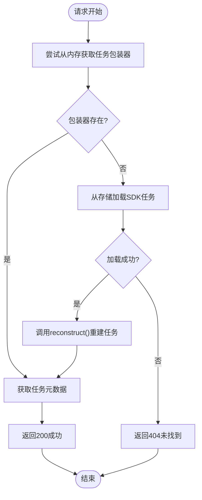
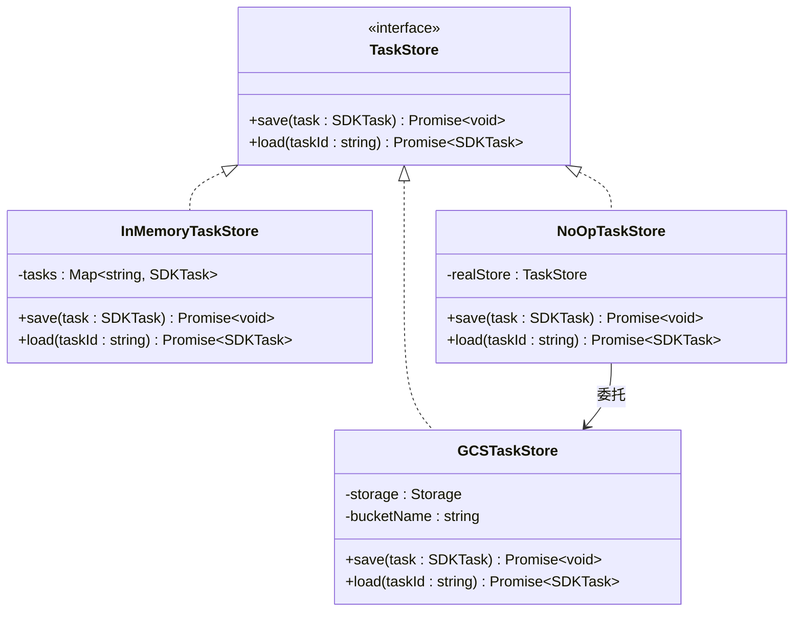
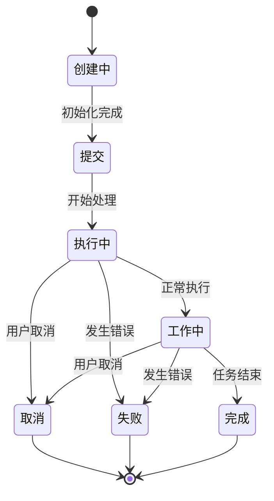
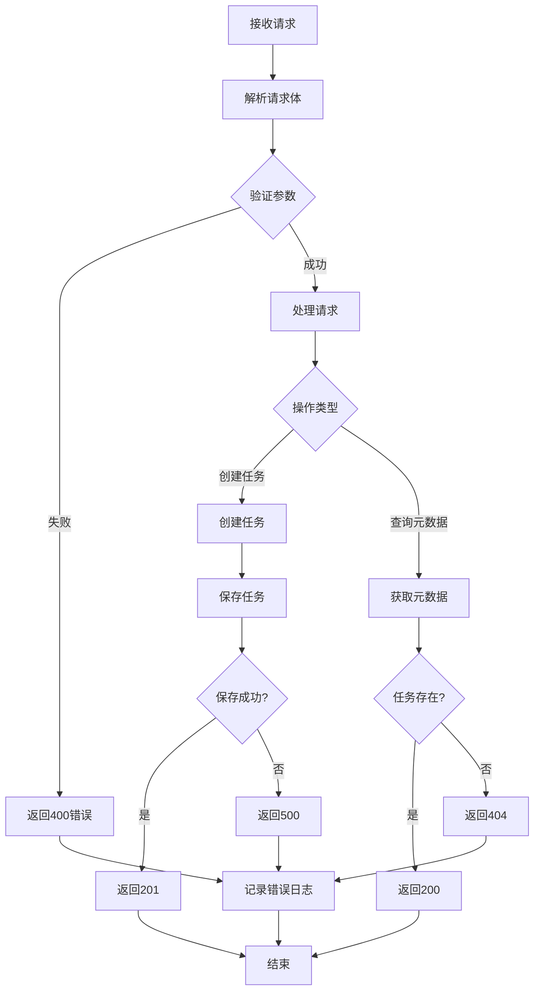

# MCP服务器HTTP接口文档

<cite>
**本文档引用的文件**
- [app.ts](file://packages/a2a-server/src/http/app.ts)
- [server.ts](file://packages/a2a-server/src/http/server.ts)
- [requestStorage.ts](file://packages/a2a-server/src/http/requestStorage.ts)
- [endpoints.test.ts](file://packages/a2a-server/src/http/endpoints.test.ts)
- [executor.ts](file://packages/a2a-server/src/agent/executor.ts)
- [types.ts](file://packages/a2a-server/src/types.ts)
- [gcs.ts](file://packages/a2a-server/src/persistence/gcs.ts)
- [config.ts](file://packages/a2a-server/src/config/config.ts)
- [tools.ts](file://packages/core/src/tools/tools.ts)
</cite>

## 目录
1. [简介](#简介)
2. [项目架构概览](#项目架构概览)
3. [核心端点详解](#核心端点详解)
4. [任务管理机制](#任务管理机制)
5. [错误处理与状态码](#错误处理与状态码)
6. [API使用示例](#api使用示例)
7. [故障排除指南](#故障排除指南)
8. [总结](#总结)

## 简介

本文档详细介绍了MCP（Model Context Protocol）服务器的HTTP接口，该服务器为Gemini SDLC Agent提供了完整的RESTful API支持。服务器实现了任务创建、管理和元数据查询的核心功能，支持内存存储和Google Cloud Storage两种持久化方案。

## 项目架构概览

MCP服务器采用模块化设计，主要组件包括：



**图表来源**
- [app.ts](file://packages/a2a-server/src/http/app.ts#L1-L50)
- [executor.ts](file://packages/a2a-server/src/agent/executor.ts#L1-L50)

**章节来源**
- [app.ts](file://packages/a2a-server/src/http/app.ts#L1-L201)
- [server.ts](file://packages/a2a-server/src/http/server.ts#L1-L34)

## 核心端点详解

### POST /tasks - 创建新任务

**端点描述**: 接收创建新任务的请求，初始化CoderAgentExecutor并返回任务ID。

**HTTP方法**: POST  
**URL路径**: `/tasks`  
**内容类型**: `application/json`

**请求体结构**:
```json
{
  "agentSettings": {
    "kind": "agent-settings",
    "workspacePath": "/path/to/workspace"
  },
  "contextId": "optional-context-id"
}
```

**响应格式**:
- **成功 (201)**: 返回任务ID字符串
- **服务器错误 (500)**: 错误信息对象

**实现细节**:
1. 生成唯一任务ID和上下文ID
2. 调用CoderAgentExecutor.createTask()创建任务包装器
3. 将任务保存到任务存储
4. 返回创建的任务ID



**图表来源**
- [app.ts](file://packages/a2a-server/src/http/app.ts#L75-L85)
- [executor.ts](file://packages/a2a-server/src/agent/executor.ts#L120-L145)

### GET /tasks/metadata - 获取所有任务元数据

**端点描述**: 获取所有任务的元数据信息，仅在使用InMemoryTaskStore时可用。

**HTTP方法**: GET  
**URL路径**: `/tasks/metadata`

**响应格式**:
- **成功 (200)**: 任务元数据数组
- **未实现 (501)**: 当使用GCSTaskStore时返回
- **无内容 (204)**: 没有任务时返回
- **服务器错误 (500)**: 错误信息对象

**实现细节**:
- 仅在InMemoryTaskStore模式下可用
- 收集所有活跃任务的元数据
- 并行获取每个任务的元数据信息

### GET /tasks/:taskId/metadata - 查询特定任务元数据

**端点描述**: 根据任务ID查询特定任务的元数据，支持从持久化存储中重建任务。

**HTTP方法**: GET  
**URL路径**: `/tasks/:taskId/metadata`

**路径参数**:
- `taskId`: 任务的唯一标识符

**响应格式**:
- **成功 (200)**: 包含任务元数据的对象
- **未找到 (404)**: 任务不存在
- **服务器错误 (500)**: 错误信息对象

**实现细节**:
1. 尝试从内存中获取任务包装器
2. 如果内存中不存在，尝试从持久化存储加载
3. 使用CoderAgentExecutor.reconstruct()重建任务
4. 返回任务元数据



**图表来源**
- [app.ts](file://packages/a2a-server/src/http/app.ts#L95-L110)
- [executor.ts](file://packages/a2a-server/src/agent/executor.ts#L101-L125)

**章节来源**
- [app.ts](file://packages/a2a-server/src/http/app.ts#L75-L110)
- [executor.ts](file://packages/a2a-server/src/agent/executor.ts#L101-L145)

## 任务管理机制

### 存储策略

系统支持两种任务存储策略：



**图表来源**
- [gcs.ts](file://packages/a2a-server/src/persistence/gcs.ts#L20-L50)
- [app.ts](file://packages/a2a-server/src/http/app.ts#L45-L60)

### 任务生命周期



**章节来源**
- [executor.ts](file://packages/a2a-server/src/agent/executor.ts#L1-L100)
- [gcs.ts](file://packages/a2a-server/src/persistence/gcs.ts#L79-L150)

## 错误处理与状态码

### HTTP状态码说明

| 状态码 | 含义 | 场景 |
|--------|------|------|
| 200 | 成功 | 请求成功处理 |
| 201 | 已创建 | 任务创建成功 |
| 204 | 无内容 | 没有任务数据 |
| 404 | 未找到 | 任务不存在 |
| 500 | 内部错误 | 服务器内部错误 |
| 501 | 未实现 | 功能尚未实现 |

### 错误响应格式

```json
{
  "error": "具体的错误信息描述"
}
```

### 错误处理流程



**章节来源**
- [app.ts](file://packages/a2a-server/src/http/app.ts#L85-L110)

## API使用示例

### curl命令示例

#### 创建新任务
```bash
curl -X POST http://localhost:41242/tasks \
  -H "Content-Type: application/json" \
  -d '{
    "agentSettings": {
      "kind": "agent-settings",
      "workspacePath": "/path/to/workspace"
    },
    "contextId": "my-context-123"
  }'
```

#### 获取所有任务元数据
```bash
curl -X GET http://localhost:41242/tasks/metadata
```

#### 查询特定任务元数据
```bash
curl -X GET http://localhost:41242/tasks/your-task-id/metadata
```

### JavaScript示例

```javascript
// 创建任务
async function createTask(workspacePath) {
  const response = await fetch('http://localhost:41242/tasks', {
    method: 'POST',
    headers: {
      'Content-Type': 'application/json'
    },
    body: JSON.stringify({
      agentSettings: {
        kind: 'agent-settings',
        workspacePath
      }
    })
  });
  
  if (!response.ok) {
    throw new Error(`HTTP error! status: ${response.status}`);
  }
  
  const taskId = await response.text();
  return taskId;
}

// 获取任务元数据
async function getTaskMetadata(taskId) {
  const response = await fetch(`http://localhost:41242/tasks/${taskId}/metadata`);
  
  if (response.status === 404) {
    throw new Error('Task not found');
  }
  
  if (!response.ok) {
    throw new Error(`HTTP error! status: ${response.status}`);
  }
  
  const data = await response.json();
  return data.metadata;
}
```

## 故障排除指南

### 常见问题及解决方案

#### 1. 任务创建失败 (500错误)
**可能原因**:
- 环境配置问题
- 工作空间路径无效
- 缺少必要的认证凭据

**解决方案**:
```bash
# 检查环境变量
echo $GEMINI_API_KEY
echo $GOOGLE_APPLICATION_CREDENTIALS

# 验证工作空间路径
ls -la /path/to/workspace

# 查看服务器日志
tail -f logs/server.log
```

#### 2. 元数据查询失败 (404错误)
**可能原因**:
- 任务ID错误
- 任务已被删除或过期
- 存储连接问题

**解决方案**:
```bash
# 检查任务是否存在
curl -X GET http://localhost:41242/tasks/metadata

# 验证任务ID格式
# 任务ID应该是有效的UUID格式
```

#### 3. GCSTaskStore配置问题
**可能原因**:
- GCS桶名称配置错误
- 认证权限不足
- 网络连接问题

**解决方案**:
```bash
# 设置GCS桶环境变量
export GCS_BUCKET_NAME="your-bucket-name"

# 验证GCS认证
gcloud auth list

# 测试网络连接
ping storage.googleapis.com
```

**章节来源**
- [app.ts](file://packages/a2a-server/src/http/app.ts#L110-L130)
- [gcs.ts](file://packages/a2a-server/src/persistence/gcs.ts#L42-L81)

## 总结

MCP服务器HTTP接口提供了完整的任务管理功能，支持：
- 异步任务创建和管理
- 多种存储后端选择
- 完整的错误处理机制
- RESTful API设计原则

该接口设计遵循现代Web服务最佳实践，具有良好的可扩展性和维护性。通过合理的错误处理和详细的文档，开发者可以轻松集成和使用该API。

关键特性包括：
- 支持内存和持久化存储
- 自动任务重建机制
- 完整的生命周期管理
- 标准化的错误响应格式