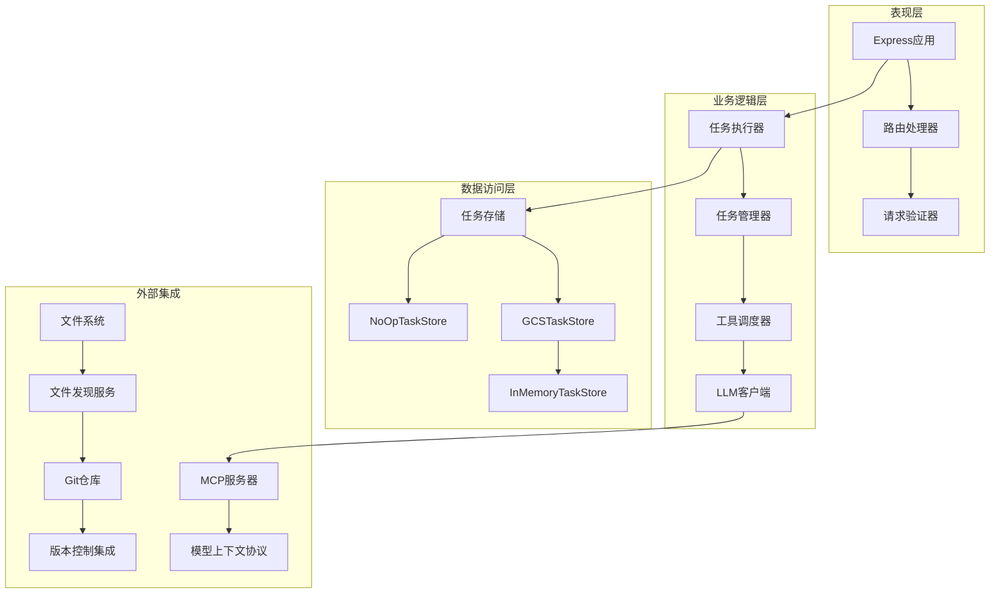

# MCP服务器实现

<cite>
**本文档引用的文件**
- [packages/a2a-server/src/http/server.ts](file://packages/a2a-server/src/http/server.ts)
- [packages/a2a-server/src/http/app.ts](file://packages/a2a-server/src/http/app.ts)
- [packages/a2a-server/src/agent/executor.ts](file://packages/a2a-server/src/agent/executor.ts)
- [packages/a2a-server/src/agent/task.ts](file://packages/a2a-server/src/agent/task.ts)
- [packages/a2a-server/src/types.ts](file://packages/a2a-server/src/types.ts)
- [packages/a2a-server/src/config/config.ts](file://packages/a2a-server/src/config/config.ts)
- [packages/a2a-server/src/utils/logger.ts](file://packages/a2a-server/src/utils/logger.ts)
- [packages/a2a-server/development-extension-rfc.md](file://packages/a2a-server/development-extension-rfc.md)
</cite>

## 目录
1. [简介](#简介)
2. [项目结构](#项目结构)
3. [核心组件](#核心组件)
4. [架构概览](#架构概览)
5. [详细组件分析](#详细组件分析)
6. [依赖关系分析](#依赖关系分析)
7. [性能考虑](#性能考虑)
8. [故障排除指南](#故障排除指南)
9. [结论](#结论)

## 简介

MCP（Model Context Protocol）服务器实现是一个基于HTTP的通信架构，专门设计用于支持A2A（Agent-to-Agent）协议的开发工具扩展。该实现提供了完整的MCP服务器功能，包括任务管理、事件流处理、工具调用确认和实时状态更新。

该系统的核心是`a2a-server`包，它实现了MCP协议的服务端逻辑，通过Express框架提供RESTful API接口，并使用事件驱动的方式处理客户端请求。系统支持异步状态更新、推送通知配置和多种工具类型的确认机制。

## 项目结构


**图表来源**
- [packages/a2a-server/src/http/server.ts](file://packages/a2a-server/src/http/server.ts#L1-L34)
- [packages/a2a-server/src/http/app.ts](file://packages/a2a-server/src/http/app.ts#L1-L201)

**章节来源**
- [packages/a2a-server/src/http/server.ts](file://packages/a2a-server/src/http/server.ts#L1-L34)
- [packages/a2a-server/src/http/app.ts](file://packages/a2a-server/src/http/app.ts#L1-L201)

## 核心组件

### 服务器启动流程

MCP服务器的启动过程遵循标准的Express应用程序模式，但集成了A2A协议的特定功能：

```typescript
// 服务器主入口点
export async function main() {
  try {
    const expressApp = await createApp();
    const port = process.env['CODER_AGENT_PORT'] || 0;
    
    const server = expressApp.listen(port, () => {
      const address = server.address();
      let actualPort;
      if (process.env['CODER_AGENT_PORT']) {
        actualPort = process.env['CODER_AGENT_PORT'];
      } else if (address && typeof address !== 'string') {
        actualPort = address.port;
      } else {
        throw new Error('[Core Agent] Could not find port number.');
      }
      updateCoderAgentCardUrl(Number(actualPort));
      logger.info(`[CoreAgent] Agent Server started on http://localhost:${actualPort}`);
      logger.info(`[CoreAgent] Agent Card: http://localhost:${actualPort}/.well-known/agent-card.json`);
      logger.info('[CoreAgent] Press Ctrl+C to stop the server');
    });
  } catch (error) {
    logger.error('[CoreAgent] Error during startup:', error);
    process.exit(1);
  }
}
```

### 连接管理与生命周期控制

系统实现了完整的连接生命周期管理，包括任务创建、执行、取消和状态持久化：


**图表来源**
- [packages/a2a-server/src/agent/executor.ts](file://packages/a2a-server/src/agent/executor.ts#L150-L250)
- [packages/a2a-server/src/agent/task.ts](file://packages/a2a-server/src/agent/task.ts#L400-L500)

**章节来源**
- [packages/a2a-server/src/http/app.ts](file://packages/a2a-server/src/http/app.ts#L150-L201)
- [packages/a2a-server/src/agent/executor.ts](file://packages/a2a-server/src/agent/executor.ts#L150-L300)

## 架构概览

MCP服务器采用分层架构设计，确保了良好的关注点分离和可扩展性：



**图表来源**
- [packages/a2a-server/src/http/app.ts](file://packages/a2a-server/src/http/app.ts#L50-L100)
- [packages/a2a-server/src/agent/executor.ts](file://packages/a2a-server/src/agent/executor.ts#L50-L100)

## 详细组件分析

### Express应用配置与中间件使用

Express应用通过`A2AExpressApp`类进行配置，集成了A2A协议的特定中间件和路由：

```typescript
export async function createApp() {
  try {
    const bucketName = process.env['GCS_BUCKET_NAME'];
    let taskStoreForExecutor: TaskStore;
    let taskStoreForHandler: TaskStore;

    // 根据环境选择任务存储策略
    if (bucketName) {
      logger.info(`Using GCSTaskStore with bucket: ${bucketName}`);
      const gcsTaskStore = new GCSTaskStore(bucketName);
      taskStoreForExecutor = gcsTaskStore;
      taskStoreForHandler = new NoOpTaskStore(gcsTaskStore);
    } else {
      logger.info('Using InMemoryTaskStore');
      const inMemoryTaskStore = new InMemoryTaskStore();
      taskStoreForExecutor = inMemoryTaskStore;
      taskStoreForHandler = inMemoryTaskStore;
    }

    const agentExecutor = new CoderAgentExecutor(taskStoreForExecutor);
    const requestHandler = new DefaultRequestHandler(
      coderAgentCard,
      taskStoreForHandler,
      agentExecutor,
    );

    let expressApp = express();
    expressApp.use((req, res, next) => {
      requestStorage.run({ req }, next);
    });

    const appBuilder = new A2AExpressApp(requestHandler);
    expressApp = appBuilder.setupRoutes(expressApp, '');
    expressApp.use(express.json());
    
    return expressApp;
  } catch (error) {
    logger.error('[CoreAgent] Error during startup:', error);
    process.exit(1);
  }
}
```

### API端点设计与功能

系统提供了多个关键API端点，每个都针对特定的MCP协议功能：

#### 任务管理端点

```mermaid
flowchart TD
A[POST /tasks] --> B[解析AgentSettings]
B --> C[创建任务实例]
C --> D[保存到任务存储]
D --> E[返回任务ID]
F[GET /tasks/metadata] --> G{内存存储检查}
G --> |是| H[获取所有任务元数据]
G --> |否| I[返回501错误]
H --> J[返回任务列表]
K[GET /tasks/{taskId}/metadata] --> L[查找任务]
L --> M{任务存在?}
M --> |是| N[返回任务元数据]
M --> |否| O[返回404错误]
```

**图表来源**
- [packages/a2a-server/src/http/app.ts](file://packages/a2a-server/src/http/app.ts#L80-L150)

#### 消息流端点

消息流端点处理客户端的异步请求，支持流式响应和状态更新：

```typescript
// 消息流处理示例
expressApp.post('/tasks', async (req, res) => {
  try {
    const taskId = uuidv4();
    const agentSettings = req.body.agentSettings as AgentSettings | undefined;
    const contextId = req.body.contextId || uuidv4();
    const wrapper = await agentExecutor.createTask(
      taskId,
      contextId,
      agentSettings,
    );
    await taskStoreForExecutor.save(wrapper.toSDKTask());
    res.status(201).json(wrapper.id);
  } catch (error) {
    logger.error('[CoreAgent] Error creating task:', error);
    const errorMessage = error instanceof Error ? error.message : 'Unknown error creating task';
    res.status(500).send({ error: errorMessage });
  }
});
```

**章节来源**
- [packages/a2a-server/src/http/app.ts](file://packages/a2a-server/src/http/app.ts#L80-L150)

### 服务端消息序列化与反序列化

系统实现了完整的消息序列化机制，支持ToolCall、AgentThought等核心数据结构的传输：


**图表来源**
- [packages/a2a-server/src/types.ts](file://packages/a2a-server/src/types.ts#L15-L80)

### 事件流机制实现

系统使用事件总线模式处理异步状态更新，确保客户端能够实时接收任务状态变化：

```typescript
// 事件发布机制
setTaskStateAndPublishUpdate(
  newState: TaskState,
  coderAgentMessage: CoderAgentMessage,
  messageText?: string,
  messageParts?: Part[],
  final = false,
  metadataError?: string,
): void {
  this.taskState = newState;
  
  const event = this._createStatusUpdateEvent(
    this.taskState,
    coderAgentMessage,
    message,
    final,
    undefined,
    metadataError,
  );
  this.eventBus?.publish(event);
}
```

**章节来源**
- [packages/a2a-server/src/agent/task.ts](file://packages/a2a-server/src/agent/task.ts#L200-L250)

### 错误处理、超时管理和日志记录

系统实现了全面的错误处理机制，包括异常捕获、超时管理和结构化日志记录：

```typescript
// 全局未捕获异常处理
process.on('uncaughtException', (error) => {
  logger.error('Unhandled exception:', error);
  process.exit(1);
});

// 请求级别的错误处理
try {
  await transport.handleRequest(req, res, req.body);
} catch (error) {
  const errorMessage = error instanceof Error ? error.message : 'Unknown error';
  logger.error(`Error handling MCP request: ${errorMessage}`);
  if (!res.headersSent) {
    res.status(500).json({
      jsonrpc: '2.0' as const,
      error: {
        code: -32603,
        message: 'Internal server error',
      },
      id: null,
    });
  }
}
```

**章节来源**
- [packages/a2a-server/src/http/server.ts](file://packages/a2a-server/src/http/server.ts#L15-L25)
- [packages/a2a-server/src/utils/logger.ts](file://packages/a2a-server/src/utils/logger.ts#L1-L29)

## 依赖关系分析


**图表来源**
- [packages/a2a-server/src/http/app.ts](file://packages/a2a-server/src/http/app.ts#L1-L20)
- [packages/a2a-server/src/agent/executor.ts](file://packages/a2a-server/src/agent/executor.ts#L1-L20)

**章节来源**
- [packages/a2a-server/src/http/app.ts](file://packages/a2a-server/src/http/app.ts#L1-L30)
- [packages/a2a-server/src/agent/executor.ts](file://packages/a2a-server/src/agent/executor.ts#L1-L30)

## 性能考虑

### 内存管理

系统采用多种策略优化内存使用：
- 使用任务包装器模式减少重复对象创建
- 实现任务状态的增量更新
- 支持内存和持久化两种存储策略

### 并发处理

```typescript
// 并发任务处理
private executingTasks = new Set<string>();

// 避免重复执行相同任务
if (this.executingTasks.has(taskId)) {
  logger.info(`[CoderAgentExecutor] Task ${taskId} has a pending execution. Processing message and yielding.`);
  currentTask.eventBus = eventBus;
  for await (const _ of currentTask.acceptUserMessage(requestContext, abortController.signal)) {
    // 处理消息并让位给原始执行
  }
  return;
}
```

### 超时管理

系统实现了完善的超时机制，防止长时间运行的任务影响服务器性能。

## 故障排除指南

### 常见问题诊断

1. **任务创建失败**
   - 检查环境变量配置
   - 验证工作空间路径权限
   - 查看日志中的具体错误信息

2. **工具调用确认问题**
   - 确认工具注册表配置正确
   - 检查MCP服务器连接状态
   - 验证用户权限设置

3. **内存泄漏检测**
   - 监控正在执行的任务集合
   - 检查任务完成后的清理逻辑
   - 使用内存分析工具定位问题

**章节来源**
- [packages/a2a-server/src/agent/executor.ts](file://packages/a2a-server/src/agent/executor.ts#L300-L400)
- [packages/a2a-server/src/utils/logger.ts](file://packages/a2a-server/src/utils/logger.ts#L1-L29)

## 结论

MCP服务器实现提供了一个完整、可扩展的解决方案，用于在A2A协议基础上构建智能代理服务。通过模块化设计、事件驱动架构和完善的错误处理机制，该实现能够可靠地处理复杂的开发工具工作流。

系统的主要优势包括：
- 基于HTTP的标准化通信协议
- 完整的任务生命周期管理
- 灵活的工具调用确认机制
- 可扩展的配置系统
- 全面的日志记录和监控支持

未来的改进方向可能包括增强的缓存机制、更细粒度的权限控制以及更多的集成选项。