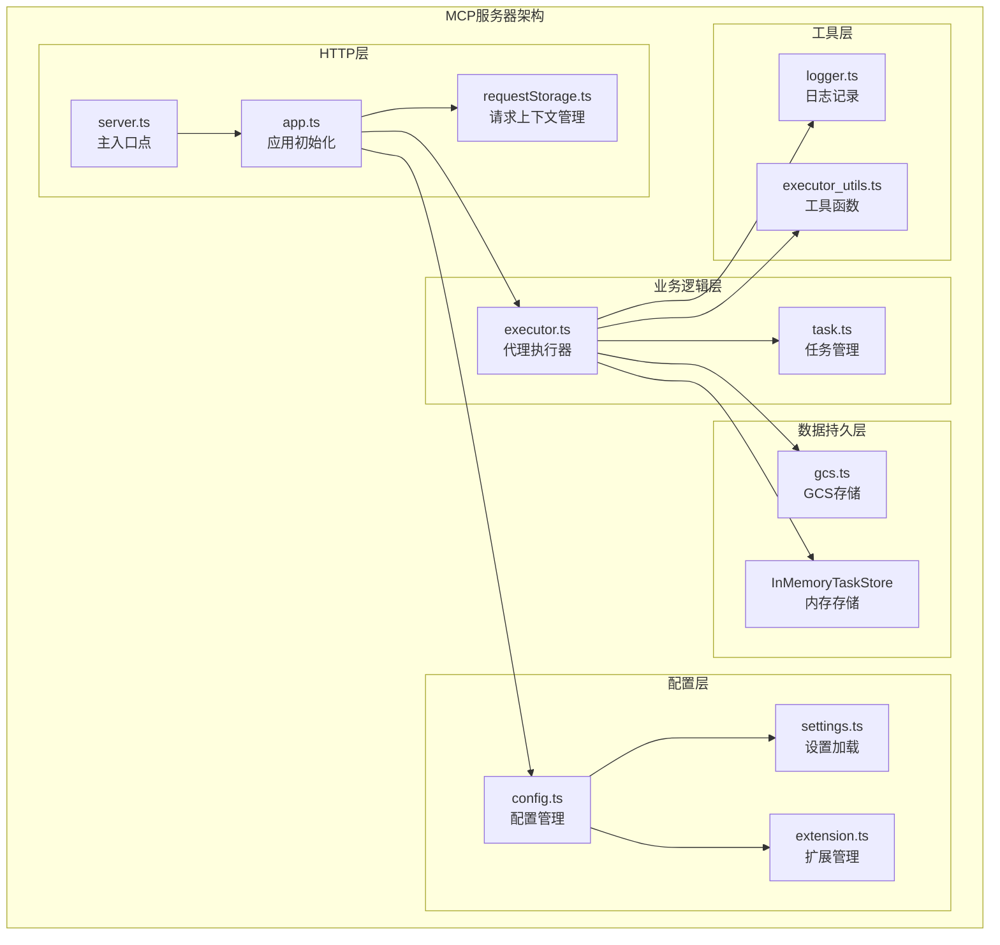
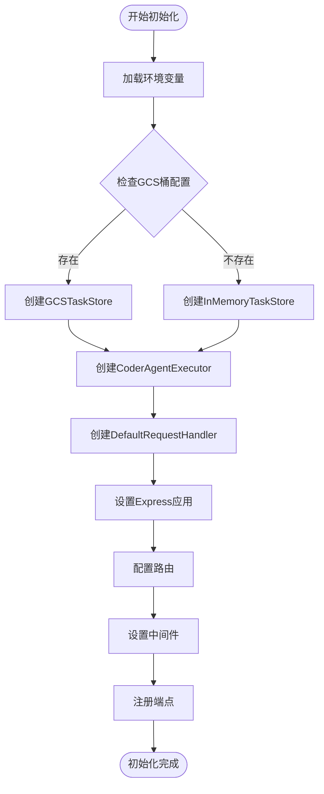
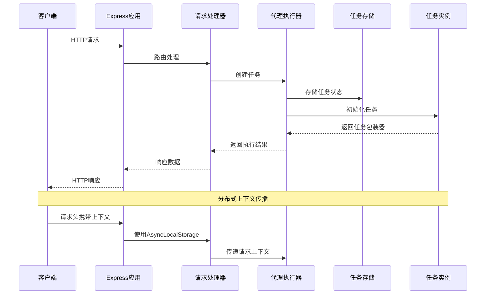
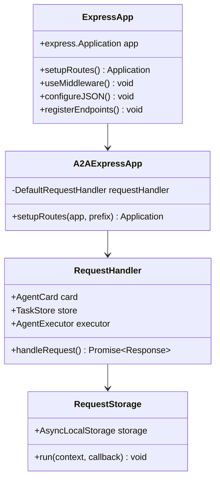
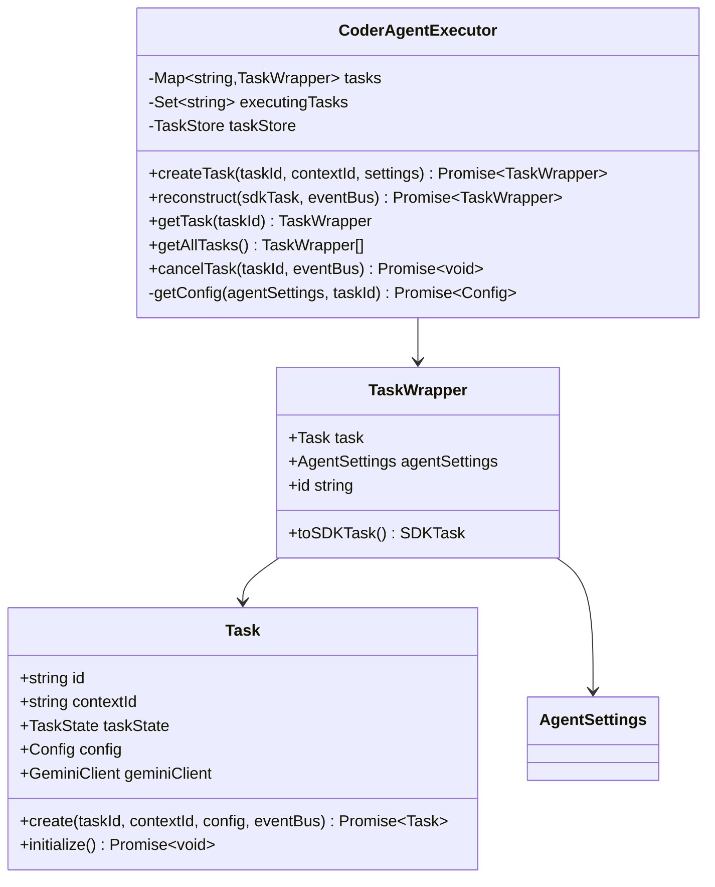
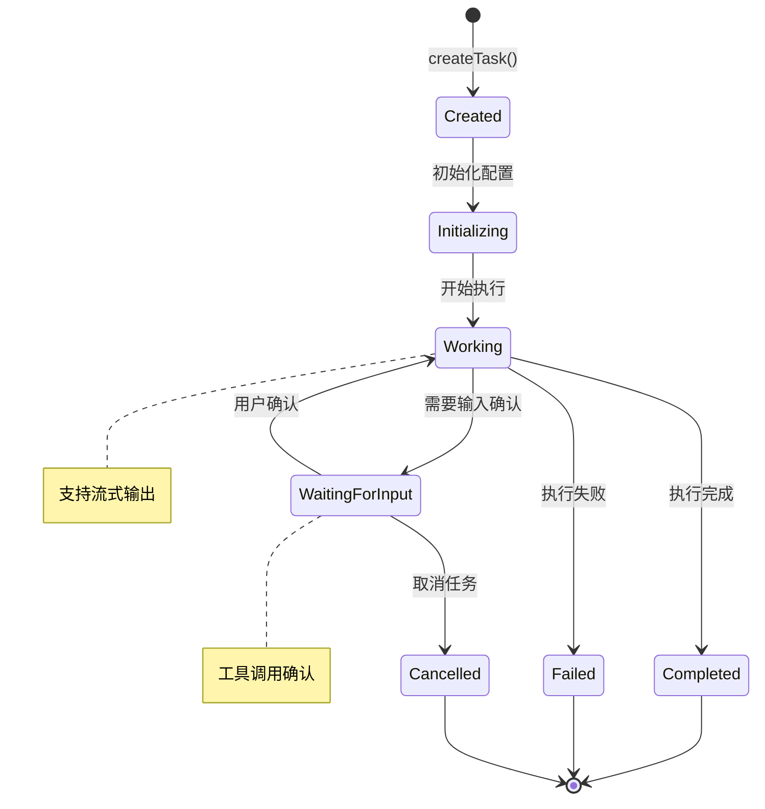
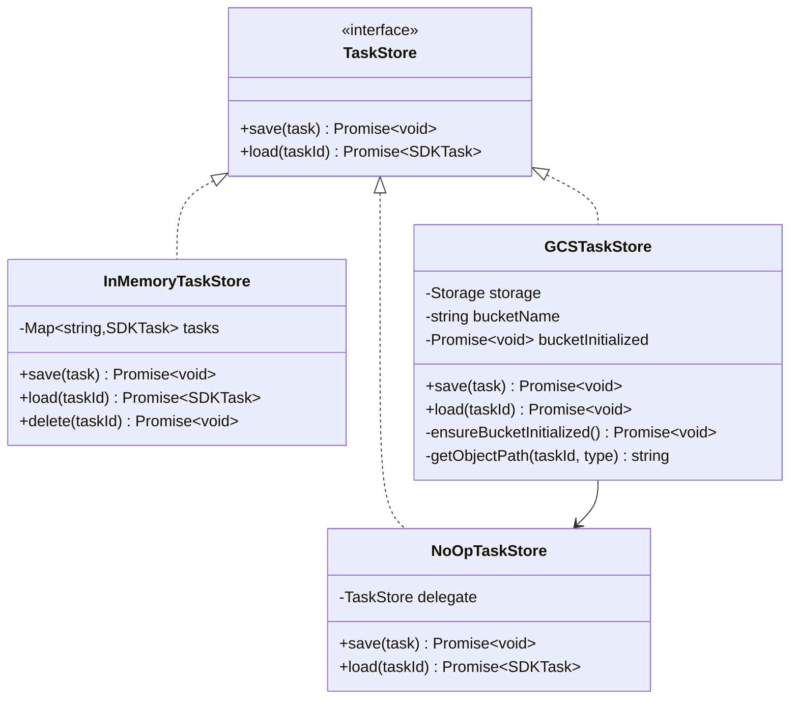
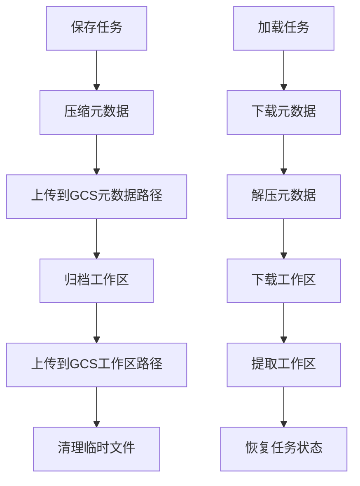
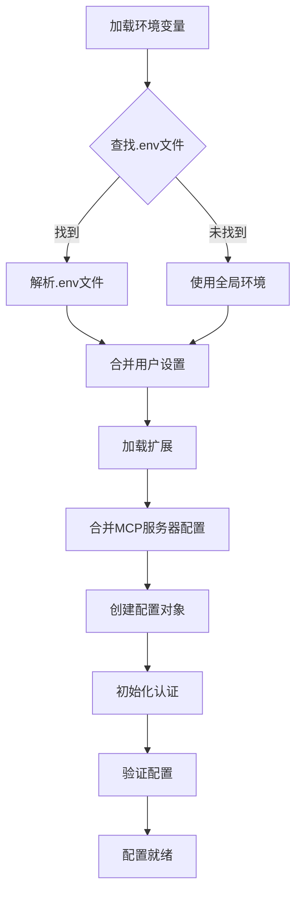

# MCP服务器架构文档

<cite>
**本文档引用的文件**
- [index.ts](file://packages/a2a-server/src/index.ts)
- [server.ts](file://packages/a2a-server/src/http/server.ts)
- [app.ts](file://packages/a2a-server/src/http/app.ts)
- [executor.ts](file://packages/a2a-server/src/agent/executor.ts)
- [gcs.ts](file://packages/a2a-server/src/persistence/gcs.ts)
- [requestStorage.ts](file://packages/a2a-server/src/http/requestStorage.ts)
- [types.ts](file://packages/a2a-server/src/types.ts)
- [config.ts](file://packages/a2a-server/src/config/config.ts)
- [package.json](file://packages/a2a-server/package.json)
</cite>

## 目录
1. [简介](#简介)
2. [项目结构](#项目结构)
3. [核心组件](#核心组件)
4. [架构概览](#架构概览)
5. [详细组件分析](#详细组件分析)
6. [依赖关系分析](#依赖关系分析)
7. [性能考虑](#性能考虑)
8. [故障排除指南](#故障排除指南)
9. [结论](#结论)

## 简介

MCP（Model Context Protocol）服务器架构是一个基于Express框架构建的高性能HTTP服务，专门设计用于与A2A SDK（Agent-to-Agent SDK）集成。该架构提供了完整的代码生成代理服务，支持内存存储和Google Cloud Storage两种任务持久化模式，具备强大的请求上下文管理和分布式执行能力。

该系统的核心目标是为开发者提供一个可扩展的、可靠的代码生成平台，通过标准化的协议接口实现与各种AI模型的无缝集成。架构设计遵循现代微服务原则，具有高度的模块化和可测试性。

## 项目结构

MCP服务器采用清晰的分层架构，主要包含以下核心模块：



**图表来源**
- [server.ts](file://packages/a2a-server/src/http/server.ts#L1-L34)
- [app.ts](file://packages/a2a-server/src/http/app.ts#L1-L201)
- [executor.ts](file://packages/a2a-server/src/agent/executor.ts#L1-L610)

**章节来源**
- [index.ts](file://packages/a2a-server/src/index.ts#L1-L10)
- [package.json](file://packages/a2a-server/package.json#L1-L49)

## 核心组件

### 主模块检测机制

服务器采用智能的主模块检测机制来确保正确的启动流程：

```typescript
// 检测是否为主模块运行
const isMainModule =
  path.resolve(process.argv[1]) ===
  path.resolve(url.fileURLToPath(import.meta.url));

// 异常处理策略
process.on('uncaughtException', (error) => {
  logger.error('Unhandled exception:', error);
  process.exit(1);
});
```

这种设计确保了：
- 避免在模块导入时意外执行主函数
- 提供统一的异常处理机制
- 支持测试环境的隔离

### 应用程序初始化流程

`createApp()`函数负责完整的应用程序初始化：



**图表来源**
- [app.ts](file://packages/a2a-server/src/http/app.ts#L60-L120)

**章节来源**
- [server.ts](file://packages/a2a-server/src/http/server.ts#L15-L34)
- [app.ts](file://packages/a2a-server/src/http/app.ts#L60-L120)

## 架构概览

MCP服务器采用事件驱动的架构模式，核心组件之间通过明确定义的接口进行通信：



**图表来源**
- [app.ts](file://packages/a2a-server/src/http/app.ts#L80-L100)
- [executor.ts](file://packages/a2a-server/src/agent/executor.ts#L100-L150)
- [requestStorage.ts](file://packages/a2a-server/src/http/requestStorage.ts#L1-L11)

## 详细组件分析

### Express应用层

Express应用层负责HTTP请求的接收和路由分发：



**图表来源**
- [app.ts](file://packages/a2a-server/src/http/app.ts#L80-L100)
- [requestStorage.ts](file://packages/a2a-server/src/http/requestStorage.ts#L1-L11)

#### 请求上下文存储机制

`requestStorage`提供了基于`AsyncLocalStorage`的请求上下文管理：

```typescript
export const requestStorage = new AsyncLocalStorage<{ req: express.Request }>();
```

这种设计的优势：
- 支持异步操作中的上下文传递
- 避免手动传递请求对象
- 提供类型安全的上下文访问
- 自动清理避免内存泄漏

**章节来源**
- [app.ts](file://packages/a2a-server/src/http/app.ts#L80-L100)
- [requestStorage.ts](file://packages/a2a-server/src/http/requestStorage.ts#L1-L11)

### 代理执行器层

代理执行器是系统的核心业务逻辑组件：



**图表来源**
- [executor.ts](file://packages/a2a-server/src/agent/executor.ts#L30-L80)
- [executor.ts](file://packages/a2a-server/src/agent/executor.ts#L100-L150)

#### 任务生命周期管理

代理执行器实现了完整的工作流管理：



**图表来源**
- [executor.ts](file://packages/a2a-server/src/agent/executor.ts#L150-L200)

**章节来源**
- [executor.ts](file://packages/a2a-server/src/agent/executor.ts#L1-L200)

### 数据持久化层

系统支持两种存储模式：内存存储和Google Cloud Storage：



**图表来源**
- [gcs.ts](file://packages/a2a-server/src/persistence/gcs.ts#L20-L80)

#### Google Cloud Storage存储机制

GCSTaskStore提供了生产级的持久化解决方案：



**图表来源**
- [gcs.ts](file://packages/a2a-server/src/persistence/gcs.ts#L80-L150)

**章节来源**
- [gcs.ts](file://packages/a2a-server/src/persistence/gcs.ts#L1-L200)

### 配置管理层

配置管理系统负责环境变量加载、设置解析和扩展管理：



**图表来源**
- [config.ts](file://packages/a2a-server/src/config/config.ts#L20-L80)

**章节来源**
- [config.ts](file://packages/a2a-server/src/config/config.ts#L1-L200)

## 依赖关系分析

系统的依赖关系展现了清晰的分层架构：

```mermaid
graph TB
subgraph "外部依赖"
Express[express ^5.1.0]
UUID[uuid ^11.1.0]
Winston[winston ^3.17.0]
GCS[@google-cloud/storage ^7.16.0]
end
subgraph "内部依赖"
A2ASDK[@a2a-js/sdk ^0.3.2]
CoreLib[@google/gemini-cli-core]
end
subgraph "MCP服务器"
Server[server.ts]
App[app.ts]
Executor[executor.ts]
Config[config.ts]
GCSStore[gcs.ts]
end
Server --> App
App --> Executor
App --> Config
App --> GCSStore
Executor --> A2ASDK
Executor --> CoreLib
App --> Express
App --> UUID
Config --> Winston
GCSStore --> GCS
```

**图表来源**
- [package.json](file://packages/a2a-server/package.json#L25-L35)

**章节来源**
- [package.json](file://packages/a2a-server/package.json#L1-L49)

## 性能考虑

### 内存优化策略

1. **任务状态管理**：使用Map结构存储活跃任务，支持快速查找和删除
2. **流式处理**：支持大文件的流式传输，避免内存溢出
3. **缓存机制**：合理利用浏览器缓存和CDN加速静态资源

### 并发处理能力

1. **异步存储**：所有I/O操作都是异步的，不会阻塞主线程
2. **连接池管理**：合理配置数据库连接池大小
3. **负载均衡**：支持多实例部署和负载均衡

### 监控和可观测性

系统集成了全面的日志记录和监控机制：

```typescript
// 结构化日志记录
logger.info(`Task ${taskId} reconstructed from store.`);
logger.error('[CoreAgent] Error during startup:', error);
```

## 故障排除指南

### 常见问题及解决方案

#### 1. 任务创建失败

**症状**：POST /tasks返回500错误
**原因**：配置加载或权限问题
**解决方案**：
- 检查环境变量配置
- 验证GCS桶权限
- 查看详细错误日志

#### 2. 认证失败

**症状**：无法连接到AI服务
**原因**：API密钥或认证配置错误
**解决方案**：
- 验证GEMINI_API_KEY环境变量
- 检查USE_CCPA配置
- 确认Google Cloud凭证

#### 3. 存储问题

**症状**：任务状态丢失
**原因**：存储配置或网络问题
**解决方案**：
- 切换到内存存储进行测试
- 检查GCS桶配置
- 验证网络连接

**章节来源**
- [app.ts](file://packages/a2a-server/src/http/app.ts#L100-L150)
- [executor.ts](file://packages/a2a-server/src/agent/executor.ts#L200-L250)

## 结论

MCP服务器架构展现了现代Web服务的最佳实践，通过清晰的分层设计、完善的错误处理和灵活的配置管理，为开发者提供了一个强大而可靠的代码生成平台。

### 主要优势

1. **模块化设计**：各组件职责明确，易于维护和扩展
2. **高可用性**：支持多种存储后端，确保数据可靠性
3. **可扩展性**：基于标准协议，便于集成第三方服务
4. **可观测性**：完整的日志记录和监控支持

### 技术亮点

- 基于Express的现代化Web框架
- 基于A2A SDK的标准协议集成
- 支持分布式上下文传播
- 完善的测试覆盖和质量保证

该架构为未来的功能扩展和技术演进奠定了坚实的基础，是一个值得学习和借鉴的优秀示例。