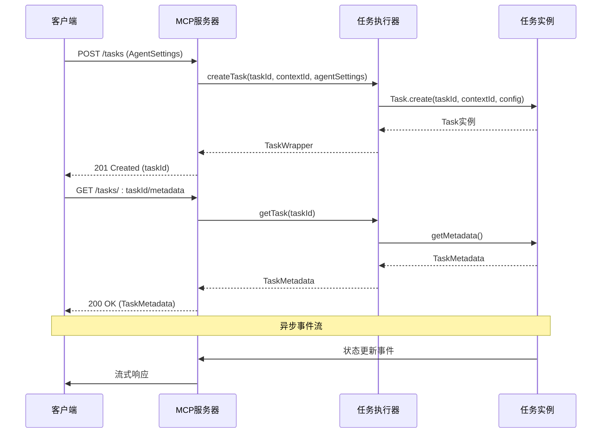
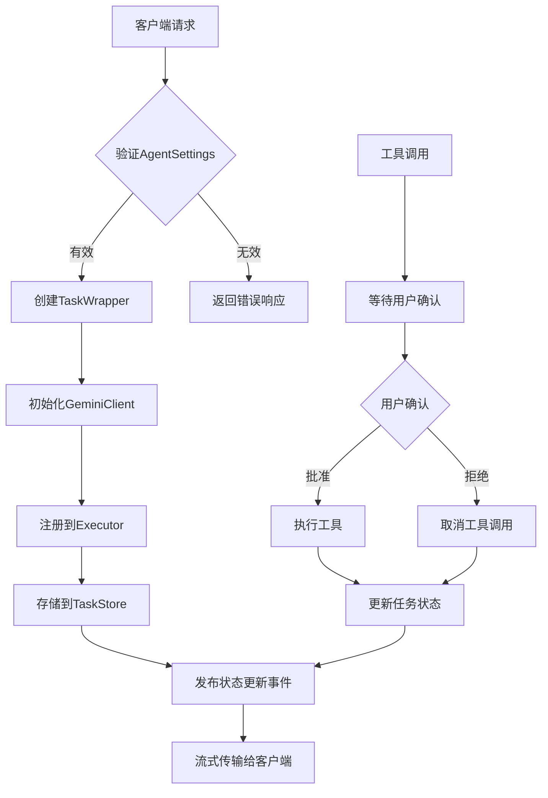
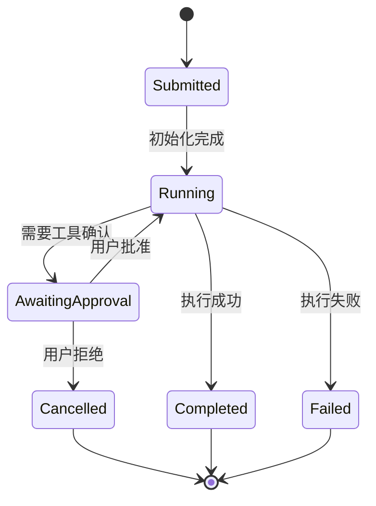

# MCP服务器消息协议详细文档

<cite>
**本文档引用的文件**
- [packages/a2a-server/src/types.ts](file://packages/a2a-server/src/types.ts)
- [packages/a2a-server/src/agent/task.ts](file://packages/a2a-server/src/agent/task.ts)
- [packages/a2a-server/src/agent/executor.ts](file://packages/a2a-server/src/agent/executor.ts)
- [packages/cli/src/zed-integration/schema.ts](file://packages/cli/src/zed-integration/schema.ts)
- [packages/a2a-server/src/http/app.ts](file://packages/a2a-server/src/http/app.ts)
- [packages/a2a-server/src/http/endpoints.test.ts](file://packages/a2a-server/src/http/endpoints.test.ts)
- [packages/core/src/tools/mcp-client.ts](file://packages/core/src/tools/mcp-client.ts)
- [packages/core/src/tools/mcp-client-manager.ts](file://packages/core/src/tools/mcp-client-manager.ts)
</cite>

## 目录
1. [简介](#简介)
2. [核心数据结构](#核心数据结构)
3. [消息协议架构](#消息协议架构)
4. [AgentCard详解](#agentcard详解)
5. [任务生命周期](#任务生命周期)
6. [序列化与反序列化](#序列化与反序列化)
7. [协议版本管理](#协议版本管理)
8. [JSON消息示例](#json消息示例)
9. [错误处理机制](#错误处理机制)
10. [最佳实践](#最佳实践)

## 简介

MCP（Model Context Protocol）服务器消息协议是Gemini CLI项目中用于服务器与客户端之间通信的核心协议。该协议基于A2A（Agent-to-Agent）标准，定义了完整的数据模型、序列化机制和通信流程，支持异步流式响应、工具调用确认和实时状态更新。

协议设计遵循以下核心原则：
- **类型安全**：使用TypeScript接口确保数据结构的一致性
- **可扩展性**：支持插件和扩展机制
- **实时性**：提供流式数据传输能力
- **可靠性**：包含完整的错误处理和重试机制

## 核心数据结构

### AgentSettings

`AgentSettings`是客户端向服务器发送的初始配置对象，定义了代理的基本设置：

```typescript
interface AgentSettings {
  kind: CoderAgentEvent.StateAgentSettingsEvent;
  workspacePath: string;
}
```

**字段说明：**
- `kind`: 固定值为`'agent-settings'`，标识消息类型
- `workspacePath`: 客户端工作区路径，指定代理操作的根目录

### TaskMetadata

`TaskMetadata`包含了任务的完整元数据信息：

```typescript
interface TaskMetadata {
  id: string;
  contextId: string;
  taskState: TaskState;
  model: string;
  mcpServers: Array<{
    name: string;
    status: MCPServerStatus;
    tools: Array<{
      name: string;
      description: string;
      parameterSchema: unknown;
    }>;
  }>;
  availableTools: Array<{
    name: string;
    description: string;
    parameterSchema: unknown;
  }>;
}
```

**关键属性：**
- `id`: 唯一的任务标识符
- `contextId`: 上下文标识符，用于关联相关任务
- `taskState`: 当前任务状态（submitted、running、completed等）
- `model`: 使用的AI模型名称
- `mcpServers`: MCP服务器列表及其可用工具
- `availableTools`: 可用工具列表

### CoderAgentMessage

所有代理间通信的消息都实现此联合类型：

```typescript
type CoderAgentMessage =
  | AgentSettings
  | ToolCallConfirmation
  | ToolCallUpdate
  | TextContent
  | StateChange
  | Thought;
```

**消息类型：**
- `AgentSettings`: 代理设置消息
- `ToolCallConfirmation`: 工具调用确认请求
- `ToolCallUpdate`: 工具调用状态更新
- `TextContent`: 文本内容消息
- `StateChange`: 状态变更通知
- `Thought`: 思考过程消息

**章节来源**
- [packages/a2a-server/src/types.ts](file://packages/a2a-server/src/types.ts#L34-L130)
- [packages/a2a-server/src/agent/task.ts](file://packages/a2a-server/src/agent/task.ts#L113-L133)

## 消息协议架构

### 通信流程图



**图表来源**
- [packages/a2a-server/src/agent/executor.ts](file://packages/a2a-server/src/agent/executor.ts#L139-L160)
- [packages/a2a-server/src/agent/task.ts](file://packages/a2a-server/src/agent/task.ts#L113-L133)

### 数据流架构



**图表来源**
- [packages/a2a-server/src/agent/executor.ts](file://packages/a2a-server/src/agent/executor.ts#L40-L90)
- [packages/a2a-server/src/agent/task.ts](file://packages/a2a-server/src/agent/task.ts#L200-L250)

**章节来源**
- [packages/a2a-server/src/agent/executor.ts](file://packages/a2a-server/src/agent/executor.ts#L40-L160)
- [packages/a2a-server/src/agent/task.ts](file://packages/a2a-server/src/agent/task.ts#L200-L300)

## AgentCard详解

### AgentCard结构

AgentCard是服务器向客户端提供的能力声明，定义了代理的功能特性和配置要求：

```typescript
interface AgentCard {
  name: string;
  description: string;
  url: string;
  provider: {
    organization: string;
    url: string;
  };
  protocolVersion: string;
  version: string;
  capabilities: {
    streaming: boolean;
    pushNotifications: boolean;
    stateTransitionHistory: boolean;
  };
  securitySchemes: undefined;
  security: undefined;
  defaultInputModes: string[];
  defaultOutputModes: string[];
  skills: Skill[];
  supportsAuthenticatedExtendedCard: boolean;
}
```

### 技能定义

每个技能通过`Skill`接口定义其功能特性：

```typescript
interface Skill {
  id: string;
  name: string;
  description: string;
  tags: string[];
  examples: string[];
  inputModes: string[];
  outputModes: string[];
}
```

**典型技能示例：**

```json
{
  "id": "code_generation",
  "name": "Code Generation",
  "description": "Generates code snippets or complete files based on user requests, streaming the results.",
  "tags": ["code", "development", "programming"],
  "examples": [
    "Write a python function to calculate fibonacci numbers.",
    "Create an HTML file with a basic button that alerts 'Hello!' when clicked."
  ],
  "inputModes": ["text"],
  "outputModes": ["text"]
}
```

### 能力特性

**流式传输（Streaming）：**
- 支持实时数据流传输
- 提供渐进式结果展示
- 减少用户等待时间

**推送通知（Push Notifications）：**
- 允许服务器主动推送更新
- 支持断线重连后的状态同步
- 提高通信效率

**状态转换历史（State Transition History）：**
- 记录任务状态变化轨迹
- 支持状态回滚和恢复
- 提供审计和调试能力

**章节来源**
- [packages/a2a-server/src/http/app.ts](file://packages/a2a-server/src/http/app.ts#L15-L60)
- [packages/cli/src/zed-integration/schema.ts](file://packages/cli/src/zed-integration/schema.ts#L280-L290)

## 任务生命周期

### 任务创建阶段



### 状态管理

任务状态通过`TaskState`枚举管理：

```typescript
type TaskState = 
  | 'submitted'      // 任务已提交
  | 'running'        // 正在执行
  | 'awaiting_approval' // 等待用户确认
  | 'completed'      // 执行完成
  | 'failed'         // 执行失败
  | 'cancelled';     // 已取消
```

### 事件发布机制

```typescript
private _createStatusUpdateEvent(
  stateToReport: TaskState,
  coderAgentMessage: CoderAgentMessage,
  message?: Message,
  final = false,
  timestamp?: string,
  metadataError?: string,
): TaskStatusUpdateEvent {
  const metadata: {
    coderAgent: CoderAgentMessage;
    model: string;
    userTier?: UserTierId;
    error?: string;
  } = {
    coderAgent: coderAgentMessage,
    model: this.config.getModel(),
    userTier: this.config.getUserTier(),
  };

  if (metadataError) {
    metadata.error = metadataError;
  }

  return {
    kind: 'status-update',
    taskId: this.id,
    contextId: this.contextId,
    status: {
      state: stateToReport,
      message, // 状态消息
      timestamp: timestamp || new Date().toISOString(),
    },
    final,
    metadata,
  };
}
```

**章节来源**
- [packages/a2a-server/src/agent/task.ts](file://packages/a2a-server/src/agent/task.ts#L200-L250)
- [packages/a2a-server/src/agent/task.ts](file://packages/a2a-server/src/agent/task.ts#L300-L400)

## 序列化与反序列化

### JSON请求体处理

客户端发送的JSON请求体首先被Express框架解析为JavaScript对象：

```typescript
expressApp.post('/tasks', async (req, res) => {
  try {
    const taskId = uuidv4();
    const agentSettings = req.body.agentSettings as AgentSettings | undefined;
    const contextId = req.body.contextId || uuidv4();
    const wrapper = await agentExecutor.createTask(
      taskId,
      contextId,
      agentSettings,
    );
    await taskStoreForExecutor.save(wrapper.toSDKTask());
    res.status(201).json(wrapper.id);
  } catch (error) {
    logger.error('[CoreAgent] Error creating task:', error);
    const errorMessage = error instanceof Error ? error.message : 'Unknown error creating task';
    res.status(500).send({ error: errorMessage });
  }
});
```

### AgentSettings反序列化

系统自动将JSON请求体反序列化为`AgentSettings`对象：

```typescript
const agentSettings = req.body.agentSettings as AgentSettings | undefined;
```

**反序列化流程：**
1. Express接收HTTP请求
2. 自动解析JSON body
3. 类型断言转换为`AgentSettings`类型
4. 传递给`AgentExecutor.createTask()`方法

### SDKTask序列化

`TaskWrapper`类负责将内部任务状态序列化为SDK兼容格式：

```typescript
toSDKTask(): SDKTask {
  const persistedState: PersistedStateMetadata = {
    _agentSettings: this.agentSettings,
    _taskState: this.task.taskState,
  };

  const sdkTask: SDKTask = {
    id: this.task.id,
    contextId: this.task.contextId,
    kind: 'task',
    status: {
      state: this.task.taskState,
      timestamp: new Date().toISOString(),
    },
    metadata: setPersistedState({}, persistedState),
    history: [],
    artifacts: [],
  };
  sdkTask.metadata!['_contextId'] = this.task.contextId;
  return sdkTask;
}
```

**章节来源**
- [packages/a2a-server/src/http/app.ts](file://packages/a2a-server/src/http/app.ts#L80-L120)
- [packages/a2a-server/src/agent/executor.ts](file://packages/a2a-server/src/agent/executor.ts#L50-L70)

## 协议版本管理

### 版本策略

协议采用语义化版本控制，当前版本为`0.3.0`：

```typescript
protocolVersion: '0.3.0',
```

### 安全方案

协议目前不包含特定的安全方案：

```typescript
securitySchemes: undefined,
security: undefined,
```

### 向后兼容性

系统通过以下机制确保向后兼容：

1. **版本检查**：客户端连接时验证协议版本
2. **功能降级**：新功能不强制要求客户端支持
3. **默认配置**：提供合理的默认行为

**章节来源**
- [packages/a2a-server/src/http/app.ts](file://packages/a2a-server/src/http/app.ts#L28-L35)
- [packages/cli/src/zed-integration/schema.ts](file://packages/cli/src/zed-integration/schema.ts#L318-L320)

## JSON消息示例

### 创建任务请求

```json
POST /tasks
Content-Type: application/json

{
  "contextId": "session-12345",
  "agentSettings": {
    "kind": "agent-settings",
    "workspacePath": "/home/user/projects/my-app"
  }
}
```

### 任务元数据响应

```json
GET /tasks/uuid-12345/metadata

{
  "metadata": {
    "id": "uuid-12345",
    "contextId": "session-12345",
    "taskState": "running",
    "model": "gemini-pro",
    "mcpServers": [
      {
        "name": "file-system",
        "status": "connected",
        "tools": [
          {
            "name": "read_file",
            "description": "Reads a text file",
            "parameterSchema": {
              "type": "object",
              "properties": {
                "path": {
                  "type": "string",
                  "description": "File path to read"
                }
              }
            }
          }
        ]
      }
    ],
    "availableTools": [
      {
        "name": "write_file",
        "description": "Writes content to a file",
        "parameterSchema": {
          "type": "object",
          "properties": {
            "path": {
              "type": "string"
            },
            "content": {
              "type": "string"
            }
          }
        }
      }
    ]
  }
}
```

### AgentCard响应

```json
GET /.well-known/agent-card.json

{
  "name": "Gemini SDLC Agent",
  "description": "An agent that generates code based on natural language instructions and streams file outputs.",
  "url": "http://localhost:41242/",
  "provider": {
    "organization": "Google",
    "url": "https://google.com"
  },
  "protocolVersion": "0.3.0",
  "version": "0.0.2",
  "capabilities": {
    "streaming": true,
    "pushNotifications": false,
    "stateTransitionHistory": true
  },
  "securitySchemes": null,
  "defaultInputModes": ["text"],
  "defaultOutputModes": ["text"],
  "skills": [
    {
      "id": "code_generation",
      "name": "Code Generation",
      "description": "Generates code snippets or complete files based on user requests, streaming the results.",
      "tags": ["code", "development", "programming"],
      "examples": [
        "Write a python function to calculate fibonacci numbers.",
        "Create an HTML file with a basic button that alerts 'Hello!' when clicked."
      ],
      "inputModes": ["text"],
      "outputModes": ["text"]
    }
  ],
  "supportsAuthenticatedExtendedCard": false
}
```

### 状态更新事件

```json
{
  "kind": "status-update",
  "taskId": "uuid-12345",
  "contextId": "session-12345",
  "status": {
    "state": "running",
    "message": {
      "kind": "message",
      "role": "agent",
      "parts": [
        {
          "kind": "text",
          "text": "正在生成代码..."
        }
      ],
      "messageId": "msg-67890",
      "taskId": "uuid-12345"
    },
    "timestamp": "2024-01-15T10:30:00.000Z"
  },
  "final": false,
  "metadata": {
    "coderAgent": {
      "kind": "text-content"
    },
    "model": "gemini-pro",
    "userTier": "free"
  }
}
```

**章节来源**
- [packages/a2a-server/src/http/endpoints.test.ts](file://packages/a2a-server/src/http/endpoints.test.ts#L60-L80)
- [packages/a2a-server/src/http/endpoints.test.ts](file://packages/a2a-server/src/http/endpoints.test.ts#L140-L160)

## 错误处理机制

### 错误分类

系统定义了多种错误类型：

```typescript
// 任务不存在错误
res.status(404).send({ error: 'Task not found' });

// 任务创建错误
res.status(500).send({ error: errorMessage });

// 不支持的操作
res.status(501).send({
  error: 'Listing all task metadata is only supported when using InMemoryTaskStore.'
});
```

### 错误传播

错误通过以下层级传播：

1. **底层服务层**：捕获具体异常
2. **业务逻辑层**：转换为业务异常
3. **API层**：标准化错误响应
4. **客户端**：处理HTTP状态码和错误消息

### 日志记录

系统使用统一的日志记录机制：

```typescript
logger.error('[CoreAgent] Error creating task:', error);
logger.error('[CoreAgent] Error getting all task metadata:', error);
logger.error('[CoreAgent] Error during startup:', error);
```

**章节来源**
- [packages/a2a-server/src/http/app.ts](file://packages/a2a-server/src/http/app.ts#L90-L110)
- [packages/a2a-server/src/agent/task.ts](file://packages/a2a-server/src/agent/task.ts#L300-L320)

## 最佳实践

### 客户端开发建议

1. **连接验证**：始终验证AgentCard中的协议版本
2. **错误处理**：实现适当的重试机制
3. **状态同步**：定期查询任务元数据
4. **资源管理**：及时清理已完成的任务

### 服务器端开发建议

1. **类型安全**：充分利用TypeScript类型系统
2. **性能优化**：使用内存缓存减少数据库访问
3. **监控告警**：实施全面的日志记录和监控
4. **扩展性**：设计可插拔的工具和插件架构

### 协议演进

1. **向后兼容**：新增功能时不破坏现有客户端
2. **版本标记**：明确标注协议版本变更
3. **文档维护**：保持API文档的及时更新
4. **社区反馈**：积极收集和响应用户反馈

### 安全考虑

1. **输入验证**：严格验证所有客户端输入
2. **权限控制**：实现细粒度的访问控制
3. **数据保护**：加密敏感数据传输
4. **审计跟踪**：记录所有重要操作

通过遵循这些最佳实践，可以构建稳定、高效且易于维护的MCP服务器消息协议实现。