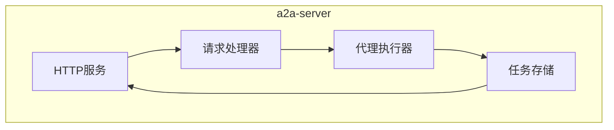
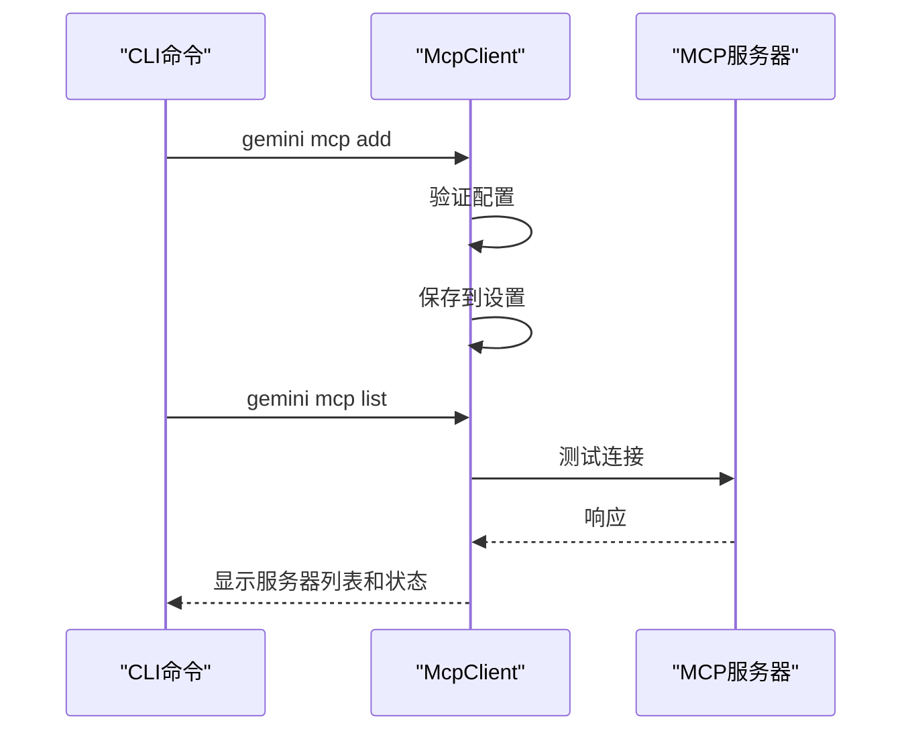
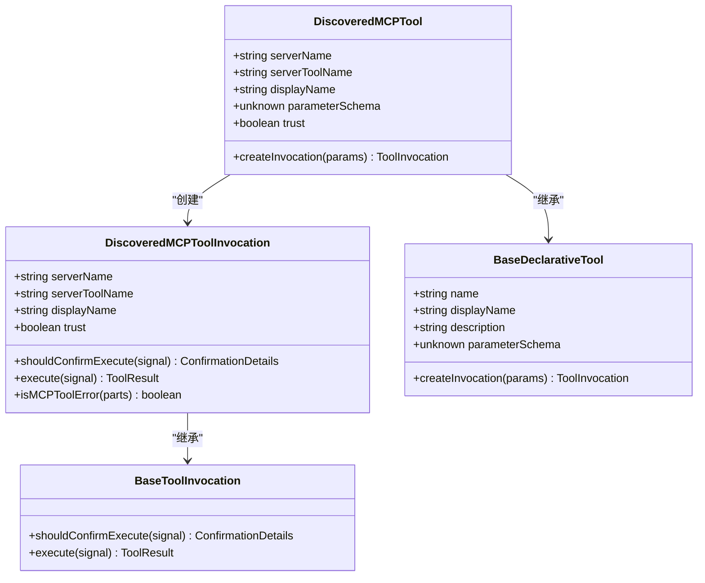

# MCP服务器集成

<cite>
**本文档中引用的文件**  
- [endpoints.ts](file://packages/a2a-server/src/http/endpoints.ts)
- [mcp-client.ts](file://packages/core/src/tools/mcp-client.ts)
- [mcp-tool.ts](file://packages/core/src/tools/mcp-tool.ts)
- [add.ts](file://packages/cli/src/commands/mcp/add.ts)
- [list.ts](file://packages/cli/src/commands/mcp/list.ts)
- [remove.ts](file://packages/cli/src/commands/mcp/remove.ts)
- [config.ts](file://packages/core/src/config/config.ts)
- [app.ts](file://packages/a2a-server/src/http/app.ts)
</cite>

## 目录
1. [简介](#简介)
2. [MCP协议概述](#mcp协议概述)
3. [a2a-server服务端实现](#a2a-server服务端实现)
4. [CLI客户端集成](#cli客户端集成)
5. [MCP工具机制](#mcp工具机制)
6. [服务器配置与管理](#服务器配置与管理)
7. [实际集成示例](#实际集成示例)
8. [结论](#结论)

## 简介
本文档全面介绍了MCP（Model Context Protocol）在gemini-cli项目中的集成。MCP协议为AI模型提供了与外部工具和服务器交互的标准方式，使gemini-cli能够通过标准化接口扩展其功能。文档详细说明了a2a-server如何作为服务端实现MCP规范，CLI如何作为客户端发现和连接服务器，以及MCP工具的注册、调用和响应处理机制。同时提供了服务器设置、配置扩展和认证处理的完整指南，并通过实际示例展示如何通过MCP协议扩展gemini-cli的功能。

## MCP协议概述
MCP（Model Context Protocol）是一种标准化协议，旨在为AI模型提供与外部工具和服务器交互的统一接口。该协议定义了一套规范，使AI代理能够发现、连接和调用各种外部服务，从而扩展其功能范围。MCP协议的核心目的是创建一个可扩展的生态系统，让开发者能够轻松地为AI模型添加新能力，而无需修改核心模型。

MCP协议基于JSON-RPC 2.0规范，通过标准的请求-响应模式进行通信。协议支持多种传输方式，包括stdio、SSE（Server-Sent Events）和HTTP流式传输，使其能够适应不同的部署场景。协议的关键特性包括：
- **工具发现**：客户端可以查询服务器支持的工具列表及其参数规范
- **工具调用**：标准化的工具调用和响应格式
- **能力协商**：客户端和服务器在连接时协商支持的功能
- **扩展性**：支持自定义方法和数据类型

MCP协议的架构采用客户端-服务器模式，其中gemini-cli作为MCP客户端，而各种功能服务作为MCP服务器。这种架构实现了功能的解耦，使得新功能可以通过独立的服务器添加，而无需修改gemini-cli的核心代码。

**Section sources**
- [mcp-client.ts](file://packages/core/src/tools/mcp-client.ts#L1-L1364)

## a2a-server服务端实现
a2a-server是gemini-cli项目中MCP协议的服务端实现，负责处理来自客户端的请求并提供相应的功能。该服务器基于Express框架构建，通过HTTP端点暴露MCP协议接口。服务器的核心功能包括任务管理、状态存储和请求处理。

a2a-server的架构设计遵循模块化原则，主要由以下几个组件构成：
- **HTTP服务**：基于Express框架，处理HTTP请求和响应
- **任务存储**：支持内存存储和Google Cloud Storage（GCS）两种模式
- **代理执行器**：负责执行具体的任务逻辑
- **请求处理器**：处理MCP协议的标准化请求

服务器通过`createApp`函数初始化，该函数设置了必要的中间件和路由。服务器支持两种任务存储后端：当配置了GCS_BUCKET_NAME环境变量时使用GCSTaskStore，否则使用InMemoryTaskStore。这种设计使得服务器既可以在开发环境中简单运行，也可以在生产环境中实现持久化存储。

服务器暴露了多个HTTP端点来支持MCP协议：
- `POST /tasks`：创建新任务
- `GET /tasks/metadata`：获取所有任务的元数据
- `GET /tasks/:taskId/metadata`：获取特定任务的元数据

这些端点实现了MCP协议的核心功能，允许客户端创建任务、查询任务状态和获取任务结果。服务器还实现了`updateCoderAgentCardUrl`函数，用于动态更新代理卡片的URL，确保客户端能够正确连接到服务器。



**Diagram sources**
- [app.ts](file://packages/a2a-server/src/http/app.ts#L1-L201)

**Section sources**
- [app.ts](file://packages/a2a-server/src/http/app.ts#L1-L201)

## CLI客户端集成
gemini-cli中的MCP客户端实现负责发现、连接和与MCP服务器通信。客户端通过`mcp-client.ts`文件中的`McpClient`类实现，该类封装了与MCP服务器交互的所有逻辑。客户端支持多种传输方式，包括stdio、SSE和HTTP流式传输，使其能够连接不同类型的MCP服务器。

MCP客户端的主要功能包括：
- **连接管理**：处理与服务器的连接、断开和状态监控
- **工具发现**：从服务器发现可用的工具和提示
- **状态跟踪**：维护服务器的连接状态和发现状态
- **错误处理**：处理连接错误和通信异常

客户端通过`connect`方法建立与服务器的连接，该方法根据服务器配置选择适当的传输方式。连接成功后，客户端通过`discover`方法从服务器获取可用的工具列表。客户端还实现了状态管理机制，通过`MCPServerStatus`枚举跟踪服务器的连接状态（已连接、连接中、已断开等）。

CLI提供了三个命令来管理MCP服务器：
- `gemini mcp add`：添加新的MCP服务器配置
- `gemini mcp list`：列出所有配置的MCP服务器及其状态
- `gemini mcp remove`：移除MCP服务器配置

这些命令通过`add.ts`、`list.ts`和`remove.ts`文件实现，提供了用户友好的界面来管理MCP服务器。`list`命令特别有用，因为它不仅列出服务器配置，还会测试每个服务器的连接状态并显示连接指示符（绿色勾号表示已连接，红色叉号表示已断开）。



**Diagram sources**
- [mcp-client.ts](file://packages/core/src/tools/mcp-client.ts#L1-L1364)
- [add.ts](file://packages/cli/src/commands/mcp/add.ts#L1-L233)
- [list.ts](file://packages/cli/src/commands/mcp/list.ts#L1-L140)
- [remove.ts](file://packages/cli/src/commands/mcp/remove.ts#L1-L61)

**Section sources**
- [mcp-client.ts](file://packages/core/src/tools/mcp-client.ts#L1-L1364)
- [add.ts](file://packages/cli/src/commands/mcp/add.ts#L1-L233)
- [list.ts](file://packages/cli/src/commands/mcp/list.ts#L1-L140)
- [remove.ts](file://packages/cli/src/commands/mcp/remove.ts#L1-L61)

## MCP工具机制
MCP工具机制是gemini-cli扩展功能的核心，它定义了如何注册、调用和处理MCP服务器提供的工具。该机制通过`mcp-tool.ts`文件中的`DiscoveredMCPTool`和`DiscoveredMCPToolInvocation`类实现，提供了完整的工具生命周期管理。

MCP工具的注册过程始于工具发现阶段。当客户端连接到MCP服务器并发现可用工具时，每个工具都会被包装成`DiscoveredMCPTool`实例并注册到工具注册表中。`DiscoveredMCPTool`类继承自`BaseDeclarativeTool`，提供了工具的基本属性，如名称、描述和参数模式。

工具调用机制通过`DiscoveredMCPToolInvocation`类实现。当需要执行工具时，系统会创建一个调用实例，该实例负责：
- **执行确认**：根据服务器信任级别和用户设置决定是否需要确认
- **实际执行**：通过MCP客户端调用服务器上的工具
- **响应处理**：转换和处理服务器返回的响应

工具的响应处理是MCP机制的重要部分。服务器返回的MCP内容块（如文本、图像、资源链接等）会被`transformMcpContentToParts`函数转换为标准的GenAI Part数组，以便在后续处理中使用。`getStringifiedResultForDisplay`函数则负责生成适合在CLI中显示的格式化字符串。

工具机制还实现了安全特性，如执行确认和信任管理。`shouldConfirmExecute`方法根据服务器和工具的信任级别决定是否需要用户确认。用户可以通过信任服务器或特定工具来避免重复确认，提高使用效率。



**Diagram sources**
- [mcp-tool.ts](file://packages/core/src/tools/mcp-tool.ts#L1-L401)

**Section sources**
- [mcp-tool.ts](file://packages/core/src/tools/mcp-tool.ts#L1-L401)

## 服务器配置与管理
MCP服务器的配置和管理是确保gemini-cli能够正确连接和使用外部服务的关键。服务器配置通过`MCPServerConfig`类定义，该类包含了连接服务器所需的所有参数。配置可以存储在用户或项目级别的设置文件中，提供了灵活的配置管理方式。

服务器配置的主要参数包括：
- **传输方式**：stdio、SSE或HTTP
- **连接信息**：命令、URL或HTTP端点
- **认证信息**：头部、环境变量、OAuth配置
- **超时设置**：连接和请求超时
- **信任级别**：是否信任服务器，避免确认提示

服务器管理通过CLI命令实现，提供了完整的生命周期管理功能。`gemini mcp add`命令允许用户添加新的服务器配置，支持多种传输方式和详细的配置选项。`gemini mcp list`命令不仅列出配置的服务器，还会测试每个服务器的连接状态，帮助用户快速识别问题服务器。`gemini mcp remove`命令则允许用户移除不再需要的服务器配置。

配置管理还支持扩展集成，允许在扩展中定义MCP服务器。当加载扩展时，扩展中的服务器配置会被合并到主配置中，实现了功能的模块化和可重用性。这种设计使得开发者可以创建包含预配置MCP服务器的扩展，简化用户的配置过程。

服务器的启动和运行依赖于正确的配置。对于基于stdio的服务器，需要确保指定的命令可以在系统路径中找到。对于基于网络的服务器，需要确保URL可达且服务器正在运行。配置中的环境变量和头部信息对于需要认证的服务器尤为重要，确保客户端能够正确通过认证。

**Section sources**
- [config.ts](file://packages/core/src/config/config.ts#L1-L1161)
- [add.ts](file://packages/cli/src/commands/mcp/add.ts#L1-L233)
- [list.ts](file://packages/cli/src/commands/mcp/list.ts#L1-L140)
- [remove.ts](file://packages/cli/src/commands/mcp/remove.ts#L1-L61)

## 实际集成示例
以下示例展示了如何通过MCP协议扩展gemini-cli的功能。我们将创建一个简单的MCP服务器，提供数学计算功能，并将其集成到gemini-cli中。

首先，创建一个名为`math-server.js`的MCP服务器：

```javascript
#!/usr/bin/env node

const readline = require('readline');
const fs = require('fs');

// 简单的JSON-RPC实现
class SimpleJSONRPC {
  constructor() {
    this.handlers = new Map();
    this.rl = readline.createInterface({
      input: process.stdin,
      output: process.stdout,
      terminal: false
    });
    
    this.rl.on('line', (line) => {
      try {
        const message = JSON.parse(line);
        this.handleMessage(message);
      } catch (e) {
        // 忽略解析错误
      }
    });
  }
  
  send(message) {
    process.stdout.write(JSON.stringify(message) + '\n');
  }
  
  async handleMessage(message) {
    if (message.method && this.handlers.has(message.method)) {
      try {
        const result = await this.handlers.get(message.method)(message.params || {});
        if (message.id !== undefined) {
          this.send({
            jsonrpc: '2.0',
            id: message.id,
            result
          });
        }
      } catch (error) {
        if (message.id !== undefined) {
          this.send({
            jsonrpc: '2.0',
            id: message.id,
            error: {
              code: -32603,
              message: error.message
            }
          });
        }
      }
    } else if (message.id !== undefined) {
      this.send({
        jsonrpc: '2.0',
        id: message.id,
        error: {
          code: -32601,
          message: 'Method not found'
        }
      });
    }
  }
  
  on(method, handler) {
    this.handlers.set(method, handler);
  }
}

// 创建MCP服务器
const rpc = new SimpleJSONRPC();

// 处理initialize请求
rpc.on('initialize', async (params) => {
  return {
    protocolVersion: '2024-11-05',
    capabilities: {
      tools: {}
    },
    serverInfo: {
      name: 'math-server',
      version: '1.0.0'
    }
  };
});

// 处理tools/list请求
rpc.on('tools/list', async () => {
  return {
    tools: [{
      name: 'calculate',
      description: 'Perform mathematical calculations',
      inputSchema: {
        type: 'object',
        properties: {
          expression: { type: 'string', description: 'Mathematical expression' }
        },
        required: ['expression']
      }
    }]
  };
});

// 处理tools/call请求
rpc.on('tools/call', async (params) => {
  if (params.name === 'calculate') {
    const { expression } = params.arguments;
    // 简单的计算实现（实际应用中应使用安全的数学表达式解析器）
    const result = eval(expression);
    return {
      content: [{
        type: 'text',
        text: `Result: ${result}`
      }]
    };
  }
  throw new Error('Unknown tool: ' + params.name);
});

// 发送initialized通知
rpc.send({
  jsonrpc: '2.0',
  method: 'initialized'
});
```

接下来，将服务器添加到gemini-cli配置中：

```bash
# 添加数学服务器
gemini mcp add math-server ./math-server.js --transport stdio

# 验证服务器已添加
gemini mcp list
```

现在，gemini-cli可以使用这个新的数学计算工具。当用户提出数学计算请求时，gemini-cli会自动发现并调用`calculate`工具来执行计算。

这个示例展示了MCP协议的灵活性和易用性。通过简单的JSON-RPC实现，我们可以为gemini-cli添加新的功能，而无需修改其核心代码。这种模块化的设计使得功能扩展变得简单而安全。

**Section sources**
- [mcp-client.ts](file://packages/core/src/tools/mcp-client.ts#L1-L1364)
- [mcp-tool.ts](file://packages/core/src/tools/mcp-tool.ts#L1-L401)
- [add.ts](file://packages/cli/src/commands/mcp/add.ts#L1-L233)

## 结论
MCP（Model Context Protocol）集成是gemini-cli项目的核心扩展机制，它通过标准化的协议实现了功能的模块化和可扩展性。a2a-server作为服务端实现，提供了基于HTTP的MCP协议接口，支持任务管理和状态存储。CLI作为客户端，实现了完整的MCP协议栈，包括连接管理、工具发现和状态跟踪。

MCP工具机制通过`DiscoveredMCPTool`和`DiscoveredMCPToolInvocation`类提供了完整的工具生命周期管理，从注册、调用到响应处理。服务器配置和管理通过CLI命令实现，提供了用户友好的界面来管理MCP服务器。实际集成示例展示了如何通过MCP协议轻松扩展gemini-cli的功能。

这种架构设计带来了诸多优势：功能解耦使得新功能可以独立开发和部署；标准化协议确保了不同实现之间的兼容性；模块化设计提高了系统的可维护性和可扩展性。未来，MCP协议有望成为AI工具生态系统的核心，连接各种AI模型和外部服务，创造更强大的智能应用。