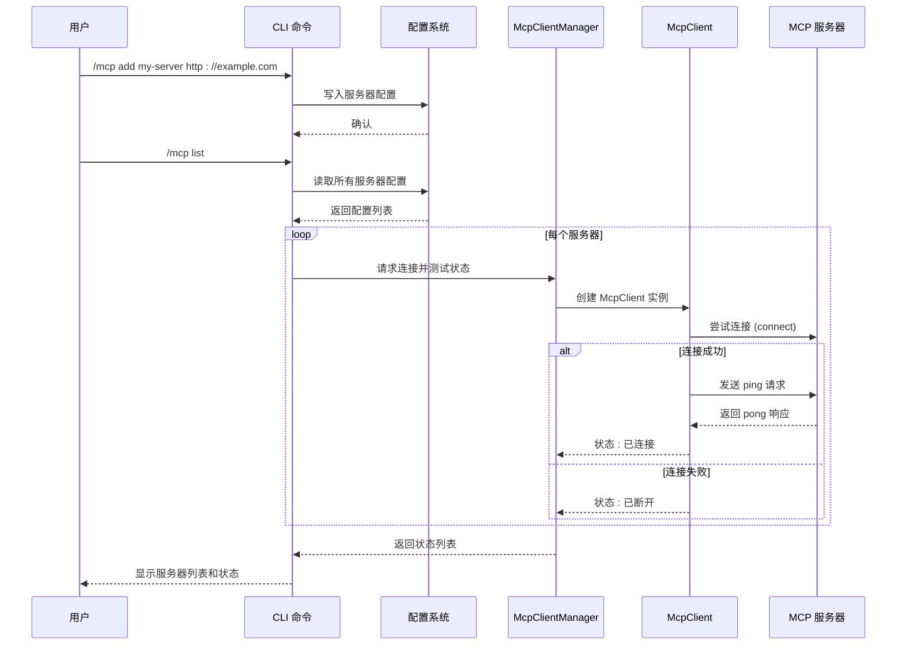
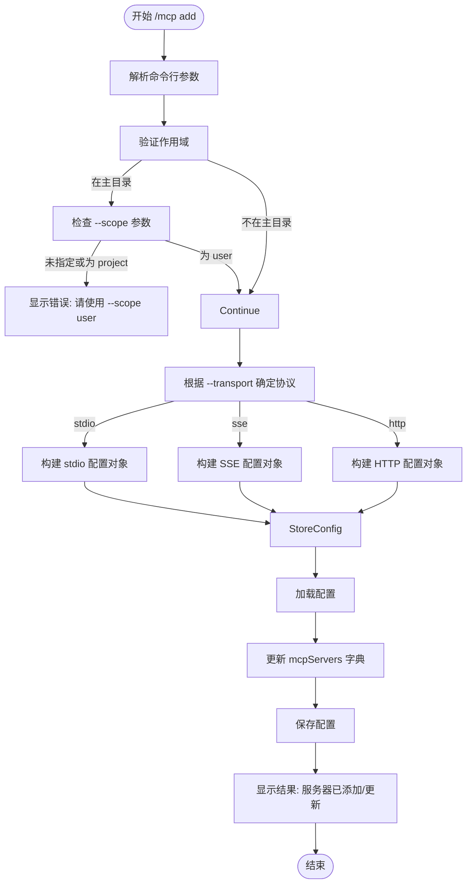
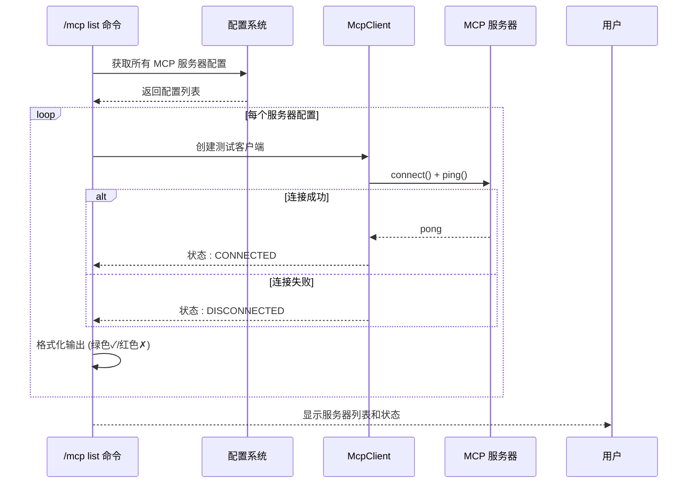
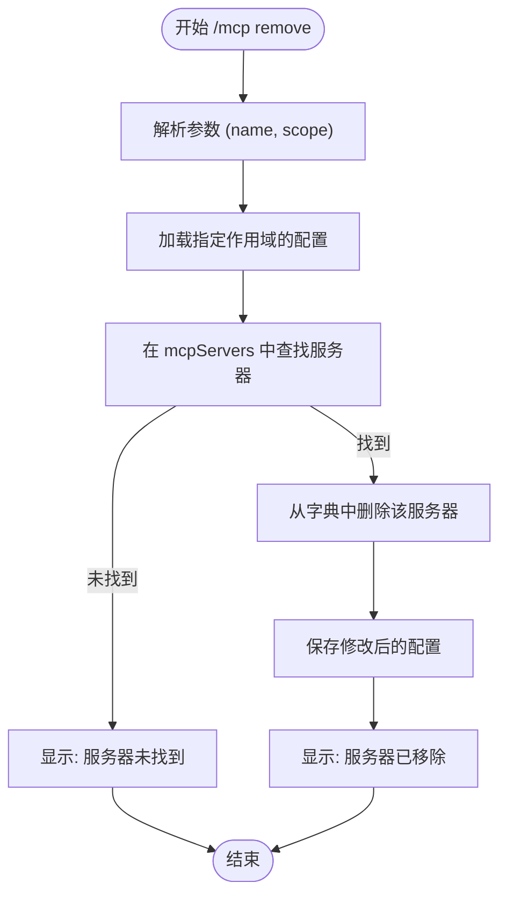

# MCP服务器管理命令

<cite>
**本文档引用的文件**   
- [add.ts](file://packages/cli/src/commands/mcp/add.ts)
- [list.ts](file://packages/cli/src/commands/mcp/list.ts)
- [remove.ts](file://packages/cli/src/commands/mcp/remove.ts)
- [mcp-client.ts](file://packages/core/src/tools/mcp-client.ts)
- [mcp-client-manager.ts](file://packages/core/src/tools/mcp-client-manager.ts)
- [settings.ts](file://packages/cli/src/config/settings.ts)
</cite>

## 目录
1. [简介](#简介)
2. [项目结构](#项目结构)
3. [核心组件](#核心组件)
4. [架构概述](#架构概述)
5. [详细组件分析](#详细组件分析)
6. [依赖分析](#依赖分析)
7. [性能考虑](#性能考虑)
8. [故障排除指南](#故障排除指南)
9. [结论](#结论)

## 简介
本文档详细介绍了 Gemini CLI 中 MCP（Model Context Protocol）服务器管理命令的实现和使用。重点分析了 `/mcp add`、`/mcp remove` 和 `/mcp list` 三个核心命令，这些命令允许用户配置、管理和监控与外部 MCP 服务器的连接。MCP 服务器通过提供工具扩展和上下文集成功能，极大地增强了 Gemini CLI 的能力。本文档将深入源码，解释命令的执行流程、配置选项、安全连接机制以及错误处理策略。

## 项目结构
MCP 服务器管理功能主要分布在 `packages/cli` 和 `packages/core` 两个包中。`cli` 包负责命令行接口的实现，而 `core` 包则处理底层的连接、发现和通信逻辑。

```mermaid
graph TD
subgraph "CLI 命令层"
A[add.ts] --> |定义| B[/mcp add 命令]
C[list.ts] --> |定义| D[/mcp list 命令]
E[remove.ts] --> |定义| F[/mcp remove 命令]
end
subgraph "核心服务层"
G[mcp-client-manager.ts] --> |管理| H[MCP 客户端生命周期]
I[mcp-client.ts] --> |处理| J[连接、发现、通信]
end
subgraph "配置层"
K[settings.ts] --> |存储| L[MCP 服务器配置]
end
B --> |调用| K
D --> |读取| K
F --> |修改| K
B --> |触发| G
D --> |触发| G
G --> |使用| I
```

**Diagram sources**
- [add.ts](file://packages/cli/src/commands/mcp/add.ts)
- [list.ts](file://packages/cli/src/commands/mcp/list.ts)
- [remove.ts](file://packages/cli/src/commands/mcp/remove.ts)
- [mcp-client-manager.ts](file://packages/core/src/tools/mcp-client-manager.ts)
- [mcp-client.ts](file://packages/core/src/tools/mcp-client.ts)
- [settings.ts](file://packages/cli/src/config/settings.ts)

**Section sources**
- [add.ts](file://packages/cli/src/commands/mcp/add.ts)
- [list.ts](file://packages/cli/src/commands/mcp/list.ts)
- [remove.ts](file://packages/cli/src/commands/mcp/remove.ts)

## 核心组件
核心组件包括三个主要的 CLI 命令模块（`add`、`list`、`remove`）和两个核心服务模块（`mcp-client` 和 `mcp-client-manager`）。`add`、`list` 和 `remove` 命令负责与用户交互并管理配置，而 `mcp-client-manager` 负责协调所有 MCP 客户端的生命周期，`mcp-client` 则封装了与单个 MCP 服务器通信的所有细节。

**Section sources**
- [add.ts](file://packages/cli/src/commands/mcp/add.ts)
- [list.ts](file://packages/cli/src/commands/mcp/list.ts)
- [remove.ts](file://packages/cli/src/commands/mcp/remove.ts)
- [mcp-client-manager.ts](file://packages/core/src/tools/mcp-client-manager.ts)
- [mcp-client.ts](file://packages/core/src/tools/mcp-client.ts)

## 架构概述
MCP 服务器管理的整体架构遵循分层设计。CLI 命令层接收用户输入，将其转换为对配置系统的操作。配置系统（`settings`）持久化存储 MCP 服务器的定义。当需要与服务器交互时，核心层的 `McpClientManager` 会根据配置创建并管理一个或多个 `McpClient` 实例。每个 `McpClient` 负责使用适当的传输协议（如 stdio、SSE 或 HTTP）连接到其对应的服务器，发现可用的工具，并处理后续的请求。



**Diagram sources**
- [add.ts](file://packages/cli/src/commands/mcp/add.ts)
- [list.ts](file://packages/cli/src/commands/mcp/list.ts)
- [mcp-client-manager.ts](file://packages/core/src/tools/mcp-client-manager.ts)
- [mcp-client.ts](file://packages/core/src/tools/mcp-client.ts)

## 详细组件分析

### /mcp add 命令分析
`/mcp add` 命令用于向配置中添加一个新的 MCP 服务器。它支持多种传输协议和丰富的配置选项。

#### 命令参数与配置
`/mcp add` 命令的语法为 `gemini mcp add <name> <commandOrUrl> [args...]`。其主要参数和选项如下：

**表：/mcp add 命令参数说明**

| 参数/选项 | 描述 | 示例 |
| :--- | :--- | :--- |
| `name` | 服务器的唯一名称，用于后续引用 | `my-file-server` |
| `commandOrUrl` | 对于 stdio 传输，是可执行命令；对于 SSE/HTTP 传输，是服务器 URL | `/usr/bin/my-mcp-server` 或 `https://api.example.com/mcp` |
| `--scope` | 配置的作用域，可以是 `user`（用户级）或 `project`（项目级） | `--scope user` |
| `--transport` | 传输协议类型，支持 `stdio`、`sse`、`http` | `--transport http` |
| `--env` | 为 stdio 服务器设置环境变量 | `-e API_KEY=abc123` |
| `--header` | 为 SSE/HTTP 服务器设置 HTTP 请求头 | `-H "Authorization: Bearer xyz"` |
| `--timeout` | 设置连接超时时间（毫秒） | `--timeout 30000` |
| `--trust` | 信任该服务器，绕过所有工具调用确认提示 | `--trust` |
| `--description` | 为服务器添加描述信息 | `--description "文件搜索服务"` |
| `--include-tools` | 指定要包含的工具列表（逗号分隔） | `--include-tools search,find` |
| `--exclude-tools` | 指定要排除的工具列表（逗号分隔） | `--exclude-tools dangerous_op` |

#### 安全连接配置示例
以下示例展示了如何配置一个需要 OAuth 认证的 HTTP MCP 服务器：

```bash
gemini mcp add my-secure-server https://api.secure-service.com/mcp \
  --transport http \
  --scope user \
  --header "X-Client-ID: my-client-id" \
  --timeout 60000 \
  --description "受保护的API服务"
```

此命令会将服务器配置存储在用户级设置中。当 CLI 尝试连接时，如果服务器返回 401 未授权错误，系统会自动触发 OAuth 认证流程（如果服务器支持发现），或提示用户手动执行 `/mcp auth my-secure-server` 命令进行认证。



**Diagram sources**
- [add.ts](file://packages/cli/src/commands/mcp/add.ts)

**Section sources**
- [add.ts](file://packages/cli/src/commands/mcp/add.ts)

### /mcp list 命令分析
`/mcp list` 命令用于展示所有已注册的 MCP 服务器及其状态。

#### 服务器状态展示
该命令会从用户和项目配置中合并所有 MCP 服务器定义，并尝试连接到每个服务器以测试其连通性。结果显示包括服务器名称、连接信息、传输类型和实时状态（通过颜色标识）。



**Diagram sources**
- [list.ts](file://packages/cli/src/commands/mcp/list.ts)
- [mcp-client.ts](file://packages/core/src/tools/mcp-client.ts)

**Section sources**
- [list.ts](file://packages/cli/src/commands/mcp/list.ts)

### /mcp remove 命令分析
`/mcp remove` 命令用于从配置中安全地移除一个 MCP 服务器绑定。

#### 解除绑定流程
该命令的执行流程非常直接：它根据指定的 `name` 和 `scope` 从相应的配置作用域中查找并删除对应的服务器条目。此操作是安全的，因为它只修改本地配置文件，不会对远程服务器进行任何操作。



**Diagram sources**
- [remove.ts](file://packages/cli/src/commands/mcp/remove.ts)

**Section sources**
- [remove.ts](file://packages/cli/src/commands/mcp/remove.ts)

## 依赖分析
MCP 命令的实现依赖于多个内部模块和外部库。核心依赖关系如下图所示。

```mermaid
graph LR
A[add.ts] --> B[settings.ts]
C[list.ts] --> B
D[remove.ts] --> B
B --> E[配置文件]
A --> F[mcp-client-manager.ts]
C --> F
F --> G[mcp-client.ts]
G --> H[@modelcontextprotocol/sdk]
G --> I[oauth-provider.ts]
G --> J[google-auth-provider.ts]
```

**Diagram sources**
- [add.ts](file://packages/cli/src/commands/mcp/add.ts)
- [list.ts](file://packages/cli/src/commands/mcp/list.ts)
- [remove.ts](file://packages/cli/src/commands/mcp/remove.ts)
- [settings.ts](file://packages/cli/src/config/settings.ts)
- [mcp-client-manager.ts](file://packages/core/src/tools/mcp-client-manager.ts)
- [mcp-client.ts](file://packages/core/src/tools/mcp-client.ts)

**Section sources**
- [add.ts](file://packages/cli/src/commands/mcp/add.ts)
- [list.ts](file://packages/cli/src/commands/mcp/list.ts)
- [remove.ts](file://packages/cli/src/commands/mcp/remove.ts)

## 性能考虑
MCP 客户端的连接和发现过程是异步并行执行的。`McpClientManager` 使用 `Promise.all()` 来同时启动所有服务器的发现流程，这大大减少了总的初始化时间。每个 `McpClient` 在连接时都设置了默认的 10 分钟超时（`MCP_DEFAULT_TIMEOUT_MSEC`），以防止因网络问题导致的长时间阻塞。对于 `list` 命令，连接测试使用了较短的 5 秒超时，以确保命令能快速返回结果。

## 故障排除指南
当 MCP 服务器管理出现问题时，可以参考以下解决方案：

**表：常见问题及解决方案**

| 问题现象 | 可能原因 | 解决方案 |
| :--- | :--- | :--- |
| `/mcp add` 失败并提示作用域错误 | 在主目录下尝试使用 `--scope project` | 使用 `--scope user` 参数 |
| `/mcp list` 显示服务器为红色（Disconnected） | 网络连接问题、服务器地址错误或服务器未运行 | 检查服务器 URL 或命令路径，确认服务器正在运行 |
| 连接 HTTP/SSE 服务器时出现 401 错误 | 认证失败或令牌过期 | 执行 `/mcp auth <server-name>` 重新进行 OAuth 认证 |
| 协议不兼容或方法未找到 | MCP 服务器实现的协议版本与客户端不匹配 | 检查服务器文档，确保其支持 Model Context Protocol |
| stdio 服务器启动失败 | 可执行文件路径错误或权限不足 | 检查 `command` 路径是否正确，确认文件具有可执行权限 |

## 结论
Gemini CLI 的 MCP 服务器管理命令提供了一套强大而灵活的机制，用于集成外部工具和服务。通过 `/mcp add`、`/mcp list` 和 `/mcp remove` 命令，用户可以轻松地配置、监控和管理与 MCP 服务器的连接。其背后的核心架构清晰地分离了命令行接口、配置管理和通信逻辑，确保了系统的可维护性和可扩展性。结合自动化的 OAuth 认证和并行的连接发现，该系统为用户提供了一个高效、安全的扩展平台。