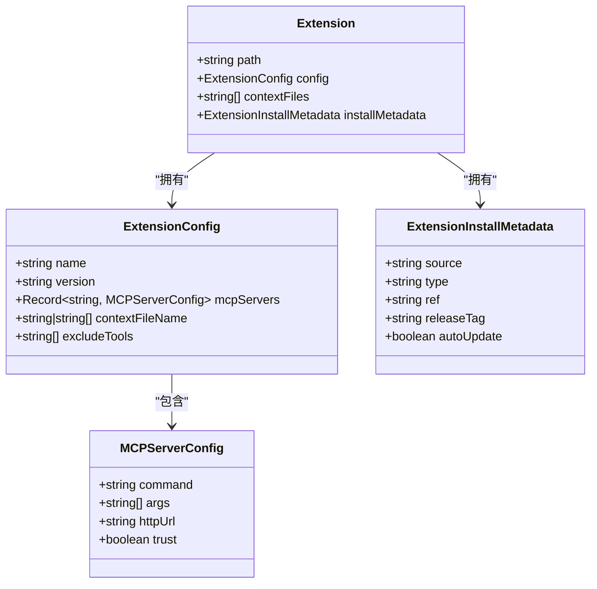
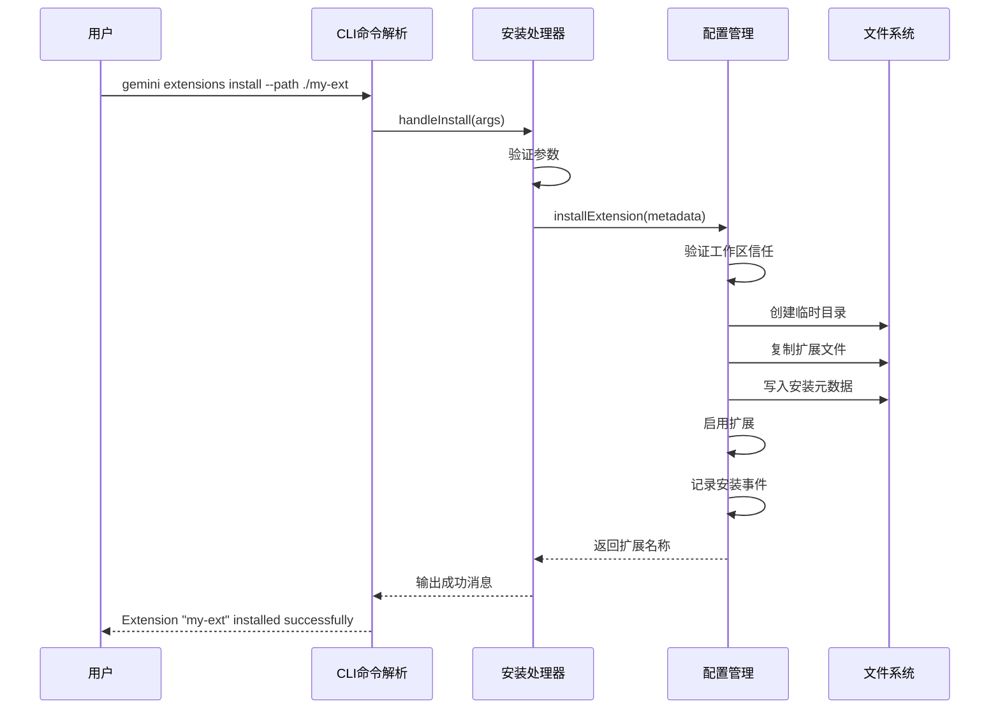
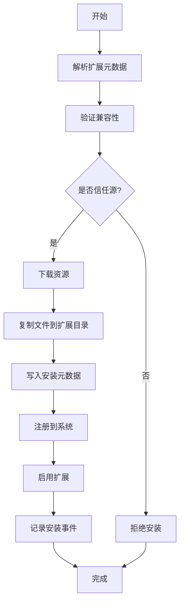

# 扩展管理命令

<cite>
**本文档中引用的文件**  
- [install.ts](file://packages/cli/src/commands/extensions/install.ts)
- [uninstall.ts](file://packages/cli/src/commands/extensions/uninstall.ts)
- [enable.ts](file://packages/cli/src/commands/extensions/enable.ts)
- [disable.ts](file://packages/cli/src/commands/extensions/disable.ts)
- [list.ts](file://packages/cli/src/commands/extensions/list.ts)
- [new.ts](file://packages/cli/src/commands/extensions/new.ts)
- [extension.ts](file://packages/cli/src/config/extension.ts)
- [gemini-extension.json](file://hello/gemini-extension.json)
- [examples](file://packages/cli/src/commands/extensions/examples)
</cite>

## 目录
1. [简介](#简介)
2. [扩展管理命令概览](#扩展管理命令概览)
3. [命令详细说明](#命令详细说明)
   - [/extensions install](#extensions-install)
   - [/extensions uninstall](#extensions-uninstall)
   - [/extensions enable](#extensions-enable)
   - [/extensions disable](#extensions-disable)
   - [/extensions list](#extensions-list)
   - [/extensions new](#extensions-new)
4. [扩展配置文件结构](#扩展配置文件结构)
5. [命令调用链路分析](#命令调用链路分析)
6. [扩展生命周期管理](#扩展生命周期管理)
7. [常见问题解决方案](#常见问题解决方案)
8. [结论](#结论)

## 简介
Gemini CLI 提供了一套完整的扩展管理命令，允许用户安装、卸载、启用、禁用、列出和创建扩展。这些命令构成了扩展生态系统的核心管理功能，支持从本地或远程源安装扩展，管理扩展的启用状态，并提供创建新扩展模板的功能。本文档详细说明了每个命令的用途、语法、参数以及内部实现机制。

## 扩展管理命令概览
Gemini CLI 的扩展管理命令提供了一套完整的扩展生命周期管理功能。这些命令位于 `packages/cli/src/commands/extensions/` 目录下，通过 yargs 命令行框架实现。每个命令都遵循一致的设计模式：定义命令语法、解析参数、执行核心逻辑并处理错误。扩展的配置信息存储在 `gemini-extension.json` 文件中，而安装元数据则保存在 `.gemini-extension-install.json` 文件中。

```mermaid
graph TD
A[扩展管理命令] --> B[/extensions install]
A --> C[/extensions uninstall]
A --> D[/extensions enable]
A --> E[/extensions disable]
A --> F[/extensions list]
A --> G[/extensions new]
B --> H[安装扩展]
C --> I[卸载扩展]
D --> J[启用扩展]
E --> K[禁用扩展]
F --> L[列出扩展]
G --> M[创建扩展]
```

**Diagram sources**
- [install.ts](file://packages/cli/src/commands/extensions/install.ts)
- [uninstall.ts](file://packages/cli/src/commands/extensions/uninstall.ts)
- [enable.ts](file://packages/cli/src/commands/extensions/enable.ts)
- [disable.ts](file://packages/cli/src/commands/extensions/disable.ts)
- [list.ts](file://packages/cli/src/commands/extensions/list.ts)
- [new.ts](file://packages/cli/src/commands/extensions/new.ts)

**Section sources**
- [install.ts](file://packages/cli/src/commands/extensions/install.ts)
- [uninstall.ts](file://packages/cli/src/commands/extensions/uninstall.ts)
- [enable.ts](file://packages/cli/src/commands/extensions/enable.ts)
- [disable.ts](file://packages/cli/src/commands/extensions/disable.ts)
- [list.ts](file://packages/cli/src/commands/extensions/list.ts)
- [new.ts](file://packages/cli/src/commands/extensions/new.ts)

## 命令详细说明

### /extensions install
`/extensions install` 命令用于从 Git 仓库 URL 或本地路径安装扩展。该命令支持多种安装源，包括 HTTP/HTTPS、Git SSH 和本地文件系统路径。

**语法结构**
```
gemini extensions install [<source>] [--path] [--ref] [--auto-update]
```

**支持的参数和标志**
- `source`: 要安装的扩展的 GitHub URL（位置参数）
- `--path`: 本地扩展目录的路径
- `--ref`: 要安装的 Git 引用（分支、标签或提交）
- `--auto-update`: 为此扩展启用自动更新

**使用示例**
```bash
# 从 GitHub 仓库安装扩展
gemini extensions install https://github.com/user/repo.git --ref main

# 从本地路径安装扩展
gemini extensions install --path ./my-extension
```

该命令通过 `installCommand` 对象定义，使用 yargs 的 `positional` 和 `option` 方法声明参数，并通过 `conflicts` 方法确保 `source` 和 `path` 参数互斥。核心安装逻辑在 `handleInstall` 函数中实现，该函数验证输入参数并调用 `installExtension` 函数执行实际安装。

**Section sources**
- [install.ts](file://packages/cli/src/commands/extensions/install.ts)

### /extensions uninstall
`/extensions uninstall` 命令用于卸载已安装的扩展。用户可以通过扩展名称或源路径来指定要卸载的扩展。

**语法结构**
```
gemini extensions uninstall <name>
```

**支持的参数和标志**
- `name`: 要卸载的扩展的名称或源路径（位置参数）

**使用示例**
```bash
# 卸载名为 "test-extension" 的扩展
gemini extensions uninstall test-extension
```

该命令通过 `uninstallCommand` 对象定义，其 `handler` 函数调用 `handleUninstall` 函数，后者又调用 `uninstallExtension` 函数执行卸载操作。`uninstallExtension` 函数首先查找指定的扩展，然后使用 `ExtensionStorage` 删除扩展目录并更新启用状态。

**Section sources**
- [uninstall.ts](file://packages/cli/src/commands/extensions/uninstall.ts)

### /extensions enable
`/extensions enable` 命令用于启用已安装的扩展。用户可以指定启用范围（用户或工作区）。

**语法结构**
```
gemini extensions enable [--scope] <name>
```

**支持的参数和标志**
- `name`: 要启用的扩展的名称（位置参数）
- `--scope`: 启用扩展的范围（用户或工作区）

**使用示例**
```bash
# 在用户范围内启用扩展
gemini extensions enable my-extension

# 在工作区范围内启用扩展
gemini extensions enable my-extension --scope workspace
```

该命令通过 `enableCommand` 对象定义，支持 `SettingScope` 枚举来管理不同范围的启用状态。`handleEnable` 函数根据指定的范围调用 `enableExtension` 函数，该函数使用 `ExtensionEnablementManager` 来管理扩展的启用状态。

**Section sources**
- [enable.ts](file://packages/cli/src/commands/extensions/enable.ts)

### /extensions disable
`/extensions disable` 命令用于禁用已安装的扩展。与启用命令类似，用户可以指定禁用范围。

**语法结构**
```
gemini extensions disable [--scope] <name>
```

**支持的参数和标志**
- `name`: 要禁用的扩展的名称（位置参数）
- `--scope`: 禁用扩展的范围（默认为用户范围）

**使用示例**
```bash
# 禁用扩展
gemini extensions disable my-extension

# 在工作区范围内禁用扩展
gemini extensions disable my-extension --scope workspace
```

该命令通过 `disableCommand` 对象定义，其逻辑与启用命令对称。`handleDisable` 函数调用 `disableExtension` 函数，后者使用 `ExtensionEnablementManager` 来更新扩展的禁用状态。

**Section sources**
- [disable.ts](file://packages/cli/src/commands/extensions/disable.ts)

### /extensions list
`/extensions list` 命令用于列出所有已安装的扩展及其状态信息。

**语法结构**
```
gemini extensions list
```

**使用示例**
```bash
# 列出所有已安装的扩展
gemini extensions list
```

该命令通过 `listCommand` 对象定义，其 `handler` 函数调用 `handleList` 函数，后者使用 `loadUserExtensions` 函数加载所有用户扩展，并通过 `toOutputString` 函数格式化输出。输出包含扩展名称、版本、路径、源、启用状态等详细信息。

**Section sources**
- [list.ts](file://packages/cli/src/commands/extensions/list.ts)

### /extensions new
`/extensions new` 命令用于从模板创建新的扩展项目。

**语法结构**
```
gemini extensions new <path> <template>
```

**支持的参数和标志**
- `path`: 创建扩展的路径（位置参数）
- `template`: 要使用的模板名称（位置参数）

**使用示例**
```bash
# 使用 "context" 模板创建新扩展
gemini extensions new ./my-new-extension context
```

该命令通过 `newCommand` 对象定义，支持从 `examples` 目录中的多个模板创建扩展。`getBoilerplateChoices` 函数动态获取可用的模板列表，`copyDirectory` 函数负责将模板文件复制到指定路径。

**Section sources**
- [new.ts](file://packages/cli/src/commands/extensions/new.ts)

## 扩展配置文件结构
扩展配置文件 `gemini-extension.json` 定义了扩展的基本信息和行为。该文件位于扩展根目录下，是扩展安装和加载的核心元数据文件。

**配置文件结构**
```json
{
  "name": "扩展名称",
  "version": "版本号",
  "mcpServers": {
    "服务器名称": {
      "command": "启动命令",
      "args": ["参数列表"]
    }
  },
  "contextFileName": "上下文文件名",
  "excludeTools": ["要排除的工具"]
}
```

**字段说明**
- `name`: 扩展的唯一标识名称，只能包含字母、数字和连字符
- `version`: 扩展的版本号，遵循语义化版本规范
- `mcpServers`: 定义扩展提供的 MCP 服务器，包括启动命令和参数
- `contextFileName`: 指定扩展使用的上下文文件名，默认为 `GEMINI.md`
- `excludeTools`: 指定要排除的核心工具列表

配置文件通过 `loadExtensionConfig` 函数加载和验证，该函数还支持环境变量解析和字符串模板填充。配置文件的结构直接影响扩展的功能和行为，例如 `mcpServers` 字段定义了扩展可以启动的服务，而 `excludeTools` 字段则可以禁用特定的核心功能。



**Diagram sources**
- [extension.ts](file://packages/cli/src/config/extension.ts)
- [gemini-extension.json](file://hello/gemini-extension.json)

**Section sources**
- [extension.ts](file://packages/cli/src/config/extension.ts)
- [gemini-extension.json](file://hello/gemini-extension.json)

## 命令调用链路分析
扩展管理命令的执行遵循清晰的调用链路，从命令行接口到核心配置管理。以安装命令为例，其调用链路展示了从用户输入到系统变更的完整流程。



**Diagram sources**
- [install.ts](file://packages/cli/src/commands/extensions/install.ts)
- [extension.ts](file://packages/cli/src/config/extension.ts)

**Section sources**
- [install.ts](file://packages/cli/src/commands/extensions/install.ts)
- [extension.ts](file://packages/cli/src/config/extension.ts)

## 扩展生命周期管理
Gemini CLI 的扩展生命周期管理机制确保了扩展的安全性和可维护性。该机制包括安装、启用、禁用、更新和卸载等阶段，每个阶段都有相应的验证和日志记录。

**生命周期管理机制**
- **冲突处理**: 通过 `ExtensionEnablementManager` 确保扩展名称的唯一性，防止命名冲突
- **版本控制**: 在配置文件中明确指定版本号，支持版本比较和更新检测
- **依赖解析**: 通过 `mcpServers` 配置管理扩展依赖的服务，确保依赖项正确加载
- **信任管理**: 通过 `isWorkspaceTrusted` 函数验证工作区信任状态，防止从不受信任的源安装扩展
- **权限控制**: 支持用户和工作区两个范围的启用/禁用控制，提供细粒度的权限管理

扩展的安装过程包括元数据解析、兼容性验证、文件复制和注册等步骤。系统会检查扩展名称的有效性，验证配置文件的完整性，并在安装前请求用户同意。这种分阶段的管理机制确保了扩展系统的稳定性和安全性。



**Diagram sources**
- [extension.ts](file://packages/cli/src/config/extension.ts)

**Section sources**
- [extension.ts](file://packages/cli/src/config/extension.ts)

## 常见问题解决方案
在使用扩展管理命令时，可能会遇到各种问题。以下是常见问题及其解决方案：

**安装失败**
- **问题**: 扩展名称已存在
- **解决方案**: 先卸载同名扩展，再重新安装
- **问题**: 源路径不受信任
- **解决方案**: 确保工作区已标记为受信任，或使用受信任的源

**权限错误**
- **问题**: 无法写入扩展目录
- **解决方案**: 检查用户对 `~/.gemini/extensions` 目录的写权限
- **问题**: 无法创建临时目录
- **解决方案**: 检查系统临时目录的可用空间和权限

**加载异常**
- **问题**: 配置文件缺失或格式错误
- **解决方案**: 确保 `gemini-extension.json` 文件存在且 JSON 格式正确
- **问题**: 扩展名称包含非法字符
- **解决方案**: 使用仅包含字母、数字和连字符的名称

系统通过详细的错误处理机制捕获和报告这些问题。例如，`installExtension` 函数会捕获所有异常，记录安装失败事件，并提供清晰的错误消息。`getErrorMessage` 工具函数确保错误信息对用户友好且具有诊断价值。

**Section sources**
- [extension.ts](file://packages/cli/src/config/extension.ts)
- [errors.ts](file://packages/cli/src/utils/errors.ts)

## 结论
Gemini CLI 的扩展管理命令提供了一套强大而灵活的工具，用于管理扩展的整个生命周期。通过清晰的命令接口、结构化的配置文件和健壮的管理机制，用户可以轻松地安装、配置和维护扩展。系统的模块化设计和严格的错误处理确保了扩展管理的安全性和可靠性。理解这些命令的内部工作原理有助于更有效地使用和开发 Gemini 扩展。