# 核心工具调用命令

<cite>
**本文档中引用的文件**
- [tool-registry.ts](file://packages/core/src/tools/tool-registry.ts)
- [edit.ts](file://packages/core/src/tools/edit.ts)
- [shell.ts](file://packages/core/src/tools/shell.ts)
- [web-search.ts](file://packages/core/src/tools/web-search.ts)
- [read-file.ts](file://packages/core/src/tools/read-file.ts)
- [config.ts](file://packages/core/src/config/config.ts)
- [tool-names.ts](file://packages/core/src/tools/tool-names.ts)
- [list_directory.test.ts](file://integration-tests/list_directory.test.ts)
- [run_shell_command.test.ts](file://integration-tests/run_shell_command.test.ts)
</cite>

## 目录
1. [简介](#简介)
2. [工具架构概览](#工具架构概览)
3. [核心工具类型](#核心工具类型)
4. [工具注册与发现机制](#工具注册与发现机制)
5. [文件操作工具](#文件操作工具)
6. [Shell命令执行工具](#shell命令执行工具)
7. [网络搜索工具](#网络搜索工具)
8. [工具权限模型](#工具权限模型)
9. [复合使用场景](#复合使用场景)
10. [性能优化建议](#性能优化建议)
11. [故障排除指南](#故障排除指南)
12. [总结](#总结)

## 简介

Gemini CLI 提供了一套完整的工具调用命令系统，支持文件操作、Shell执行、网络搜索、文件系统查询和内存管理等功能。这些工具通过统一的接口暴露给AI模型，实现了智能化的代码修改、系统交互和信息检索能力。

本文档详细介绍了核心工具调用命令的实现原理、使用方法和最佳实践，涵盖了从基础文件读写到高级Shell命令执行的完整功能链路。

## 工具架构概览

Gemini CLI 的工具系统采用模块化设计，通过工具注册表统一管理所有可用工具。系统支持两种主要的工具发现方式：静态注册和动态发现。

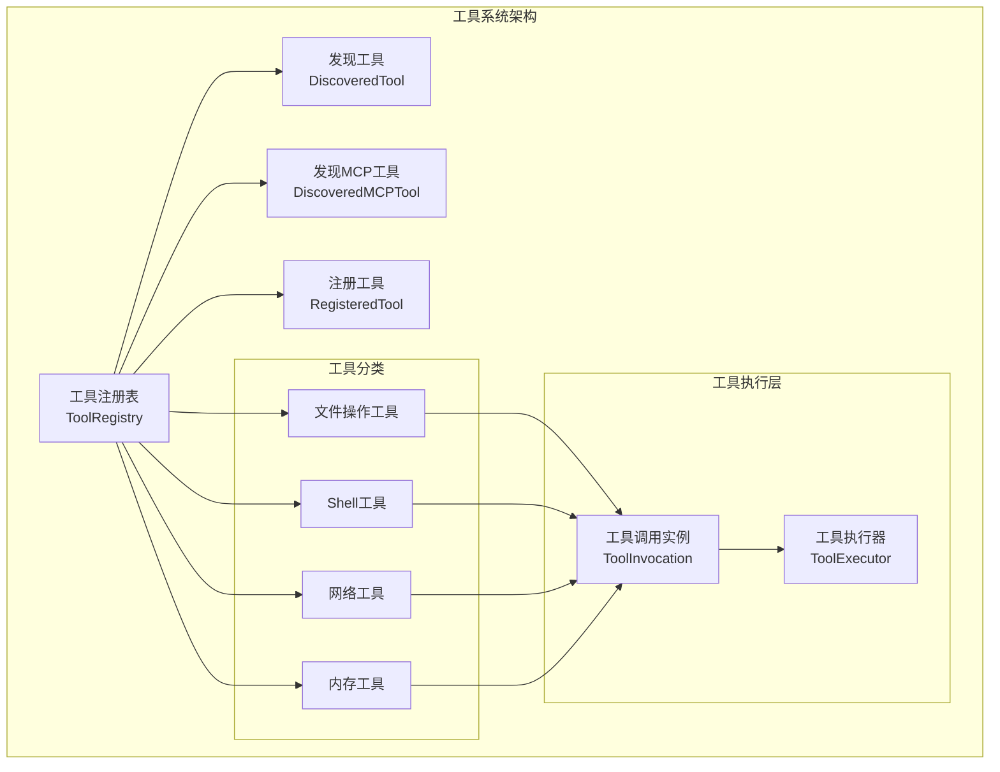

**图表来源**
- [tool-registry.ts](file://packages/core/src/tools/tool-registry.ts#L1-L480)

**章节来源**
- [tool-registry.ts](file://packages/core/src/tools/tool-registry.ts#L1-L100)
- [config.ts](file://packages/core/src/config/config.ts#L1-L50)

## 核心工具类型

### 文件操作工具

文件操作工具提供了完整的文件读写功能，支持文本文件和二进制文件的处理。

#### ReadFileTool - 文件读取工具

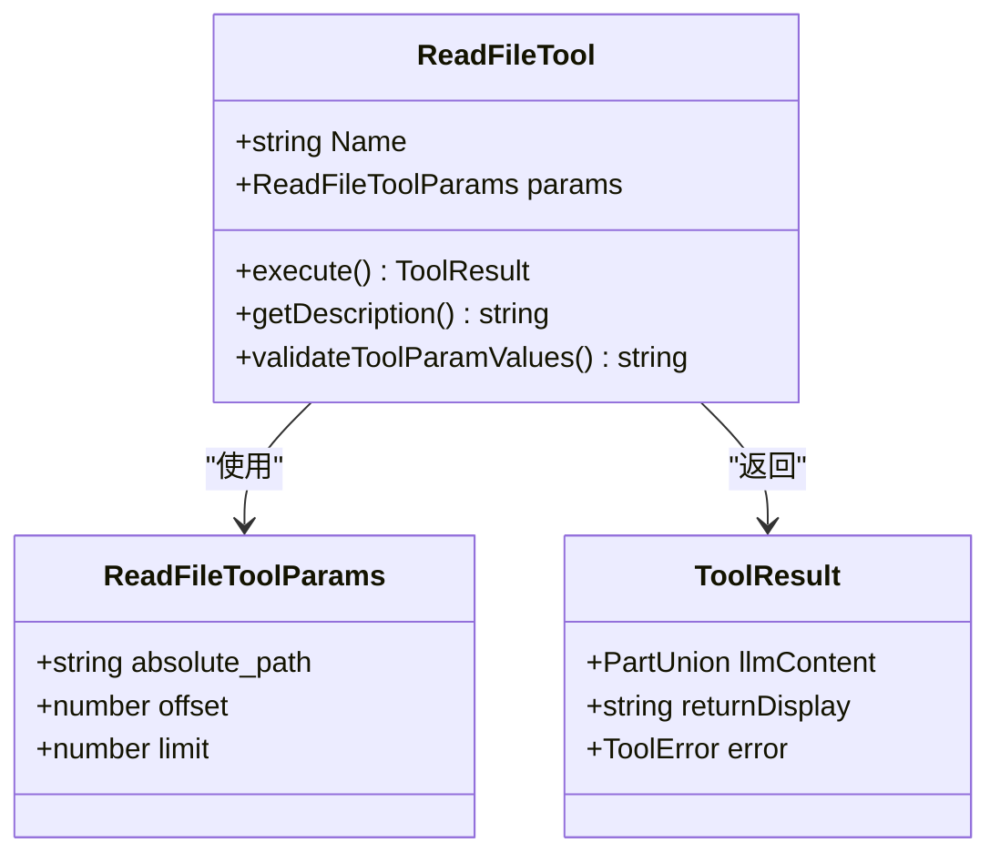

**图表来源**
- [read-file.ts](file://packages/core/src/tools/read-file.ts#L1-L100)

#### EditTool - 智能编辑工具

EditTool 是最复杂的工具之一，实现了智能的代码修改功能，包括diff生成、变更确认和自动保存机制。

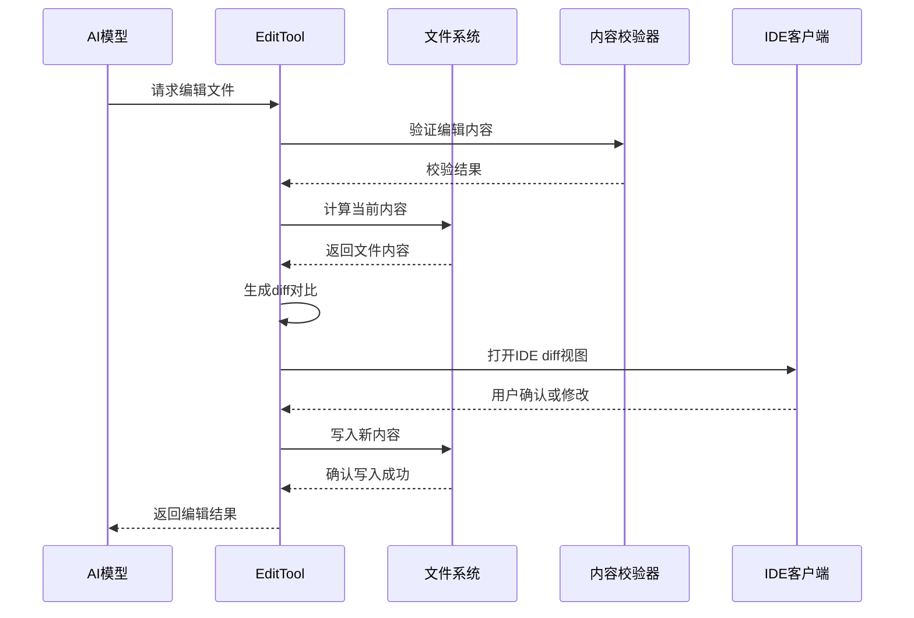

**图表来源**
- [edit.ts](file://packages/core/src/tools/edit.ts#L1-L200)

### Shell命令执行工具

Shell工具提供了安全可控的Shell命令执行能力，支持多种Shell环境和权限控制。

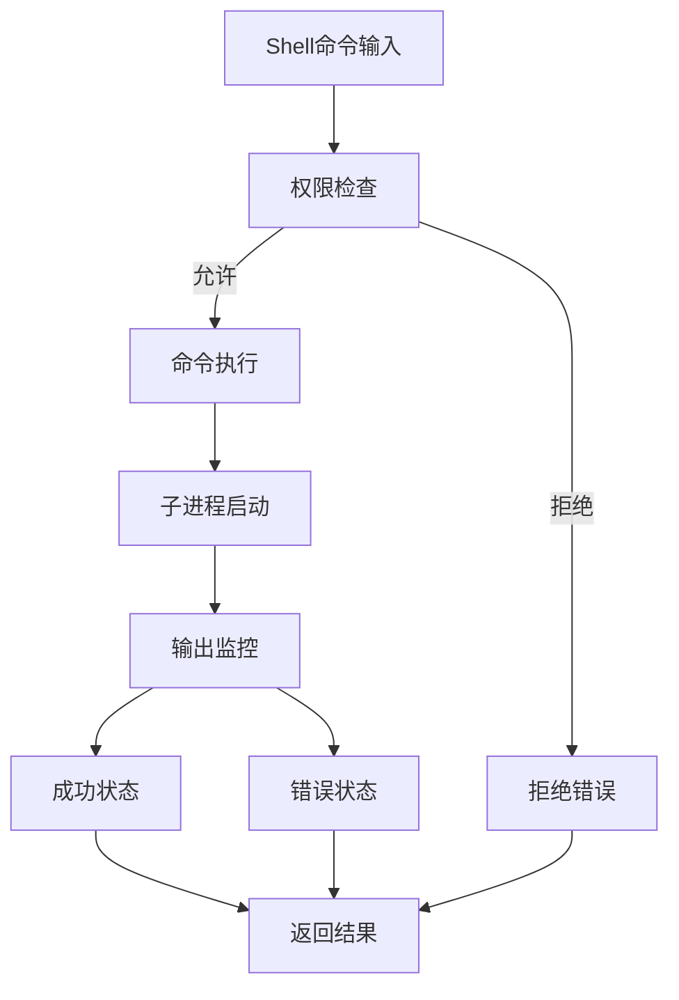

**图表来源**
- [shell.ts](file://packages/core/src/tools/shell.ts#L1-L100)

**章节来源**
- [edit.ts](file://packages/core/src/tools/edit.ts#L1-L300)
- [shell.ts](file://packages/core/src/tools/shell.ts#L1-L200)

## 工具注册与发现机制

### 工具注册表

工具注册表是整个工具系统的中央管理中心，负责维护所有可用工具的状态和生命周期。

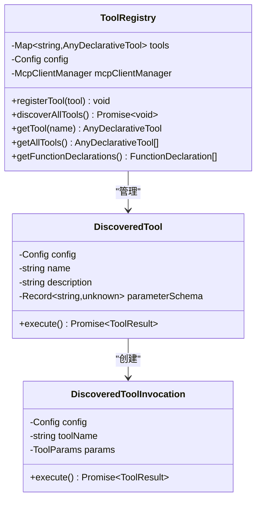

**图表来源**
- [tool-registry.ts](file://packages/core/src/tools/tool-registry.ts#L100-L200)

### 动态工具发现

系统支持通过命令行工具动态发现和注册新的工具。

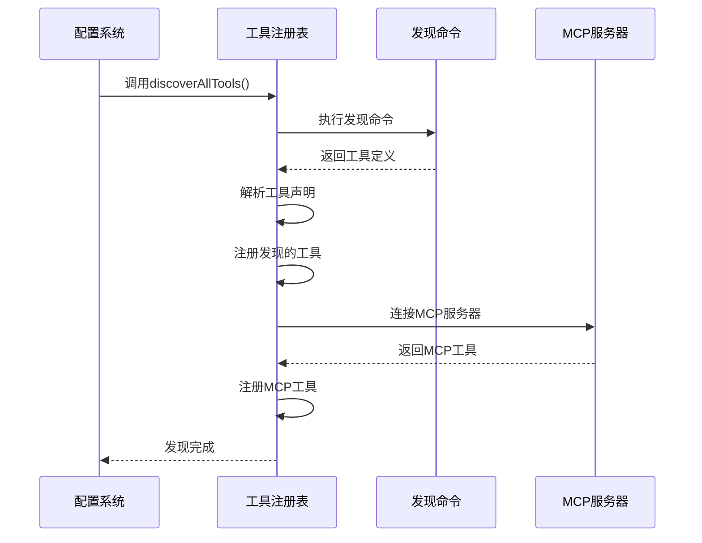

**图表来源**
- [tool-registry.ts](file://packages/core/src/tools/tool-registry.ts#L200-L300)

**章节来源**
- [tool-registry.ts](file://packages/core/src/tools/tool-registry.ts#L100-L480)

## 文件操作工具

### 文件读取机制

ReadFileTool 支持多种文件类型的读取，包括文本文件、图片文件和PDF文档。对于大型文件，系统会自动进行分页处理。

```typescript
// 文件读取参数示例
interface ReadFileToolParams {
  absolute_path: string;  // 绝对路径
  offset?: number;        // 起始行号（可选）
  limit?: number;         // 读取行数（可选）
}
```

### 编辑工具的智能特性

EditTool 实现了多项智能特性：

1. **上下文感知替换**：要求提供足够的上下文来确保精确匹配
2. **多处替换支持**：通过 `expected_replacements` 参数支持批量替换
3. **变更确认机制**：在执行前显示diff对比，让用户确认修改
4. **自动保存**：修改完成后自动保存到文件系统

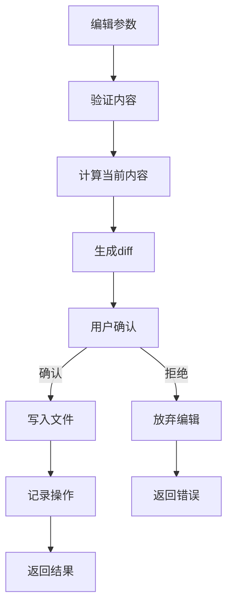

**图表来源**
- [edit.ts](file://packages/core/src/tools/edit.ts#L200-L300)

**章节来源**
- [read-file.ts](file://packages/core/src/tools/read-file.ts#L1-L200)
- [edit.ts](file://packages/core/src/tools/edit.ts#L1-L588)

## Shell命令执行工具

### 权限控制机制

Shell工具实现了多层次的权限控制：

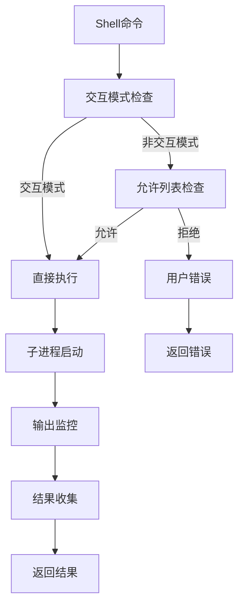

**图表来源**
- [shell.ts](file://packages/core/src/tools/shell.ts#L100-L200)

### 多Shell环境支持

系统支持多种Shell环境，包括：

- **PowerShell**：Windows平台原生Shell
- **CMD**：传统Windows命令行
- **Bash**：Unix/Linux标准Shell
- **Zsh**：增强版Unix Shell

### 输出处理与监控

Shell工具实现了实时输出监控功能：

```typescript
// 输出更新间隔设置
const OUTPUT_UPDATE_INTERVAL_MS = 1000;

// 实时输出处理
async execute(signal: AbortSignal, updateOutput?: (output: string) => void) {
  // 命令执行逻辑
  // 实时输出处理
  // 错误处理
}
```

**章节来源**
- [shell.ts](file://packages/core/src/tools/shell.ts#L1-L492)

## 网络搜索工具

### Google搜索集成

WebSearchTool 通过Google Search API实现网页搜索功能，支持结果溯源和引用标记。

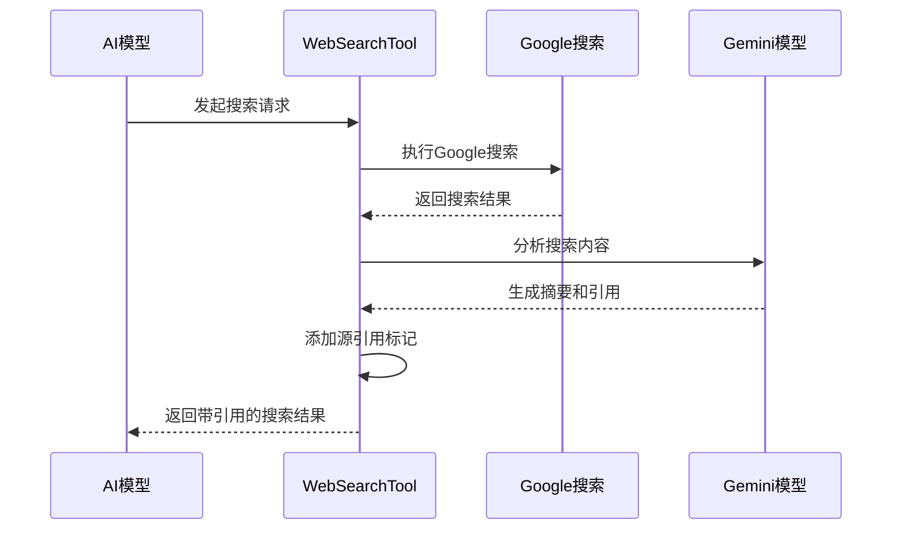

**图表来源**
- [web-search.ts](file://packages/core/src/tools/web-search.ts#L1-L100)

### 结果呈现格式

搜索结果采用结构化的格式呈现：

```typescript
interface WebSearchToolResult extends ToolResult {
  sources?: GroundingMetadata['groundingChunks'];
}

// 结果格式示例
Web search results for "JavaScript frameworks":
- React, Angular, Vue are popular JavaScript frameworks...
- [1] React (https://reactjs.org/)
- [2] Angular (https://angular.io/)
- [3] Vue (https://vuejs.org/)
```

**章节来源**
- [web-search.ts](file://packages/core/src/tools/web-search.ts#L1-L228)

## 工具权限模型

### 审批模式

系统定义了三种审批模式：

```typescript
enum ApprovalMode {
  DEFAULT = 'default',     // 默认模式：需要用户确认
  AUTO_EDIT = 'autoEdit',  // 自动编辑：跳过确认
  YOLO = 'yolo',          // 无限制模式：无需确认
}
```

### 允许工具配置

通过 `--allowed-tools` 参数可以精确控制允许执行的命令：

```bash
# 允许所有Shell命令
--allowed-tools=run_shell_command

# 只允许特定命令
--allowed-tools=run_shell_command(wc)
--allowed-tools=run_shell_command(ls,cat)

# 使用ShellTool别名
--allowed-tools=ShellTool(wc)
```

### 用户确认流程

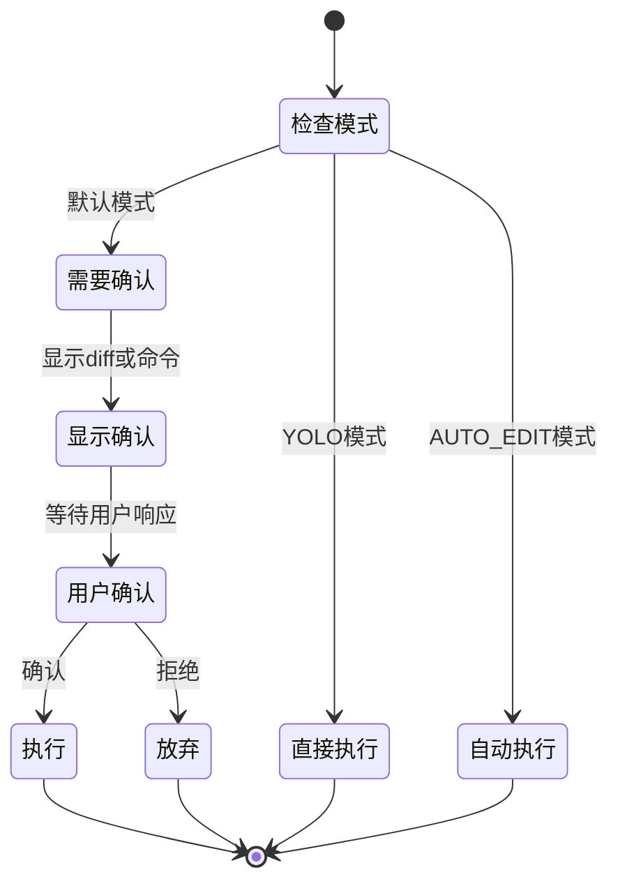

**章节来源**
- [config.ts](file://packages/core/src/config/config.ts#L50-L100)
- [shell.ts](file://packages/core/src/tools/shell.ts#L50-L150)

## 复合使用场景

### 代码库重构任务

以下是一个典型的代码库重构场景：

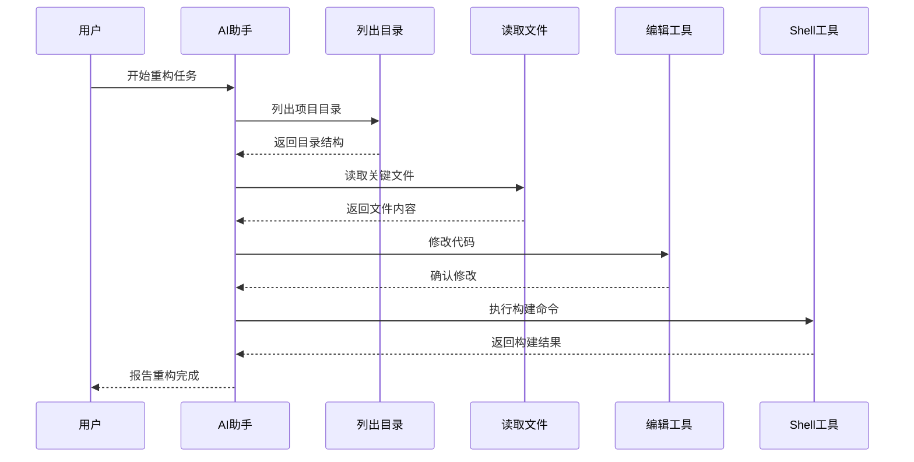

### 文件系统查询工作流

```typescript
// 示例：查找并修改配置文件
const tools = [
  { name: 'list_directory', params: { path: '/project' } },
  { name: 'read_file', params: { absolute_path: '/project/config.json' } },
  { name: 'replace', params: { 
    file_path: '/project/config.json',
    old_string: '"debug": false',
    new_string: '"debug": true'
  }},
  { name: 'run_shell_command', params: { command: 'npm run lint' } }
];
```

**章节来源**
- [list_directory.test.ts](file://integration-tests/list_directory.test.ts#L1-L67)
- [run_shell_command.test.ts](file://integration-tests/run_shell_command.test.ts#L1-L100)

## 性能优化建议

### 大文件处理策略

1. **分页读取**：对于大型文件，使用 `offset` 和 `limit` 参数分页读取
2. **内容截断**：当文件过大时，自动截断内容并提示用户分页阅读
3. **内存管理**：及时释放不再使用的文件内容缓冲区

### 搜索结果缓存

```typescript
// 缓存配置示例
const CACHE_CONFIG = {
  maxSize: 100,           // 最大缓存项数
  ttl: 3600000,           // TTL：1小时
  maxFileSize: 1048576    // 最大缓存文件大小：1MB
};
```

### 并发控制

```typescript
// 工具并发执行限制
const CONCURRENT_TOOL_LIMIT = 5;

// 子进程并发限制
const MAX_CONCURRENT_PROCESSES = 10;
```

### 性能监控指标

- **工具执行时间**：监控每个工具的平均执行时间
- **内存使用量**：跟踪文件读取和处理的内存消耗
- **网络请求延迟**：监控网络搜索和外部API调用的响应时间

## 故障排除指南

### 常见问题诊断

#### 文件访问权限问题

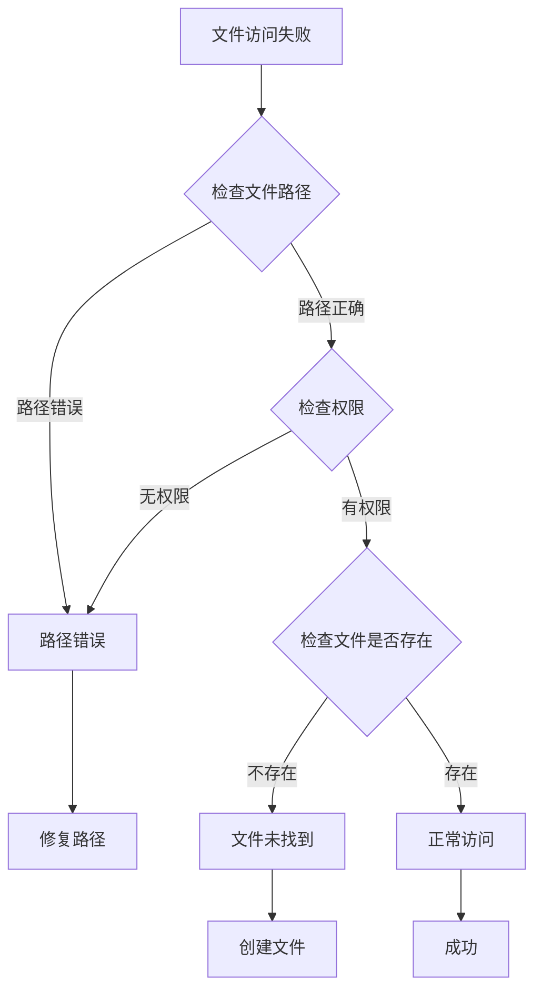

#### Shell命令执行失败

1. **命令不存在**：检查命令是否安装在系统PATH中
2. **权限不足**：确认用户是否有执行该命令的权限
3. **参数错误**：验证命令参数的正确性
4. **超时问题**：调整命令执行的超时设置

#### 网络搜索失败

```typescript
// 搜索失败处理
try {
  const result = await webSearch.execute(params);
} catch (error) {
  if (error.type === ToolErrorType.WEB_SEARCH_FAILED) {
    // 尝试备用搜索引擎
    return fallbackSearch(params.query);
  }
}
```

### 调试技巧

1. **启用调试模式**：使用 `--debug` 参数获取详细日志
2. **检查工具状态**：通过 `tool-registry` 查看已注册工具列表
3. **验证配置**：确认工具发现命令和MCP服务器配置正确
4. **测试连接**：单独测试Shell命令和网络搜索功能

**章节来源**
- [tool-registry.ts](file://packages/core/src/tools/tool-registry.ts#L300-L480)

## 总结

Gemini CLI 的核心工具调用命令系统提供了完整的文件操作、Shell执行、网络搜索和权限控制功能。通过统一的工具注册表和灵活的权限模型，系统能够安全高效地执行各种自动化任务。

### 主要特性总结

1. **模块化设计**：清晰的工具分类和职责分离
2. **智能确认**：编辑和Shell命令的双重确认机制
3. **多环境支持**：兼容不同操作系统和Shell环境
4. **权限控制**：细粒度的命令执行权限管理
5. **性能优化**：针对大文件和高并发场景的优化策略
6. **错误处理**：完善的异常捕获和恢复机制

### 最佳实践建议

1. **合理使用权限模式**：根据使用场景选择合适的审批模式
2. **提供充分上下文**：编辑工具需要足够的上下文信息
3. **监控资源使用**：注意文件读取和网络请求的资源消耗
4. **定期清理缓存**：避免缓存占用过多磁盘空间
5. **测试工具组合**：在生产环境中充分测试工具组合使用

通过遵循这些原则和最佳实践，开发者可以充分利用Gemini CLI工具系统的强大功能，实现高效的自动化开发工作流。