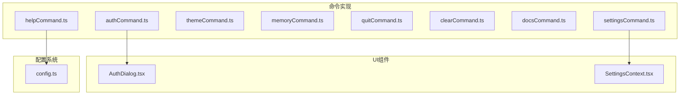
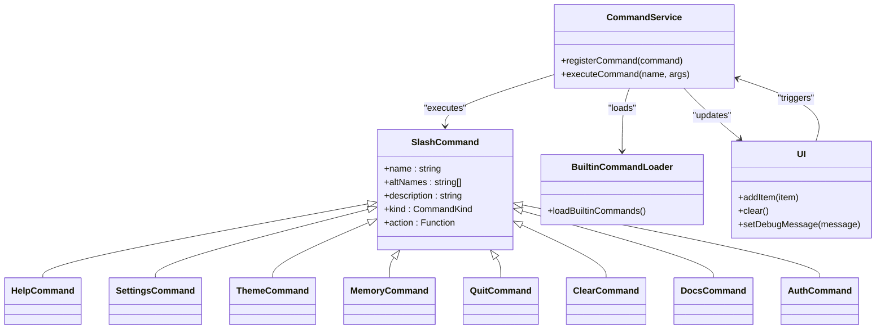
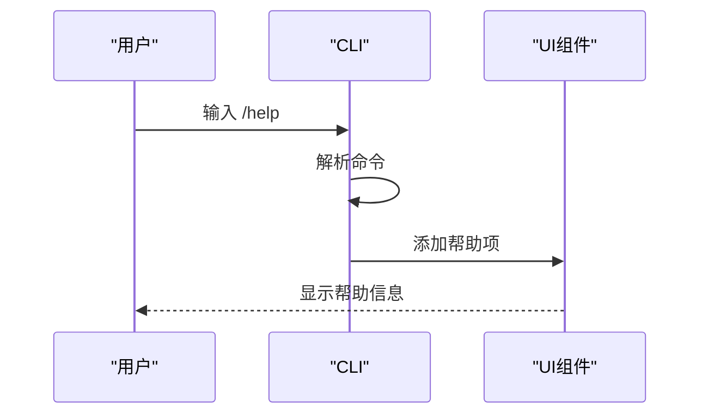
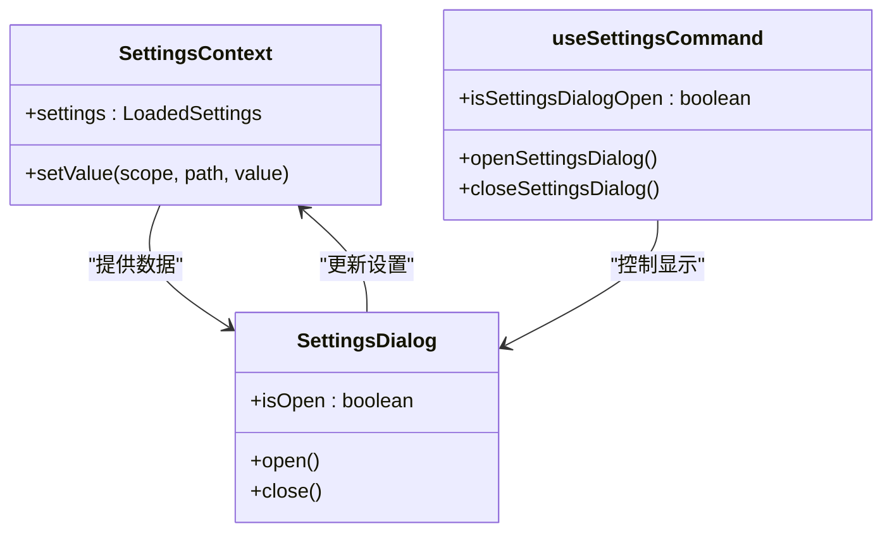
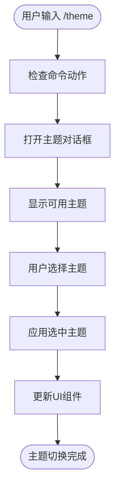
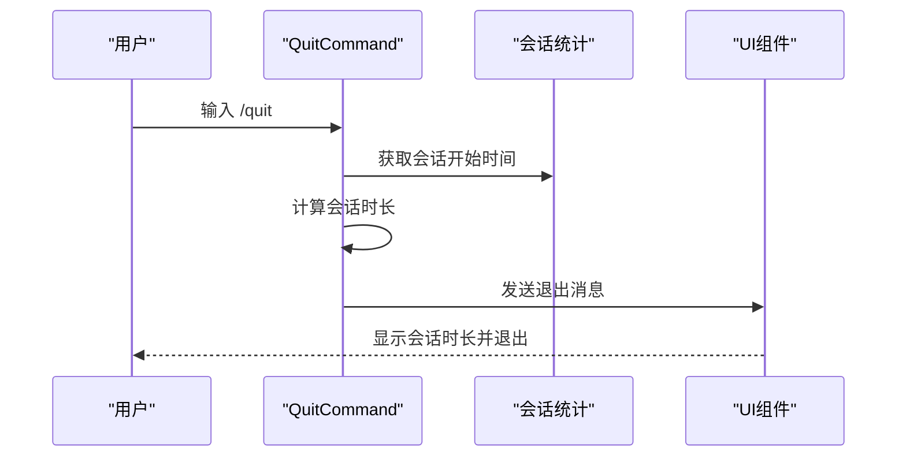
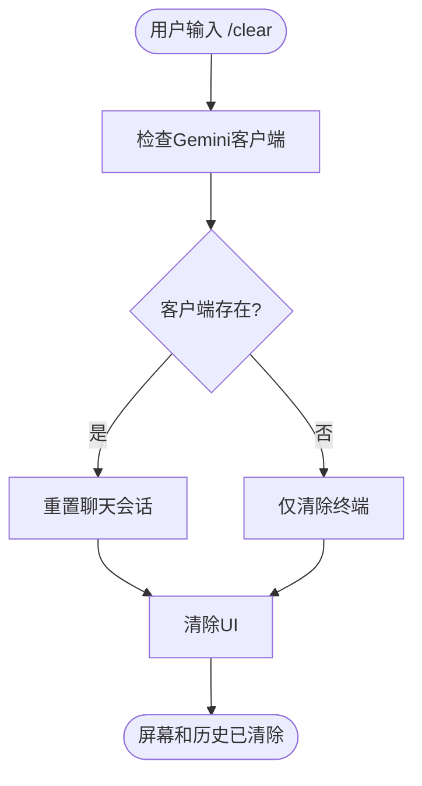
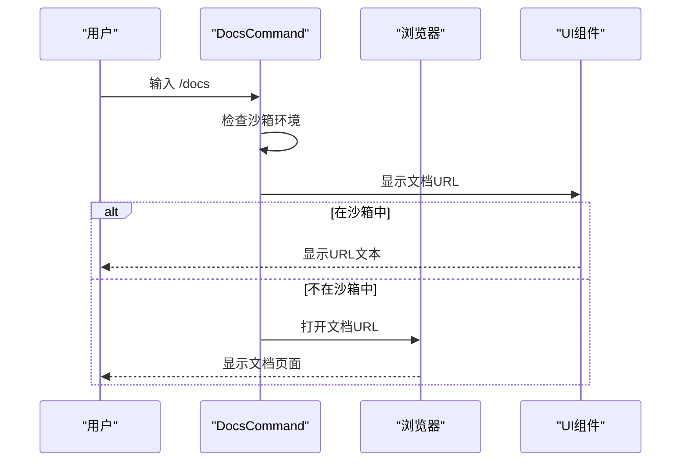
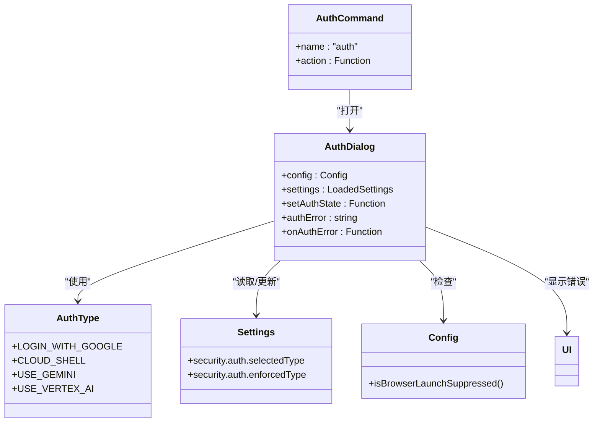
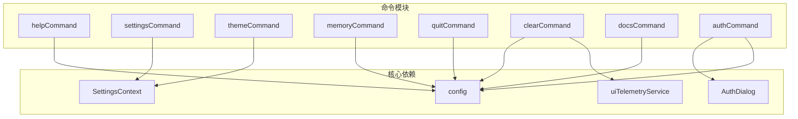

# 用户界面控制命令

<cite>
**本文档引用的文件**
- [helpCommand.ts](file://packages/cli/src/ui/commands/helpCommand.ts)
- [settingsCommand.ts](file://packages/cli/src/ui/commands/settingsCommand.ts)
- [themeCommand.ts](file://packages/cli/src/ui/commands/themeCommand.ts)
- [memoryCommand.ts](file://packages/cli/src/ui/commands/memoryCommand.ts)
- [quitCommand.ts](file://packages/cli/src/ui/commands/quitCommand.ts)
- [clearCommand.ts](file://packages/cli/src/ui/commands/clearCommand.ts)
- [docsCommand.ts](file://packages/cli/src/ui/commands/docsCommand.ts)
- [authCommand.ts](file://packages/cli/src/ui/commands/authCommand.ts)
- [AuthDialog.tsx](file://packages/cli/src/ui/auth/AuthDialog.tsx)
- [SettingsContext.tsx](file://packages/cli/src/ui/contexts/SettingsContext.tsx)
- [config.ts](file://packages/cli/src/config/config.ts)
- [useSettingsCommand.ts](file://packages/cli/src/ui/hooks/useSettingsCommand.ts)
</cite>

## 目录
1. [简介](#简介)
2. [项目结构](#项目结构)
3. [核心组件](#核心组件)
4. [架构概述](#架构概述)
5. [详细组件分析](#详细组件分析)
6. [依赖分析](#依赖分析)
7. [性能考虑](#性能考虑)
8. [故障排除指南](#故障排除指南)
9. [结论](#结论)
10. [附录](#附录)（如有必要）

## 简介
本文档详细介绍了 Gemini CLI 的用户界面控制命令，包括 `/help`、`/settings`、`/theme`、`/memory`、`/quit`、`/clear`、`/docs` 和 `/auth` 等命令的交互模式、前端实现机制以及与底层配置系统的集成方式。

## 项目结构
Gemini CLI 项目采用模块化架构，主要功能集中在 `packages/cli` 目录下，特别是 `src/ui/commands` 子目录中实现了所有用户界面控制命令。



**Diagram sources**
- [helpCommand.ts](file://packages/cli/src/ui/commands/helpCommand.ts)
- [settingsCommand.ts](file://packages/cli/src/ui/commands/settingsCommand.ts)
- [authCommand.ts](file://packages/cli/src/ui/commands/authCommand.ts)
- [AuthDialog.tsx](file://packages/cli/src/ui/auth/AuthDialog.tsx)
- [SettingsContext.tsx](file://packages/cli/src/ui/contexts/SettingsContext.tsx)
- [config.ts](file://packages/cli/src/config/config.ts)

**Section sources**
- [helpCommand.ts](file://packages/cli/src/ui/commands/helpCommand.ts)
- [settingsCommand.ts](file://packages/cli/src/ui/commands/settingsCommand.ts)
- [themeCommand.ts](file://packages/cli/src/ui/commands/themeCommand.ts)
- [memoryCommand.ts](file://packages/cli/src/ui/commands/memoryCommand.ts)
- [quitCommand.ts](file://packages/cli/src/ui/commands/quitCommand.ts)
- [clearCommand.ts](file://packages/cli/src/ui/commands/clearCommand.ts)
- [docsCommand.ts](file://packages/cli/src/ui/commands/docsCommand.ts)
- [authCommand.ts](file://packages/cli/src/ui/commands/authCommand.ts)

## 核心组件
本文档的核心组件包括各种用户界面控制命令的实现，这些命令通过统一的接口与系统其他部分交互，提供一致的用户体验。

**Section sources**
- [helpCommand.ts](file://packages/cli/src/ui/commands/helpCommand.ts)
- [settingsCommand.ts](file://packages/cli/src/ui/commands/settingsCommand.ts)
- [memoryCommand.ts](file://packages/cli/src/ui/commands/memoryCommand.ts)

## 架构概述
Gemini CLI 的用户界面控制命令架构基于命令模式，每个命令都实现了统一的 `SlashCommand` 接口。命令通过 `BuiltinCommandLoader` 注册，并通过 UI 组件与用户交互。



**Diagram sources**
- [helpCommand.ts](file://packages/cli/src/ui/commands/helpCommand.ts)
- [settingsCommand.ts](file://packages/cli/src/ui/commands/settingsCommand.ts)
- [themeCommand.ts](file://packages/cli/src/ui/commands/themeCommand.ts)
- [memoryCommand.ts](file://packages/cli/src/ui/commands/memoryCommand.ts)
- [quitCommand.ts](file://packages/cli/src/ui/commands/quitCommand.ts)
- [clearCommand.ts](file://packages/cli/src/ui/commands/clearCommand.ts)
- [docsCommand.ts](file://packages/cli/src/ui/commands/docsCommand.ts)
- [authCommand.ts](file://packages/cli/src/ui/commands/authCommand.ts)
- [BuiltinCommandLoader.ts](file://packages/cli/src/services/BuiltinCommandLoader.ts)

## 详细组件分析
本节详细分析各个用户界面控制命令的实现细节、交互模式和系统集成。

### 帮助命令分析
`/help` 命令提供系统帮助信息，列出所有可用命令及其描述。



**Diagram sources**
- [helpCommand.ts](file://packages/cli/src/ui/commands/helpCommand.ts)

**Section sources**
- [helpCommand.ts](file://packages/cli/src/ui/commands/helpCommand.ts)

### 设置命令分析
`/settings` 命令启动配置向导，允许用户查看和编辑 Gemini CLI 设置。



**Diagram sources**
- [settingsCommand.ts](file://packages/cli/src/ui/commands/settingsCommand.ts)
- [SettingsContext.tsx](file://packages/cli/src/ui/contexts/SettingsContext.tsx)
- [useSettingsCommand.ts](file://packages/cli/src/ui/hooks/useSettingsCommand.ts)

**Section sources**
- [settingsCommand.ts](file://packages/cli/src/ui/commands/settingsCommand.ts)
- [SettingsContext.tsx](file://packages/cli/src/ui/contexts/SettingsContext.tsx)
- [useSettingsCommand.ts](file://packages/cli/src/ui/hooks/useSettingsCommand.ts)

### 主题命令分析
`/theme` 命令用于切换终端主题，支持多种预设主题如 dracula、github-dark 等。



**Diagram sources**
- [themeCommand.ts](file://packages/cli/src/ui/commands/themeCommand.ts)

**Section sources**
- [themeCommand.ts](file://packages/cli/src/ui/commands/themeCommand.ts)

### 内存命令分析
`/memory` 命令用于管理上下文记忆状态，提供多种子命令来查看和操作记忆内容。

```mermaid
classDiagram
class MemoryCommand {
+name : "memory"
+subCommands : Array
}
class SubCommand {
+name : string
+description : string
+action : Function
}
class Config {
+getUserMemory()
+setUserMemory(content)
+getGeminiMdFileCount()
+setGeminiMdFileCount(count)
+getGeminiMdFilePaths()
+setGeminiMdFilePaths(paths)
}
MemoryCommand --> SubCommand : "包含"
SubCommand --> Config : "调用"
MemoryCommand --> Config : "直接调用"
class "show" as showSubCommand {
显示当前记忆内容
}
class "add" as addSubCommand {
添加内容到记忆
}
class "refresh" as refreshSubCommand {
从源刷新记忆
}
class "list" as listSubCommand {
列出GEMINI.md文件路径
}
SubCommand <|-- showSubCommand
SubCommand <|-- addSubCommand
SubCommand <|-- refreshSubCommand
SubCommand <|-- listSubCommand
```

**Diagram sources**
- [memoryCommand.ts](file://packages/cli/src/ui/commands/memoryCommand.ts)
- [config.ts](file://packages/cli/src/config/config.ts)

**Section sources**
- [memoryCommand.ts](file://packages/cli/src/ui/commands/memoryCommand.ts)

### 退出命令分析
`/quit` 命令用于退出 CLI 应用程序，清理会话并显示会话统计信息。



**Diagram sources**
- [quitCommand.ts](file://packages/cli/src/ui/commands/quitCommand.ts)

**Section sources**
- [quitCommand.ts](file://packages/cli/src/ui/commands/quitCommand.ts)

### 清除命令分析
`/clear` 命令用于清除屏幕和对话历史，重置会话状态。



**Diagram sources**
- [clearCommand.ts](file://packages/cli/src/ui/commands/clearCommand.ts)

**Section sources**
- [clearCommand.ts](file://packages/cli/src/ui/commands/clearCommand.ts)

### 文档命令分析
`/docs` 命令用于在浏览器中打开完整的 Gemini CLI 文档。



**Diagram sources**
- [docsCommand.ts](file://packages/cli/src/ui/commands/docsCommand.ts)

**Section sources**
- [docsCommand.ts](file://packages/cli/src/ui/commands/docsCommand.ts)

### 认证命令分析
`/auth` 命令用于管理认证方法，包括 OAuth 跳转、凭证存储和多账户管理。



**Diagram sources**
- [authCommand.ts](file://packages/cli/src/ui/commands/authCommand.ts)
- [AuthDialog.tsx](file://packages/cli/src/ui/auth/AuthDialog.tsx)
- [config.ts](file://packages/cli/src/config/config.ts)

**Section sources**
- [authCommand.ts](file://packages/cli/src/ui/commands/authCommand.ts)
- [AuthDialog.tsx](file://packages/cli/src/ui/auth/AuthDialog.tsx)

## 依赖分析
用户界面控制命令依赖于多个核心系统组件，包括配置系统、UI 组件和状态管理。



**Diagram sources**
- [helpCommand.ts](file://packages/cli/src/ui/commands/helpCommand.ts)
- [settingsCommand.ts](file://packages/cli/src/ui/commands/settingsCommand.ts)
- [themeCommand.ts](file://packages/cli/src/ui/commands/themeCommand.ts)
- [memoryCommand.ts](file://packages/cli/src/ui/commands/memoryCommand.ts)
- [quitCommand.ts](file://packages/cli/src/ui/commands/quitCommand.ts)
- [clearCommand.ts](file://packages/cli/src/ui/commands/clearCommand.ts)
- [docsCommand.ts](file://packages/cli/src/ui/commands/docsCommand.ts)
- [authCommand.ts](file://packages/cli/src/ui/commands/authCommand.ts)
- [config.ts](file://packages/cli/src/config/config.ts)
- [SettingsContext.tsx](file://packages/cli/src/ui/contexts/SettingsContext.tsx)
- [AuthDialog.tsx](file://packages/cli/src/ui/auth/AuthDialog.tsx)

**Section sources**
- [helpCommand.ts](file://packages/cli/src/ui/commands/helpCommand.ts)
- [settingsCommand.ts](file://packages/cli/src/ui/commands/settingsCommand.ts)
- [themeCommand.ts](file://packages/cli/src/ui/commands/themeCommand.ts)
- [memoryCommand.ts](file://packages/cli/src/ui/commands/memoryCommand.ts)
- [quitCommand.ts](file://packages/cli/src/ui/commands/quitCommand.ts)
- [clearCommand.ts](file://packages/cli/src/ui/commands/clearCommand.ts)
- [docsCommand.ts](file://packages/cli/src/ui/commands/docsCommand.ts)
- [authCommand.ts](file://packages/cli/src/ui/commands/authCommand.ts)
- [config.ts](file://packages/cli/src/config/config.ts)

## 性能考虑
用户界面控制命令的设计考虑了性能因素，确保快速响应和高效执行。

- `/help` 命令：轻量级操作，仅需渲染预定义的帮助信息
- `/settings` 命令：延迟加载设置对话框，减少初始内存占用
- `/theme` 命令：主题切换即时生效，无需重启应用
- `/memory` 命令：内存操作异步执行，避免阻塞 UI
- `/quit` 命令：快速清理会话，确保优雅退出
- `/clear` 命令：高效清除 UI 状态，重置会话
- `/docs` 命令：外部文档加载，不影响主应用性能
- `/auth` 命令：认证流程优化，减少用户等待时间

## 故障排除指南
本节提供常见问题的解决方案和调试信息。

**Section sources**
- [authCommand.ts](file://packages/cli/src/ui/commands/authCommand.ts)
- [clearCommand.ts](file://packages/cli/src/ui/commands/clearCommand.ts)
- [memoryCommand.ts](file://packages/cli/src/ui/commands/memoryCommand.ts)

## 结论
Gemini CLI 的用户界面控制命令提供了强大而直观的交互方式，通过统一的架构和清晰的实现模式，确保了用户体验的一致性和系统的可维护性。

## 附录
### 快捷键映射
- `/help`：显示帮助信息
- `/settings`：打开设置向导
- `/theme`：切换终端主题
- `/memory`：管理上下文记忆
- `/quit` 或 `/exit`：退出应用程序
- `/clear`：清除屏幕和历史
- `/docs`：打开文档
- `/auth`：管理认证方法

### 可访问性支持
- 屏幕阅读器模式支持
- 键盘导航优化
- 高对比度主题
- 语义化 UI 组件

### 自定义配置示例
```json
{
  "ui": {
    "showMemoryUsage": true,
    "accessibility": {
      "screenReader": true
    }
  },
  "context": {
    "importFormat": "tree",
    "fileName": "CUSTOM.md"
  },
  "security": {
    "auth": {
      "selectedType": "LOGIN_WITH_GOOGLE",
      "enforcedType": "USE_GEMINI"
    }
  }
}
```

### 命令行参数覆盖
```bash
# 覆盖默认设置
gemini --screen-reader --output-format=json --approval-mode=yolo

# 启动时执行命令
gemini --prompt-interactive "/settings" "/theme"
```