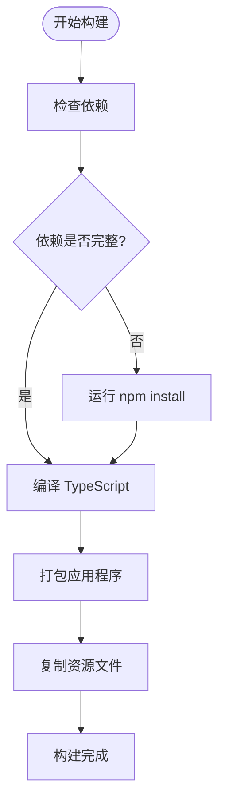

# Gemini CLI 安装指南

<cite>
**本文档中引用的文件**
- [README.md](file://README.md)
- [package.json](file://package.json)
- [scripts/build.js](file://scripts/build.js)
- [scripts/start.js](file://scripts/start.js)
- [packages/cli/src/utils/installationInfo.ts](file://packages/cli/src/utils/installationInfo.ts)
- [docs/get-started/index.md](file://docs/get-started/index.md)
- [docs/get-started/deployment.md](file://docs/get-started/deployment.md)
- [docs/get-started/authentication.md](file://docs/get-started/authentication.md)
</cite>

## 目录
1. [简介](#简介)
2. [系统要求](#系统要求)
3. [快速安装](#快速安装)
4. [详细安装方法](#详细安装方法)
5. [从源码构建安装](#从源码构建安装)
6. [验证安装](#验证安装)
7. [常见问题解决](#常见问题解决)
8. [卸载指南](#卸载指南)
9. [总结](#总结)

## 简介

Gemini CLI 是一个开源的人工智能代理，它将 Gemini 的强大功能直接带入您的终端。作为一个 AI 驱动的助手，Gemini CLI 可以帮助您完成各种任务，从理解和生成代码到审查和编辑文档。

Gemini CLI 提供了多种安装方式，包括通过 npm/yarn 进行全局安装、Homebrew 安装，以及从源码构建安装。无论您是新手还是系统管理员，本指南都将为您提供详细的安装说明和故障排除建议。

## 系统要求

在安装 Gemini CLI 之前，请确保您的系统满足以下要求：

### 基本要求
- **Node.js 版本 20 或更高版本**：这是运行 Gemini CLI 的最低要求
- **操作系统支持**：
  - macOS
  - Linux
  - Windows

### 推荐配置
- 具备稳定的互联网连接
- 足够的磁盘空间用于安装包和缓存
- 权限设置允许全局包安装（对于 npm/yarn 安装）

**章节来源**
- [README.md](file://README.md#L35-L40)
- [package.json](file://package.json#L4-L6)

## 快速安装

### 使用 npx 即时运行（无需安装）

如果您只想快速尝试 Gemini CLI 而不想进行全局安装，可以使用以下命令：

```bash
# 使用 npx（无需安装）
npx https://github.com/google-gemini/gemini-cli
```

这个方法会从 GitHub 仓库下载最新版本的 Gemini CLI 并立即运行，非常适合临时使用或测试功能。

### 全局安装（推荐）

要永久安装 Gemini CLI，可以使用以下命令：

```bash
# 使用 npm 全局安装
npm install -g @google/gemini-cli

# 或者使用 yarn
yarn global add @google/gemini-cli

# 或者使用 pnpm
pnpm add -g @google/gemini-cli
```

安装完成后，您可以通过以下命令运行 Gemini CLI：

```bash
gemini
```

**章节来源**
- [README.md](file://README.md#L42-L55)
- [docs/get-started/index.md](file://docs/get-started/index.md#L10-L25)

## 详细安装方法

### 方法一：使用 npm 全局安装

这是最常用的安装方法，适用于大多数用户：

```bash
# 安装最新稳定版本
npm install -g @google/gemini-cli

# 安装预览版本（每周三 UTC 2359 发布）
npm install -g @google/gemini-cli@preview

# 安装夜间版本（每天 UTC 0000 发布）
npm install -g @google/gemini-cli@nightly
```

#### npm 安装特点：
- 自动处理依赖关系
- 支持自动更新机制
- 提供完整的包管理功能

### 方法二：使用 Homebrew 安装（macOS/Linux）

对于 macOS 和 Linux 用户，可以使用 Homebrew 进行安装：

```bash
# 安装 Homebrew（如果尚未安装）
/bin/bash -c "$(curl -fsSL https://raw.githubusercontent.com/Homebrew/install/HEAD/install.sh)"

# 使用 Homebrew 安装 Gemini CLI
brew install gemini-cli

# 更新到最新版本
brew upgrade gemini-cli
```

#### Homebrew 安装优势：
- 系统级包管理
- 自动处理依赖
- 简化的更新流程

### 方法三：使用 yarn 全局安装

如果您更喜欢使用 yarn 包管理器：

```bash
# 安装
yarn global add @google/gemini-cli

# 更新
yarn global upgrade @google/gemini-cli
```

### 方法四：使用 pnpm 安装

对于使用 pnpm 的用户：

```bash
# 安装
pnpm add -g @google/gemini-cli

# 更新
pnpm update -g @google/gemini-cli
```

**章节来源**
- [README.md](file://README.md#L42-L70)
- [docs/get-started/deployment.md](file://docs/get-started/deployment.md#L15-L45)

## 从源码构建安装

对于开发者或需要自定义构建的用户，可以从源码进行安装：

### 开发模式安装

```bash
# 克隆仓库
git clone https://github.com/google-gemini/gemini-cli.git
cd gemini-cli

# 安装依赖
npm install

# 启动开发模式
npm run start
```

### 生产环境安装

```bash
# 构建生产版本
npm run build

# 创建本地链接
npm link packages/cli

# 测试本地安装
gemini
```

### 构建过程详解

Gemini CLI 的构建过程包括以下步骤：

1. **依赖安装**：自动检测并安装缺失的依赖项
2. **代码编译**：使用 TypeScript 编译器编译源代码
3. **打包处理**：使用 esbuild 打包应用程序
4. **资源复制**：复制必要的静态资源文件



**图表来源**
- [scripts/build.js](file://scripts/build.js#L25-L55)

**章节来源**
- [docs/get-started/deployment.md](file://docs/get-started/deployment.md#L60-L90)
- [scripts/build.js](file://scripts/build.js#L1-L56)

## 验证安装

安装完成后，您应该验证 Gemini CLI 是否正确安装并可以正常运行：

### 检查版本信息

```bash
# 查看当前版本
gemini --version

# 或者
gemini -v
```

### 测试基本功能

```bash
# 启动交互式模式
gemini

# 或者运行简单查询
gemini -p "Hello, world!"
```

### 验证输出

成功的安装应该显示类似以下的输出：

```
Gemini CLI v0.9.0
Welcome to Gemini CLI!
```

### 常见验证问题

1. **命令未找到**：检查 PATH 环境变量是否包含全局 npm 包路径
2. **权限错误**：确保您有权限写入全局安装目录
3. **Node.js 版本不兼容**：确认 Node.js 版本 >= 20.0.0

**章节来源**
- [packages/cli/src/utils/installationInfo.ts](file://packages/cli/src/utils/installationInfo.ts#L1-L50)

## 常见问题解决

### 权限错误

#### 问题描述
```
Error: EACCES: permission denied, mkdir '/usr/local/lib/node_modules'
```

#### 解决方案

**方法一：使用 sudo（不推荐）**
```bash
sudo npm install -g @google/gemini-cli
```

**方法二：修复 npm 权限（推荐）**
```bash
# 修复 npm 全局安装权限
mkdir ~/.npm-global
npm config set prefix '~/.npm-global'

# 添加到 PATH（添加到 ~/.bashrc 或 ~/.zshrc）
export PATH=~/.npm-global/bin:$PATH

# 重新安装
npm install -g @google/gemini-cli
```

### 网络问题

#### 问题描述
安装过程中出现网络超时或连接失败

#### 解决方案

**使用国内镜像源**
```bash
# 设置淘宝镜像源
npm config set registry https://registry.npmmirror.com/

# 或者临时使用
npm install -g @google/gemini-cli --registry=https://registry.npmmirror.com/
```

**配置代理**
```bash
# 设置 HTTP 代理
npm config set proxy http://proxy.company.com:8080
npm config set https-proxy http://proxy.company.com:8080

# 或者临时使用代理
npm install -g @google/gemini-cli --proxy=http://proxy.company.com:8080
```

### 依赖冲突

#### 问题描述
多个版本的依赖包导致冲突

#### 解决方案

```bash
# 清理缓存
npm cache clean --force

# 删除全局安装的包
npm uninstall -g @google/gemini-cli

# 重新安装
npm install -g @google/gemini-cli
```

### Node.js 版本问题

#### 问题描述
Node.js 版本过低导致安装失败

#### 解决方案

**使用 nvm 管理 Node.js 版本**
```bash
# 安装 nvm（如果尚未安装）
curl -o- https://raw.githubusercontent.com/nvm-sh/nvm/v0.39.0/install.sh | bash

# 重启终端后安装 Node.js 20+
nvm install 20
nvm use 20

# 重新安装 Gemini CLI
npm install -g @google/gemini-cli
```

### Homebrew 安装问题

#### 问题描述
Homebrew 安装失败或找不到 gemini-cli

#### 解决方案

```bash
# 更新 Homebrew
brew update

# 搜索 gemini-cli
brew search gemini-cli

# 如果找不到，手动安装
brew install gemini-cli

# 检查安装位置
which gemini
```

**章节来源**
- [packages/cli/src/utils/installationInfo.ts](file://packages/cli/src/utils/installationInfo.ts#L60-L120)

## 卸载指南

如果您需要卸载 Gemini CLI，可以按照以下步骤操作：

### 使用 npm 卸载

```bash
# 卸载全局安装的包
npm uninstall -g @google/gemini-cli

# 清理缓存（可选）
npm cache clean --force
```

### 使用 Homebrew 卸载

```bash
# 卸载 Homebrew 安装的包
brew uninstall gemini-cli

# 清理残留文件（可选）
brew cleanup
```

### 手动清理

```bash
# 删除配置文件
rm -rf ~/.gemini

# 删除缓存文件
rm -rf ~/.cache/gemini-cli

# 删除日志文件
rm -rf ~/Library/Logs/gemini-cli  # macOS
rm -rf ~/.local/share/gemini-cli  # Linux
```

### 验证卸载

```bash
# 检查命令是否仍然存在
which gemini

# 尝试运行命令
gemini --version  # 应该报错
```

## 总结

Gemini CLI 提供了多种灵活的安装方式，您可以根据自己的需求和技术水平选择最适合的方法：

### 推荐安装方式

1. **新手用户**：使用 npm 全局安装（`npm install -g @google/gemini-cli`）
2. **macOS 用户**：使用 Homebrew 安装（`brew install gemini-cli`）
3. **开发者**：从源码构建安装以便进行开发和调试
4. **企业用户**：考虑使用沙箱模式提高安全性

### 下一步行动

安装完成后，您应该：

1. **配置认证**：根据您的使用场景选择合适的认证方法
2. **探索功能**：阅读官方文档了解 Gemini CLI 的核心功能
3. **定制配置**：根据您的工作流程调整设置和配置
4. **参与社区**：加入 Gemini CLI 社区获取支持和分享经验

### 获取帮助

如果您在安装过程中遇到任何问题，可以：

- 查阅官方文档中的故障排除部分
- 在 GitHub 上提交 issue
- 加入社区讨论
- 参考官方提供的安装视频教程

通过本指南，您应该能够成功安装并开始使用 Gemini CLI，享受其强大的 AI 功能来提升您的开发效率。