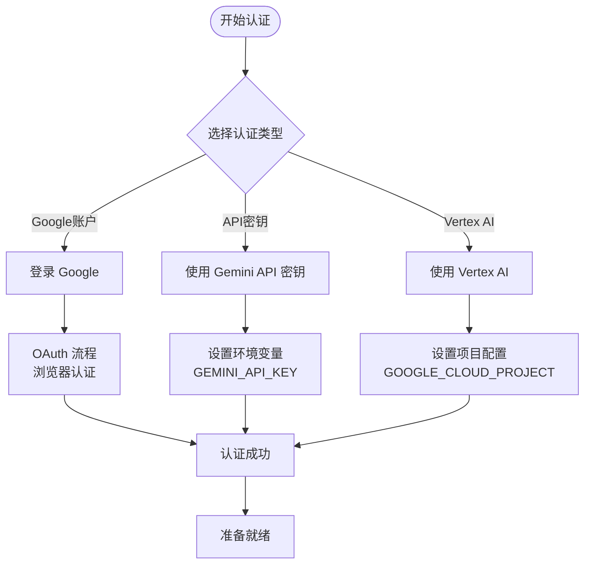
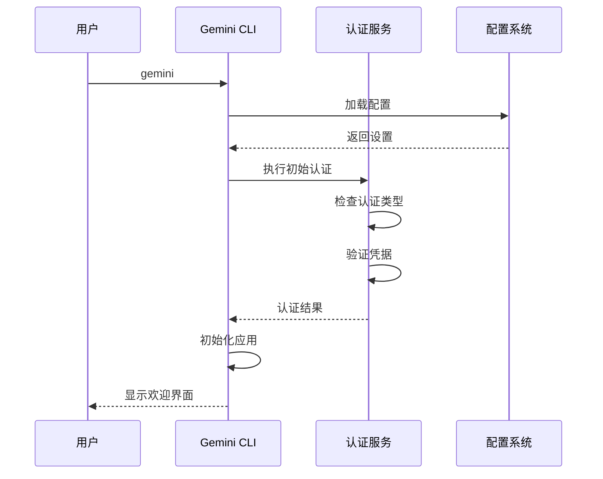
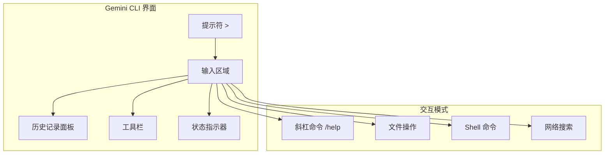
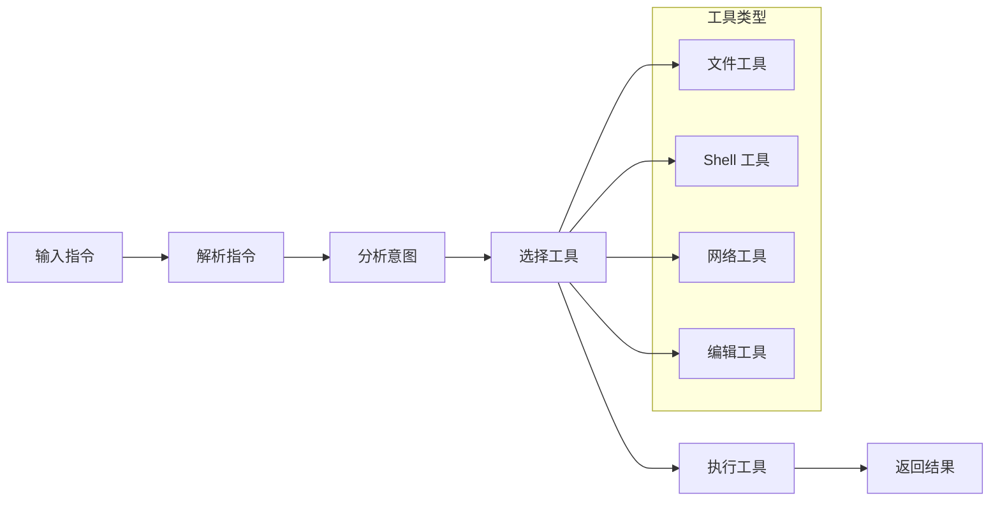

# Gemini CLI 快速入门指南

<cite>
**本文档引用的文件**
- [README.md](file://README.md)
- [GEMINI.md](file://GEMINI.md)
- [packages/cli/src/core/initializer.ts](file://packages/cli/src/core/initializer.ts)
- [packages/cli/src/core/auth.ts](file://packages/cli/src/core/auth.ts)
- [packages/cli/src/config/auth.ts](file://packages/cli/src/config/auth.ts)
- [packages/cli/src/ui/auth/useAuth.ts](file://packages/cli/src/ui/auth/useAuth.ts)
- [packages/cli/src/ui/auth/AuthDialog.tsx](file://packages/cli/src/ui/auth/AuthDialog.tsx)
- [packages/core/src/tools/read-file.ts](file://packages/core/src/tools/read-file.ts)
- [packages/core/src/tools/shell.ts](file://packages/core/src/tools/shell.ts)
- [hello/gemini-extension.json](file://hello/gemini-extension.json)
- [hello/GEMINI.md](file://hello/GEMINI.md)
- [integration-tests/test-helper.ts](file://integration-tests/test-helper.ts)
- [integration-tests/write_file.test.ts](file://integration-tests/write_file.test.ts)
</cite>

## 目录
1. [简介](#简介)
2. [安装与初始化](#安装与初始化)
3. [认证设置](#认证设置)
4. [首次使用体验](#首次使用体验)
5. [基本界面元素](#基本界面元素)
6. [核心工作流](#核心工作流)
7. [实践示例](#实践示例)
8. [故障排除](#故障排除)
9. [总结](#总结)

## 简介

Gemini CLI 是一个开源的 AI 助手，它将 Gemini 的强大功能直接带入您的终端。本快速入门指南将引导您完成从安装到首次使用的完整流程，让您能够快速上手并充分利用 Gemini CLI 的各项功能。

### 主要特性

- **免费使用**：个人 Google 账户享有每分钟 60 次请求和每天 1,000 次请求的免费配额
- **强大的模型**：访问具有 1M 令牌上下文窗口的 Gemini 2.5 Pro
- **内置工具**：支持 Google 搜索、文件操作、Shell 命令和网页抓取
- **可扩展性**：支持 MCP（模型上下文协议）以实现自定义集成
- **终端优先**：专为喜欢在命令行中工作的开发者设计

## 安装与初始化

### 安装方式

Gemini CLI 提供多种安装方式，您可以选择最适合您环境的方法：

#### 使用 npx（无需安装）

```bash
# 直接运行，无需安装
npx https://github.com/google-gemini/gemini-cli
```

#### 全局安装（推荐）

```bash
# 使用 npm 安装
npm install -g @google/gemini-cli

# 或使用 Homebrew（macOS/Linux）
brew install gemini-cli
```

#### 系统要求

- Node.js 版本 20 或更高
- 支持的操作系统：macOS、Linux、Windows

### 初始化配置

安装完成后，您需要进行初始化配置：

```bash
# 启动 Gemini CLI
gemini
```

首次启动时，系统会自动检测是否已安装必要的依赖项，并提示您进行配置。

**章节来源**
- [README.md](file://README.md#L25-L50)
- [packages/cli/src/core/initializer.ts](file://packages/cli/src/core/initializer.ts#L1-L58)

## 认证设置

Gemini CLI 提供三种不同的认证方式，您可以根据自己的需求选择最适合的方式。

### 认证选项概览



**图表来源**
- [packages/cli/src/config/auth.ts](file://packages/cli/src/config/auth.ts#L1-L44)
- [packages/cli/src/ui/auth/AuthDialog.tsx](file://packages/cli/src/ui/auth/AuthDialog.tsx#L155-L200)

### 选项 1：Google 账户登录（推荐）

这是最简单的认证方式，适合大多数个人开发者。

**优势：**
- 免费配额：每分钟 60 次请求，每天 1,000 次请求
- 最新模型：自动获得最新的 Gemini 2.5 Pro
- 无需管理 API 密钥
- 自动更新

**使用方法：**

```bash
# 启动 Gemini CLI
gemini

# 当提示时，选择 "Login with Google"
# 系统会打开浏览器进行 OAuth 认证
```

**企业用户注意事项：**
如果您使用的是组织提供的 Gemini Code Assist 许可证，请记得设置 Google Cloud 项目：

```bash
# 设置您的 Google Cloud 项目
export GOOGLE_CLOUD_PROJECT="YOUR_PROJECT_ID"
gemini
```

### 选项 2：Gemini API 密钥

适合需要特定模型控制或付费配额的开发者。

**优势：**
- 免费配额：每天 100 次请求，使用 Gemini 2.5 Pro
- 模型选择：可以选择特定的 Gemini 模型
- 按使用计费：需要时可以升级更高的限制

**使用方法：**

```bash
# 从 https://aistudio.google.com/apikey 获取您的 API 密钥
export GEMINI_API_KEY="YOUR_API_KEY"
gemini
```

### 选项 3：Vertex AI

适合企业团队和生产工作负载。

**优势：**
- 企业功能：高级安全性和合规性
- 可扩展性：通过计费账户获得更高的速率限制
- 集成：与现有的 Google Cloud 基础设施配合使用

**使用方法：**

```bash
# 从 Google Cloud 控制台获取您的密钥
export GOOGLE_API_KEY="YOUR_API_KEY"
export GOOGLE_GENAI_USE_VERTEXAI=true
gemini
```

**章节来源**
- [README.md](file://README.md#L85-L150)
- [packages/cli/src/config/auth.ts](file://packages/cli/src/config/auth.ts#L1-L44)
- [packages/cli/src/ui/auth/useAuth.ts](file://packages/cli/src/ui/auth/useAuth.ts#L42-L95)

## 首次使用体验

### 启动流程

当您第一次运行 `gemini` 命令时，系统会执行以下步骤：



**图表来源**
- [packages/cli/src/core/initializer.ts](file://packages/cli/src/core/initializer.ts#L20-L58)

### 认证验证

系统会自动验证您的认证设置：

```typescript
// 认证验证逻辑
export async function performInitialAuth(
  config: Config,
  authType: AuthType | undefined,
): Promise<string | null> {
  if (!authType) {
    return null;
  }

  try {
    await config.refreshAuth(authType);
    console.log(`Authenticated via "${authType}".`);
    return null;
  } catch (e) {
    return `Failed to login. Message: ${getErrorMessage(e)}`;
  }
}
```

### 界面显示

认证成功后，您将看到以下界面元素：

1. **提示符**：`>` - 输入区域
2. **历史记录**：显示之前的对话
3. **工具栏**：提供快捷操作按钮
4. **状态指示器**：显示当前状态和进度

**章节来源**
- [packages/cli/src/core/initializer.ts](file://packages/cli/src/core/initializer.ts#L20-L58)
- [packages/cli/src/core/auth.ts](file://packages/cli/src/core/auth.ts#L1-L35)

## 基本界面元素

### 提示符与输入区域

Gemini CLI 的界面设计简洁直观：



### 响应格式

Gemini CLI 的响应采用分层格式：

1. **文本响应**：直接的自然语言回答
2. **工具调用**：显示 AI 正在执行的具体操作
3. **文件内容**：显示读取或写入的文件内容
4. **Shell 输出**：显示命令执行结果

### 交互模式

#### 斜杠命令（Slash Commands）

```bash
# 查看所有可用命令
/help

# 开始新的聊天会话
/chat

# 清除当前会话
/clear

# 列出所有可用工具
/tools
```

#### 文件操作

```bash
# 读取文件
read_file /path/to/file.txt

# 写入文件
write_file /path/to/newfile.txt "文件内容"

# 编辑现有文件
edit_file /path/to/existing.txt "修改内容"
```

#### Shell 命令

```bash
# 执行系统命令
run_shell_command "ls -la"

# 运行 Python 脚本
run_shell_command "python script.py"

# 执行多行命令
run_shell_command "mkdir new_project && cd new_project && npm init"
```

**章节来源**
- [packages/core/src/tools/read-file.ts](file://packages/core/src/tools/read-file.ts#L1-L215)
- [packages/core/src/tools/shell.ts](file://packages/core/src/tools/shell.ts#L396-L448)

## 核心工作流

### 输入-处理-执行-输出循环

Gemini CLI 的核心工作流程遵循以下模式：



### 工具执行机制

每个工具都有明确的执行流程：

1. **参数验证**：检查输入参数的有效性
2. **权限检查**：确保操作符合安全策略
3. **执行操作**：调用底层系统功能
4. **结果处理**：格式化输出并返回给用户

### 错误处理

系统提供了完善的错误处理机制：

```typescript
// 错误处理示例
try {
  await config.refreshAuth(authType);
  console.log(`Authenticated via "${authType}".`);
  setAuthState(AuthState.Authenticated);
} catch (e) {
  onAuthError(`Failed to login. Message: ${getErrorMessage(e)}`);
}
```

**章节来源**
- [packages/cli/src/ui/auth/useAuth.ts](file://packages/cli/src/ui/auth/useAuth.ts#L42-L95)

## 实践示例

### 示例 1：读取文件内容

让我们从最基本的文件操作开始：

```bash
# 读取 README.md 文件
> read_file /path/to/README.md

# 分页读取大文件
> read_file /path/to/large_file.txt offset:100 limit:50
```

**预期输出：**
```
Reading file: /path/to/README.md
[文件内容将在下方显示...]

Status: Showing lines 1-50 of 200 total lines.
Action: To read more of the file, you can use the 'offset' and 'limit' parameters in a subsequent 'read_file' call.
```

### 示例 2：编辑代码片段

```bash
# 创建新文件
> write_file /tmp/example.js "console.log('Hello, World!');"

# 编辑现有文件
> edit_file /tmp/example.js "// 添加注释\nconsole.log('Hello, World!');"
```

### 示例 3：执行 Shell 命令

```bash
# 列出目录内容
> run_shell_command "ls -la"

# 创建项目结构
> run_shell_command "mkdir project && cd project && touch README.md"

# 运行测试
> run_shell_command "npm test"
```

### 示例 4：综合任务

```bash
# 1. 读取项目配置
> read_file package.json

# 2. 分析依赖关系
> run_shell_command "npm list --depth=0"

# 3. 创建新组件
> write_file src/components/Button.js "
import React from 'react';

export default function Button({ children, onClick }) {
  return (
    <button onClick={onClick} className='btn'>
      {children}
    </button>
  );
}
"
```

### 示例 5：帮助系统

```bash
# 查看所有可用命令
> /help

# 获取特定命令的帮助
> /help read_file

# 查看工具列表
> /tools
```

**章节来源**
- [integration-tests/write_file.test.ts](file://integration-tests/write_file.test.ts#L1-L70)
- [hello/GEMINI.md](file://hello/GEMINI.md#L1-L9)

## 故障排除

### 常见问题与解决方案

#### 认证失败

**问题**：无法完成 Google 登录或 API 密钥验证

**解决方案**：
```bash
# 检查环境变量
echo $GEMINI_API_KEY
echo $GOOGLE_CLOUD_PROJECT

# 重新设置认证
gemini --reset-auth
```

**常见错误信息及解决方法：**

1. **"GEMINI_API_KEY environment variable not found"**
   - 确保已正确设置 API 密钥
   - 检查环境变量是否在当前 shell 中生效

2. **"Failed to login"**
   - 检查网络连接
   - 尝试清除缓存：`gemini --clear-cache`

3. **"Invalid auth method selected"**
   - 确认选择了正确的认证方式
   - 检查配置文件中的设置

#### 权限问题

**问题**：无法访问某些文件或执行特定命令

**解决方案**：
```bash
# 检查文件权限
ls -la /path/to/file

# 修改文件权限
chmod 644 /path/to/file

# 在可信目录中操作
gemini --trusted-dir /safe/directory
```

#### 性能问题

**问题**：响应缓慢或超时

**解决方案**：
```bash
# 减少上下文大小
gemini --max-context-size 1000

# 使用更快的模型
gemini -m gemini-2.5-flash

# 清理临时文件
gemini --cleanup
```

### 调试技巧

#### 启用详细日志

```bash
# 启用调试模式
DEBUG=gemini:* gemini

# 查看工具调用日志
gemini --verbose
```

#### 检查配置

```bash
# 查看当前配置
gemini --show-config

# 验证配置文件
gemini --validate-config
```

### 支持资源

- **内置帮助系统**：`/help` 命令提供实时帮助
- **社区论坛**：GitHub Issues 和 Discussions
- **官方文档**：在线文档和教程
- **错误报告**：使用 `/bug` 命令报告问题

**章节来源**
- [packages/cli/src/config/auth.ts](file://packages/cli/src/config/auth.ts#L1-L44)
- [integration-tests/test-helper.ts](file://integration-tests/test-helper.ts#L1-L859)

## 总结

通过本快速入门指南，您已经掌握了：

1. **安装与初始化**：成功安装并配置 Gemini CLI
2. **认证设置**：选择合适的认证方式并完成配置
3. **基本界面**：熟悉用户界面元素和交互模式
4. **核心工作流**：理解输入-处理-执行-输出的完整流程
5. **实践操作**：完成了多个实际的使用示例
6. **故障排除**：学会了识别和解决常见问题

### 下一步建议

1. **探索更多工具**：尝试使用文件操作、Shell 命令等高级功能
2. **自定义配置**：根据您的工作流程调整设置
3. **学习扩展**：了解如何使用 MCP 服务器扩展功能
4. **参与社区**：加入讨论，分享经验和最佳实践

### 最佳实践

- **保持认证更新**：定期检查和更新您的认证信息
- **合理使用配额**：注意免费配额限制，避免超出限制
- **安全第一**：只在受信任的目录中执行命令
- **备份重要数据**：定期备份重要的文件和配置

祝您使用 Gemini CLI 体验愉快！如有任何问题，请随时使用内置的帮助系统或寻求社区支持。