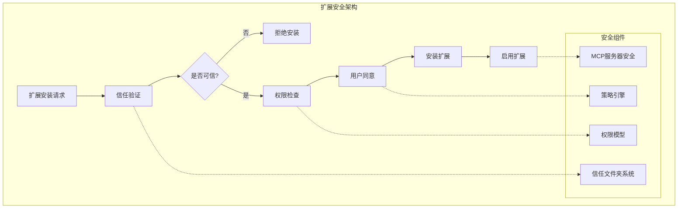
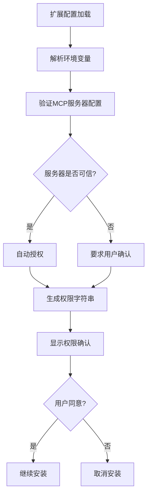
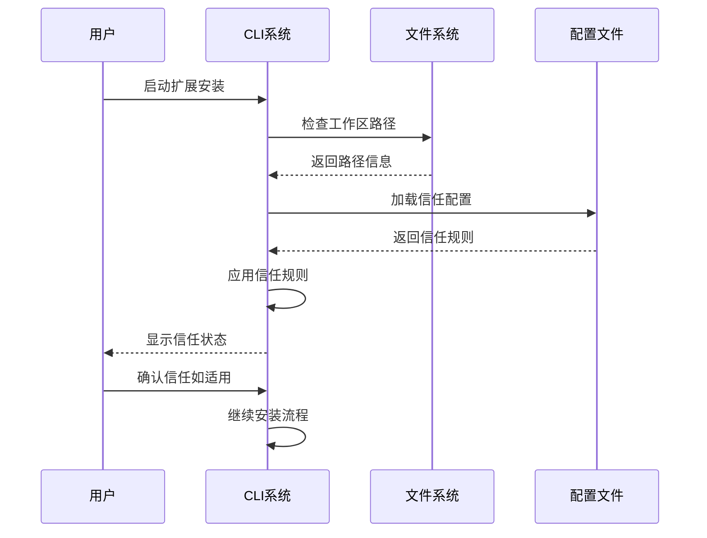
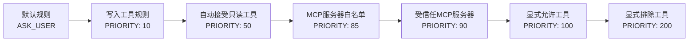
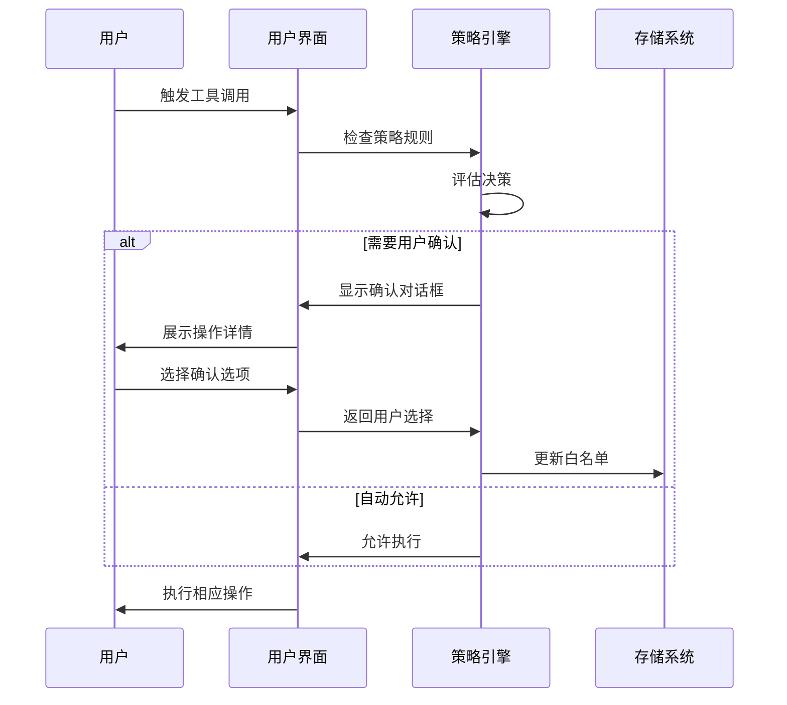

# 扩展安全策略

<cite>
**本文档中引用的文件**
- [packages/cli/src/config/extension.ts](file://packages/cli/src/config/extension.ts)
- [packages/cli/src/commands/extensions/install.ts](file://packages/cli/src/commands/extensions/install.ts)
- [packages/cli/src/config/trustedFolders.ts](file://packages/cli/src/config/trustedFolders.ts)
- [packages/cli/src/config/extensions/extensionEnablement.ts](file://packages/cli/src/config/extensions/extensionEnablement.ts)
- [packages/cli/src/config/policy.ts](file://packages/cli/src/config/policy.ts)
- [packages/core/src/tools/mcp-tool.ts](file://packages/core/src/tools/mcp-tool.ts)
- [packages/cli/src/ui/components/ConsentPrompt.tsx](file://packages/cli/src/ui/components/ConsentPrompt.tsx)
- [hello/gemini-extension.json](file://hello/gemini-extension.json)
- [integration-tests/extensions-install.test.ts](file://integration-tests/extensions-install.test.ts)
</cite>

## 目录
1. [简介](#简介)
2. [扩展安全架构概览](#扩展安全架构概览)
3. [权限模型](#权限模型)
4. [安装过程中的安全验证](#安装过程中的安全验证)
5. [信任系统](#信任系统)
6. [MCP服务器安全](#mcp服务器安全)
7. [策略引擎](#策略引擎)
8. [用户交互机制](#用户交互机制)
9. [最佳实践](#最佳实践)
10. [故障排除指南](#故障排除指南)

## 简介

Gemini CLI 实现了一套全面的扩展安全策略，确保第三方扩展在使用时的安全性和可控性。该系统采用多层防护机制，包括权限验证、用户同意流程、信任评估和实时监控，为用户提供安全可靠的扩展环境。

## 扩展安全架构概览



**图表来源**
- [packages/cli/src/config/extension.ts](file://packages/cli/src/config/extension.ts#L1-L50)
- [packages/cli/src/config/trustedFolders.ts](file://packages/cli/src/config/trustedFolders.ts#L1-L50)

## 权限模型

Gemini CLI 的权限模型基于最小权限原则，为每个扩展精确声明其需要的权限。权限模型包含以下核心组件：

### 扩展配置权限

扩展通过 `gemini-extension.json` 配置文件声明其权限需求：

```json
{
  "name": "example-extension",
  "version": "1.0.0",
  "mcpServers": {
    "server-name": {
      "command": "node",
      "args": ["server.js"],
      "trust": false
    }
  },
  "contextFileName": "GEMINI.md",
  "excludeTools": ["shell", "write-file"]
}
```

### 核心权限类型

1. **MCP服务器权限**：控制扩展可以启动和访问的MCP服务器
2. **上下文文件权限**：允许扩展添加自定义上下文信息
3. **工具排除权限**：阻止扩展使用特定的核心工具

### 权限验证流程



**图表来源**
- [packages/cli/src/config/extension.ts](file://packages/cli/src/config/extension.ts#L598-L632)
- [packages/cli/src/config/extension.ts](file://packages/cli/src/config/extension.ts#L470-L520)

**章节来源**
- [packages/cli/src/config/extension.ts](file://packages/cli/src/config/extension.ts#L470-L520)
- [hello/gemini-extension.json](file://hello/gemini-extension.json#L1-L6)

## 安装过程中的安全验证

### 安装前验证

在扩展安装过程中，系统执行多层次的安全验证：

1. **源验证**：检查扩展来源的合法性
2. **信任验证**：确认工作区是否被信任
3. **权限验证**：分析扩展请求的权限
4. **兼容性验证**：确保扩展与当前版本兼容

### 安装函数实现

```typescript
export async function installExtension(
  installMetadata: ExtensionInstallMetadata,
  requestConsent: (consent: string) => Promise<boolean>,
  cwd: string = process.cwd(),
  previousExtensionConfig?: ExtensionConfig,
): Promise<string>
```

该函数负责：
- 验证工作区信任状态
- 下载和验证扩展包
- 请求用户权限确认
- 处理安装元数据

### 权限字符串生成

系统为每次安装生成详细的权限字符串，明确列出扩展将要执行的操作：

```typescript
function extensionConsentString(extensionConfig: ExtensionConfig): string {
  const output: string[] = [];
  const mcpServerEntries = Object.entries(extensionConfig.mcpServers || {});
  
  output.push(`Installing extension "${extensionConfig.name}".`);
  output.push('**Extensions may introduce unexpected behavior. Ensure you have investigated the extension source and trust the author.**');
  
  if (mcpServerEntries.length) {
    output.push('This extension will run the following MCP servers:');
    for (const [key, mcpServer] of mcpServerEntries) {
      const isLocal = !!mcpServer.command;
      const source = mcpServer.httpUrl ?? 
        `${mcpServer.command || ''}${mcpServer.args ? ' ' + mcpServer.args.join(' ') : ''}`;
      output.push(`  * ${key} (${isLocal ? 'local' : 'remote'}): ${source}`);
    }
  }
  
  return output.join('\n');
}
```

**章节来源**
- [packages/cli/src/config/extension.ts](file://packages/cli/src/config/extension.ts#L598-L632)
- [packages/cli/src/config/extension.ts](file://packages/cli/src/config/extension.ts#L470-L520)

## 信任系统

### 工作区信任机制

Gemini CLI 实现了基于文件系统的信任机制，通过 `trustedFolders.json` 文件管理信任状态：

```typescript
export enum TrustLevel {
  TRUST_FOLDER = 'TRUST_FOLDER',
  TRUST_PARENT = 'TRUST_PARENT',
  DO_NOT_TRUST = 'DO_NOT_TRUST',
}
```

### 信任规则

信任系统支持三种信任级别：

1. **TRUST_FOLDER**：信任指定目录及其内容
2. **TRUST_PARENT**：信任父目录及其子目录
3. **DO_NOT_TRUST**：明确不信任指定目录

### 信任验证流程



**图表来源**
- [packages/cli/src/config/trustedFolders.ts](file://packages/cli/src/config/trustedFolders.ts#L150-L200)

### 信任文件格式

信任配置文件采用JSON格式：

```json
{
  "/path/to/project": "TRUST_FOLDER",
  "/path/to/workspace": "TRUST_PARENT",
  "/path/to/untrusted": "DO_NOT_TRUST"
}
```

**章节来源**
- [packages/cli/src/config/trustedFolders.ts](file://packages/cli/src/config/trustedFolders.ts#L1-L50)
- [packages/cli/src/config/trustedFolders.ts](file://packages/cli/src/config/trustedFolders.ts#L150-L200)

## MCP服务器安全

### MCP服务器信任机制

Model Context Protocol (MCP) 服务器的安全性通过信任属性和策略引擎双重保障：

```typescript
interface MCPServerConfig {
  command?: string;
  args?: string[];
  httpUrl?: string;
  url?: string;
  trust?: boolean; // 信任标志
  authProviderType?: AuthProviderType;
  oauth?: OAuthConfig;
}
```

### 服务器状态监控

系统持续监控MCP服务器的连接状态：

```typescript
export enum MCPServerStatus {
  DISCONNECTED = 'DISCONNECTED',
  CONNECTED = 'CONNECTED',
  ERROR = 'ERROR',
}
```

### 服务器连接测试

```typescript
async function testMCPConnection(
  serverName: string,
  config: MCPServerConfig,
): Promise<MCPServerStatus> {
  const client = new Client({
    name: 'mcp-test-client',
    version: '0.0.1',
  });

  let transport;
  try {
    transport = await createTransport(serverName, config, false);
  } catch (_error) {
    return MCPServerStatus.DISCONNECTED;
  }

  try {
    await client.connect(transport, { timeout: 5000 });
    await client.ping();
    await client.close();
    return MCPServerStatus.CONNECTED;
  } catch (_error) {
    await transport.close();
    return MCPServerStatus.DISCONNECTED;
  }
}
```

### MCP工具确认机制

对于未信任的MCP服务器，系统要求工具调用前的用户确认：

```typescript
override async shouldConfirmExecute(
  _abortSignal: AbortSignal,
): Promise<ToolCallConfirmationDetails | false> {
  const serverAllowListKey = this.serverName;
  const toolAllowListKey = `${this.serverName}.${this.serverToolName}`;

  if (this.cliConfig?.isTrustedFolder() && this.trust) {
    return false; // 服务器受信任，无需确认
  }

  if (
    DiscoveredMCPToolInvocation.allowlist.has(serverAllowListKey) ||
    DiscoveredMCPToolInvocation.allowlist.has(toolAllowListKey)
  ) {
    return false; // 服务器和/或工具已在白名单中
  }

  return {
    type: 'mcp',
    title: 'Confirm MCP Tool Execution',
    serverName: this.serverName,
    toolName: this.serverToolName,
    toolDisplayName: this.displayName,
    onConfirm: async (outcome: ToolConfirmationOutcome) => {
      if (outcome === ToolConfirmationOutcome.ProceedAlwaysServer) {
        DiscoveredMCPToolInvocation.allowlist.add(serverAllowListKey);
      } else if (outcome === ToolConfirmationOutcome.ProceedAlwaysTool) {
        DiscoveredMCPToolInvocation.allowlist.add(toolAllowListKey);
      }
    },
  };
}
```

**章节来源**
- [packages/core/src/tools/mcp-tool.ts](file://packages/core/src/tools/mcp-tool.ts#L65-L92)
- [packages/cli/src/commands/mcp/list.ts](file://packages/cli/src/commands/mcp/list.ts#L44-L97)

## 策略引擎

### 策略决策系统

Gemini CLI 实现了灵活的策略引擎，支持多种决策模式：

```typescript
export enum PolicyDecision {
  ALLOW = 'ALLOW',
  DENY = 'DENY',
  ASK_USER = 'ASK_USER',
}
```

### 策略优先级

策略引擎采用优先级系统，高优先级规则覆盖低优先级规则：



**图表来源**
- [packages/cli/src/config/policy.ts](file://packages/cli/src/config/policy.ts#L40-L80)

### 策略规则配置

```typescript
export function createPolicyEngineConfig(
  settings: Settings,
  approvalMode: ApprovalMode,
): PolicyEngineConfig {
  const rules: PolicyRule[] = [];

  // MCP服务器白名单
  if (settings.mcp?.allowed) {
    for (const serverName of settings.mcp.allowed) {
      rules.push({
        toolName: `${serverName}__*`,
        decision: PolicyDecision.ALLOW,
        priority: 85,
      });
    }
  }

  // 受信任的MCP服务器
  if (settings.mcpServers) {
    for (const [serverName, serverConfig] of Object.entries(settings.mcpServers)) {
      if (serverConfig.trust) {
        rules.push({
          toolName: `${serverName}__*`,
          decision: PolicyDecision.ALLOW,
          priority: 90,
        });
      }
    }
  }

  // 显式允许的工具
  if (settings.tools?.allowed) {
    for (const tool of settings.tools.allowed) {
      rules.push({
        toolName: tool,
        decision: PolicyDecision.ALLOW,
        priority: 100,
      });
    }
  }

  // 显式排除的工具
  if (settings.tools?.exclude) {
    for (const tool of settings.tools.exclude) {
      rules.push({
        toolName: tool,
        decision: PolicyDecision.DENY,
        priority: 200,
      });
    }
  }

  return {
    rules,
    defaultDecision: PolicyDecision.ASK_USER,
  };
}
```

### 工具分类

系统将工具分为三类：

1. **只读工具**：不会修改用户文件或系统状态
2. **写入工具**：可能修改用户文件或系统状态
3. **MCP工具**：通过MCP协议执行的外部工具

**章节来源**
- [packages/cli/src/config/policy.ts](file://packages/cli/src/config/policy.ts#L1-L50)
- [packages/cli/src/config/policy.ts](file://packages/cli/src/config/policy.ts#L40-L120)

## 用户交互机制

### 交互式同意机制

Gemini CLI 提供两种同意机制，适应不同的使用场景：

#### 非交互模式

```typescript
export async function requestConsentNonInteractive(
  consentDescription: string,
): Promise<boolean> {
  console.info(consentDescription);
  const result = await promptForConsentNonInteractive(
    'Do you want to continue? [Y/n]: ',
  );
  return result;
}
```

#### 交互模式

```typescript
export async function requestConsentInteractive(
  consentDescription: string,
  addExtensionUpdateConfirmationRequest: (value: ConfirmationRequest) => void,
): Promise<boolean> {
  return await promptForConsentInteractive(
    consentDescription + '\n\nDo you want to continue?',
    addExtensionUpdateConfirmationRequest,
  );
}
```

### 同意提示组件

系统提供专门的同意提示UI组件：

```typescript
export const ConsentPrompt = (props: ConsentPromptProps) => {
  const { prompt, onConfirm, terminalWidth } = props;

  return (
    <Box
      borderStyle="round"
      borderColor={theme.border.default}
      flexDirection="column"
      paddingY={1}
      paddingX={2}
    >
      {typeof prompt === 'string' ? (
        <MarkdownDisplay
          isPending={true}
          text={prompt}
          terminalWidth={terminalWidth}
        />
      ) : (
        prompt
      )}
      <Box marginTop={1}>
        <RadioButtonSelect
          items={[
            { label: 'Yes', value: true, key: 'Yes' },
            { label: 'No', value: false, key: 'No' },
          ]}
          onSelect={onConfirm}
        />
      </Box>
    </Box>
  );
};
```

### 请求确认流程



**图表来源**
- [packages/cli/src/ui/components/ConsentPrompt.tsx](file://packages/cli/src/ui/components/ConsentPrompt.tsx#L1-L50)

**章节来源**
- [packages/cli/src/config/extension.ts](file://packages/cli/src/config/extension.ts#L355-L397)
- [packages/cli/src/ui/components/ConsentPrompt.tsx](file://packages/cli/src/ui/components/ConsentPrompt.tsx#L1-L50)

## 最佳实践

### 安全安装扩展

1. **验证来源**：只从可信来源安装扩展
2. **审查权限**：仔细阅读扩展请求的权限
3. **检查签名**：验证扩展的数字签名（如果可用）
4. **测试环境**：在隔离环境中测试扩展

### 扩展开发指南

1. **最小权限原则**：只请求必要的权限
2. **透明度**：清晰说明扩展的功能和权限需求
3. **安全编码**：遵循安全编码最佳实践
4. **定期更新**：及时修复安全漏洞

### 用户安全建议

1. **定期审查**：定期检查已安装扩展
2. **撤销权限**：不再需要时撤销扩展权限
3. **监控活动**：监控扩展的活动和行为
4. **备份数据**：定期备份重要数据

## 故障排除指南

### 常见问题

#### 安装失败

**问题**：扩展安装失败
**解决方案**：
1. 检查网络连接
2. 验证扩展来源
3. 确认工作区信任状态
4. 查看详细错误日志

#### 权限不足

**问题**：扩展无法执行某些操作
**解决方案**：
1. 检查扩展权限配置
2. 更新信任设置
3. 修改策略规则
4. 联系扩展开发者

#### MCP服务器连接问题

**问题**：MCP服务器无法连接
**解决方案**：
1. 测试服务器可达性
2. 检查防火墙设置
3. 验证认证配置
4. 查看服务器日志

### 调试技巧

1. **启用调试模式**：使用 `--debug` 参数
2. **查看日志文件**：检查扩展日志
3. **使用测试命令**：运行 `extensions list` 检查状态
4. **重置配置**：必要时重置信任配置

### 支持资源

- **官方文档**：查阅完整的扩展开发文档
- **社区论坛**：参与扩展开发者社区讨论
- **GitHub Issues**：报告安全问题和bug
- **安全团队**：联系安全团队获取帮助