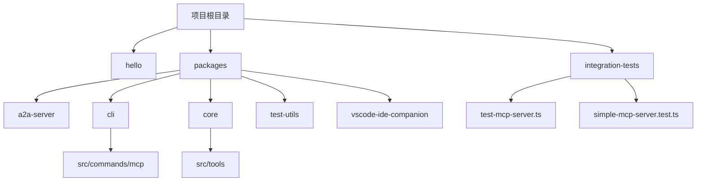
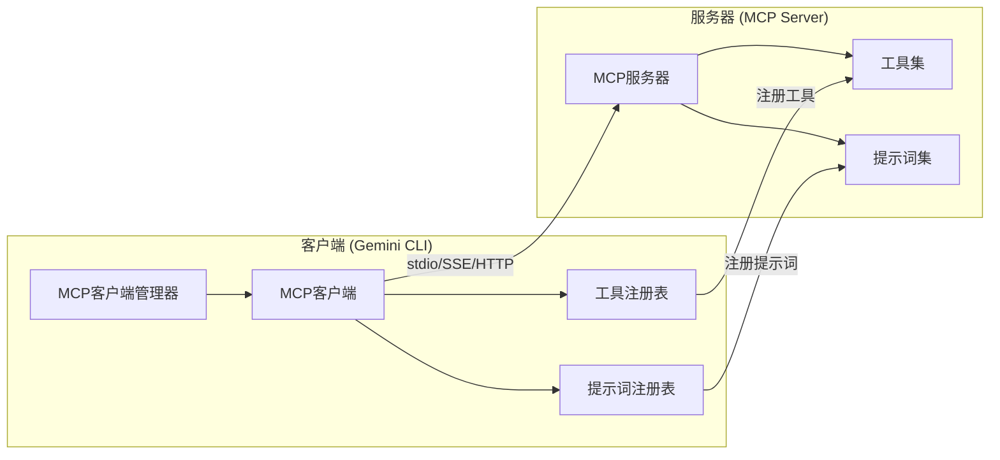
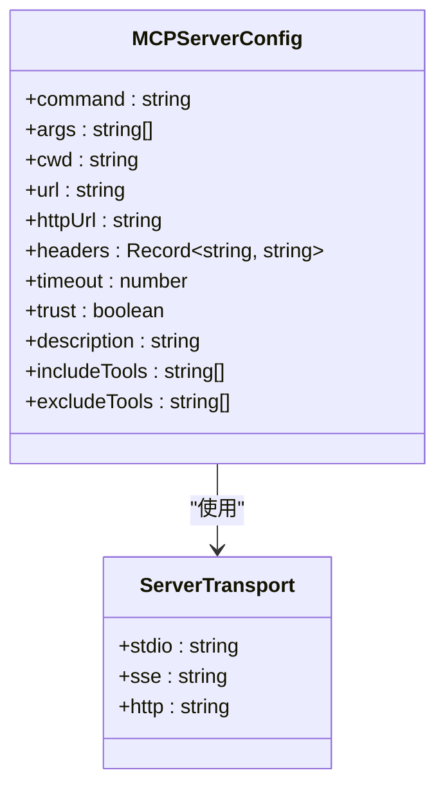
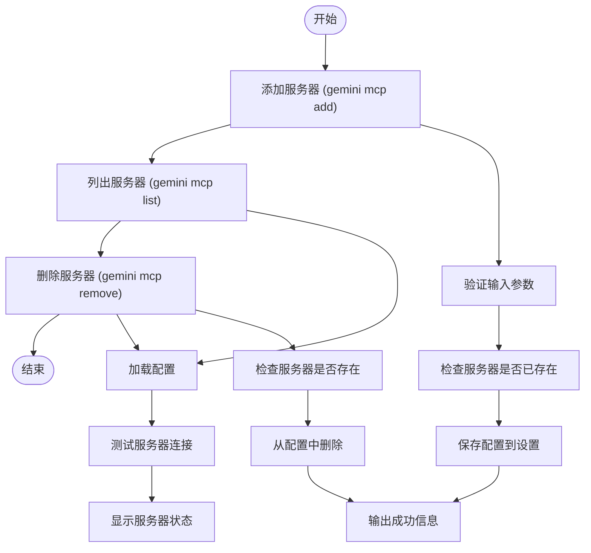
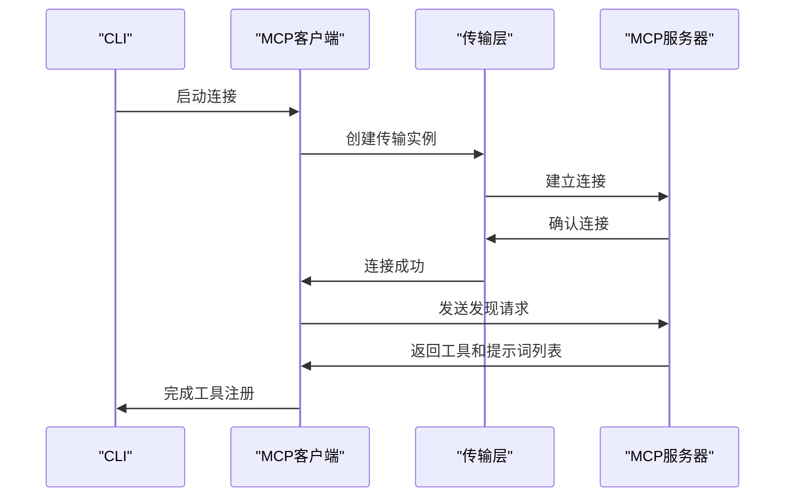
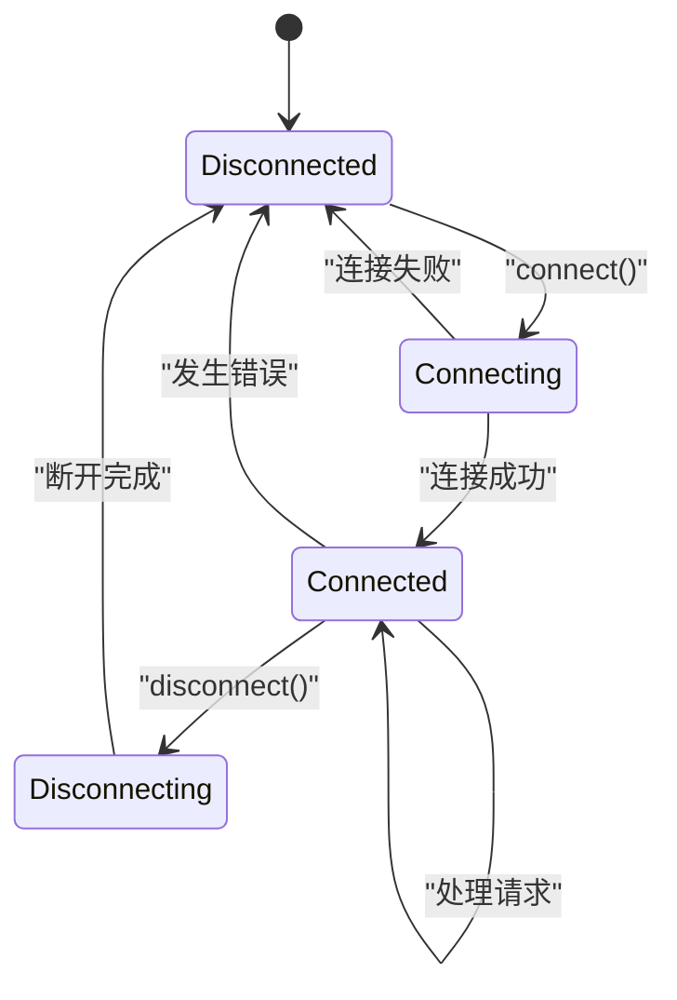

# MCP服务器集成

<cite>
**本文档引用的文件**   
- [gemini-extension.json](file://hello/gemini-extension.json)
- [add.ts](file://packages/cli/src/commands/mcp/add.ts)
- [list.ts](file://packages/cli/src/commands/mcp/list.ts)
- [remove.ts](file://packages/cli/src/commands/mcp/remove.ts)
- [config.ts](file://packages/cli/src/config/config.ts)
- [mcp-client-manager.ts](file://packages/core/src/tools/mcp-client-manager.ts)
- [mcp-client.ts](file://packages/core/src/tools/mcp-client.ts)
- [mcp-tool.ts](file://packages/core/src/tools/mcp-tool.ts)
- [test-mcp-server.ts](file://integration-tests/test-mcp-server.ts)
- [simple-mcp-server.test.ts](file://integration-tests/simple-mcp-server.test.ts)
</cite>

## 目录
1. [简介](#简介)
2. [项目结构](#项目结构)
3. [核心组件](#核心组件)
4. [架构概述](#架构概述)
5. [详细组件分析](#详细组件分析)
6. [依赖分析](#依赖分析)
7. [性能考虑](#性能考虑)
8. [故障排除指南](#故障排除指南)
9. [结论](#结论)

## 简介
本文档全面介绍了Model Context Protocol（MCP）服务器在Gemini CLI中的集成。重点阐述了如何在扩展中配置和启动MCP服务器，详细解释了`gemini-extension.json`文件中`mcpServers`字段的配置选项，包括本地命令（如`node example.ts`）和远程HTTP端点的启动方式。通过`mcp-server`示例，展示了TypeScript服务器的完整实现，包括如何处理MCP请求、定义工具集和返回响应。同时说明了服务器生命周期管理、错误日志记录以及与核心CLI的通信协议，确保开发者能成功构建和调试自定义MCP服务。

## 项目结构
Gemini CLI项目采用模块化结构，MCP服务器相关的配置和实现分布在多个包和测试文件中。核心的MCP客户端和服务管理逻辑位于`packages/core/src/tools/`目录下，而CLI命令行接口则在`packages/cli/src/commands/mcp/`中实现。集成测试文件提供了MCP服务器的实际使用示例。



**Diagram sources**
- [project_structure](file://project_structure)

**Section sources**
- [project_structure](file://project_structure)

## 核心组件
MCP服务器集成的核心组件包括配置管理、客户端管理、工具注册和通信协议。`mcp-client-manager.ts`负责管理所有MCP客户端的生命周期，包括启动、发现工具和关闭连接。`mcp-client.ts`实现了与单个MCP服务器的连接和交互，而`mcp-tool.ts`则定义了如何将MCP工具集成到核心工具注册表中。

**Section sources**
- [mcp-client-manager.ts](file://packages/core/src/tools/mcp-client-manager.ts#L1-L130)
- [mcp-client.ts](file://packages/core/src/tools/mcp-client.ts#L1-L200)
- [mcp-tool.ts](file://packages/core/src/tools/mcp-tool.ts#L1-L200)

## 架构概述
MCP服务器集成采用客户端-服务器架构，通过标准的MCP协议进行通信。CLI作为客户端，可以连接到本地或远程的MCP服务器。服务器可以是通过`stdio`管道运行的本地进程，也可以是通过`SSE`或`HTTP`协议访问的远程服务。核心组件负责管理这些连接，并将服务器提供的工具注册到全局工具库中。



**Diagram sources**
- [mcp-client-manager.ts](file://packages/core/src/tools/mcp-client-manager.ts#L1-L130)
- [mcp-client.ts](file://packages/core/src/tools/mcp-client.ts#L1-L200)

## 详细组件分析

### MCP服务器配置分析
MCP服务器的配置主要通过`gemini-extension.json`文件中的`mcpServers`字段完成。该字段定义了服务器的名称、启动命令、参数和工作目录等信息。配置可以通过CLI命令动态添加、列出和删除。

#### 配置选项分析


**Diagram sources**
- [add.ts](file://packages/cli/src/commands/mcp/add.ts#L1-L233)
- [config.ts](file://packages/cli/src/config/config.ts#L758-L808)

#### CLI命令分析


**Diagram sources**
- [add.ts](file://packages/cli/src/commands/mcp/add.ts#L1-L233)
- [list.ts](file://packages/cli/src/commands/mcp/list.ts#L1-L140)
- [remove.ts](file://packages/cli/src/commands/mcp/remove.ts#L1-L61)

**Section sources**
- [add.ts](file://packages/cli/src/commands/mcp/add.ts#L1-L233)
- [list.ts](file://packages/cli/src/commands/mcp/list.ts#L1-L140)
- [remove.ts](file://packages/cli/src/commands/mcp/remove.ts#L1-L61)

### MCP服务器实现分析
MCP服务器的实现基于Model Context Protocol SDK，通过`McpServer`类和相应的传输层（如`StreamableHTTPServerTransport`）来处理客户端请求。服务器可以以不同的方式启动，包括作为本地进程或远程HTTP服务。

#### 服务器启动流程


**Diagram sources**
- [test-mcp-server.ts](file://integration-tests/test-mcp-server.ts#L1-L63)
- [mcp-client.ts](file://packages/core/src/tools/mcp-client.ts#L1-L200)

#### 服务器生命周期管理


**Diagram sources**
- [mcp-client.ts](file://packages/core/src/tools/mcp-client.ts#L1-L200)
- [mcp-client-manager.ts](file://packages/core/src/tools/mcp-client-manager.ts#L1-L130)

**Section sources**
- [test-mcp-server.ts](file://integration-tests/test-mcp-server.ts#L1-L63)
- [mcp-client.ts](file://packages/core/src/tools/mcp-client.ts#L1-L200)
- [mcp-client-manager.ts](file://packages/core/src/tools/mcp-client-manager.ts#L1-L130)

## 依赖分析
MCP服务器集成依赖于多个核心包和外部库。`@modelcontextprotocol/sdk`提供了MCP协议的基础实现，而`@google/gemini-cli-core`则封装了与核心功能的交互。CLI包依赖于核心包来管理MCP客户端和配置。

```mermaid
graph TD
A[@modelcontextprotocol/sdk] --> B[MCP协议实现]
C[@google/gemini-cli-core] --> D[核心功能]
D --> E[MCP客户端管理]
E --> F[工具注册]
F --> G[提示词注册]
H[CLI] --> I[MCP命令]
I --> E
I --> J[配置管理]
J --> K[设置存储]
```

**Diagram sources**
- [package.json](file://packages/cli/package.json)
- [package.json](file://packages/core/package.json)

**Section sources**
- [mcp-client-manager.ts](file://packages/core/src/tools/mcp-client-manager.ts#L1-L130)
- [mcp-client.ts](file://packages/core/src/tools/mcp-client.ts#L1-L200)

## 性能考虑
MCP服务器的性能主要受网络延迟、服务器响应时间和工具执行时间的影响。建议对远程服务器使用HTTP或SSE传输以减少连接开销，对本地服务器使用stdio以获得最佳性能。同时，应合理设置超时时间以避免长时间等待。

## 故障排除指南
当MCP服务器无法正常工作时，首先检查服务器配置是否正确，然后验证服务器进程是否成功启动。查看日志输出以确定连接问题或认证错误。使用`gemini mcp list`命令检查服务器状态，并确保网络连接正常。

**Section sources**
- [list.ts](file://packages/cli/src/commands/mcp/list.ts#L1-L140)
- [mcp-client.ts](file://packages/core/src/tools/mcp-client.ts#L1-L200)

## 结论
MCP服务器集成提供了一种灵活且强大的方式来扩展Gemini CLI的功能。通过标准化的协议和清晰的配置，开发者可以轻松地创建和集成自定义工具和服务。本文档详细介绍了配置、实现和管理MCP服务器的各个方面，为开发者提供了构建和调试自定义MCP服务所需的全部信息。