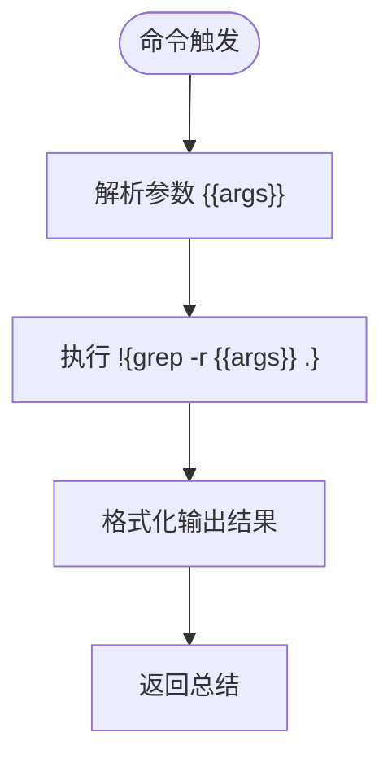

# 扩展开发

<cite>
**本文档中引用的文件**  
- [gemini-extension.json](file://hello/gemini-extension.json)
- [GEMINI.md](file://hello/GEMINI.md)
- [gemini-extension.json](file://packages/cli/src/commands/extensions/examples/mcp-server/gemini-extension.json)
- [gemini-extension.json](file://packages/cli/src/commands/extensions/examples/custom-commands/gemini-extension.json)
- [gemini-extension.json](file://packages/cli/src/commands/extensions/examples/context/gemini-extension.json)
- [gemini-extension.json](file://packages/cli/src/commands/extensions/examples/exclude-tools/gemini-extension.json)
- [grep-code.toml](file://packages/cli/src/commands/extensions/examples/custom-commands/commands/fs/grep-code.toml)
- [new.ts](file://packages/cli/src/commands/extensions/new.ts)
- [link.ts](file://packages/cli/src/commands/extensions/link.ts)
</cite>

## 目录
1. [简介](#简介)
2. [项目结构](#项目结构)
3. [核心组件](#核心组件)
4. [架构概述](#架构概述)
5. [详细组件分析](#详细组件分析)
6. [依赖分析](#依赖分析)
7. [性能考虑](#性能考虑)
8. [故障排除指南](#故障排除指南)
9. [结论](#结论)

## 简介
本文档旨在为 `gemini-cli` 提供一份详尽的扩展开发指南，帮助开发者从零开始构建自定义扩展。我们将深入解析 `gemini-extension.json` 清单文件的结构与字段含义，并通过 `hello` 和 `custom-commands` 等示例展示如何定义自定义命令、集成 MCP 服务器以及管理上下文文件。此外，文档还将提供完整的项目结构模板和调试技巧，确保开发者能够高效地进行扩展开发。

## 项目结构
`gemini-cli` 的扩展开发依赖于清晰的目录结构和配置文件组织方式。核心扩展示例位于 `packages/cli/src/commands/extensions/examples/` 目录下，包含多个功能不同的模板，如 `custom-commands`、`mcp-server`、`context` 和 `exclude-tools`。每个扩展通常包含一个 `gemini-extension.json` 配置文件，部分扩展还包含自定义命令文件（`.toml`）或上下文文档（如 `GEMINI.md`）。


**Diagram sources**
- [gemini-extension.json](file://packages/cli/src/commands/extensions/examples/custom-commands/gemini-extension.json)
- [gemini-extension.json](file://packages/cli/src/commands/extensions/examples/mcp-server/gemini-extension.json)
- [gemini-extension.json](file://packages/cli/src/commands/extensions/examples/context/gemini-extension.json)
- [gemini-extension.json](file://packages/cli/src/commands/extensions/examples/exclude-tools/gemini-extension.json)

**Section sources**
- [gemini-extension.json](file://packages/cli/src/commands/extensions/examples/custom-commands/gemini-extension.json)
- [example.ts](file://packages/cli/src/commands/extensions/examples/mcp-server/example.ts)
- [GEMINI.md](file://packages/cli/src/commands/extensions/examples/context/GEMINI.md)

## 核心组件
`gemini-cli` 扩展的核心是 `gemini-extension.json` 文件，它定义了扩展的基本信息、功能配置和行为规则。该文件中的关键字段包括 `name`、`version`、`mcpServers`、`contextFileName` 和 `excludeTools`。通过这些字段，开发者可以控制扩展的命名、版本、MCP 服务器集成、上下文文件加载以及工具调用限制。

**Section sources**
- [gemini-extension.json](file://hello/gemini-extension.json)
- [gemini-extension.json](file://packages/cli/src/commands/extensions/examples/mcp-server/gemini-extension.json)

## 架构概述
`gemini-cli` 扩展系统采用模块化设计，允许开发者通过 JSON 配置和 TOML 命令文件定义扩展行为。CLI 工具通过读取 `gemini-extension.json` 加载扩展元数据，并根据配置启动 MCP 服务器或加载自定义命令。上下文文件（如 `GEMINI.md`）可被自动加载以提供额外的上下文信息，而 `excludeTools` 字段则用于限制某些危险命令的执行。

```mermaid
graph TD
A[用户] --> B[gemini-cli]
B --> C{读取 gemini-extension.json}
C --> D[加载扩展元数据]
C --> E[启动 MCP 服务器 (可选)]
C --> F[加载自定义命令]
C --> G[加载上下文文件]
D --> H[执行扩展功能]
H --> I[输出结果]
```

**Diagram sources**
- [gemini-extension.json](file://hello/gemini-extension.json)
- [new.ts](file://packages/cli/src/commands/extensions/new.ts)

## 详细组件分析
### 清单文件结构分析
`gemini-extension.json` 是扩展的核心配置文件，其字段定义如下：

#### name
扩展的唯一标识名称，用于在 CLI 中识别和引用该扩展。

#### version
扩展的版本号，遵循语义化版本控制规范。

#### mcpServers
定义 MCP（Model Control Protocol）服务器的启动配置，包括命令、参数和工作目录。支持使用 `${extensionPath}` 变量动态引用扩展根路径。

```mermaid
classDiagram
class McpServerConfig {
+string command
+string[] args
+string cwd
}
McpServerConfig : "nodeServer" : McpServerConfig
```

**Diagram sources**
- [gemini-extension.json](file://packages/cli/src/commands/extensions/examples/mcp-server/gemini-extension.json)

#### contextFileName
指定扩展加载的上下文文件名（如 `GEMINI.md`），该文件内容将作为上下文注入到模型请求中。

#### excludeTools
用于排除特定工具调用的列表，防止执行潜在危险的操作，例如 `run_shell_command(rm -rf)`。

**Section sources**
- [gemini-extension.json](file://packages/cli/src/commands/extensions/examples/exclude-tools/gemini-extension.json)
- [GEMINI.md](file://packages/cli/src/commands/extensions/examples/context/GEMINI.md)

### 自定义命令实现
通过在 `commands/` 目录下创建 `.toml` 文件，开发者可以定义自定义命令。例如，`grep-code.toml` 定义了一个使用 `grep` 搜索代码的命令模板，支持参数注入。



**Diagram sources**
- [grep-code.toml](file://packages/cli/src/commands/extensions/examples/custom-commands/commands/fs/grep-code.toml)

**Section sources**
- [grep-code.toml](file://packages/cli/src/commands/extensions/examples/custom-commands/commands/fs/grep-code.toml)

## 依赖分析
`gemini-cli` 扩展依赖于 CLI 核心模块（`@google/gemini-cli-core`）提供的扩展管理、配置加载和命令执行服务。扩展本身不直接依赖外部包，但可通过 MCP 服务器引入 Node.js 或其他运行时环境。

```mermaid
dependencyDiagram
gemini-cli --> extension
extension --> core
extension --> mcp-server
mcp-server --> nodejs
```

**Diagram sources**
- [link.ts](file://packages/cli/src/commands/extensions/link.ts)
- [new.ts](file://packages/cli/src/commands/extensions/new.ts)

**Section sources**
- [link.ts](file://packages/cli/src/commands/extensions/link.ts)
- [new.ts](file://packages/cli/src/commands/extensions/new.ts)

## 性能考虑
扩展的性能主要受 MCP 服务器启动时间和上下文文件大小影响。建议将上下文文件控制在合理范围内，并优化 MCP 服务器的启动效率。避免在 `excludeTools` 中频繁检查大量工具，以减少运行时开销。

## 故障排除指南
### 开发模式下链接扩展
使用 `gemini extensions link <path>` 命令可将本地扩展目录链接到 CLI，便于实时开发和测试。修改本地文件后无需重新安装即可生效。

### 常见配置错误处理
- **字段拼写错误**：确保 `gemini-extension.json` 中的字段名正确无误。
- **路径变量未解析**：确认 `${extensionPath}` 等变量在运行时能被正确替换。
- **MCP 服务器启动失败**：检查 `command` 和 `args` 是否指向有效的可执行文件。
- **上下文文件未加载**：验证 `contextFileName` 指定的文件存在于扩展根目录。

**Section sources**
- [link.ts](file://packages/cli/src/commands/extensions/link.ts)
- [gemini-extension.json](file://hello/gemini-extension.json)

## 结论
通过本文档，开发者可以全面掌握 `gemini-cli` 扩展的开发流程，从创建项目结构到配置 `gemini-extension.json`，再到定义自定义命令和集成 MCP 服务器。利用提供的示例和调试技巧，开发者能够快速构建安全、高效的扩展，充分发挥 `gemini-cli` 的灵活性和可扩展性。