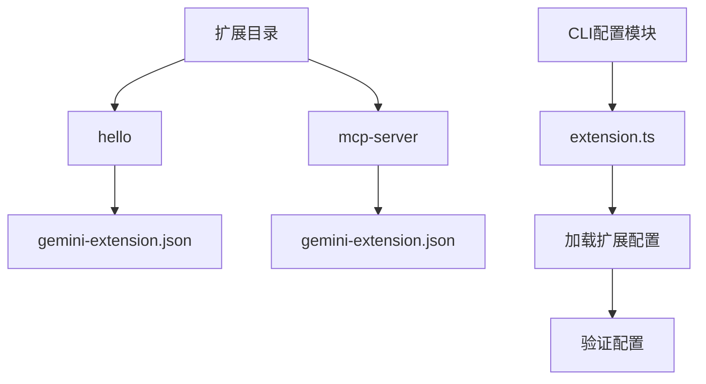
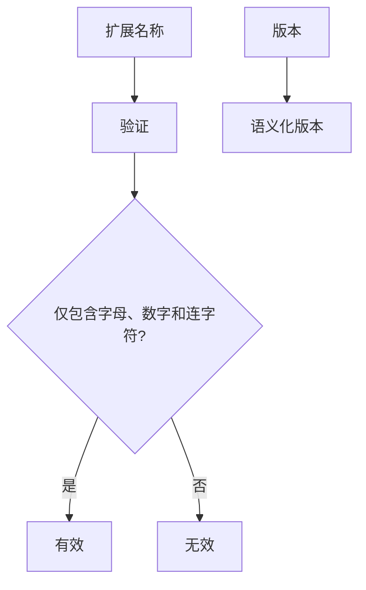
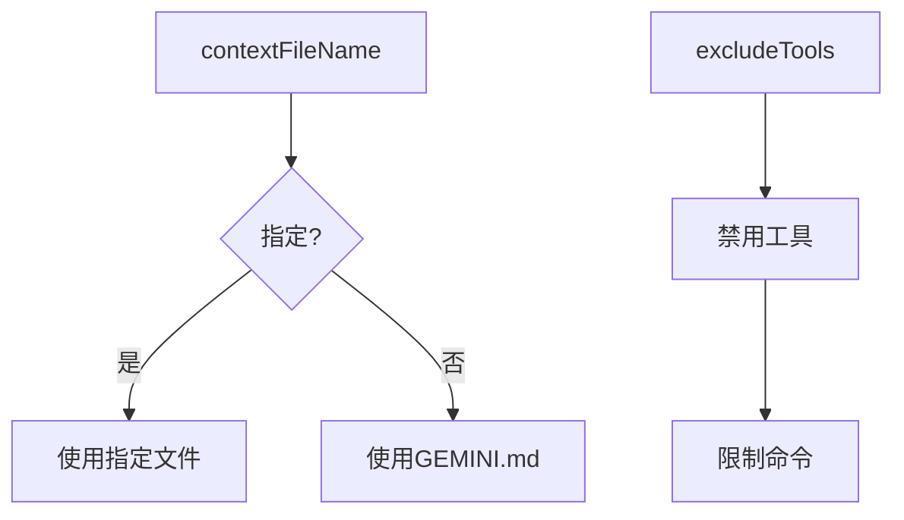
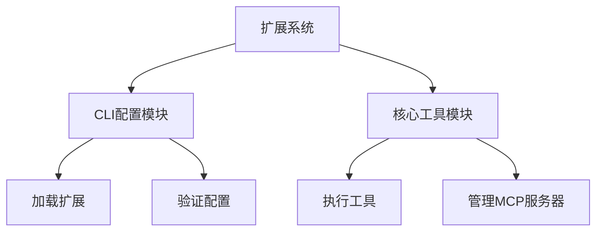

# 扩展清单文件

<cite>
**本文档中引用的文件**  
- [gemini-extension.json](file://hello/gemini-extension.json)
- [mcp-server/gemini-extension.json](file://packages/cli/src/commands/extensions/examples/mcp-server/gemini-extension.json)
- [extension.ts](file://packages/cli/src/config/extension.ts)
- [config.ts](file://packages/cli/src/config/config.ts)
</cite>

## 目录
1. [简介](#简介)
2. [项目结构](#项目结构)
3. [核心组件](#核心组件)
4. [架构概述](#架构概述)
5. [详细组件分析](#详细组件分析)
6. [依赖分析](#依赖分析)
7. [性能考虑](#性能考虑)
8. [故障排除指南](#故障排除指南)
9. [结论](#结论)

## 简介
本文档详细介绍了Gemini扩展系统中`gemini-extension.json`清单文件的结构和每个字段的精确含义。通过分析`hello`和`mcp-server`示例，文档解释了扩展配置的各个方面，包括名称规范、版本要求、MCP服务器配置、上下文文件指定以及工具排除机制。文档还涵盖了JSON Schema验证逻辑和错误处理机制。

## 项目结构
Gemini扩展系统通过`gemini-extension.json`文件定义扩展的配置。这些配置文件位于各个扩展目录中，如`hello`和`mcp-server`示例所示。系统通过CLI包中的配置管理模块加载和验证这些扩展配置。



**Diagram sources**
- [gemini-extension.json](file://hello/gemini-extension.json)
- [mcp-server/gemini-extension.json](file://packages/cli/src/commands/extensions/examples/mcp-server/gemini-extension.json)
- [extension.ts](file://packages/cli/src/config/extension.ts)

**Section sources**
- [gemini-extension.json](file://hello/gemini-extension.json)
- [mcp-server/gemini-extension.json](file://packages/cli/src/commands/extensions/examples/mcp-server/gemini-extension.json)

## 核心组件
扩展清单文件的核心组件包括`name`、`version`、`mcpServers`、`contextFileName`和`excludeTools`字段。这些字段共同定义了扩展的基本信息、服务器配置、上下文文件和工具限制。

**Section sources**
- [extension.ts](file://packages/cli/src/config/extension.ts#L57-L62)

## 架构概述
Gemini扩展系统的架构基于模块化设计，通过配置文件定义扩展行为。系统通过CLI包中的配置管理模块加载扩展，验证配置，并根据配置启动相应的MCP服务器。


**Diagram sources**
- [extension.ts](file://packages/cli/src/config/extension.ts)
- [config.ts](file://packages/cli/src/config/config.ts)

## 详细组件分析

### 扩展名称和版本分析
扩展的`name`字段必须仅包含字母、数字和连字符，这是通过`validateName`函数验证的。`version`字段遵循语义化版本要求。



**Diagram sources**
- [extension.ts](file://packages/cli/src/config/extension.ts#L760-L765)

**Section sources**
- [extension.ts](file://packages/cli/src/config/extension.ts#L760-L765)

### MCP服务器配置分析
`mcpServers`对象定义了扩展的MCP服务器配置，包括命令、参数和工作目录。`${extensionPath}`变量用于引用扩展的根目录。

```mermaid
graph TD
A[mcpServers] --> B[服务器名称]
B --> C[命令]
C --> D[参数]
D --> E[工作目录]
E --> F[${extensionPath}]
```

**Diagram sources**
- [mcp-server/gemini-extension.json](file://packages/cli/src/commands/extensions/examples/mcp-server/gemini-extension.json)
- [extension.ts](file://packages/cli/src/config/extension.ts#L286-L294)

**Section sources**
- [mcp-server/gemini-extension.json](file://packages/cli/src/commands/extensions/examples/mcp-server/gemini-extension.json)
- [extension.ts](file://packages/cli/src/config/extension.ts#L286-L294)

### 上下文文件和工具排除分析
`contextFileName`字段指定扩展的上下文文件，默认为`GEMINI.md`。`excludeTools`数组用于禁用核心工具或限制特定命令。



**Diagram sources**
- [extension.ts](file://packages/cli/src/config/extension.ts#L380-L389)
- [gemini-extension.json](file://hello/gemini-extension.json)

**Section sources**
- [extension.ts](file://packages/cli/src/config/extension.ts#L380-L389)
- [gemini-extension.json](file://hello/gemini-extension.json)

## 依赖分析
扩展系统依赖于CLI包中的配置管理模块和核心包中的工具模块。这些模块共同提供了扩展加载、验证和执行的功能。



**Diagram sources**
- [extension.ts](file://packages/cli/src/config/extension.ts)
- [config.ts](file://packages/cli/src/config/config.ts)

**Section sources**
- [extension.ts](file://packages/cli/src/config/extension.ts)
- [config.ts](file://packages/cli/src/config/config.ts)

## 性能考虑
扩展系统的性能主要受配置验证和MCP服务器启动的影响。通过缓存已验证的配置和优化服务器启动流程，可以提高系统性能。

## 故障排除指南
当扩展配置出现问题时，系统会提供详细的错误信息。常见的问题包括无效的扩展名称、缺失的版本号和错误的MCP服务器配置。

**Section sources**
- [extension.ts](file://packages/cli/src/config/extension.ts#L740-L755)

## 结论
`gemini-extension.json`清单文件是Gemini扩展系统的核心配置文件。通过正确配置`name`、`version`、`mcpServers`、`contextFileName`和`excludeTools`字段，可以定义扩展的行为和功能。系统通过严格的验证和错误处理机制确保配置的正确性。