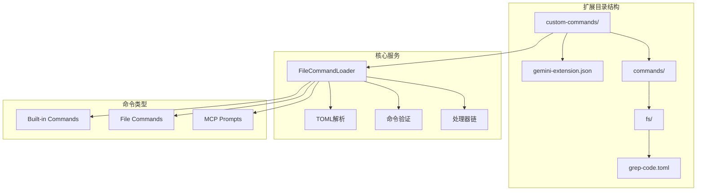
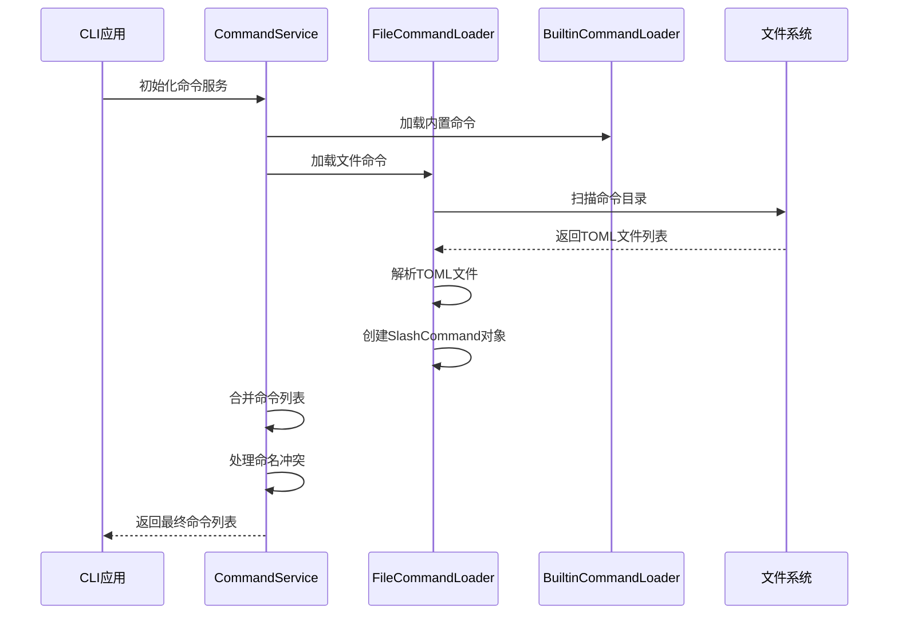
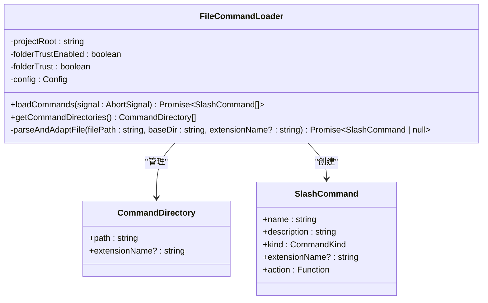
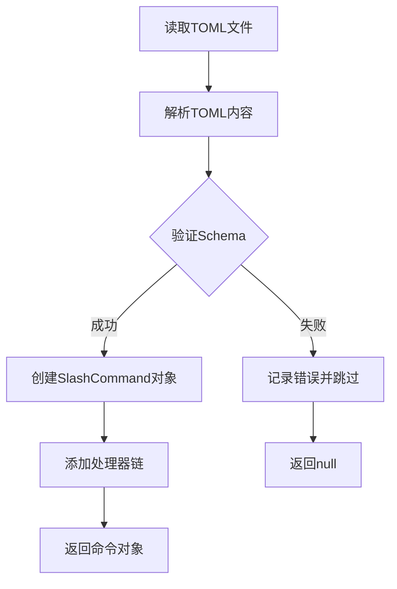
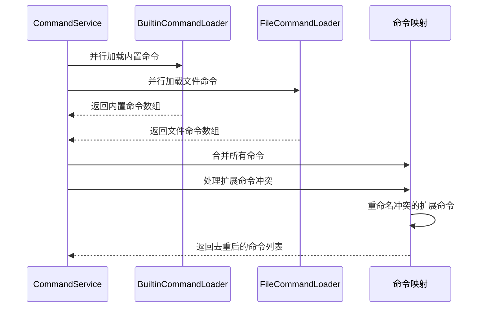
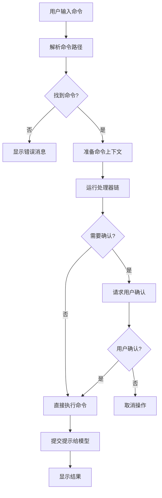
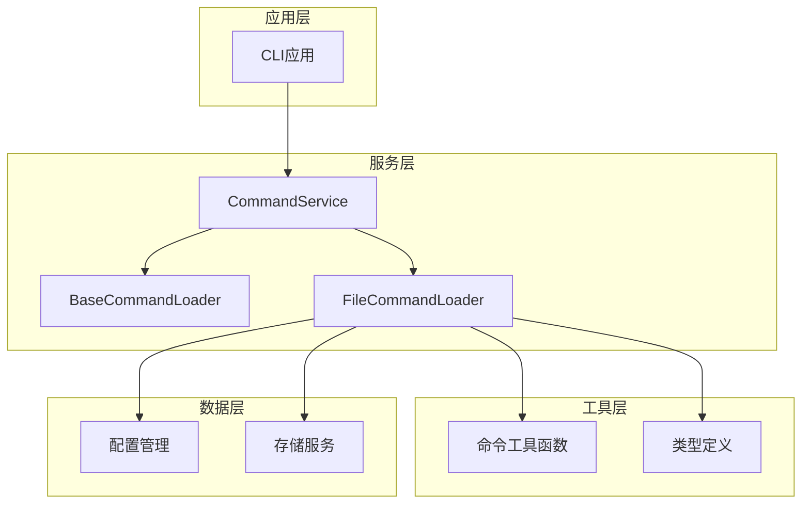

# 自定义命令开发指南

<cite>
**本文档引用的文件**
- [packages/cli/src/commands/extensions/examples/custom-commands/gemini-extension.json](file://packages/cli/src/commands/extensions/examples/custom-commands/gemini-extension.json)
- [packages/cli/src/commands/extensions/examples/custom-commands/commands/fs/grep-code.toml](file://packages/cli/src/commands/extensions/examples/custom-commands/commands/fs/grep-code.toml)
- [packages/cli/src/services/FileCommandLoader.ts](file://packages/cli/src/services/FileCommandLoader.ts)
- [packages/cli/src/services/BuiltinCommandLoader.ts](file://packages/cli/src/services/BuiltinCommandLoader.ts)
- [packages/cli/src/services/CommandService.ts](file://packages/cli/src/services/CommandService.ts)
- [packages/cli/src/ui/commands/types.ts](file://packages/cli/src/ui/commands/types.ts)
- [packages/cli/src/services/types.ts](file://packages/cli/src/services/types.ts)
- [packages/cli/src/utils/commands.ts](file://packages/cli/src/utils/commands.ts)
</cite>

## 目录
1. [简介](#简介)
2. [项目结构](#项目结构)
3. [核心组件](#核心组件)
4. [架构概览](#架构概览)
5. [详细组件分析](#详细组件分析)
6. [依赖关系分析](#依赖关系分析)
7. [性能考虑](#性能考虑)
8. [故障排除指南](#故障排除指南)
9. [结论](#结论)

## 简介

Gemini CLI 提供了一个强大的扩展系统，允许开发者创建和注册自定义命令。通过分析 `custom-commands` 示例，本指南详细介绍了如何在扩展目录中创建 `commands` 子目录，并使用 TOML 文件定义命令的名称、描述、参数和执行逻辑。

该系统支持多种类型的命令加载器，包括内置命令、文件命令和 MCP 提示，为开发者提供了灵活的扩展机制。通过 `gemini-extension.json` 中的配置，命令可以与上下文文件无缝集成，实现自动发现和加载。

## 项目结构

Gemini CLI 的自定义命令系统采用模块化设计，主要包含以下关键目录：



**图表来源**
- [packages/cli/src/commands/extensions/examples/custom-commands/gemini-extension.json](file://packages/cli/src/commands/extensions/examples/custom-commands/gemini-extension.json#L1-L5)
- [packages/cli/src/commands/extensions/examples/custom-commands/commands/fs/grep-code.toml](file://packages/cli/src/commands/extensions/examples/custom-commands/commands/fs/grep-code.toml#L1-L7)

**章节来源**
- [packages/cli/src/commands/extensions/examples/custom-commands/gemini-extension.json](file://packages/cli/src/commands/extensions/examples/custom-commands/gemini-extension.json#L1-L5)
- [packages/cli/src/commands/extensions/examples/custom-commands/commands/fs/grep-code.toml](file://packages/cli/src/commands/extensions/examples/custom-commands/commands/fs/grep-code.toml#L1-L7)

## 核心组件

### 命令加载器接口

Gemini CLI 定义了统一的命令加载器接口，支持多种命令源的扩展：

```typescript
export interface ICommandLoader {
  loadCommands(signal: AbortSignal): Promise<SlashCommand[]>;
}
```

这个接口确保了所有命令加载器都遵循相同的标准，使得系统可以轻松扩展新的命令源。

### TOML 命令定义格式

每个自定义命令都通过 TOML 文件定义，支持以下字段：

- `prompt`: 必需字段，定义命令的提示文本
- `description`: 可选字段，提供命令的描述信息

**章节来源**
- [packages/cli/src/services/types.ts](file://packages/cli/src/services/types.ts#L12-L24)
- [packages/cli/src/commands/extensions/examples/custom-commands/commands/fs/grep-code.toml](file://packages/cli/src/commands/extensions/examples/custom-commands/commands/fs/grep-code.toml#L1-L7)

## 架构概览

Gemini CLI 的命令系统采用分层架构设计，通过多个组件协同工作实现命令的发现、加载和执行：



**图表来源**
- [packages/cli/src/services/CommandService.ts](file://packages/cli/src/services/CommandService.ts#L35-L70)
- [packages/cli/src/services/FileCommandLoader.ts](file://packages/cli/src/services/FileCommandLoader.ts#L60-L90)

## 详细组件分析

### FileCommandLoader 分析

`FileCommandLoader` 是负责从文件系统加载自定义命令的核心组件：



**图表来源**
- [packages/cli/src/services/FileCommandLoader.ts](file://packages/cli/src/services/FileCommandLoader.ts#L40-L60)
- [packages/cli/src/ui/commands/types.ts](file://packages/cli/src/ui/commands/types.ts#L170-L190)

#### 命令目录扫描流程

FileCommandLoader 按照特定顺序扫描命令目录：

1. **用户命令目录**: 用户全局配置目录
2. **项目命令目录**: 当前项目的命令目录
3. **扩展命令目录**: 激活扩展的命令目录

这种顺序确保了扩展命令能够检测到所有可能的冲突。

#### TOML 文件解析和验证



**图表来源**
- [packages/cli/src/services/FileCommandLoader.ts](file://packages/cli/src/services/FileCommandLoader.ts#L150-L200)

**章节来源**
- [packages/cli/src/services/FileCommandLoader.ts](file://packages/cli/src/services/FileCommandLoader.ts#L40-L315)

### 命令服务协调器

`CommandService` 负责协调所有命令加载器的工作，并处理命令合并和冲突解决：



**图表来源**
- [packages/cli/src/services/CommandService.ts](file://packages/cli/src/services/CommandService.ts#L35-L70)

#### 冲突解决策略

当扩展命令与现有命令发生冲突时，系统采用以下策略：

1. **扩展命令重命名**: 将冲突的扩展命令重命名为 `extensionName.commandName`
2. **数字后缀**: 如果重命名后仍然冲突，添加数字后缀（如 `.1`, `.2`）
3. **保持确定性**: 使用字母顺序确保加载顺序的一致性

**章节来源**
- [packages/cli/src/services/CommandService.ts](file://packages/cli/src/services/CommandService.ts#L70-L103)

### 命令执行流程

当用户执行自定义命令时，系统会按照以下流程处理：



**图表来源**
- [packages/cli/src/utils/commands.ts](file://packages/cli/src/utils/commands.ts#L15-L50)

**章节来源**
- [packages/cli/src/utils/commands.ts](file://packages/cli/src/utils/commands.ts#L15-L71)

## 依赖关系分析

Gemini CLI 的命令系统具有清晰的依赖层次结构：



**图表来源**
- [packages/cli/src/services/CommandService.ts](file://packages/cli/src/services/CommandService.ts#L1-L20)
- [packages/cli/src/services/FileCommandLoader.ts](file://packages/cli/src/services/FileCommandLoader.ts#L1-L30)

**章节来源**
- [packages/cli/src/services/CommandService.ts](file://packages/cli/src/services/CommandService.ts#L1-L103)
- [packages/cli/src/services/FileCommandLoader.ts](file://packages/cli/src/services/FileCommandLoader.ts#L1-L315)

## 性能考虑

### 异步加载优化

命令系统采用异步并行加载策略，避免阻塞主线程：

- **并行加载**: 所有命令加载器同时启动，互不阻塞
- **信号控制**: 支持 AbortSignal 取消长时间运行的操作
- **错误隔离**: 单个加载器失败不会影响其他加载器

### 内存管理

- **只读命令列表**: 使用 `Object.freeze()` 确保命令列表不可变
- **延迟初始化**: 按需加载扩展命令，减少内存占用
- **垃圾回收友好**: 避免循环引用，便于垃圾回收

### 缓存策略

虽然当前实现没有显式缓存，但可以通过以下方式优化：

- **命令解析缓存**: 缓存命令路径解析结果
- **TOML解析缓存**: 缓存已解析的TOML文件内容
- **处理器链缓存**: 缓存重复使用的处理器实例

## 故障排除指南

### 常见问题及解决方案

#### 1. 命令未被发现

**症状**: 自定义命令无法通过 `/命令名` 访问

**可能原因**:
- TOML文件语法错误
- 文件路径不符合约定
- 权限问题导致文件无法读取

**解决方案**:
```bash
# 检查TOML文件语法
npx @iarna/toml-validate commands/**/*.toml

# 验证文件权限
ls -la commands/

# 查看加载日志
DEBUG=* gemini --verbose
```

#### 2. 命令执行失败

**症状**: 命令被识别但执行时出错

**可能原因**:
- Shell注入安全检查触发
- 参数传递错误
- 上下文缺失

**解决方案**:
- 检查命令中的占位符使用
- 验证参数处理器配置
- 确认上下文完整性

#### 3. 命名冲突

**症状**: 扩展命令被重命名或覆盖

**可能原因**:
- 与内置命令冲突
- 与其他扩展命令冲突

**解决方案**:
- 使用更具体的命令名称
- 检查冲突的命令列表
- 修改扩展名称以避免冲突

**章节来源**
- [packages/cli/src/services/FileCommandLoader.ts](file://packages/cli/src/services/FileCommandLoader.ts#L150-L200)
- [packages/cli/src/services/CommandService.ts](file://packages/cli/src/services/CommandService.ts#L70-L103)

## 结论

Gemini CLI 的自定义命令系统提供了一个强大而灵活的扩展机制。通过 TOML 文件定义命令、自动发现和加载机制，以及完善的冲突解决策略，开发者可以轻松创建和部署自定义命令。

### 主要优势

1. **简单易用**: 通过 TOML 文件即可定义复杂命令
2. **安全可靠**: 内置安全检查防止恶意命令执行
3. **可扩展性强**: 支持多种命令源和处理器
4. **性能优秀**: 异步并行加载，响应迅速

### 最佳实践建议

1. **合理命名**: 使用描述性的命令名称和描述
2. **安全第一**: 充分测试命令的安全性
3. **错误处理**: 实现适当的错误处理和用户反馈
4. **文档完善**: 为自定义命令编写清晰的使用文档

通过遵循这些指导原则，开发者可以充分利用 Gemini CLI 的扩展能力，创建高质量的自定义命令，提升开发效率和用户体验。