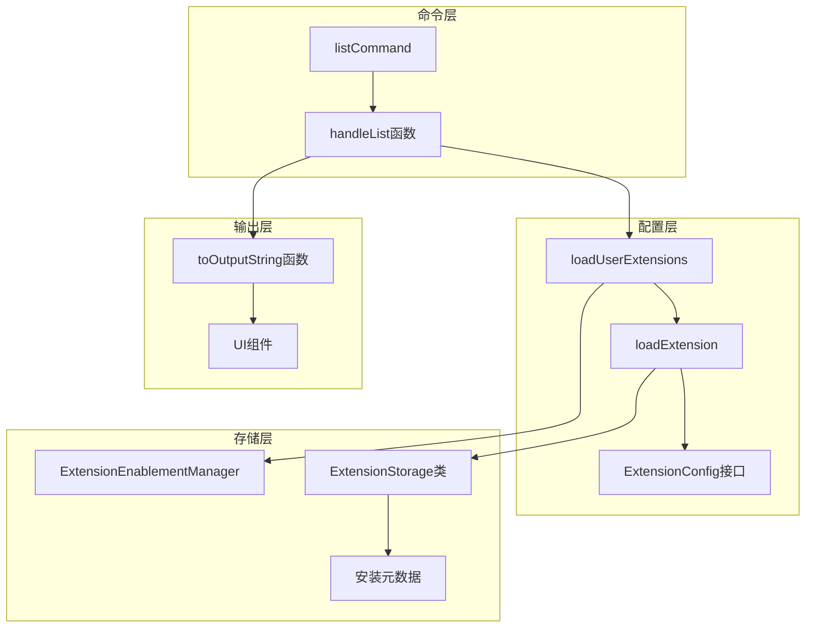
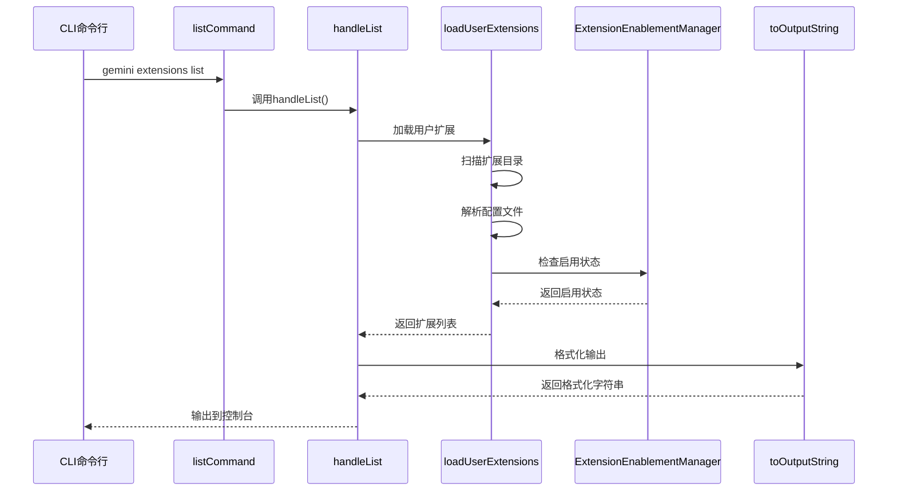
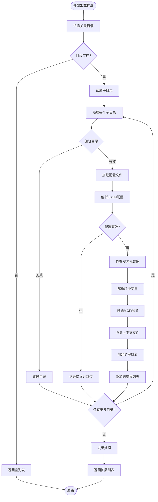
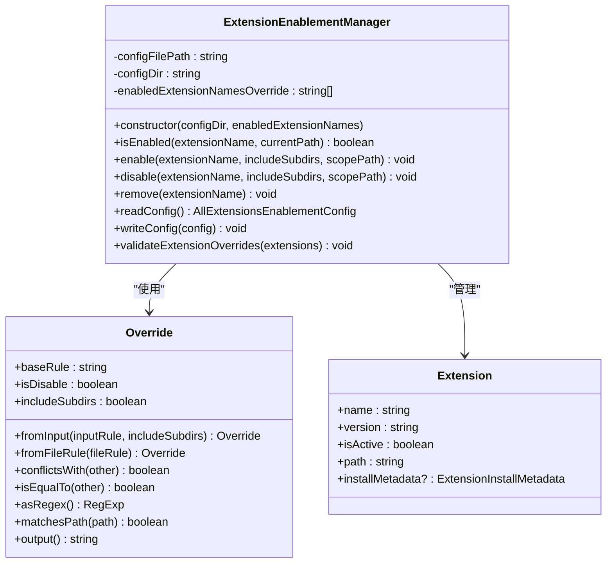

# 扩展列表查看

<cite>
**本文档中引用的文件**
- [packages/cli/src/commands/extensions/list.ts](file://packages/cli/src/commands/extensions/list.ts)
- [packages/cli/src/config/extension.ts](file://packages/cli/src/config/extension.ts)
- [packages/cli/src/config/extensions/extensionEnablement.ts](file://packages/cli/src/config/extensions/extensionEnablement.ts)
- [packages/cli/src/ui/components/views/ExtensionsList.tsx](file://packages/cli/src/ui/components/views/ExtensionsList.tsx)
- [packages/core/src/config/config.ts](file://packages/core/src/config/config.ts)
- [hello/gemini-extension.json](file://hello/gemini-extension.json)
- [integration-tests/extensions-install.test.ts](file://integration-tests/extensions-install.test.ts)
</cite>

## 目录
1. [简介](#简介)
2. [命令概述](#命令概述)
3. [核心架构](#核心架构)
4. [详细组件分析](#详细组件分析)
5. [输出格式详解](#输出格式详解)
6. [启用状态管理](#启用状态管理)
7. [使用示例](#使用示例)
8. [故障排除指南](#故障排除指南)
9. [总结](#总结)

## 简介

`gemini extensions list` 命令是 Gemini CLI 扩展管理系统的核心功能之一，用于扫描 `.gemini/extensions` 目录并读取配置文件，以展示所有已安装扩展的详细信息。该命令不仅显示扩展的基本信息，还提供了丰富的元数据，包括启用状态、来源类型、版本信息等关键细节。

## 命令概述

### 基本语法

```bash
gemini extensions list
```

### 功能特性

- **扫描扩展目录**：自动发现 `.gemini/extensions` 目录下的所有扩展
- **读取配置文件**：解析每个扩展的 `gemini-extension.json` 配置文件
- **显示扩展信息**：提供扩展名称、版本、路径、来源等详细信息
- **状态标识**：明确区分启用和禁用状态
- **支持多种来源**：识别本地、远程、链接等多种安装方式

## 核心架构



**图表来源**
- [packages/cli/src/commands/extensions/list.ts](file://packages/cli/src/commands/extensions/list.ts#L10-L35)
- [packages/cli/src/config/extension.ts](file://packages/cli/src/config/extension.ts#L120-L180)

## 详细组件分析

### 列表命令处理器



**图表来源**
- [packages/cli/src/commands/extensions/list.ts](file://packages/cli/src/commands/extensions/list.ts#L10-L35)
- [packages/cli/src/config/extension.ts](file://packages/cli/src/config/extension.ts#L120-L180)

### 扩展加载机制

扩展加载过程采用分层架构设计，确保可靠性和可维护性：



**图表来源**
- [packages/cli/src/config/extension.ts](file://packages/cli/src/config/extension.ts#L180-L250)

**章节来源**
- [packages/cli/src/commands/extensions/list.ts](file://packages/cli/src/commands/extensions/list.ts#L10-L35)
- [packages/cli/src/config/extension.ts](file://packages/cli/src/config/extension.ts#L120-L250)

### 启用状态管理器



**图表来源**
- [packages/cli/src/config/extensions/extensionEnablement.ts](file://packages/cli/src/config/extensions/extensionEnablement.ts#L104-L240)

**章节来源**
- [packages/cli/src/config/extensions/extensionEnablement.ts](file://packages/cli/src/config/extensions/extensionEnablement.ts#L104-L240)

## 输出格式详解

### 基本输出结构

`gemini extensions list` 命令的输出采用清晰的文本格式，包含以下关键信息：

```
✓ extension-name (1.0.0)
 Path: /path/to/extension
 Source: https://github.com/user/repo.git (Type: git)
 Ref: main
 Release tag: v1.0.0
 Enabled (User): true
 Enabled (Workspace): false
 Context files:
  /path/to/context.md
 MCP servers:
  server-name
 Excluded tools:
  tool-name
```

### 状态标识系统

- **✓ 绿色符号**：表示扩展在当前工作区中处于启用状态
- **✗ 红色符号**：表示扩展在当前工作区中处于禁用状态
- **Enabled (User)**：用户级别的启用状态
- **Enabled (Workspace)**：工作区级别的启用状态

### 详细字段说明

1. **启用状态**：
   - 用户级别：影响所有工作区的全局设置
   - 工作区级别：仅影响当前项目的设置

2. **源信息**：
   - `Source`：扩展的原始来源地址
   - `Type`：安装类型（git、local、link、github-release）
   - `Ref`：分支或标签引用
   - `Release tag`：GitHub发布标签

3. **功能信息**：
   - `Context files`：扩展提供的上下文文件
   - `MCP servers`：扩展注册的MCP服务器
   - `Excluded tools`：被排除的核心工具列表

**章节来源**
- [packages/cli/src/config/extension.ts](file://packages/cli/src/config/extension.ts#L596-L650)

## 启用状态管理

### 启用规则优先级

扩展启用状态遵循以下优先级规则：

1. **覆盖规则**：`-e <name>` 参数指定的扩展列表
2. **配置规则**：`extension-enablement.json` 中的路径规则
3. **默认行为**：未配置时，默认启用所有扩展

### 路径匹配算法


**图表来源**
- [packages/cli/src/config/extensions/extensionEnablement.ts](file://packages/cli/src/config/extensions/extensionEnablement.ts#L134-L180)

### 启用/禁用操作

扩展的启用和禁用通过以下机制实现：

1. **直接操作**：修改 `extension-enablement.json` 文件
2. **命令行**：使用 `gemini extensions enable/disable` 命令
3. **配置覆盖**：通过 `-e` 参数临时覆盖

**章节来源**
- [packages/cli/src/config/extensions/extensionEnablement.ts](file://packages/cli/src/config/extensions/extensionEnablement.ts#L134-L240)

## 使用示例

### 基本使用

```bash
# 显示所有已安装扩展
gemini extensions list

# 在工作区中显示扩展
cd my-project
gemini extensions list
```

### 输出示例

```
✓ context-example (1.0.0)
 Path: /Users/user/.gemini/extensions/context-example
 Source: /Users/user/projects/context-example (Type: local)
 Enabled (User): true
 Enabled (Workspace): true
 Context files:
  /Users/user/projects/context-example/GEMINI.md

✗ api-client (2.1.0)
 Path: /Users/user/.gemini/extensions/api-client
 Source: https://github.com/user/api-client.git (Type: git)
 Ref: main
 Enabled (User): false
 Enabled (Workspace): false
 MCP servers:
  rest-api
  graphql
```

### 机器可读输出

虽然 `list` 命令主要提供人类可读的输出，但可以通过结合其他工具实现机器可读格式：

```bash
# 获取纯文本输出
gemini extensions list > extensions.txt

# 结合 grep 过滤特定扩展
gemini extensions list | grep "api-client"

# 使用 sed 提取特定信息
gemini extensions list | sed -n 's/.*\(✓\|✗\) \([^ ]*\).*/\2/p'
```

### 集成脚本示例

```bash
#!/bin/bash
# 检查特定扩展是否启用
check_extension_enabled() {
  local extension_name="$1"
  gemini extensions list | grep -q " $extension_name "
}

# 获取所有启用的扩展列表
get_enabled_extensions() {
  gemini extensions list | grep "✓" | awk '{print $2}' | tr -d ':'
}

# 验证扩展状态
verify_extension_status() {
  local extension_name="$1"
  local expected_status="$2"
  
  if [[ "$expected_status" == "enabled" ]]; then
    gemini extensions list | grep -q "✓ $extension_name"
  else
    gemini extensions list | grep -q "✗ $extension_name"
  fi
  
  return $?
}
```

## 故障排除指南

### 常见问题及解决方案

#### 1. 扩展未显示

**症状**：运行 `gemini extensions list` 时显示 "No extensions installed."

**可能原因**：
- 扩展目录不存在
- 配置文件损坏
- 权限问题

**解决方案**：
```bash
# 检查扩展目录是否存在
ls -la ~/.gemini/extensions/

# 检查配置文件
cat ~/.gemini/extensions/extension-name/gemini-extension.json

# 重新安装扩展
gemini extensions install --path=/path/to/extension
```

#### 2. 启用状态不正确

**症状**：扩展显示为禁用，但实际上应该启用

**诊断步骤**：
```bash
# 检查启用配置文件
cat ~/.gemini/extension-enablement.json

# 检查扩展详情
gemini extensions list | grep -A 10 "extension-name"

# 强制重新启用
gemini extensions enable extension-name
```

#### 3. 环境变量解析失败

**症状**：扩展配置中的环境变量未正确解析

**解决方案**：
```bash
# 检查环境变量
env | grep -E "(API_KEY|DATABASE_URL)"

# 重新加载配置
rm ~/.gemini/extensions/extension-name/.gemini-extension-install.json
gemini extensions list
```

### 调试技巧

#### 启用调试模式

```bash
# 设置调试环境变量
export DEBUG=true
gemini extensions list
```

#### 检查日志文件

```bash
# 查看扩展安装日志
tail -f ~/.gemini/logs/extension-install.log

# 检查配置加载错误
grep -i error ~/.gemini/logs/*.log
```

#### 验证配置结构

```bash
# 使用 jq 验证 JSON 格式
jq . ~/.gemini/extensions/*/gemini-extension.json

# 检查必需字段
jq '.name, .version' ~/.gemini/extensions/*/gemini-extension.json
```

**章节来源**
- [packages/cli/src/config/extension.ts](file://packages/cli/src/config/extension.ts#L244-L290)

## 总结

`gemini extensions list` 命令是一个功能强大且设计精良的扩展管理工具。它不仅提供了直观的扩展信息展示，还通过复杂的启用状态管理机制确保了灵活的配置选项。

### 主要优势

1. **全面的信息展示**：涵盖扩展的所有关键属性和状态信息
2. **智能的状态管理**：支持多层级的启用/禁用规则
3. **友好的错误处理**：优雅地处理配置错误和缺失情况
4. **可扩展的架构**：模块化设计便于功能扩展

### 最佳实践建议

1. **定期检查**：定期运行 `gemini extensions list` 确保扩展状态正常
2. **备份配置**：重要配置更改前备份 `extension-enablement.json`
3. **环境变量管理**：合理使用环境变量简化配置管理
4. **权限控制**：确保扩展目录具有适当的访问权限

通过深入理解这个命令的工作原理和最佳实践，开发者可以更有效地管理和维护 Gemini CLI 扩展生态系统，提升开发效率和体验质量。